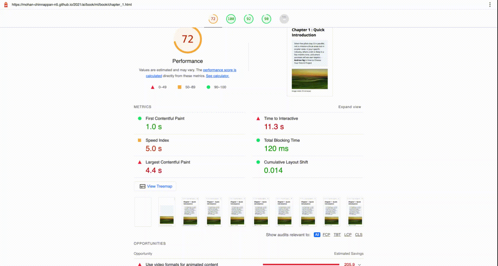

# Using [Lighthouse](https://developers.google.com/web/tools/lighthouse)  to check 508

## Topics

- [Using Lighthouse npm](#npm)
- [Using Lighthouse in Chrome Dev Tools](#inDevTools)

<hr>
<a name="npm"><a>

## Install [Lighthouse npm](https://www.npmjs.com/package/lighthouse)

```
sudo npm install -g lighthouse
```

## Run it
```
lighthouse https://mohan-chinnappan-n5.github.io/2021/ai/book/ml/book/chapter_1.html
```
```
  LH:ChromeLauncher Waiting for browser. +0ms
  LH:ChromeLauncher Waiting for browser... +1ms
  LH:ChromeLauncher Waiting for browser..... +505ms
  LH:ChromeLauncher Waiting for browser.....✓ +2ms
  LH:config:warn IFrameElements gatherer requested, however no audit requires it. +635ms
  LH:config:warn Inputs gatherer requested, however no audit requires it. +1ms
  LH:status Connecting to browser +62ms
  LH:status Resetting state with about:blank +112ms
  LH:status Navigating to about:blank +0ms
  LH:status Benchmarking machine +25ms
  LH:status Initializing… +1s
  LH:status Preparing target for navigation mode +3ms
  LH:status Running defaultPass pass CSSUsage, JsUsage, ViewportDimensions, ConsoleMessages, AnchorElements, ImageElements, LinkElements, MetaElements, ScriptElements, IFrameElements, Inputs, MainDocumentContent, GlobalListeners, Doctype, DOMStats, OptimizedImages, PasswordInputsWithPreventedPaste, ResponseCompression, TagsBlockingFirstPaint, FontSize, EmbeddedContent, RobotsTxt, TapTargets, Accessibility, TraceElements, InspectorIssues, SourceMaps, FullPageScreenshot +10ms
  LH:status Resetting state with about:blank +0ms
  LH:status Navigating to about:blank +0ms
  LH:status Preparing target for navigation +8ms
  LH:status Cleaning origin data +7ms
  LH:status Cleaning browser cache +6ms
  LH:status Preparing network conditions +43ms
  LH:status Beginning devtoolsLog and trace +13ms
  LH:status Loading page & waiting for onload +87ms
  LH:status Navigating to https://mohan-chinnappan-n5.github.io/2021/ai/book/ml/book/chapter_1.html +1ms
  LH:status Gathering in-page: CSSUsage +19s
  LH:status Gathering in-page: JsUsage +0ms
  LH:status Gathering in-page: ViewportDimensions +0ms
  LH:status Gathering in-page: ConsoleMessages +0ms
  LH:status Gathering in-page: AnchorElements +0ms
  LH:status Gathering in-page: ImageElements +0ms
  LH:status Gathering in-page: LinkElements +0ms
  LH:status Gathering in-page: MetaElements +0ms
  LH:status Gathering in-page: ScriptElements +0ms
  LH:status Gathering in-page: IFrameElements +0ms
  LH:status Gathering in-page: Inputs +0ms
  LH:status Gathering in-page: MainDocumentContent +1ms
  LH:status Gathering in-page: GlobalListeners +0ms
  LH:status Gathering in-page: Doctype +0ms
  LH:status Gathering in-page: DOMStats +0ms
  LH:status Gathering in-page: OptimizedImages +0ms
  LH:status Gathering in-page: PasswordInputsWithPreventedPaste +0ms
  LH:status Gathering in-page: ResponseCompression +0ms
  LH:status Gathering in-page: TagsBlockingFirstPaint +0ms
  LH:status Gathering in-page: FontSize +0ms
  LH:status Gathering in-page: EmbeddedContent +0ms
  LH:status Gathering in-page: RobotsTxt +0ms
  LH:status Gathering in-page: TapTargets +0ms
  LH:status Gathering in-page: Accessibility +0ms
  LH:status Gathering in-page: TraceElements +0ms
  LH:status Gathering in-page: InspectorIssues +0ms
  LH:status Gathering in-page: SourceMaps +0ms
  LH:status Gathering in-page: FullPageScreenshot +0ms
  LH:status Gathering trace +0ms
  LH:status Gathering devtoolsLog & network records +2s
  LH:status Gathering: CSSUsage +14ms
  LH:status Gathering: JsUsage +45ms
  LH:status Gathering: ViewportDimensions +14ms
  LH:status Gathering: ConsoleMessages +2ms
  LH:status Gathering: AnchorElements +2ms
  LH:status Gathering: ImageElements +88ms
  LH:status Gathering: LinkElements +32ms
  LH:status Gathering: MetaElements +6ms
  LH:status Gathering: ScriptElements +3ms
  LH:status Gathering: IFrameElements +18ms
  LH:status Gathering: Inputs +5ms
  LH:status Gathering: MainDocumentContent +5ms
  LH:status Gathering: GlobalListeners +2ms
  LH:status Gathering: Doctype +2ms
  LH:status Gathering: DOMStats +2ms
  LH:status Gathering: OptimizedImages +6ms
  LH:status Gathering: PasswordInputsWithPreventedPaste +261ms
  LH:status Gathering: ResponseCompression +3ms
  LH:status Gathering: TagsBlockingFirstPaint +1ms
  LH:status Gathering: FontSize +2ms
  LH:status Gathering: EmbeddedContent +24ms
  LH:status Gathering: RobotsTxt +3ms
  LH:status Gathering: TapTargets +34ms
  LH:status Gathering: Accessibility +32ms
  LH:status Gathering: TraceElements +597ms
  LH:status Gathering: InspectorIssues +173ms
  LH:status Gathering: SourceMaps +2ms
  LH:status Gathering: FullPageScreenshot +1ms
  LH:status Populate base artifacts +5s
  LH:status Get webapp manifest +0ms
  LH:status Collect stacks +0ms
  LH:status Running offlinePass pass ServiceWorker +15ms
  LH:status Resetting state with about:blank +0ms
  LH:status Navigating to about:blank +0ms
  LH:status Preparing target for navigation +34ms
  LH:status Preparing network conditions +0ms
  LH:status Beginning devtoolsLog and trace +8ms
  LH:status Loading page & waiting for onload +0ms
  LH:status Navigating to https://mohan-chinnappan-n5.github.io/2021/ai/book/ml/book/chapter_1.html +0ms
  LH:status Gathering in-page: ServiceWorker +845ms
  LH:status Gathering devtoolsLog & network records +0ms
  LH:status Gathering: ServiceWorker +6ms
  LH:status Disconnecting from browser... +1ms
  LH:status Cleaning origin data +0ms
  LH:status Analyzing and running audits... +8ms
  LH:status Auditing: Uses HTTPS +3ms
  LH:status Auditing: Registers a service worker that controls page and `start_url` +4ms
  LH:status Auditing: Has a `<meta name="viewport">` tag with `width` or `initial-scale` +3ms
  LH:status Auditing: First Contentful Paint +3ms
  LH:status Auditing: Largest Contentful Paint +60ms
  LH:status Auditing: First Meaningful Paint +10ms
  LH:status Auditing: Speed Index +10ms
  LH:status Auditing: Screenshot Thumbnails +323ms
  LH:status Auditing: Final Screenshot +193ms
  LH:status Auditing: Total Blocking Time +9ms
  LH:status Auditing: Max Potential First Input Delay +68ms
  LH:status Auditing: Cumulative Layout Shift +26ms
  LH:status Auditing: No browser errors logged to the console +8ms
  LH:status Auditing: Initial server response time was short +30ms
  LH:status Auditing: Time to Interactive +9ms
  LH:status Auditing: User Timing marks and measures +6ms
  LH:status Auditing: Avoid chaining critical requests +15ms
  LH:status Auditing: Avoid multiple page redirects +14ms
  LH:status Auditing: Web app manifest and service worker meet the installability requirements +15ms
  LH:status Auditing: Provides a valid `apple-touch-icon` +5ms
  LH:status Auditing: Configured for a custom splash screen +3ms
  LH:status Auditing: Sets a theme color for the address bar. +3ms
  LH:status Auditing: Manifest has a maskable icon +3ms
  LH:status Auditing: Content is sized correctly for the viewport +4ms
  LH:status Auditing: Displays images with correct aspect ratio +2ms
  LH:status Auditing: Serves images with appropriate resolution +3ms
  LH:status Auditing: Fonts with `font-display: optional` are preloaded +3ms
  LH:status Auditing: Avoids deprecated APIs +1ms
  LH:status Auditing: Minimizes main-thread work +4ms
  LH:status Auditing: JavaScript execution time +96ms
  LH:status Auditing: Preload key requests +12ms
  LH:status Auditing: Preconnect to required origins +1ms
  LH:status Auditing: All text remains visible during webfont loads +3ms
  LH:status Auditing: Diagnostics +4ms
  LH:status Auditing: Network Requests +3ms
  LH:status Auditing: Network Round Trip Times +2ms
  LH:status Auditing: Server Backend Latencies +2ms
  LH:status Auditing: Tasks +1ms
  LH:status Auditing: Metrics +1ms
  LH:status Auditing: Performance budget +2ms
  LH:status Auditing: Timing budget +3ms
  LH:status Auditing: Keep request counts low and transfer sizes small +2ms
  LH:status Auditing: Minimize third-party usage +5ms
  LH:status Auditing: Lazy load third-party resources with facades +10ms
  LH:status Auditing: Largest Contentful Paint element +10ms
  LH:status Auditing: Largest Contentful Paint image was not lazily loaded +2ms
  LH:status Auditing: Avoid large layout shifts +1ms
  LH:status Auditing: Avoid long main-thread tasks +2ms
  LH:status Auditing: Avoids `unload` event listeners +10ms
  LH:status Auditing: Avoid non-composited animations +2ms
  LH:status Auditing: Image elements have explicit `width` and `height` +1ms
  LH:status Auditing: Page has valid source maps +3ms
  LH:status Auditing: Preload Largest Contentful Paint image +3ms
  LH:status Auditing: Ensure CSP is effective against XSS attacks +2ms
  LH:status Auditing: Full-page screenshot +2ms
  LH:status Auditing: Script Treemap Data +0ms
  LH:status Auditing: Site works cross-browser +21ms
  LH:status Auditing: Page transitions don't feel like they block on the network +1ms
  LH:status Auditing: Each page has a URL +2ms
  LH:status Auditing: `[accesskey]` values are unique +1ms
  LH:status Auditing: `[aria-*]` attributes match their roles +3ms
  LH:status Auditing: `button`, `link`, and `menuitem` elements have accessible names +6ms
  LH:status Auditing: `[aria-hidden="true"]` is not present on the document `<body>` +2ms
  LH:status Auditing: `[aria-hidden="true"]` elements do not contain focusable descendents +5ms
  LH:status Auditing: ARIA input fields have accessible names +6ms
  LH:status Auditing: ARIA `meter` elements have accessible names +2ms
  LH:status Auditing: ARIA `progressbar` elements have accessible names +3ms
  LH:status Auditing: `[role]`s have all required `[aria-*]` attributes +2ms
  LH:status Auditing: Elements with an ARIA `[role]` that require children to contain a specific `[role]` have all required children. +5ms
  LH:status Auditing: `[role]`s are contained by their required parent element +4ms
  LH:status Auditing: `[role]` values are valid +3ms
  LH:status Auditing: ARIA toggle fields have accessible names +5ms
  LH:status Auditing: ARIA `tooltip` elements have accessible names +3ms
  LH:status Auditing: ARIA `treeitem` elements have accessible names +3ms
  LH:status Auditing: `[aria-*]` attributes have valid values +8ms
  LH:status Auditing: `[aria-*]` attributes are valid and not misspelled +6ms
  LH:status Auditing: Buttons have an accessible name +5ms
  LH:status Auditing: The page contains a heading, skip link, or landmark region +5ms
  LH:status Auditing: Background and foreground colors have a sufficient contrast ratio +5ms
  LH:status Auditing: `<dl>`'s contain only properly-ordered `<dt>` and `<dd>` groups, `<script>`, `<template>` or `<div>` elements. +5ms
  LH:status Auditing: Definition list items are wrapped in `<dl>` elements +4ms
  LH:status Auditing: Document has a `<title>` element +3ms
  LH:status Auditing: `[id]` attributes on active, focusable elements are unique +6ms
  LH:status Auditing: ARIA IDs are unique +5ms
  LH:status Auditing: No form fields have multiple labels +4ms
  LH:status Auditing: `<frame>` or `<iframe>` elements have a title +4ms
  LH:status Auditing: Heading elements appear in a sequentially-descending order +4ms
  LH:status Auditing: `<html>` element has a `[lang]` attribute +7ms
  LH:status Auditing: `<html>` element has a valid value for its `[lang]` attribute +10ms
  LH:status Auditing: Image elements have `[alt]` attributes +4ms
  LH:status Auditing: `<input type="image">` elements have `[alt]` text +5ms
  LH:status Auditing: Form elements have associated labels +4ms
  LH:status Auditing: Links have a discernible name +3ms
  LH:status Auditing: Lists contain only `<li>` elements and script supporting elements (`<script>` and `<template>`). +4ms
  LH:status Auditing: List items (`<li>`) are contained within `<ul>` or `<ol>` parent elements +5ms
  LH:status Auditing: The document does not use `<meta http-equiv="refresh">` +5ms
  LH:status Auditing: `[user-scalable="no"]` is not used in the `<meta name="viewport">` element and the `[maximum-scale]` attribute is not less than 5. +3ms
  LH:status Auditing: `<object>` elements have alternate text +6ms
  LH:status Auditing: No element has a `[tabindex]` value greater than 0 +4ms
  LH:status Auditing: Cells in a `<table>` element that use the `[headers]` attribute refer to table cells within the same table. +7ms
  LH:status Auditing: `<th>` elements and elements with `[role="columnheader"/"rowheader"]` have data cells they describe. +11ms
  LH:status Auditing: `[lang]` attributes have a valid value +6ms
  LH:status Auditing: `<video>` elements contain a `<track>` element with `[kind="captions"]` +6ms
  LH:status Auditing: Custom controls have associated labels +4ms
  LH:status Auditing: Custom controls have ARIA roles +0ms
  LH:status Auditing: User focus is not accidentally trapped in a region +0ms
  LH:status Auditing: Interactive controls are keyboard focusable +0ms
  LH:status Auditing: Interactive elements indicate their purpose and state +0ms
  LH:status Auditing: The page has a logical tab order +0ms
  LH:status Auditing: The user's focus is directed to new content added to the page +1ms
  LH:status Auditing: Offscreen content is hidden from assistive technology +0ms
  LH:status Auditing: HTML5 landmark elements are used to improve navigation +0ms
  LH:status Auditing: Visual order on the page follows DOM order +0ms
  LH:status Auditing: Uses efficient cache policy on static assets +0ms
  LH:status Auditing: Avoids enormous network payloads +4ms
  LH:status Auditing: Defer offscreen images +2ms
  LH:status Auditing: Eliminate render-blocking resources +8ms
  LH:status Auditing: Minify CSS +3ms
  LH:status Auditing: Minify JavaScript +21ms
  LH:status Auditing: Reduce unused CSS +72ms
  LH:status Auditing: Reduce unused JavaScript +6ms
  LH:status Auditing: Serve images in next-gen formats +8ms
  LH:status Auditing: Efficiently encode images +18ms
  LH:status Auditing: Enable text compression +17ms
  LH:status Auditing: Properly size images +13ms
  LH:status Auditing: Use video formats for animated content +10ms
  LH:status Auditing: Remove duplicate modules in JavaScript bundles +7ms
  LH:status Auditing: Avoid serving legacy JavaScript to modern browsers +9ms
  LH:status Auditing: Page has the HTML doctype +36ms
  LH:status Auditing: Properly defines charset +2ms
  LH:status Auditing: Avoids an excessive DOM size +2ms
  LH:status Auditing: Avoids requesting the geolocation permission on page load +2ms
  LH:status Auditing: No issues in the `Issues` panel in Chrome Devtools +2ms
  LH:status Auditing: Avoids `document.write()` +3ms
  LH:status Auditing: Avoids front-end JavaScript libraries with known security vulnerabilities +2ms
  LH:status Auditing: Detected JavaScript libraries +3ms
  LH:status Auditing: Avoids requesting the notification permission on page load +3ms
  LH:status Auditing: Allows users to paste into password fields +2ms
  LH:status Auditing: Use HTTP/2 +2ms
  LH:status Auditing: Uses passive listeners to improve scrolling performance +7ms
  LH:status Auditing: Document has a meta description +2ms
  LH:status Auditing: Page has successful HTTP status code +2ms
  LH:status Auditing: Document uses legible font sizes +2ms
  LH:status Auditing: Links have descriptive text +3ms
  LH:status Auditing: Links are crawlable +4ms
  LH:status Auditing: Page isn’t blocked from indexing +4ms
  LH:status Auditing: robots.txt is valid +2ms
  LH:status Auditing: Tap targets are sized appropriately +2ms
  LH:status Auditing: Document has a valid `hreflang` +4ms
  LH:status Auditing: Document avoids plugins +2ms
  LH:status Auditing: Document has a valid `rel=canonical` +2ms
  LH:status Auditing: Structured data is valid +1ms
  LH:status Generating results... +1ms
  LH:Printer html output written to /Users/mchinnappan/508/mohan-chinnappan-n5.github.io_2022-04-10_08-09-43.report.html +48ms
  LH:CLI Protip: Run lighthouse with `--view` to immediately open the HTML report in your browser +0ms
  LH:ChromeLauncher Killing Chrome instance 18054 +0ms
```

## View the Report - Demo

- 


<hr>
<a name="inDevTools"><a>
# Using Lighthouse in Dev Tools

- 


