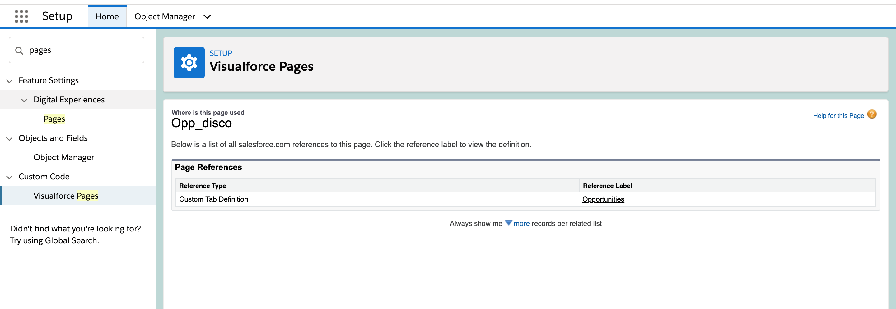
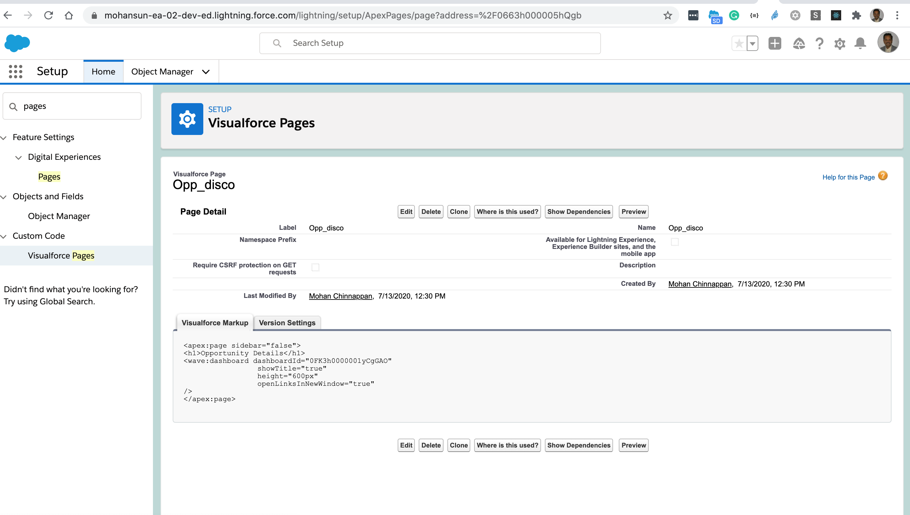

## MetadataComponentDependency

```
$ cat mda.soql
```

```
SELECT 
Id
,MetadataComponentId
,MetadataComponentNamespace
,MetadataComponentName
,MetadataComponentType
,RefMetadataComponentId
,RefMetadataComponentNamespace
,RefMetadataComponentName
,RefMetadataComponentType

FROM MetadataComponentDependency

```

## Querying MetadataComponentDependency

```
$ sfdx mohanc:tooling:query  -u mohan.chinnappan.n_ea2@gmail.com -q mda.soql  -f json
```

```
[
  {
    attributes: {
      type: 'MetadataComponentDependency',
      url: '/services/data/v51.0/tooling/sobjects/MetadataComponentDependency/000000000000000AAA'
    },
    Id: '000000000000000AAA',
    MetadataComponentId: '01r3h0000017AcnAAE',
    MetadataComponentNamespace: null,
    MetadataComponentName: 'Manager_Overview',
    MetadataComponentType: 'CustomTab',
    RefMetadataComponentId: '0663h000005hQgaAAE',
    RefMetadataComponentNamespace: null,
    RefMetadataComponentName: 'Manager_Overview',
    RefMetadataComponentType: 'ApexPage'
  },
  {
    attributes: {
      type: 'MetadataComponentDependency',
      url: '/services/data/v51.0/tooling/sobjects/MetadataComponentDependency/000000000000000AAA'
    },
    Id: '000000000000000AAA',
    MetadataComponentId: '01r3h0000017AcoAAE',
    MetadataComponentNamespace: null,
    MetadataComponentName: 'Opp_Disco',
    MetadataComponentType: 'CustomTab',
    RefMetadataComponentId: '0663h000005hQgbAAE',
    RefMetadataComponentNamespace: null,
    RefMetadataComponentName: 'Opp_disco',
    RefMetadataComponentType: 'ApexPage'
  },
  {
    attributes: {
      type: 'MetadataComponentDependency',
      url: '/services/data/v51.0/tooling/sobjects/MetadataComponentDependency/000000000000000AAA'
    },
    Id: '000000000000000AAA',
    MetadataComponentId: '01r3h0000017AcpAAE',
    MetadataComponentNamespace: null,
    MetadataComponentName: 'Trailhead_Data_Manager',
    MetadataComponentType: 'CustomTab',
    RefMetadataComponentId: '0663h000005hQgZAAU',
    RefMetadataComponentNamespace: null,
    RefMetadataComponentName: 'DataManager',
    RefMetadataComponentType: 'ApexPage'
  },
...
]

```

<table> <tr><td> </td></tr>
<tr><td> <b>REFERS &#8595;</b>	 <td></tr>
<tr><td>  </td> </tr> 
</table>
