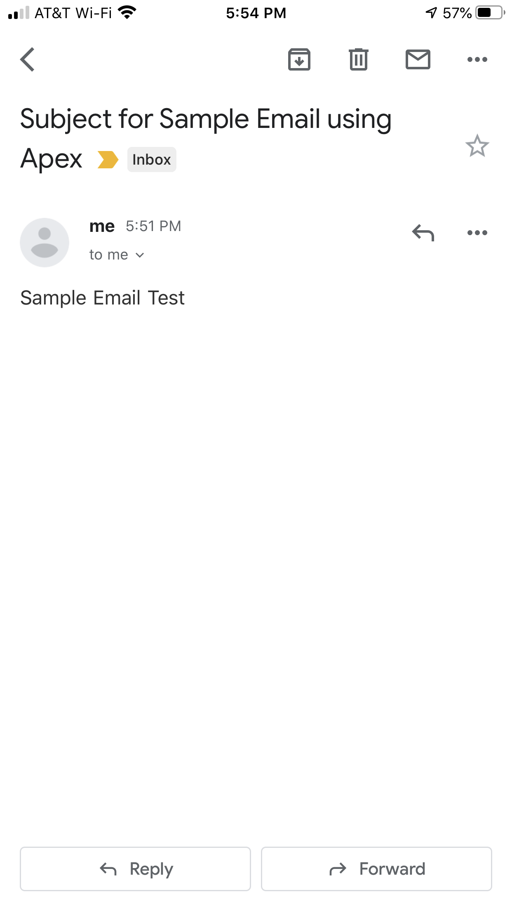

##  SFDX plugin to  Execute Anonymous Apex 
### Topics
- [Usage](#usage)
- [Sending Email](#email)

<a name='usage'></a>
### Usage

```
$ sfdx mohanc:tooling:execute -h
Execute Anonymous Apex

USAGE
  $ sfdx mohanc:tooling:execute

OPTIONS
  -a, --apexcodefilename=apexcodefilename          Apex Code Input File Name
  -u, --targetusername=targetusername              username or alias for the target org; overrides default target org
  -v, --targetdevhubusername=targetdevhubusername  username or alias for the dev hub org; overrides default dev hub org
  --apiversion=apiversion                          override the api version used for api requests made by this command
  --json                                           format output as json
  --loglevel=(trace|debug|info|warn|error|fatal)   logging level for this command invocation

EXAMPLE


     ** Execute Anonymous Apex **
  
     $ sfdx  mohanc:tooling:execute -u TestOrg2 -a apexCode.cls

```

### Demo

- **Apex Code**
``` 
$ cat tooling_update.soql 
Account[] acctsBefore = [SELECT NumberOfEmployees  FROM Account  
                     WHERE Id = '0013h00000Ffg18AAB'
                  ];
System.debug(acctsBefore);
acctsBefore[0].NumberOfEmployees = 12000;
update acctsBefore;

Account[] acctsAfter = [SELECT NumberOfEmployees  FROM Account  
                     WHERE Id = '0013h00000Ffg18AAB'
                  ];
System.debug(acctsAfter);
```

- **Execute**

```  
$ sfdx mohanc:tooling:execute -a tooling_update.soql -u  mohan.chinnappan.n_ea2@gmail.com

apexCode: Account[] acctsBefore = [SELECT NumberOfEmployees  FROM Account  
                     WHERE Id = '0013h00000Ffg18AAB'
                  ];
System.debug(acctsBefore);
acctsBefore[0].NumberOfEmployees = 12000;
update acctsBefore;

Account[] acctsAfter = [SELECT NumberOfEmployees  FROM Account  
                     WHERE Id = '0013h00000Ffg18AAB'
                  ];
System.debug(acctsAfter);

compiled?: true
executed?: true
{
  line: -1,
  column: -1,
  compiled: true,
  success: true,
  compileProblem: null,
  exceptionStackTrace: null,
  exceptionMessage: null
}

```

### Results


<a name='email'></a>
## Sending email using Apex

```
$ sfdx mohanc:tooling:execute  -u mohan.chinnappan.n_ea2@gmail.com -a email.cls 
apexCode: // First, reserve email capacity for the current Apex transaction to ensure
// that we won't exceed our daily email limits when sending email after
// the current transaction is committed.
Messaging.reserveSingleEmailCapacity(2);

// Processes and actions involved in the Apex transaction occur next,
// which conclude with sending a single email.

// Now create a new single email message object
// that will send out a single email to the addresses in the To, CC & BCC list.
Messaging.SingleEmailMessage mail = new Messaging.SingleEmailMessage();

// Strings to hold the email addresses to which you are sending the email.
String[] toAddresses = new String[] {'mohan.chinnappan.n@gmail.com'}; 
//String[] ccAddresses = new String[] {'smith@gmail.com'};
  

// Assign the addresses for the To and CC lists to the mail object.
mail.setToAddresses(toAddresses);
//mail.setCcAddresses(ccAddresses);

// Specify the address used when the recipients reply to the email. 
mail.setReplyTo('mohan.chinnappan.n@gmail.com');

// Specify the name used as the display name.
mail.setSenderDisplayName('Sample Email using Apex');

// Specify the subject line for your email address.
mail.setSubject('Subject for Sample Email using Apex');

// Set to True if you want to BCC yourself on the email.
mail.setBccSender(false);

// Optionally append the salesforce.com email signature to the email.
// The email address of the user executing the Apex Code will be used.
mail.setUseSignature(false);

// Specify the text content of the email.
mail.setPlainTextBody('Sample Email Test');


// Send the email you have created.
Messaging.sendEmail(new Messaging.SingleEmailMessage[] { mail });

compiled?: true
executed?: true
{
  line: -1,
  column: -1,
  compiled: true,
  success: true,
  compileProblem: null,
  exceptionStackTrace: null,
  exceptionMessage: null
}
```

