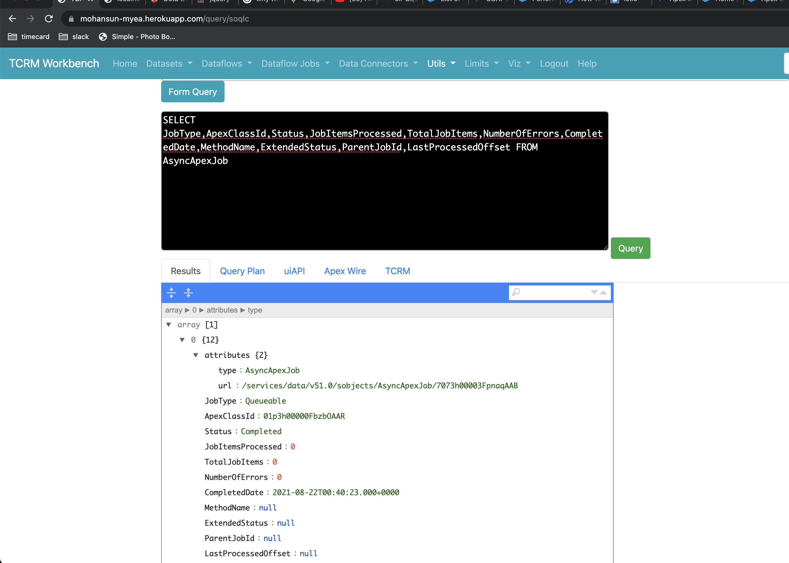

## Asynchronous Apex


```sql


SELECT JobType,ApexClassId,Status,JobItemsProcessed,TotalJobItems,NumberOfErrors,CompletedDate,MethodName,ExtendedStatus,ParentJobId,LastProcessedOffset FROM AsyncApexJob

```


```java

public class AsyncExecutionExample implements Queueable {
    public void execute(QueueableContext context) {
        Account a = new Account(Name='Acme',Phone='(415) 555-1212');
        insert a;        
    }
}

```

```java

ID jobID = System.enqueueJob(new AsyncExecutionExample());

```



`
