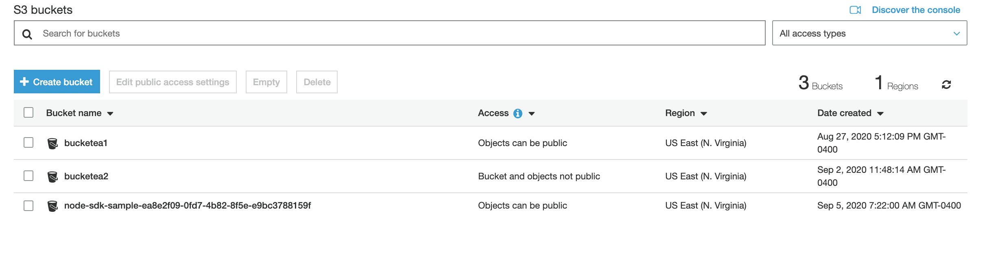

# AWS access via DX

## List S3 buckets

### Usage

- Make sure that you have aws_access_key_id and aws_secret_access_key are in the file  ~/.aws/credentials 

```
$ cat ~/.aws/credentials 
[default]
aws_access_key_id =  YOUR_KEY_ID_HERE
aws_secret_access_key = YOUR_SECRET_ACCESS_KEY_HERE

```


```
List AWS S3 buckets 

USAGE
  $ sfdx mohanc:aws:s3:ls

OPTIONS
  --json                                          format output as json
  --loglevel=(trace|debug|info|warn|error|fatal)  logging level for this command invocation

EXAMPLE

       ** List AWS S3 buckets  **

       sfdx mohanc:aws:s3:ls 
```

### Demo

```
$ sfdx mohanc:aws:s3:ls 
[
  { Name: 'bucketea1', CreationDate: 2020-08-27T21:12:09.000Z },
  { Name: 'bucketea2', CreationDate: 2020-09-02T15:48:14.000Z },
  {
    Name: 'node-sdk-sample-ea8e2f09-0fd7-4b82-8f5e-e9bc3788159f',
    CreationDate: 2020-09-05T11:22:00.000Z
  }
]

```

