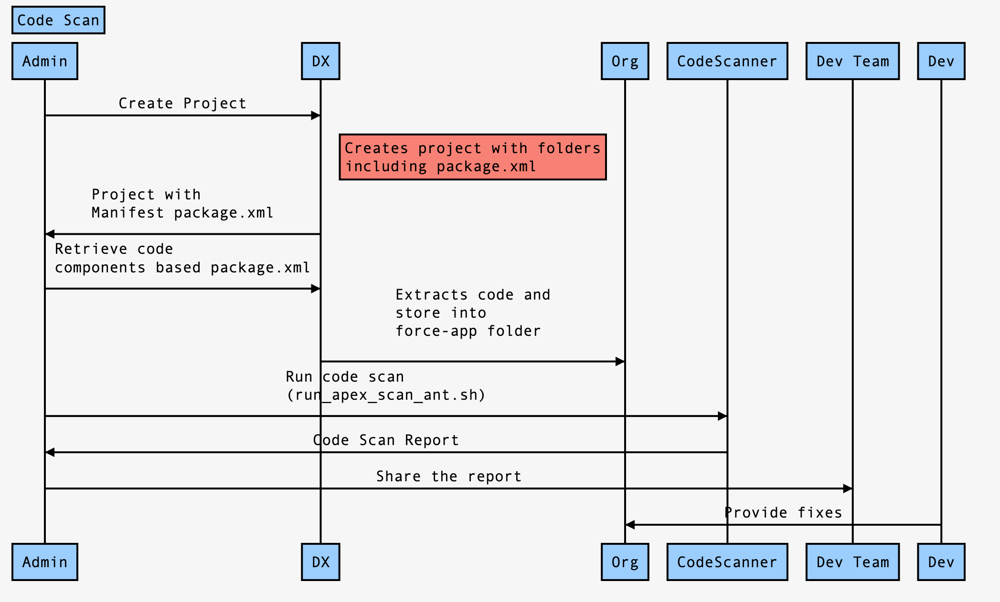
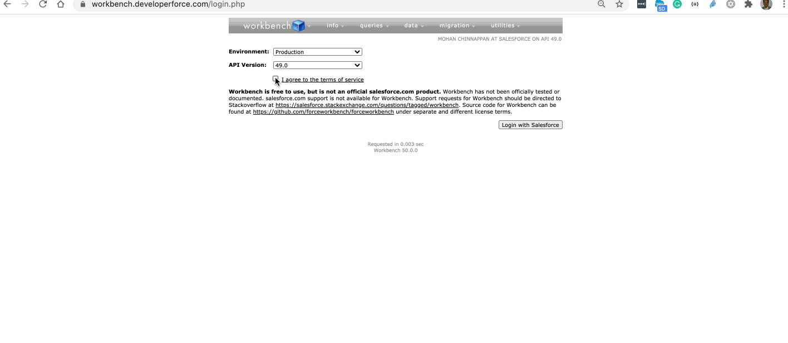
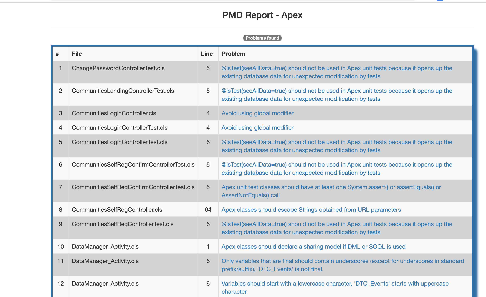

# How to retrieve the code in your Org using DX and perform Code Scan?

<a name='topics'></a>
## Topics
- [Create project](#cprj)
- [Retrieve code based on package.xml](#rcode)
- [Retrieve only the selected items](#sel)
- [Using workbench to retrieve code](#wrcode)
- [Run code scan](#cs) 

## References
- [Running PMD using ANT tasks](https://github.com/mohan-chinnappan-n/pmd-dist)
- [VS Code Extension Option](#vsc)
- [User Profile permission descriptions](https://help.salesforce.com/articleView?id=000332385&type=1&mode=1)
- [User Permissions and Access](https://help.salesforce.com/articleView?id=permissions_about_users_access.htm&type=5)


## Flow



<a name="cprj"></a>
- [Top](#topics)
## Create a project  (example: cproj)
```
$ sfdx force:project:create -x -n cproj
target dir = /Users/mchinnappan/code-extract
   create cproj/config/project-scratch-def.json
   create cproj/README.md
   create cproj/sfdx-project.json
   create cproj/manifest/package.xml <------
   create cproj/.vscode/extensions.json
   create cproj/.vscode/launch.json
   create cproj/.vscode/settings.json
   create cproj/force-app/main/default/lwc/.eslintrc.json
   create cproj/force-app/main/default/aura/.eslintrc.json
   create cproj/scripts/soql/account.soql
   create cproj/scripts/apex/hello.apex
   create cproj/.eslintignore
   create cproj/.forceignore
   create cproj/.gitignore
   create cproj/.prettierignore
   create cproj/.prettierrc
   create cproj/package.json

$ cd cproj

$ cd cproj
$ tree
.
├── README.md
├── config
│   └── project-scratch-def.json
├── force-app
│   └── main
│       └── default
│           ├── applications
│           ├── aura
│           ├── classes
│           ├── contentassets
│           ├── flexipages
│           ├── layouts
│           ├── lwc
│           ├── objects
│           ├── permissionsets
│           ├── staticresources
│           ├── tabs
│           └── triggers
├── manifest
│   └── package.xml <--------
├── package.json
├── scripts
│   ├── apex
│   │   └── hello.apex
│   └── soql
│       └── account.soql
└── sfdx-project.json
```
### Manifest package.xml 
```
$ cat manifest/package.xml 
```

- This has  selectors for all the code types 
```xml
<?xml version="1.0" encoding="UTF-8" standalone="yes"?>
<Package xmlns="http://soap.sforce.com/2006/04/metadata">
    <types>
        <members>*</members>
        <name>ApexClass</name>
    </types>
    <types>
        <members>*</members>
        <name>ApexComponent</name>
    </types>
    <types>
        <members>*</members>
        <name>ApexPage</name>
    </types>
    <types>
        <members>*</members>
        <name>ApexTestSuite</name>
    </types>
    <types>
        <members>*</members>
        <name>ApexTrigger</name>
    </types>
    <types>
        <members>*</members>
        <name>AuraDefinitionBundle</name>
    </types>
    <types>
        <members>*</members>
        <name>LightningComponentBundle</name>
    </types>
    <types>
        <members>*</members>
        <name>StaticResource</name>
    </types>
    <version>49.0</version>
</Package>
```
<a name="rcode"></a>
- [Topics](#topics)

### Retrieve the code based on this package.xml
```
$ sfdx force:source:retrieve  -u mohan.chinnappan.n_ea2@gmail.com -x manifest/package.xml 
=== Retrieved Source
FULL NAME                                   TYPE                      PROJECT PATH
──────────────────────────────────────────  ────────────────────────  ──────────────────────────────────────────────────────────────────────────────────────────────────────────────────────
wave_template_assets                        StaticResource            force-app/main/default/staticresources/wave_template_assets.resource-meta.xml
wave_template_assets                        StaticResource            force-app/main/default/staticresources/wave_template_assets/__MACOSX/screenshots/._Test_Dashboard_colorblind_theme.png
wave_template_assets                        StaticResource            force-app/main/default/staticresources/wave_template_assets/__MACOSX/screenshots/._Test_Dashboard_dark_theme.png
wave_template_assets                        StaticResource            force-app/main/default/staticresources/wave_template_assets/__MACOSX/screenshots/._Test_Dashboard_light_theme.png
wave_template_assets                        StaticResource            force-app/main/default/staticresources/wave_template_assets/__MACOSX/screenshots/._Test_Dashboard_wave_theme.png
wave_template_assets                        StaticResource            force-app/main/default/staticresources/wave_template_assets/__MACOSX/template_images/._customize_sales_wave.png
wave_template_assets                        StaticResource            force-app/main/default/staticresources/wave_template_assets/__MACOSX/template_images/._launch_sales_wave.png
wave_template_assets                        StaticResource            force-app/main/default/staticresources/wave_template_assets/screenshots/Test_Dashboard_colorblind_theme.png
wave_template_assets                        StaticResource            force-app/main/default/staticresources/wave_template_assets/screenshots/Test_Dashboard_dark_theme.png
wave_template_assets                        StaticResource            force-app/main/default/staticresources/wave_template_assets/screenshots/Test_Dashboard_light_theme.png
wave_template_assets                        StaticResource            force-app/main/default/staticresources/wave_template_assets/screenshots/Test_Dashboard_wave_theme.png
wave_template_assets                        StaticResource            force-app/main/default/staticresources/wave_template_assets/template_images/customize_sales_wave.png
wave_template_assets                        StaticResource            force-app/main/default/staticresources/wave_template_assets/template_images/launch_sales_wave.png
URI                                         StaticResource            force-app/main/default/staticresources/URI.resource-meta.xml
URI                                         StaticResource            force-app/main/default/staticresources/URI.csv
DTC_OpportunityHistory                      StaticResource            force-app/main/default/staticresources/DTC_OpportunityHistory.resource-meta.xml
...

```

###  Content of force-app folder

```
$ tree force-app/
force-app/
└── main
    └── default
        ├── applications
        ├── aura
        │   ├── FilterTest
        │   │   ├── FilterTest.cmp
        │   │   ├── FilterTest.cmp-meta.xml
        │   │   └── FilterTestController.js
        │   ├── WaveTest
        │   │   ├── WaveTest.cmp
        │   │   └── WaveTest.cmp-meta.xml
        │   ├── WaveTestApp
        │   │   ├── WaveTestApp.app
        │   │   └── WaveTestApp.app-meta.xml
        │   ├── forgotPassword
        │   │   ├── forgotPassword.cmp
        │   │   ├── forgotPassword.cmp-meta.xml
        │   │   ├── forgotPassword.css
        │   │   ├── forgotPassword.design
        │   │   ├── forgotPasswordController.js
        │   │   └── forgotPasswordHelper.js
        │   ├── loginForm
        │   │   ├── loginForm.cmp
        │   │   ├── loginForm.cmp-meta.xml
        │   │   ├── loginForm.css
        │   │   ├── loginForm.design
        │   │   ├── loginFormController.js
        │   │   └── loginFormHelper.js
        │   ├── selfRegister
        │   │   ├── selfRegister.cmp
        │   │   ├── selfRegister.cmp-meta.xml
        │   │   ├── selfRegister.css
        │   │   ├── selfRegister.design
        │   │   ├── selfRegisterController.js
        │   │   └── selfRegisterHelper.js
        │   ├── setExpId
        │   │   ├── setExpId.evt
        │   │   └── setExpId.evt-meta.xml
        │   └── setStartUrl
        │       ├── setStartUrl.evt
        │       └── setStartUrl.evt-meta.xml
        ├── classes
        │   ├── ChangePasswordController.cls
        | ...
        │   └── Upload_controller_EMTest.cls-meta.xml
        ├── components
        │   ├── SiteFooter.component
        │   ├── SiteFooter.component-meta.xml
        │   ├── SiteHeader.component
        │   ├── SiteHeader.component-meta.xml
        │   ├── SiteLogin.component
        │   ├── SiteLogin.component-meta.xml
        │   ├── SitePoweredBy.component
        │   ├── SitePoweredBy.component-meta.xml
        │   ├── loadinganalytics.component
        │   └── loadinganalytics.component-meta.xml
        ├── contentassets
        ├── flexipages
        ├── layouts
        ├── lwc
        │   ├── ideaList
        │   │   ├── ideaList.html
        │   │   ├── ideaList.js
        │   │   └── ideaList.js-meta.xml
        │   ├── ideaMgmt
        │   │   ├── ideaMgmt.html
        │   │   ├── ideaMgmt.js
        │   │   └── ideaMgmt.js-meta.xml
        │   └── rower
        │       ├── rower.html
        │       ├── rower.js
        │       └── rower.js-meta.xml
        ├── objects
        ├── pages
        │   ├── AnswersHome.page
        │   ├── AnswersHome.page-meta.xml
        │   ├── BandwidthExceeded.page
        │   ├── BandwidthExceeded.page-meta.xml
        │   ├── ChangePassword.page
        │   ├── ChangePassword.page-meta.xml
        │   ├── CommunitiesLanding.page
        │   ├── CommunitiesLanding.page-meta.xml
        │   ├── CommunitiesLogin.page
        │   ├── CommunitiesLogin.page-meta.xml
        │   ├── CommunitiesSelfReg.page
        │   ├── CommunitiesSelfReg.page-meta.xml
        │   ├── CommunitiesSelfRegConfirm.page
        │   ├── CommunitiesSelfRegConfirm.page-meta.xml
        │   ├── CommunitiesTemplate.page
        │   ├── CommunitiesTemplate.page-meta.xml
        │   ├── DataManager.page
        │   ├── DataManager.page-meta.xml
        │   ├── EMDatasetUpload.page
        │   ├── EMDatasetUpload.page-meta.xml
        │   ├── Exception.page
        │   ├── Exception.page-meta.xml
        │   ├── FileNotFound.page
        │   ├── FileNotFound.page-meta.xml
        │   ├── ForgotPassword.page
        │   ├── ForgotPassword.page-meta.xml
        │   ├── ForgotPasswordConfirm.page
        │   ├── ForgotPasswordConfirm.page-meta.xml
        │   ├── IdeasHome.page
        │   ├── IdeasHome.page-meta.xml
        │   ├── InMaintenance.page
        │   ├── InMaintenance.page-meta.xml
        │   ├── Manager_Overview.page
        │   ├── Manager_Overview.page-meta.xml
        │   ├── MyProfilePage.page
        │   ├── MyProfilePage.page-meta.xml
        │   ├── Opp_disco.page
        │   ├── Opp_disco.page-meta.xml
        │   ├── SiteLogin.page
        │   ├── SiteLogin.page-meta.xml
        │   ├── SiteRegister.page
        │   ├── SiteRegister.page-meta.xml
        │   ├── SiteRegisterConfirm.page
        │   ├── SiteRegisterConfirm.page-meta.xml
        │   ├── SiteTemplate.page
        │   ├── SiteTemplate.page-meta.xml
        │   ├── StdExceptionTemplate.page
        │   ├── StdExceptionTemplate.page-meta.xml
        │   ├── Unauthorized.page
        │   ├── Unauthorized.page-meta.xml
        │   ├── UnderConstruction.page
        │   ├── UnderConstruction.page-meta.xml
        │   ├── atutils.page
        │   ├── atutils.page-meta.xml
        │   ├── colorTest.page
        │   ├── colorTest.page-meta.xml
        │   ├── typeTest.page
        │   └── typeTest.page-meta.xml
        ├── permissionsets
        ├── staticresources
        │   ├── DTC_Account.csv
        │   ├── DTC_Account.resource-meta.xml
        │   ├── DTC_Case.csv
        │   ├── DTC_Case.resource-meta.xml
        │   ├── DTC_Event.csv
        │   ├── DTC_Event.resource-meta.xml
        │   ├── DTC_Opportunity.csv
        │   ├── DTC_Opportunity.resource-meta.xml
        │   ├── DTC_OpportunityHistory.csv
        │   ├── DTC_OpportunityHistory.resource-meta.xml
        │   ├── DTC_OpportunityLineItem.csv
        │   ├── DTC_OpportunityLineItem.resource-meta.xml
        │   ├── DTC_PriceBookEntry.csv
        │   ├── DTC_PriceBookEntry.resource-meta.xml
        │   ├── DTC_Product2.csv
        │   ├── DTC_Product2.resource-meta.xml
        │   ├── DTC_Task.csv
        │   ├── DTC_Task.resource-meta.xml
        │   ├── DTC_Telephony.csv
        │   ├── DTC_Telephony.resource-meta.xml
        │   ├── DataManager_SalesWave_WorkflowEdits.bin
        │   ├── DataManager_SalesWave_WorkflowEdits.resource-meta.xml
        │   ├── Report.csv
        │   ├── Report.resource-meta.xml
        │   ├── ReportSchema.json
        │   ├── ReportSchema.resource-meta.xml
        │   ├── SiteSamples
        │   │   ├── SiteStyles.css
        │   │   └── img
        │   │       ├── clock.png
        │   │       ├── construction.png
        │   │       ├── force_logo.png
        │   │       ├── maintenance.png
        │   │       ├── poweredby.png
        │   │       ├── tools.png
        │   │       ├── unauthorized.png
        │   │       └── warning.png
        │   ├── SiteSamples.resource-meta.xml
        │   ├── TestReport.csv
        │   ├── TestReport.resource-meta.xml
        │   ├── TestURI.csv
        │   ├── TestURI.resource-meta.xml
        │   ├── Test_WorkflowDefinition.json
        │   ├── Test_WorkflowDefinition.resource-meta.xml
        │   ├── Test_WorkflowList.json
        │   ├── Test_WorkflowList.resource-meta.xml
        │   ├── URI.csv
        │   ├── URI.resource-meta.xml
        │   ├── URISchema.json
        │   ├── URISchema.resource-meta.xml
        │   ├── atutils.js
        │   ├── atutils.resource-meta.xml
        │   ├── jscolor.js
        │   ├── jscolor.resource-meta.xml
        │   ├── normalize.css
        │   ├── normalize.resource-meta.xml
        │   ├── style.css
        │   ├── style.resource-meta.xml
        │   ├── trailhead_detail.png
        │   ├── trailhead_detail.resource-meta.xml
        │   ├── trailhead_detail_p1.png
        │   ├── trailhead_detail_p1.resource-meta.xml
        │   ├── trailhead_icon_160x160.png
        │   ├── trailhead_icon_160x160.resource-meta.xml
        │   ├── trailhead_icon_160x160_p1.png
        │   ├── trailhead_icon_160x160_p1.resource-meta.xml
        │   ├── upload_styles.css
        │   ├── upload_styles.resource-meta.xml
        │   ├── wave_template_assets
        │   │   ├── __MACOSX
        │   │   │   ├── screenshots
        │   │   │   └── template_images
        │   │   ├── screenshots
        │   │   │   ├── Test_Dashboard_colorblind_theme.png
        │   │   │   ├── Test_Dashboard_dark_theme.png
        │   │   │   ├── Test_Dashboard_light_theme.png
        │   │   │   └── Test_Dashboard_wave_theme.png
        │   │   └── template_images
        │   │       ├── customize_sales_wave.png
        │   │       └── launch_sales_wave.png
        │   └── wave_template_assets.resource-meta.xml
        ├── tabs
        └── triggers
            ├── TestTooling.trigger
            └── TestTooling.trigger-meta.xml

35 directories, 283 files
```


### Let us look at an Apex class
```
$ cat force-app/main/default/classes/ChangePasswordController.cls
```
```java
/**
 * An apex page controller that exposes the change password functionality
 */
public with sharing class ChangePasswordController {
    public String oldPassword {get; set;}
    public String newPassword {get; set;}
    public String verifyNewPassword {get; set;}        
    
    public PageReference changePassword() {
        return Site.changePassword(newPassword, verifyNewPassword, oldpassword);    
    }     
    
   	public ChangePasswordController() {}
}

```
### Let us look at lwc code
```
$ cat force-app/main/default/lwc/rower/rower.js
```
```js
import { LightningElement, api, track } from 'lwc';

export default class Rower extends LightningElement {
 
    @api index;
    @api rc;
    @track isNewRow;
    connectedCallback() {
        console.log(this.rc);
        this.isNewRow = this.index % this.rc === 0;
    }

    

}

```


<a name="sel"></a>
- [Topics](#topics)

## How to get only selected Items 
```
## login to the org you want to access
$ sfdx force:auth:web:login
## create project
$ sfdx force:project:create -x -n cprojSel
$ cd cprojSel
## retrieve
$ sfdx force:source:retrieve -m ApexClass,ApexComponent,ApexPage,ApexTrigger,AuraDefinitionBundle -u mohan.chinnappan.n_ea2@gmail.com
## zip it
$ zip -r code.zip force-app/main/default/*
$ ls -l code.zip 
-rw-r--r--  1 mchinnappan  wheel  152194 Oct  7 16:44 code.zip

$ tree force-app/main/default/
force-app/main/default/
├── applications
├── aura
├── classes
│   ├── ChangePasswordController.cls
│   ├── ChangePasswordController.cls-meta.xml
│   ├── ChangePasswordControllerTest.cls
│   ├── ChangePasswordControllerTest.cls-meta.xml
│   ├── CommunitiesLandingController.cls
|   ...
|   ├── Upload_controller_EMTest.cls
│   └── Upload_controller_EMTest.cls-meta.xml
├── contentassets
├── flexipages
├── layouts
├── lwc
├── objects
├── pages
│   ├── AnswersHome.page
│   ├── AnswersHome.page-meta.xml
│   ├── BandwidthExceeded.page
│   ├── BandwidthExceeded.page-meta.xml
│   ├── ChangePassword.page
│   ├── ChangePassword.page-meta.xml
│   ├── CommunitiesLanding.page
│   ├── CommunitiesLanding.page-meta.xml
│   ├── CommunitiesLogin.page
│   ├── CommunitiesLogin.page-meta.xml
│   ├── CommunitiesSelfReg.page
│   ├── CommunitiesSelfReg.page-meta.xml
│   ├── CommunitiesSelfRegConfirm.page
│   ├── CommunitiesSelfRegConfirm.page-meta.xml
│   ├── CommunitiesTemplate.page
│   ├── CommunitiesTemplate.page-meta.xml
│   ├── DataManager.page
│   ├── DataManager.page-meta.xml
│   ├── EMDatasetUpload.page
│   ├── EMDatasetUpload.page-meta.xml
│   ├── Exception.page
│   ├── Exception.page-meta.xml
│   ├── FileNotFound.page
│   ├── FileNotFound.page-meta.xml
│   ├── ForgotPassword.page
│   ├── ForgotPassword.page-meta.xml
│   ├── ForgotPasswordConfirm.page
│   ├── ForgotPasswordConfirm.page-meta.xml
│   ├── IdeasHome.page
│   ├── IdeasHome.page-meta.xml
│   ├── InMaintenance.page
│   ├── InMaintenance.page-meta.xml
│   ├── Manager_Overview.page
│   ├── Manager_Overview.page-meta.xml
│   ├── MyProfilePage.page
│   ├── MyProfilePage.page-meta.xml
│   ├── Opp_disco.page
│   ├── Opp_disco.page-meta.xml
│   ├── SiteLogin.page
│   ├── SiteLogin.page-meta.xml
│   ├── SiteRegister.page
│   ├── SiteRegister.page-meta.xml
│   ├── SiteRegisterConfirm.page
│   ├── SiteRegisterConfirm.page-meta.xml
│   ├── SiteTemplate.page
│   ├── SiteTemplate.page-meta.xml
│   ├── StdExceptionTemplate.page
│   ├── StdExceptionTemplate.page-meta.xml
│   ├── Unauthorized.page
│   ├── Unauthorized.page-meta.xml
│   ├── UnderConstruction.page
│   ├── UnderConstruction.page-meta.xml
│   ├── atutils.page
│   ├── atutils.page-meta.xml
│   ├── colorTest.page
│   ├── colorTest.page-meta.xml
│   ├── typeTest.page
│   └── typeTest.page-meta.xml
├── permissionsets
├── staticresources
├── tabs
└── triggers
    ├── TestTooling.trigger
    └── TestTooling.trigger-meta.xml

13 directories, 162 files

```
<a name="wrcode"></a>
- [Topics](#topics)
## Using Workbench to retrieve code
- Prepare  Metadata xml

```
$ cat MetadataAll.xml
```
```xml 
<?xml version="1.0" encoding="UTF-8"?>
<Package xmlns="http://soap.sforce.com/2006/04/metadata">
    <types>
        <members>*</members>
        <name>ApexClass</name>
    </types>
    <types>
        <members>*</members>
        <name>ApexComponent</name>
    </types>
    <types>
        <members>*</members>
        <name>ApexPage</name>
    </types>
   
 <types>
        <members>*</members>
        <name>ApexTrigger</name>
    </types>
    
    <types>
        <members>*</members>
        <name>AuraDefinitionBundle</name>
    </types>
 
    <version>49.0</version>
</Package>
```

- [Login to Workbench](https://workbench.developerforce.com/login.php)
- Select Migration > Retrieve from the main Menu


- The downloaded zip  has retrieved metadata components 
```
$ jar tvf retrieve_09S3h000004vtXcEAI.zip 
  2950 Wed Oct 07 23:44:14 EDT 2020 aura/loginForm/loginFormController.js
   403 Wed Oct 07 23:44:14 EDT 2020 aura/FilterTest/FilterTestController.js
  4098 Wed Oct 07 23:44:14 EDT 2020 aura/loginForm/loginForm.cmp
   230 Wed Oct 07 23:44:14 EDT 2020 aura/loginForm/loginForm.cmp-meta.xml
    96 Wed Oct 07 23:44:14 EDT 2020 aura/setStartUrl/setStartUrl.evt
   228 Wed Oct 07 23:44:14 EDT 2020 aura/setStartUrl/setStartUrl.evt-meta.xml
    96 Wed Oct 07 23:44:14 EDT 2020 aura/setExpId/setExpId.evt
   225 Wed Oct 07 23:44:14 EDT 2020 aura/setExpId/setExpId.evt-meta.xml
   831 Wed Oct 07 23:44:14 EDT 2020 aura/FilterTest/FilterTest.cmp
   228 Wed Oct 07 23:44:14 EDT 2020 aura/FilterTest/FilterTest.cmp-meta.xml
  1043 Wed Oct 07 23:44:14 EDT 2020 aura/forgotPassword/forgotPasswordHelper.js
   953 Wed Oct 07 23:44:14 EDT 2020 aura/WaveTest/WaveTest.cmp
...

```
<a name="cs"></a>
- [Topics](#topics)
## Let us run code scan on Apex code
- If you are curious to know about SonarCube for code scan here it is [SonarQube Code Scan](https://github.com/mohan-chinnappan-n/cli-dx/blob/master/code/sonar/sonar.md)

### Set JDK to 1.8 for our purpose
- Note: these steps regarding setting JAVA_HOME is for macOS 
```
$ /usr/libexec/java_home -V
Matching Java Virtual Machines (4):
    11.0.8, x86_64:	"GraalVM CE 20.2.0"	/Library/Java/JavaVirtualMachines/graalvm-ce-java11-20.2.0/Contents/Home
    11.0.4-zulu-11.33+15, x86_64:	"Zulu 11"	/Library/Java/JavaVirtualMachines/zulu-11.jdk/Contents/Home
    1.8.0_111, x86_64:	"Java SE 8"	/Library/Java/JavaVirtualMachines/jdk1.8.0_111.jdk/Contents/Home
    1.7.0_79, x86_64:	"Java SE 7"	/Library/Java/JavaVirtualMachines/jdk1.7.0_79.jdk/Contents/Home

$ export JAVA_HOME=`/usr/libexec/java_home -v 1.8`
$ java -version
java version "1.8.0_111"
Java(TM) SE Runtime Environment (build 1.8.0_111-b14)
Java HotSpot(TM) 64-Bit Server VM (build 25.111-b14, mixed mode)
```
### Run code scan 
- Make sure you have cloned this repo [https://github.com/mohan-chinnappan-n/pmd-dist](https://github.com/mohan-chinnappan-n/pmd-dist) 
- In my case it is cloned to ~/codescan folder

```
$  bash run_apex_scan_ant.sh 
Buildfile: /Users/mchinnappan/codescan/pmd-dist/test-apex.xml

pmd:
      [pmd] Oct 07, 2020 8:59:07 AM apex.jorje.parser.impl.BaseApexLexer dedupe
      [pmd] INFO: Deduped array ApexLexer.DFA23_transition. Found 7927114 shorts which is 15MB not including array overhead. Removed 7204963 shorts which is 13MB not counting array overhead. Took 9ms.

BUILD SUCCESSFUL
Total time: 2 seconds
```

### Output
- [Apex Scan Result - CSV](results/pmd_report_apex.csv)

- HTML
    - 
    - [Apex Test Results](results/result_apex.html)
    - [Apex Test Results Page](https://mohan-chinnappan-n2.github.io/2020/codescan/results/apex/result_apex.html)


<a name='vsc'></a>
- [Topics](#topics)
## VS Code Option

- [VSCode Apex PMD](https://marketplace.visualstudio.com/items?itemName=mohanChinnappan.apex-pmd-code-scanner)

