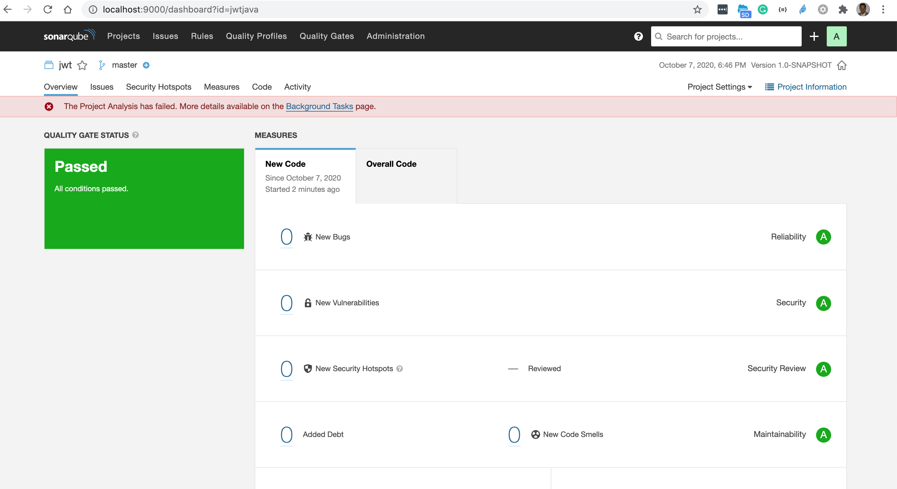

# Sonarqube 

## Topics

- [Download and Install](#install)
- [Code scan java](#java) - Maven based
- [Code scan apex](#apex) - Requires Enterprise or above


<a name="install"></a>
## Download
- Download from [CommunityEdition](https://www.sonarqube.org/downloads/)
- Note: Apex analysis is available as part of the Enterprise Edition and above.
- [Clearing the quarantine extended attribute from downloaded applications](https://community.sonarsource.com/t/sonar-cannot-start-once-updated-to-macos-catalina-error-as-wrapper-cannot-be-opened-because-the-developer-cannot-be-verified/16439/2)
```
$   xattr -dr com.apple.quarantine sonarqube-8.4.2.36762

```

### Set up JAVA_HOME
```
$ export JAVA_HOME=`/usr/libexec/java_home -v 11.0.4`
$ java --version
openjdk 11.0.4 2019-07-16 LTS
OpenJDK Runtime Environment Zulu11.33+15-CA (build 11.0.4+11-LTS)
OpenJDK 64-Bit Server VM Zulu11.33+15-CA (build 11.0.4+11-LTS, mixed mode)
```


### Run sonarqube 
```
$  sonarqube-8.4.2.36762/bin/macosx-universal-64/sonar.sh start
$ open http://localhost:9000
```


<a name='java'></a>
## Code scan java
```
## Create a project (e.g. jwtjava)
# cd to the folder maven project
$  mvn sonar:sonar   -Dsonar.projectKey=jwtjava   -Dsonar.host.url=http://localhost:9000   -Dsonar.login=da2a82e12a6504a69f3aa0b69cad171ed61b7a9a
[INFO] Scanning for projects...
[INFO]                                                                         
[INFO] ------------------------------------------------------------------------
[INFO] Building jwt 1.0-SNAPSHOT
[INFO] ------------------------------------------------------------------------
[INFO] 
[INFO] --- sonar-maven-plugin:3.7.0.1746:sonar (default-cli) @ jwt ---
[INFO] User cache: /Users/mchinnappan/.sonar/cache
[INFO] SonarQube version: 8.4.2
...
# open the scan reports
$ open http://localhost:9000/dashboard?id=jwtjava

```
### Results



<a name='apex'></a>
## Code scan Apex (requires Enterprise Edition and above)

```
## Create a project (e.g. eaorg)
## Download and install sonar-scanner
### Apex analysis is available as part of the Enterprise Edition and above.

## Run scanner
 ./sonar-scanner   -Dsonar.projectKey=eaorg   -Dsonar.sources=/Users/mchinnappan/code-extract/cprojApex/force-app/main/default/classes/   -Dsonar.host.url=http://localhost:9000   -Dsonar.login=c0e8f777df1ee5b87d2b7ab07200b1ae702f7dfc

## Open the reports
$ open http://localhost:9000/dashboard?id=eaorg
```

