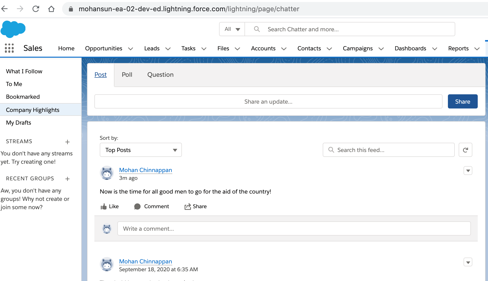
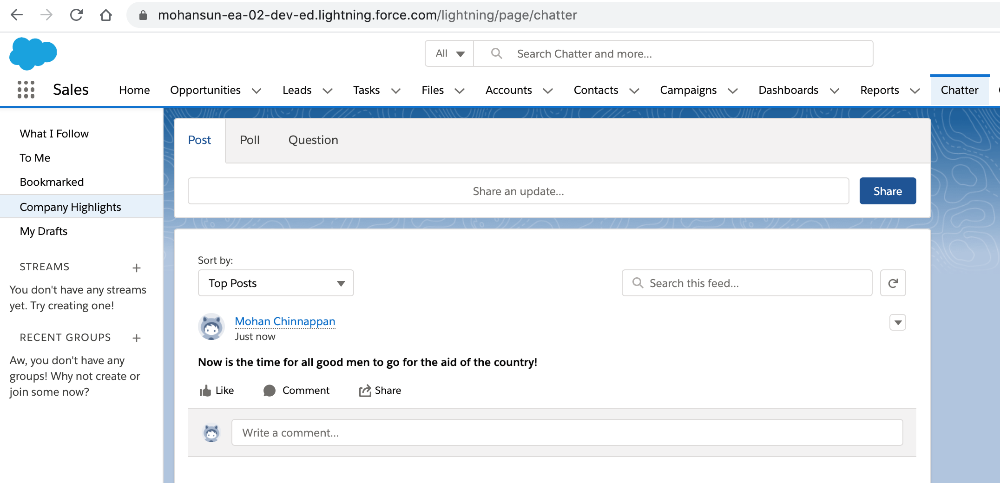
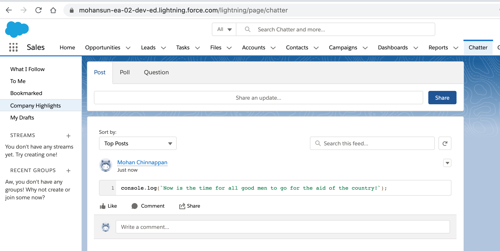

# Using  Connect API

## Topics

- [Creating header.json for the connected Salesforce org](#myorg)
- [Getting the user info](#userinfo)
- [Posting a chatter message to a user](#postmsg)
    - [Plain Text](#postplain)
    - [Rich Text](#postrtf)
    - [Code block](#postcode)
- [References](#ref)


<a name='postmsg'></a>
## Posting a chatter message to a user 

<a name='postplain'></a>
### Plain Text
```
$ sfdx mohanc:ws:rest -r https://mohansun-ea-02-dev-ed.my.salesforce.com/services/data/v49.0/chatter/feed-elements -m POST -f ~/.headers/header_ea.json -d ~/.chatter/postmsg.json

```
```
$ cat ~/.chatter/postmsg.json
```
- Note: *subjectId* in this case userId
```json
{ 
   "body" : {
      "messageSegments" : [
         {
            "type" : "Text",
            "text" : "Now is the time for all good men to go for the aid of the country!"
         }
      ]
   },
   "subjectId" : "0053h000002xQ5s"
}
```
- 

<a name='postrtf'></a>
###  Rich Text
```
$ sfdx mohanc:ws:rest -r https://mohansun-ea-02-dev-ed.my.salesforce.com/services/data/v49.0/chatter/feed-elements -m POST -f ~/.headers/header_ea.json -d ~/.chatter/postmsg_rtf.json

```
```
$ cat ~/.chatter/postmsg_rtf.json
```
- Note: *subjectId* in this case userId
```json

{ 
   "body" : {
      "messageSegments" : [

         {
            "markupType" : "Bold",
            "type" : "MarkupBegin"
         },
         {
            "type" : "Text",
            "text" : "Now is the time for all good men to go for the aid of the country!"
         },

        {
            "markupType" : "Bold",
            "type" : "MarkupEnd"
        }
      ]
   },
   "subjectId" : "0053h000002xQ5s"
}
```
- 

<a name='postcode'></a>
###  Code Block
```
$ sfdx mohanc:/s:rest -r https://mohansun-ea-02-dev-ed.my.salesforce.com/services/data/v49.0/chatter/feed-elements -m POST -f ~/.headers/header_ea.json -d ~/.chatter/postmsg_code.json

```
```
$ cat ~/.chatter/postmsg_code.json
```
- Note: *subjectId* in this case userId
```json

{ 
   "body" : {
      "messageSegments" : [

         {
            "markupType" : "Code",
            "type" : "MarkupBegin"
         },
         {
            "type" : "Text",
            "text" : "console.log(`Now is the time for all good men to go for the aid of the country!`);"
         },

        {
            "markupType" : "Code",
            "type" : "MarkupEnd"
        }
      ]
   },
   "subjectId" : "0053h000002xQ5s"
}
```
- 


<a name='userinfo'></a>

## Getting about the user: 'me'

```
$ sfdx mohanc:ws:rest -r https://mohansun-ea-02-dev-ed.my.salesforce.com/services/data/v49.0/chatter/users/me -m GET -f ~/.headers/header_ea.json > /tmp/chatter-me.json

$ cat /tmp/chatter-me.json
```


```json
{
    "aboutMe": null,
    "additionalLabel": null,
    "address": {
        "city": null,
        "country": "US",
        "formattedAddress": "US",
        "state": null,
        "street": null,
        "zip": null
    },
    "bannerPhoto": {
        "bannerPhotoUrl": "https://mohansun-ea-02-dev-ed--c.documentforce.com/profilephoto/005/B",
        "bannerPhotoVersionId": null,
        "url": "/services/data/v49.0/connect/user-profiles/0053h000002xQ5sAAE/banner-photo"
    },
    "chatterActivity": {
        "commentCount": 0,
        "commentReceivedCount": 0,
        "likeReceivedCount": 0,
        "postCount": 4
    },
    "chatterInfluence": {
        "percentile": "0.0",
        "rank": 1
    },
    "communityNickname": "User15946686587279553601",
    "companyName": "salesforce",
    "displayName": "Mohan Chinnappan",
    "email": "mohan.chinnappan.n@gmail.com",
    "firstName": "Mohan",
    "followersCount": 0,
    "followingCounts": {
        "people": 0,
        "records": 0,
        "total": 0
    },
    "groupCount": 0,
    "hasChatter": true,
    "id": "0053h000002xQ5sAAE",
    "isActive": true,
    "isInThisCommunity": true,
    "lastName": "Chinnappan",
    "managerId": null,
    "managerName": null,
    "motif": {
        "color": "65CAE4",
        "largeIconUrl": "/img/icon/profile64.png",
        "mediumIconUrl": "/img/icon/profile32.png",
        "smallIconUrl": "/img/icon/profile16.png",
        "svgIconUrl": null
    },
    "mySubscription": null,
    "name": "Mohan Chinnappan",
    "outOfOffice": {
        "message": ""
    },
    "phoneNumbers": [],
    "photo": {
        "fullEmailPhotoUrl": "https://mohansun-ea-02-dev-ed.my.salesforce.com/img/userprofile/default_profile_200_v2.png?fromEmail=1",
        "largePhotoUrl": "https://mohansun-ea-02-dev-ed--c.documentforce.com/profilephoto/005/F",
        "mediumPhotoUrl": "https://mohansun-ea-02-dev-ed--c.documentforce.com/profilephoto/005/M",
        "photoVersionId": null,
        "smallPhotoUrl": "https://mohansun-ea-02-dev-ed--c.documentforce.com/profilephoto/005/T",
        "standardEmailPhotoUrl": "https://mohansun-ea-02-dev-ed.my.salesforce.com/img/userprofile/default_profile_45_v2.png?fromEmail=1",
        "url": "/services/data/v49.0/connect/user-profiles/0053h000002xQ5sAAE/photo"
    },
    "reputation": null,
    "thanksReceived": null,
    "title": null,
    "type": "User",
    "url": "/services/data/v49.0/chatter/users/0053h000002xQ5sAAE",
    "userType": "Internal",
    "username": "mohan.chinnappan.n_ea2@gmail.com"
}
```

### Getting the address of the user

```
$ sfdx mohanc:data:jq  -i /tmp/chatter-me.json -f '.address'
```
```json
{
  "city": null,
  "country": "US",
  "formattedAddress": "US",
  "state": null,
  "street": null,
  "zip": null
}
```

###  Chatter Activity of the user

```
$ sfdx mohanc:data:jq  -i /tmp/chatter-me.json -f '.chatterActivity'
```

```json
{
  "commentCount": 0,
  "commentReceivedCount": 0,
  "likeReceivedCount": 0,
  "postCount": 4
}
```
### Chattter Influence of the user
```
$ sfdx mohanc:data:jq  -i /tmp/chatter-me.json -f '.chatterInfluence'
```

```json
{
  "percentile": "0.0",
  "rank": 1
}
```
### Company Name of the user

```
$ sfdx mohanc:data:jq  -i /tmp/chatter-me.json -f '.companyName'
"salesforce"
``` 
<a name='myorg'></a>
### How to create header.json for the Salesforce org I logged in via sfdx force:auth:web:login ?

- If you like to have an automated login use:
    -  **JWT flow** (force:auth:jwt:grant)  as explained here [DX Login via JWT flow](jwt.md)
```
$ sfdx mohanc:hello:myorg -u mohan.chinnappan.n_ea2@gmail.com > header.json 

$ cat header.json 
```
```json
{
    "Content-Type": "application/json",
    "Authorization": "Bearer 00D3h000007R1Lu!qJUNKSngDojbDmxCVuYF1HFFT6snO5fhQYJy8s.jFlO2oqi9CP3qXKJ1fAzgO",
    "apiVersion": "49.0",
    "instanceUrl": "https://mohansun-ea-02-dev-ed.my.salesforce.com",
    "restAPIUri": "https://mohansun-ea-02-dev-ed.my.salesforce.com/services/data/v49.0/"
}
```
<a name='newsfeed'></a>
## Get News Feed
```
 sfdx mohanc:ws:rest -r https://mohansun-ea-02-dev-ed.my.salesforce.com/services/data/v49.0/chatter/feeds/news/me/feed-elements -m GET -f ~/.headers/header_ea.json  > /tmp/mynews-feed.json
```
```
$ cat /tmp/mynews-feed.json
```

```json

{
    "currentPageToken": null,
    "currentPageUrl": "/services/data/v49.0/chatter/feeds/news/0053h000002xQ5sAAE/feed-elements",
    "elements": [
        {
            "actor": {
                "additionalLabel": null,
                "communityNickname": "User15946686587279553601",
                "companyName": "salesforce",
                "displayName": "Mohan Chinnappan",
                "firstName": "Mohan",
                "id": "0053h000002xQ5sAAE",
                "isActive": true,
                "isInThisCommunity": true,
                "lastName": "Chinnappan",
                "motif": {
                    "color": "65CAE4",
                    "largeIconUrl": "/img/icon/profile64.png",
                    "mediumIconUrl": "/img/icon/profile32.png",
                    "smallIconUrl": "/img/icon/profile16.png",
                    "svgIconUrl": null
                },
                "mySubscription": null,
                "name": "Mohan Chinnappan",
                "outOfOffice": {
                    "message": ""
                },
                "photo": {
                    "fullEmailPhotoUrl": "https://mohansun-ea-02-dev-ed.my.salesforce.com/img/userprofile/default_profile_200_v2.png?fromEmail=1",
                    "largePhotoUrl": "https://mohansun-ea-02-dev-ed--c.documentforce.com/profilephoto/005/F",
                    "mediumPhotoUrl": "https://mohansun-ea-02-dev-ed--c.documentforce.com/profilephoto/005/M",
                    "photoVersionId": null,
                    "smallPhotoUrl": "https://mohansun-ea-02-dev-ed--c.documentforce.com/profilephoto/005/T",
                    "standardEmailPhotoUrl": "https://mohansun-ea-02-dev-ed.my.salesforce.com/img/userprofile/default_profile_45_v2.png?fromEmail=1",
                    "url": "/services/data/v49.0/connect/user-profiles/0053h000002xQ5sAAE/photo"
                },
                "reputation": null,
                "title": null,
                "type": "User",
                "url": "/services/data/v49.0/chatter/users/0053h000002xQ5sAAE",
                "userType": "Internal"
            },
            "body": {
                "isRichText": false,
                "messageSegments": [
                    {
                        "text": "Threshold has reached, take action!",
                        "type": "Text"
                    }
                ],
                "text": "Threshold has reached, take action!"
            },
            "capabilities": {
                "associatedActions": {
                    "platformActionGroups": []
                },
                "bookmarks": {
                    "isBookmarkedByCurrentUser": false
                },
                "chatterLikes": {
                    "isLikedByCurrentUser": false,
                    "likesMessage": null,
                    "myLike": null,
                    "page": {
                        "currentPageToken": 0,
                        "currentPageUrl": "/services/data/v49.0/chatter/feed-elements/0D53h00000n2hpkCAA/capabilities/chatter-likes/items",
                        "items": [],
                        "nextPageToken": null,
                        "nextPageUrl": null,
                        "previousPageToken": null,
                        "previousPageUrl": null,
                        "total": 0
                    }
                },
                "close": {
                    "canContextUserUpdateIsClosed": true,
                    "isClosed": false
                },
                "comments": {
                    "page": {
                        "currentPageToken": null,
                        "currentPageUrl": "/services/data/v49.0/chatter/feed-elements/0D53h00000n2hpkCAA/capabilities/comments/items",
                        "items": [],
                        "nextPageToken": null,
                        "nextPageUrl": null,
                        "previousPageToken": null,
                        "previousPageUrl": null,
                        "total": 0
                    }
                },
                "edit": {
                    "isEditRestricted": false,
                    "isEditableByMeUrl": "/services/data/v49.0/chatter/feed-elements/0D53h00000n2hpkCAA/capabilities/edit/is-editable-by-me",
                    "lastEditedBy": null,
                    "lastEditedDate": null,
                    "latestRevision": 1,
                    "relativeLastEditedDate": null
                },
                "interactions": {
                    "count": 0
                },
                "mute": {
                    "isMutedByMe": false
                },
                "readBy": {
                    "isReadByMe": true,
                    "lastReadDateByMe": "2020-09-18T13:35:44.000Z",
                    "page": {
                        "currentPageToken": null,
                        "currentPageUrl": "/services/data/v49.0/chatter/feed-elements/0D53h00000n2hpkCAA/capabilities/read-by/items?pageSize=3",
                        "items": [],
                        "nextPageToken": null,
                        "nextPageUrl": null,
                        "previousPageToken": null,
                        "previousPageUrl": null,
                        "total": 0
                    }
                },
                "status": {
                    "feedEntityStatus": "Published",
                    "isApprovableByMe": true
                },
                "topics": {
                    "canAssignTopics": true,
                    "items": []
                },
                "upDownVote": {
                    "downVoteCount": 0,
                    "myVote": "None",
                    "upVoteCount": 0
                }
            },
            "clientInfo": {
                "applicationName": "Salesforce CLI",
                "applicationUrl": "https://developer.salesforce.com/tools/sfdxcli"
            },
            "createdDate": "2020-09-18T13:35:44.000Z",
            "event": false,
            "feedElementType": "FeedItem",
            "hasVerifiedComment": false,
            "header": {
                "isRichText": null,
                "messageSegments": [
                    {
                        "motif": {
                            "color": "65CAE4",
                            "largeIconUrl": "/img/icon/profile64.png",
                            "mediumIconUrl": "/img/icon/profile32.png",
                            "smallIconUrl": "/img/icon/profile16.png",
                            "svgIconUrl": null
                        },
                        "reference": {
                            "id": "0053h000002xQ5sAAE",
                            "url": "/services/data/v49.0/chatter/users/0053h000002xQ5sAAE"
                        },
                        "text": "Mohan Chinnappan",
                        "type": "EntityLink"
                    }
                ],
                "text": "Mohan Chinnappan"
            },
            "id": "0D53h00000n2hpkCAA",
            "isDeleteRestricted": false,
            "isSharable": true,
            "modifiedDate": "2020-09-18T13:35:44.000Z",
            "originalFeedItem": null,
            "originalFeedItemActor": null,
            "parent": {
                "additionalLabel": null,
                "communityNickname": "User15946686587279553601",
                "companyName": "salesforce",
                "displayName": "Mohan Chinnappan",
                "firstName": "Mohan",
                "id": "0053h000002xQ5sAAE",
                "isActive": true,
                "isInThisCommunity": true,
                "lastName": "Chinnappan",
                "motif": {
                    "color": "65CAE4",
                    "largeIconUrl": "/img/icon/profile64.png",
                    "mediumIconUrl": "/img/icon/profile32.png",
                    "smallIconUrl": "/img/icon/profile16.png",
                    "svgIconUrl": null
                },
                "mySubscription": null,
                "name": "Mohan Chinnappan",
                "outOfOffice": {
                    "message": ""
                },
                "photo": {
                    "fullEmailPhotoUrl": "https://mohansun-ea-02-dev-ed.my.salesforce.com/img/userprofile/default_profile_200_v2.png?fromEmail=1",
                    "largePhotoUrl": "https://mohansun-ea-02-dev-ed--c.documentforce.com/profilephoto/005/F",
                    "mediumPhotoUrl": "https://mohansun-ea-02-dev-ed--c.documentforce.com/profilephoto/005/M",
                    "photoVersionId": null,
                    "smallPhotoUrl": "https://mohansun-ea-02-dev-ed--c.documentforce.com/profilephoto/005/T",
                    "standardEmailPhotoUrl": "https://mohansun-ea-02-dev-ed.my.salesforce.com/img/userprofile/default_profile_45_v2.png?fromEmail=1",
                    "url": "/services/data/v49.0/connect/user-profiles/0053h000002xQ5sAAE/photo"
                },
                "reputation": null,
                "title": null,
                "type": "User",
                "url": "/services/data/v49.0/chatter/users/0053h000002xQ5sAAE",
                "userType": "Internal"
            },
            "photoUrl": "https://mohansun-ea-02-dev-ed--c.documentforce.com/profilephoto/005/T",
            "relativeCreatedDate": "September 18, 2020 at 6:35 AM",
            "type": "TextPost",
            "url": "/services/data/v49.0/chatter/feed-elements/0D53h00000n2hpkCAA",
            "visibility": "AllUsers"
        },
        {
            "actor": {
                "additionalLabel": null,
                "communityNickname": "User15946686587279553601",
                "companyName": "salesforce",
                "displayName": "Mohan Chinnappan",
                "firstName": "Mohan",
                "id": "0053h000002xQ5sAAE",
                "isActive": true,
                "isInThisCommunity": true,
                "lastName": "Chinnappan",
                "motif": {
                    "color": "65CAE4",
                    "largeIconUrl": "/img/icon/profile64.png",
                    "mediumIconUrl": "/img/icon/profile32.png",
                    "smallIconUrl": "/img/icon/profile16.png",
                    "svgIconUrl": null
                },
                "mySubscription": null,
                "name": "Mohan Chinnappan",
                "outOfOffice": {
                    "message": ""
                },
                "photo": {
                    "fullEmailPhotoUrl": "https://mohansun-ea-02-dev-ed.my.salesforce.com/img/userprofile/default_profile_200_v2.png?fromEmail=1",
                    "largePhotoUrl": "https://mohansun-ea-02-dev-ed--c.documentforce.com/profilephoto/005/F",
                    "mediumPhotoUrl": "https://mohansun-ea-02-dev-ed--c.documentforce.com/profilephoto/005/M",
                    "photoVersionId": null,
                    "smallPhotoUrl": "https://mohansun-ea-02-dev-ed--c.documentforce.com/profilephoto/005/T",
                    "standardEmailPhotoUrl": "https://mohansun-ea-02-dev-ed.my.salesforce.com/img/userprofile/default_profile_45_v2.png?fromEmail=1",
                    "url": "/services/data/v49.0/connect/user-profiles/0053h000002xQ5sAAE/photo"
                },
                "reputation": null,
                "title": null,
                "type": "User",
                "url": "/services/data/v49.0/chatter/users/0053h000002xQ5sAAE",
                "userType": "Internal"
            },
            "body": {
                "isRichText": false,
                "messageSegments": [
                    {
                        "text": "Threshold has reached, take action!",
                        "type": "Text"
                    }
                ],
                "text": "Threshold has reached, take action!"
            },
            "capabilities": {
                "associatedActions": {
                    "platformActionGroups": []
                },
                "bookmarks": {
                    "isBookmarkedByCurrentUser": false
                },
                "chatterLikes": {
                    "isLikedByCurrentUser": false,
                    "likesMessage": null,
                    "myLike": null,
                    "page": {
                        "currentPageToken": 0,
                        "currentPageUrl": "/services/data/v49.0/chatter/feed-elements/0D53h00000n2horCAA/capabilities/chatter-likes/items",
                        "items": [],
                        "nextPageToken": null,
                        "nextPageUrl": null,
                        "previousPageToken": null,
                        "previousPageUrl": null,
                        "total": 0
                    }
                },
                "close": {
                    "canContextUserUpdateIsClosed": true,
                    "isClosed": false
                },
                "comments": {
                    "page": {
                        "currentPageToken": null,
                        "currentPageUrl": "/services/data/v49.0/chatter/feed-elements/0D53h00000n2horCAA/capabilities/comments/items",
                        "items": [],
                        "nextPageToken": null,
                        "nextPageUrl": null,
                        "previousPageToken": null,
                        "previousPageUrl": null,
                        "total": 0
                    }
                },
                "edit": {
                    "isEditRestricted": false,
                    "isEditableByMeUrl": "/services/data/v49.0/chatter/feed-elements/0D53h00000n2horCAA/capabilities/edit/is-editable-by-me",
                    "lastEditedBy": null,
                    "lastEditedDate": null,
                    "latestRevision": 1,
                    "relativeLastEditedDate": null
                },
                "interactions": {
                    "count": 0
                },
                "mute": {
                    "isMutedByMe": false
                },
                "readBy": {
                    "isReadByMe": true,
                    "lastReadDateByMe": "2020-09-18T13:35:13.000Z",
                    "page": {
                        "currentPageToken": null,
                        "currentPageUrl": "/services/data/v49.0/chatter/feed-elements/0D53h00000n2horCAA/capabilities/read-by/items?pageSize=3",
                        "items": [],
                        "nextPageToken": null,
                        "nextPageUrl": null,
                        "previousPageToken": null,
                        "previousPageUrl": null,
                        "total": 0
                    }
                },
                "status": {
                    "feedEntityStatus": "Published",
                    "isApprovableByMe": true
                },
                "topics": {
                    "canAssignTopics": true,
                    "items": []
                },
                "upDownVote": {
                    "downVoteCount": 0,
                    "myVote": "None",
                    "upVoteCount": 0
                }
            },
            "clientInfo": {
                "applicationName": "Salesforce CLI",
                "applicationUrl": "https://developer.salesforce.com/tools/sfdxcli"
            },
            "createdDate": "2020-09-18T13:35:13.000Z",
            "event": false,
            "feedElementType": "FeedItem",
            "hasVerifiedComment": false,
            "header": {
                "isRichText": null,
                "messageSegments": [
                    {
                        "motif": {
                            "color": "65CAE4",
                            "largeIconUrl": "/img/icon/profile64.png",
                            "mediumIconUrl": "/img/icon/profile32.png",
                            "smallIconUrl": "/img/icon/profile16.png",
                            "svgIconUrl": null
                        },
                        "reference": {
                            "id": "0053h000002xQ5sAAE",
                            "url": "/services/data/v49.0/chatter/users/0053h000002xQ5sAAE"
                        },
                        "text": "Mohan Chinnappan",
                        "type": "EntityLink"
                    }
                ],
                "text": "Mohan Chinnappan"
            },
            "id": "0D53h00000n2horCAA",
            "isDeleteRestricted": false,
            "isSharable": true,
            "modifiedDate": "2020-09-18T13:35:13.000Z",
            "originalFeedItem": null,
            "originalFeedItemActor": null,
            "parent": {
                "additionalLabel": null,
                "communityNickname": "User15946686587279553601",
                "companyName": "salesforce",
                "displayName": "Mohan Chinnappan",
                "firstName": "Mohan",
                "id": "0053h000002xQ5sAAE",
                "isActive": true,
                "isInThisCommunity": true,
                "lastName": "Chinnappan",
                "motif": {
                    "color": "65CAE4",
                    "largeIconUrl": "/img/icon/profile64.png",
                    "mediumIconUrl": "/img/icon/profile32.png",
                    "smallIconUrl": "/img/icon/profile16.png",
                    "svgIconUrl": null
                },
                "mySubscription": null,
                "name": "Mohan Chinnappan",
                "outOfOffice": {
                    "message": ""
                },
                "photo": {
                    "fullEmailPhotoUrl": "https://mohansun-ea-02-dev-ed.my.salesforce.com/img/userprofile/default_profile_200_v2.png?fromEmail=1",
                    "largePhotoUrl": "https://mohansun-ea-02-dev-ed--c.documentforce.com/profilephoto/005/F",
                    "mediumPhotoUrl": "https://mohansun-ea-02-dev-ed--c.documentforce.com/profilephoto/005/M",
                    "photoVersionId": null,
                    "smallPhotoUrl": "https://mohansun-ea-02-dev-ed--c.documentforce.com/profilephoto/005/T",
                    "standardEmailPhotoUrl": "https://mohansun-ea-02-dev-ed.my.salesforce.com/img/userprofile/default_profile_45_v2.png?fromEmail=1",
                    "url": "/services/data/v49.0/connect/user-profiles/0053h000002xQ5sAAE/photo"
                },
                "reputation": null,
                "title": null,
                "type": "User",
                "url": "/services/data/v49.0/chatter/users/0053h000002xQ5sAAE",
                "userType": "Internal"
            },
            "photoUrl": "https://mohansun-ea-02-dev-ed--c.documentforce.com/profilephoto/005/T",
            "relativeCreatedDate": "September 18, 2020 at 6:35 AM",
            "type": "TextPost",
            "url": "/services/data/v49.0/chatter/feed-elements/0D53h00000n2horCAA",
            "visibility": "AllUsers"
        },
        {
            "actor": {
                "additionalLabel": null,
                "communityNickname": "User15946686587279553601",
                "companyName": "salesforce",
                "displayName": "Mohan Chinnappan",
                "firstName": "Mohan",
                "id": "0053h000002xQ5sAAE",
                "isActive": true,
                "isInThisCommunity": true,
                "lastName": "Chinnappan",
                "motif": {
                    "color": "65CAE4",
                    "largeIconUrl": "/img/icon/profile64.png",
                    "mediumIconUrl": "/img/icon/profile32.png",
                    "smallIconUrl": "/img/icon/profile16.png",
                    "svgIconUrl": null
                },
                "mySubscription": null,
                "name": "Mohan Chinnappan",
                "outOfOffice": {
                    "message": ""
                },
                "photo": {
                    "fullEmailPhotoUrl": "https://mohansun-ea-02-dev-ed.my.salesforce.com/img/userprofile/default_profile_200_v2.png?fromEmail=1",
                    "largePhotoUrl": "https://mohansun-ea-02-dev-ed--c.documentforce.com/profilephoto/005/F",
                    "mediumPhotoUrl": "https://mohansun-ea-02-dev-ed--c.documentforce.com/profilephoto/005/M",
                    "photoVersionId": null,
                    "smallPhotoUrl": "https://mohansun-ea-02-dev-ed--c.documentforce.com/profilephoto/005/T",
                    "standardEmailPhotoUrl": "https://mohansun-ea-02-dev-ed.my.salesforce.com/img/userprofile/default_profile_45_v2.png?fromEmail=1",
                    "url": "/services/data/v49.0/connect/user-profiles/0053h000002xQ5sAAE/photo"
                },
                "reputation": null,
                "title": null,
                "type": "User",
                "url": "/services/data/v49.0/chatter/users/0053h000002xQ5sAAE",
                "userType": "Internal"
            },
            "body": {
                "isRichText": null,
                "messageSegments": [],
                "text": null
            },
            "capabilities": {
                "associatedActions": {
                    "platformActionGroups": []
                },
                "bookmarks": {
                    "isBookmarkedByCurrentUser": false
                },
                "chatterLikes": {
                    "isLikedByCurrentUser": false,
                    "likesMessage": null,
                    "myLike": null,
                    "page": {
                        "currentPageToken": 0,
                        "currentPageUrl": "/services/data/v49.0/chatter/feed-elements/0D53h00000n2g82CAA/capabilities/chatter-likes/items",
                        "items": [],
                        "nextPageToken": null,
                        "nextPageUrl": null,
                        "previousPageToken": null,
                        "previousPageUrl": null,
                        "total": 0
                    }
                },
                "close": {
                    "canContextUserUpdateIsClosed": true,
                    "isClosed": false
                },
                "comments": {
                    "page": {
                        "currentPageToken": null,
                        "currentPageUrl": "/services/data/v49.0/chatter/feed-elements/0D53h00000n2g82CAA/capabilities/comments/items",
                        "items": [],
                        "nextPageToken": null,
                        "nextPageUrl": null,
                        "previousPageToken": null,
                        "previousPageUrl": null,
                        "total": 0
                    }
                },
                "edit": {
                    "isEditRestricted": false,
                    "isEditableByMeUrl": "/services/data/v49.0/chatter/feed-elements/0D53h00000n2g82CAA/capabilities/edit/is-editable-by-me",
                    "lastEditedBy": null,
                    "lastEditedDate": null,
                    "latestRevision": 1,
                    "relativeLastEditedDate": null
                },
                "interactions": {
                    "count": 0
                },
                "mute": {
                    "isMutedByMe": false
                },
                "readBy": {
                    "isReadByMe": true,
                    "lastReadDateByMe": "2020-09-18T12:43:11.000Z",
                    "page": {
                        "currentPageToken": null,
                        "currentPageUrl": "/services/data/v49.0/chatter/feed-elements/0D53h00000n2g82CAA/capabilities/read-by/items?pageSize=3",
                        "items": [],
                        "nextPageToken": null,
                        "nextPageUrl": null,
                        "previousPageToken": null,
                        "previousPageUrl": null,
                        "total": 0
                    }
                },
                "recordSnapshot": {
                    "recordView": {
                        "id": "5003h000006f6jFAAQ",
                        "motif": {
                            "color": "F2CF5B",
                            "largeIconUrl": "/img/icon/cases64.png",
                            "mediumIconUrl": "/img/icon/cases32.png",
                            "smallIconUrl": "/img/icon/cases16.png",
                            "svgIconUrl": null
                        },
                        "mySubscription": null,
                        "name": "00028696",
                        "relatedListDefinitions": [],
                        "sections": [
                            {
                                "columnCount": 1,
                                "columnOrder": "TopDown",
                                "fields": [
                                    {
                                        "label": "Subject",
                                        "text": "Wiper Blade needs replacement",
                                        "type": "Text"
                                    },
                                    {
                                        "label": "Priority",
                                        "text": "Low",
                                        "type": "Picklist"
                                    },
                                    {
                                        "label": "Status",
                                        "text": "New",
                                        "type": "Picklist"
                                    },
                                    {
                                        "label": "Case Number",
                                        "text": "00028696",
                                        "type": "Text"
                                    }
                                ],
                                "heading": null,
                                "isCollapsible": null
                            }
                        ],
                        "type": "Case",
                        "url": null
                    }
                },
                "status": {
                    "feedEntityStatus": "Published",
                    "isApprovableByMe": true
                },
                "topics": {
                    "canAssignTopics": true,
                    "items": []
                },
                "upDownVote": {
                    "downVoteCount": 0,
                    "myVote": "None",
                    "upVoteCount": 0
                }
            },
            "clientInfo": null,
            "createdDate": "2020-09-18T12:43:11.000Z",
            "event": false,
            "feedElementType": "FeedItem",
            "hasVerifiedComment": false,
            "header": {
                "isRichText": null,
                "messageSegments": [
                    {
                        "motif": {
                            "color": "F2CF5B",
                            "largeIconUrl": "/img/icon/cases64.png",
                            "mediumIconUrl": "/img/icon/cases32.png",
                            "smallIconUrl": "/img/icon/cases16.png",
                            "svgIconUrl": null
                        },
                        "reference": {
                            "id": "5003h000006f6jFAAQ",
                            "url": "/services/data/v49.0/chatter/records/5003h000006f6jFAAQ"
                        },
                        "text": "00028696",
                        "type": "EntityLink"
                    },
                    {
                        "text": " — ",
                        "type": "Text"
                    },
                    {
                        "motif": {
                            "color": "65CAE4",
                            "largeIconUrl": "/img/icon/profile64.png",
                            "mediumIconUrl": "/img/icon/profile32.png",
                            "smallIconUrl": "/img/icon/profile16.png",
                            "svgIconUrl": null
                        },
                        "reference": {
                            "id": "0053h000002xQ5sAAE",
                            "url": "/services/data/v49.0/chatter/users/0053h000002xQ5sAAE"
                        },
                        "text": "Mohan Chinnappan",
                        "type": "EntityLink"
                    },
                    {
                        "text": " created a case.",
                        "type": "Text"
                    }
                ],
                "text": "00028696 — Mohan Chinnappan created a case."
            },
            "id": "0D53h00000n2g82CAA",
            "isDeleteRestricted": true,
            "isSharable": false,
            "modifiedDate": "2020-09-18T12:43:11.000Z",
            "originalFeedItem": null,
            "originalFeedItemActor": null,
            "parent": {
                "entityLabel": {
                    "label": "Case",
                    "labelPlural": "Cases"
                },
                "id": "5003h000006f6jFAAQ",
                "motif": {
                    "color": "F2CF5B",
                    "largeIconUrl": "/img/icon/cases64.png",
                    "mediumIconUrl": "/img/icon/cases32.png",
                    "smallIconUrl": "/img/icon/cases16.png",
                    "svgIconUrl": null
                },
                "mySubscription": null,
                "name": "00028696",
                "type": "Case",
                "url": "/services/data/v49.0/chatter/records/5003h000006f6jFAAQ"
            },
            "photoUrl": "https://mohansun-ea-02-dev-ed--c.documentforce.com/profilephoto/005/T",
            "relativeCreatedDate": "September 18, 2020 at 5:43 AM",
            "type": "CreateRecordEvent",
            "url": "/services/data/v49.0/chatter/feed-elements/0D53h00000n2g82CAA",
            "visibility": "AllUsers"
        },
        {
            "actor": {
                "additionalLabel": null,
                "communityNickname": "User15946686587279553601",
                "companyName": "salesforce",
                "displayName": "Mohan Chinnappan",
                "firstName": "Mohan",
                "id": "0053h000002xQ5sAAE",
                "isActive": true,
                "isInThisCommunity": true,
                "lastName": "Chinnappan",
                "motif": {
                    "color": "65CAE4",
                    "largeIconUrl": "/img/icon/profile64.png",
                    "mediumIconUrl": "/img/icon/profile32.png",
                    "smallIconUrl": "/img/icon/profile16.png",
                    "svgIconUrl": null
                },
                "mySubscription": null,
                "name": "Mohan Chinnappan",
                "outOfOffice": {
                    "message": ""
                },
                "photo": {
                    "fullEmailPhotoUrl": "https://mohansun-ea-02-dev-ed.my.salesforce.com/img/userprofile/default_profile_200_v2.png?fromEmail=1",
                    "largePhotoUrl": "https://mohansun-ea-02-dev-ed--c.documentforce.com/profilephoto/005/F",
                    "mediumPhotoUrl": "https://mohansun-ea-02-dev-ed--c.documentforce.com/profilephoto/005/M",
                    "photoVersionId": null,
                    "smallPhotoUrl": "https://mohansun-ea-02-dev-ed--c.documentforce.com/profilephoto/005/T",
                    "standardEmailPhotoUrl": "https://mohansun-ea-02-dev-ed.my.salesforce.com/img/userprofile/default_profile_45_v2.png?fromEmail=1",
                    "url": "/services/data/v49.0/connect/user-profiles/0053h000002xQ5sAAE/photo"
                },
                "reputation": null,
                "title": null,
                "type": "User",
                "url": "/services/data/v49.0/chatter/users/0053h000002xQ5sAAE",
                "userType": "Internal"
            },
            "body": {
                "isRichText": null,
                "messageSegments": [],
                "text": null
            },
            "capabilities": {
                "associatedActions": {
                    "platformActionGroups": []
                },
                "bookmarks": {
                    "isBookmarkedByCurrentUser": false
                },
                "chatterLikes": {
                    "isLikedByCurrentUser": false,
                    "likesMessage": null,
                    "myLike": null,
                    "page": {
                        "currentPageToken": 0,
                        "currentPageUrl": "/services/data/v49.0/chatter/feed-elements/0D53h00000n2g81CAA/capabilities/chatter-likes/items",
                        "items": [],
                        "nextPageToken": null,
                        "nextPageUrl": null,
                        "previousPageToken": null,
                        "previousPageUrl": null,
                        "total": 0
                    }
                },
                "close": {
                    "canContextUserUpdateIsClosed": true,
                    "isClosed": false
                },
                "comments": {
                    "page": {
                        "currentPageToken": null,
                        "currentPageUrl": "/services/data/v49.0/chatter/feed-elements/0D53h00000n2g81CAA/capabilities/comments/items",
                        "items": [],
                        "nextPageToken": null,
                        "nextPageUrl": null,
                        "previousPageToken": null,
                        "previousPageUrl": null,
                        "total": 0
                    }
                },
                "edit": {
                    "isEditRestricted": false,
                    "isEditableByMeUrl": "/services/data/v49.0/chatter/feed-elements/0D53h00000n2g81CAA/capabilities/edit/is-editable-by-me",
                    "lastEditedBy": null,
                    "lastEditedDate": null,
                    "latestRevision": 1,
                    "relativeLastEditedDate": null
                },
                "interactions": {
                    "count": 0
                },
                "mute": {
                    "isMutedByMe": false
                },
                "readBy": {
                    "isReadByMe": true,
                    "lastReadDateByMe": "2020-09-18T12:43:11.000Z",
                    "page": {
                        "currentPageToken": null,
                        "currentPageUrl": "/services/data/v49.0/chatter/feed-elements/0D53h00000n2g81CAA/capabilities/read-by/items?pageSize=3",
                        "items": [],
                        "nextPageToken": null,
                        "nextPageUrl": null,
                        "previousPageToken": null,
                        "previousPageUrl": null,
                        "total": 0
                    }
                },
                "recordSnapshot": {
                    "recordView": {
                        "id": "5003h000006f6jEAAQ",
                        "motif": {
                            "color": "F2CF5B",
                            "largeIconUrl": "/img/icon/cases64.png",
                            "mediumIconUrl": "/img/icon/cases32.png",
                            "smallIconUrl": "/img/icon/cases16.png",
                            "svgIconUrl": null
                        },
                        "mySubscription": null,
                        "name": "00028695",
                        "relatedListDefinitions": [],
                        "sections": [
                            {
                                "columnCount": 1,
                                "columnOrder": "TopDown",
                                "fields": [
                                    {
                                        "label": "Subject",
                                        "text": "Engine cylinder has knocking",
                                        "type": "Text"
                                    },
                                    {
                                        "label": "Priority",
                                        "text": "High",
                                        "type": "Picklist"
                                    },
                                    {
                                        "label": "Status",
                                        "text": "New",
                                        "type": "Picklist"
                                    },
                                    {
                                        "label": "Case Number",
                                        "text": "00028695",
                                        "type": "Text"
                                    }
                                ],
                                "heading": null,
                                "isCollapsible": null
                            }
                        ],
                        "type": "Case",
                        "url": null
                    }
                },
                "status": {
                    "feedEntityStatus": "Published",
                    "isApprovableByMe": true
                },
                "topics": {
                    "canAssignTopics": true,
                    "items": []
                },
                "upDownVote": {
                    "downVoteCount": 0,
                    "myVote": "None",
                    "upVoteCount": 0
                }
            },
            "clientInfo": null,
            "createdDate": "2020-09-18T12:43:11.000Z",
            "event": false,
            "feedElementType": "FeedItem",
            "hasVerifiedComment": false,
            "header": {
                "isRichText": null,
                "messageSegments": [
                    {
                        "motif": {
                            "color": "F2CF5B",
                            "largeIconUrl": "/img/icon/cases64.png",
                            "mediumIconUrl": "/img/icon/cases32.png",
                            "smallIconUrl": "/img/icon/cases16.png",
                            "svgIconUrl": null
                        },
                        "reference": {
                            "id": "5003h000006f6jEAAQ",
                            "url": "/services/data/v49.0/chatter/records/5003h000006f6jEAAQ"
                        },
                        "text": "00028695",
                        "type": "EntityLink"
                    },
                    {
                        "text": " — ",
                        "type": "Text"
                    },
                    {
                        "motif": {
                            "color": "65CAE4",
                            "largeIconUrl": "/img/icon/profile64.png",
                            "mediumIconUrl": "/img/icon/profile32.png",
                            "smallIconUrl": "/img/icon/profile16.png",
                            "svgIconUrl": null
                        },
                        "reference": {
                            "id": "0053h000002xQ5sAAE",
                            "url": "/services/data/v49.0/chatter/users/0053h000002xQ5sAAE"
                        },
                        "text": "Mohan Chinnappan",
                        "type": "EntityLink"
                    },
                    {
                        "text": " created a case.",
                        "type": "Text"
                    }
                ],
                "text": "00028695 — Mohan Chinnappan created a case."
            },
            "id": "0D53h00000n2g81CAA",
            "isDeleteRestricted": true,
            "isSharable": false,
            "modifiedDate": "2020-09-18T12:43:11.000Z",
            "originalFeedItem": null,
            "originalFeedItemActor": null,
            "parent": {
                "entityLabel": {
                    "label": "Case",
                    "labelPlural": "Cases"
                },
                "id": "5003h000006f6jEAAQ",
                "motif": {
                    "color": "F2CF5B",
                    "largeIconUrl": "/img/icon/cases64.png",
                    "mediumIconUrl": "/img/icon/cases32.png",
                    "smallIconUrl": "/img/icon/cases16.png",
                    "svgIconUrl": null
                },
                "mySubscription": null,
                "name": "00028695",
                "type": "Case",
                "url": "/services/data/v49.0/chatter/records/5003h000006f6jEAAQ"
            },
            "photoUrl": "https://mohansun-ea-02-dev-ed--c.documentforce.com/profilephoto/005/T",
            "relativeCreatedDate": "September 18, 2020 at 5:43 AM",
            "type": "CreateRecordEvent",
            "url": "/services/data/v49.0/chatter/feed-elements/0D53h00000n2g81CAA",
            "visibility": "AllUsers"
        },
        {
            "actor": {
                "additionalLabel": null,
                "communityNickname": "User15946686587279553601",
                "companyName": "salesforce",
                "displayName": "Mohan Chinnappan",
                "firstName": "Mohan",
                "id": "0053h000002xQ5sAAE",
                "isActive": true,
                "isInThisCommunity": true,
                "lastName": "Chinnappan",
                "motif": {
                    "color": "65CAE4",
                    "largeIconUrl": "/img/icon/profile64.png",
                    "mediumIconUrl": "/img/icon/profile32.png",
                    "smallIconUrl": "/img/icon/profile16.png",
                    "svgIconUrl": null
                },
                "mySubscription": null,
                "name": "Mohan Chinnappan",
                "outOfOffice": {
                    "message": ""
                },
                "photo": {
                    "fullEmailPhotoUrl": "https://mohansun-ea-02-dev-ed.my.salesforce.com/img/userprofile/default_profile_200_v2.png?fromEmail=1",
                    "largePhotoUrl": "https://mohansun-ea-02-dev-ed--c.documentforce.com/profilephoto/005/F",
                    "mediumPhotoUrl": "https://mohansun-ea-02-dev-ed--c.documentforce.com/profilephoto/005/M",
                    "photoVersionId": null,
                    "smallPhotoUrl": "https://mohansun-ea-02-dev-ed--c.documentforce.com/profilephoto/005/T",
                    "standardEmailPhotoUrl": "https://mohansun-ea-02-dev-ed.my.salesforce.com/img/userprofile/default_profile_45_v2.png?fromEmail=1",
                    "url": "/services/data/v49.0/connect/user-profiles/0053h000002xQ5sAAE/photo"
                },
                "reputation": null,
                "title": null,
                "type": "User",
                "url": "/services/data/v49.0/chatter/users/0053h000002xQ5sAAE",
                "userType": "Internal"
            },
            "body": {
                "isRichText": null,
                "messageSegments": [],
                "text": null
            },
            "capabilities": {
                "associatedActions": {
                    "platformActionGroups": []
                },
                "bookmarks": {
                    "isBookmarkedByCurrentUser": false
                },
                "chatterLikes": {
                    "isLikedByCurrentUser": false,
                    "likesMessage": null,
                    "myLike": null,
                    "page": {
                        "currentPageToken": 0,
                        "currentPageUrl": "/services/data/v49.0/chatter/feed-elements/0D53h00000n2g2lCAA/capabilities/chatter-likes/items",
                        "items": [],
                        "nextPageToken": null,
                        "nextPageUrl": null,
                        "previousPageToken": null,
                        "previousPageUrl": null,
                        "total": 0
                    }
                },
                "close": {
                    "canContextUserUpdateIsClosed": true,
                    "isClosed": false
                },
                "comments": {
                    "page": {
                        "currentPageToken": null,
                        "currentPageUrl": "/services/data/v49.0/chatter/feed-elements/0D53h00000n2g2lCAA/capabilities/comments/items",
                        "items": [],
                        "nextPageToken": null,
                        "nextPageUrl": null,
                        "previousPageToken": null,
                        "previousPageUrl": null,
                        "total": 0
                    }
                },
                "edit": {
                    "isEditRestricted": false,
                    "isEditableByMeUrl": "/services/data/v49.0/chatter/feed-elements/0D53h00000n2g2lCAA/capabilities/edit/is-editable-by-me",
                    "lastEditedBy": null,
                    "lastEditedDate": null,
                    "latestRevision": 1,
                    "relativeLastEditedDate": null
                },
                "interactions": {
                    "count": 0
                },
                "mute": {
                    "isMutedByMe": false
                },
                "readBy": {
                    "isReadByMe": true,
                    "lastReadDateByMe": "2020-09-18T12:41:24.000Z",
                    "page": {
                        "currentPageToken": null,
                        "currentPageUrl": "/services/data/v49.0/chatter/feed-elements/0D53h00000n2g2lCAA/capabilities/read-by/items?pageSize=3",
                        "items": [],
                        "nextPageToken": null,
                        "nextPageUrl": null,
                        "previousPageToken": null,
                        "previousPageUrl": null,
                        "total": 0
                    }
                },
                "recordSnapshot": {
                    "recordView": {
                        "id": "5003h000006f6jYAAQ",
                        "motif": {
                            "color": "F2CF5B",
                            "largeIconUrl": "/img/icon/cases64.png",
                            "mediumIconUrl": "/img/icon/cases32.png",
                            "smallIconUrl": "/img/icon/cases16.png",
                            "svgIconUrl": null
                        },
                        "mySubscription": null,
                        "name": "00028694",
                        "relatedListDefinitions": [],
                        "sections": [
                            {
                                "columnCount": 1,
                                "columnOrder": "TopDown",
                                "fields": [
                                    {
                                        "label": "Subject",
                                        "text": "Wiper Blade needs replacement",
                                        "type": "Text"
                                    },
                                    {
                                        "label": "Priority",
                                        "text": "Low",
                                        "type": "Picklist"
                                    },
                                    {
                                        "label": "Status",
                                        "text": "New",
                                        "type": "Picklist"
                                    },
                                    {
                                        "label": "Case Number",
                                        "text": "00028694",
                                        "type": "Text"
                                    }
                                ],
                                "heading": null,
                                "isCollapsible": null
                            }
                        ],
                        "type": "Case",
                        "url": null
                    }
                },
                "status": {
                    "feedEntityStatus": "Published",
                    "isApprovableByMe": true
                },
                "topics": {
                    "canAssignTopics": true,
                    "items": []
                },
                "upDownVote": {
                    "downVoteCount": 0,
                    "myVote": "None",
                    "upVoteCount": 0
                }
            },
            "clientInfo": null,
            "createdDate": "2020-09-18T12:41:24.000Z",
            "event": false,
            "feedElementType": "FeedItem",
            "hasVerifiedComment": false,
            "header": {
                "isRichText": null,
                "messageSegments": [
                    {
                        "motif": {
                            "color": "F2CF5B",
                            "largeIconUrl": "/img/icon/cases64.png",
                            "mediumIconUrl": "/img/icon/cases32.png",
                            "smallIconUrl": "/img/icon/cases16.png",
                            "svgIconUrl": null
                        },
                        "reference": {
                            "id": "5003h000006f6jYAAQ",
                            "url": "/services/data/v49.0/chatter/records/5003h000006f6jYAAQ"
                        },
                        "text": "00028694",
                        "type": "EntityLink"
                    },
                    {
                        "text": " — ",
                        "type": "Text"
                    },
                    {
                        "motif": {
                            "color": "65CAE4",
                            "largeIconUrl": "/img/icon/profile64.png",
                            "mediumIconUrl": "/img/icon/profile32.png",
                            "smallIconUrl": "/img/icon/profile16.png",
                            "svgIconUrl": null
                        },
                        "reference": {
                            "id": "0053h000002xQ5sAAE",
                            "url": "/services/data/v49.0/chatter/users/0053h000002xQ5sAAE"
                        },
                        "text": "Mohan Chinnappan",
                        "type": "EntityLink"
                    },
                    {
                        "text": " created a case.",
                        "type": "Text"
                    }
                ],
                "text": "00028694 — Mohan Chinnappan created a case."
            },
            "id": "0D53h00000n2g2lCAA",
            "isDeleteRestricted": true,
            "isSharable": false,
            "modifiedDate": "2020-09-18T12:41:24.000Z",
            "originalFeedItem": null,
            "originalFeedItemActor": null,
            "parent": {
                "entityLabel": {
                    "label": "Case",
                    "labelPlural": "Cases"
                },
                "id": "5003h000006f6jYAAQ",
                "motif": {
                    "color": "F2CF5B",
                    "largeIconUrl": "/img/icon/cases64.png",
                    "mediumIconUrl": "/img/icon/cases32.png",
                    "smallIconUrl": "/img/icon/cases16.png",
                    "svgIconUrl": null
                },
                "mySubscription": null,
                "name": "00028694",
                "type": "Case",
                "url": "/services/data/v49.0/chatter/records/5003h000006f6jYAAQ"
            },
            "photoUrl": "https://mohansun-ea-02-dev-ed--c.documentforce.com/profilephoto/005/T",
            "relativeCreatedDate": "September 18, 2020 at 5:41 AM",
            "type": "CreateRecordEvent",
            "url": "/services/data/v49.0/chatter/feed-elements/0D53h00000n2g2lCAA",
            "visibility": "AllUsers"
        },
        {
            "actor": {
                "additionalLabel": null,
                "communityNickname": "User15946686587279553601",
                "companyName": "salesforce",
                "displayName": "Mohan Chinnappan",
                "firstName": "Mohan",
                "id": "0053h000002xQ5sAAE",
                "isActive": true,
                "isInThisCommunity": true,
                "lastName": "Chinnappan",
                "motif": {
                    "color": "65CAE4",
                    "largeIconUrl": "/img/icon/profile64.png",
                    "mediumIconUrl": "/img/icon/profile32.png",
                    "smallIconUrl": "/img/icon/profile16.png",
                    "svgIconUrl": null
                },
                "mySubscription": null,
                "name": "Mohan Chinnappan",
                "outOfOffice": {
                    "message": ""
                },
                "photo": {
                    "fullEmailPhotoUrl": "https://mohansun-ea-02-dev-ed.my.salesforce.com/img/userprofile/default_profile_200_v2.png?fromEmail=1",
                    "largePhotoUrl": "https://mohansun-ea-02-dev-ed--c.documentforce.com/profilephoto/005/F",
                    "mediumPhotoUrl": "https://mohansun-ea-02-dev-ed--c.documentforce.com/profilephoto/005/M",
                    "photoVersionId": null,
                    "smallPhotoUrl": "https://mohansun-ea-02-dev-ed--c.documentforce.com/profilephoto/005/T",
                    "standardEmailPhotoUrl": "https://mohansun-ea-02-dev-ed.my.salesforce.com/img/userprofile/default_profile_45_v2.png?fromEmail=1",
                    "url": "/services/data/v49.0/connect/user-profiles/0053h000002xQ5sAAE/photo"
                },
                "reputation": null,
                "title": null,
                "type": "User",
                "url": "/services/data/v49.0/chatter/users/0053h000002xQ5sAAE",
                "userType": "Internal"
            },
            "body": {
                "isRichText": null,
                "messageSegments": [],
                "text": null
            },
            "capabilities": {
                "associatedActions": {
                    "platformActionGroups": []
                },
                "bookmarks": {
                    "isBookmarkedByCurrentUser": false
                },
                "chatterLikes": {
                    "isLikedByCurrentUser": false,
                    "likesMessage": null,
                    "myLike": null,
                    "page": {
                        "currentPageToken": 0,
                        "currentPageUrl": "/services/data/v49.0/chatter/feed-elements/0D53h00000n2g2kCAA/capabilities/chatter-likes/items",
                        "items": [],
                        "nextPageToken": null,
                        "nextPageUrl": null,
                        "previousPageToken": null,
                        "previousPageUrl": null,
                        "total": 0
                    }
                },
                "close": {
                    "canContextUserUpdateIsClosed": true,
                    "isClosed": false
                },
                "comments": {
                    "page": {
                        "currentPageToken": null,
                        "currentPageUrl": "/services/data/v49.0/chatter/feed-elements/0D53h00000n2g2kCAA/capabilities/comments/items",
                        "items": [],
                        "nextPageToken": null,
                        "nextPageUrl": null,
                        "previousPageToken": null,
                        "previousPageUrl": null,
                        "total": 0
                    }
                },
                "edit": {
                    "isEditRestricted": false,
                    "isEditableByMeUrl": "/services/data/v49.0/chatter/feed-elements/0D53h00000n2g2kCAA/capabilities/edit/is-editable-by-me",
                    "lastEditedBy": null,
                    "lastEditedDate": null,
                    "latestRevision": 1,
                    "relativeLastEditedDate": null
                },
                "interactions": {
                    "count": 0
                },
                "mute": {
                    "isMutedByMe": false
                },
                "readBy": {
                    "isReadByMe": true,
                    "lastReadDateByMe": "2020-09-18T12:41:24.000Z",
                    "page": {
                        "currentPageToken": null,
                        "currentPageUrl": "/services/data/v49.0/chatter/feed-elements/0D53h00000n2g2kCAA/capabilities/read-by/items?pageSize=3",
                        "items": [],
                        "nextPageToken": null,
                        "nextPageUrl": null,
                        "previousPageToken": null,
                        "previousPageUrl": null,
                        "total": 0
                    }
                },
                "recordSnapshot": {
                    "recordView": {
                        "id": "5003h000006f6jXAAQ",
                        "motif": {
                            "color": "F2CF5B",
                            "largeIconUrl": "/img/icon/cases64.png",
                            "mediumIconUrl": "/img/icon/cases32.png",
                            "smallIconUrl": "/img/icon/cases16.png",
                            "svgIconUrl": null
                        },
                        "mySubscription": null,
                        "name": "00028693",
                        "relatedListDefinitions": [],
                        "sections": [
                            {
                                "columnCount": 1,
                                "columnOrder": "TopDown",
                                "fields": [
                                    {
                                        "label": "Subject",
                                        "text": "Engine cylinder has knocking",
                                        "type": "Text"
                                    },
                                    {
                                        "label": "Priority",
                                        "text": "High",
                                        "type": "Picklist"
                                    },
                                    {
                                        "label": "Status",
                                        "text": "New",
                                        "type": "Picklist"
                                    },
                                    {
                                        "label": "Case Number",
                                        "text": "00028693",
                                        "type": "Text"
                                    }
                                ],
                                "heading": null,
                                "isCollapsible": null
                            }
                        ],
                        "type": "Case",
                        "url": null
                    }
                },
                "status": {
                    "feedEntityStatus": "Published",
                    "isApprovableByMe": true
                },
                "topics": {
                    "canAssignTopics": true,
                    "items": []
                },
                "upDownVote": {
                    "downVoteCount": 0,
                    "myVote": "None",
                    "upVoteCount": 0
                }
            },
            "clientInfo": null,
            "createdDate": "2020-09-18T12:41:24.000Z",
            "event": false,
            "feedElementType": "FeedItem",
            "hasVerifiedComment": false,
            "header": {
                "isRichText": null,
                "messageSegments": [
                    {
                        "motif": {
                            "color": "F2CF5B",
                            "largeIconUrl": "/img/icon/cases64.png",
                            "mediumIconUrl": "/img/icon/cases32.png",
                            "smallIconUrl": "/img/icon/cases16.png",
                            "svgIconUrl": null
                        },
                        "reference": {
                            "id": "5003h000006f6jXAAQ",
                            "url": "/services/data/v49.0/chatter/records/5003h000006f6jXAAQ"
                        },
                        "text": "00028693",
                        "type": "EntityLink"
                    },
                    {
                        "text": " — ",
                        "type": "Text"
                    },
                    {
                        "motif": {
                            "color": "65CAE4",
                            "largeIconUrl": "/img/icon/profile64.png",
                            "mediumIconUrl": "/img/icon/profile32.png",
                            "smallIconUrl": "/img/icon/profile16.png",
                            "svgIconUrl": null
                        },
                        "reference": {
                            "id": "0053h000002xQ5sAAE",
                            "url": "/services/data/v49.0/chatter/users/0053h000002xQ5sAAE"
                        },
                        "text": "Mohan Chinnappan",
                        "type": "EntityLink"
                    },
                    {
                        "text": " created a case.",
                        "type": "Text"
                    }
                ],
                "text": "00028693 — Mohan Chinnappan created a case."
            },
            "id": "0D53h00000n2g2kCAA",
            "isDeleteRestricted": true,
            "isSharable": false,
            "modifiedDate": "2020-09-18T12:41:24.000Z",
            "originalFeedItem": null,
            "originalFeedItemActor": null,
            "parent": {
                "entityLabel": {
                    "label": "Case",
                    "labelPlural": "Cases"
                },
                "id": "5003h000006f6jXAAQ",
                "motif": {
                    "color": "F2CF5B",
                    "largeIconUrl": "/img/icon/cases64.png",
                    "mediumIconUrl": "/img/icon/cases32.png",
                    "smallIconUrl": "/img/icon/cases16.png",
                    "svgIconUrl": null
                },
                "mySubscription": null,
                "name": "00028693",
                "type": "Case",
                "url": "/services/data/v49.0/chatter/records/5003h000006f6jXAAQ"
            },
            "photoUrl": "https://mohansun-ea-02-dev-ed--c.documentforce.com/profilephoto/005/T",
            "relativeCreatedDate": "September 18, 2020 at 5:41 AM",
            "type": "CreateRecordEvent",
            "url": "/services/data/v49.0/chatter/feed-elements/0D53h00000n2g2kCAA",
            "visibility": "AllUsers"
        },
        {
            "actor": {
                "additionalLabel": null,
                "communityNickname": "User15946686587279553601",
                "companyName": "salesforce",
                "displayName": "Mohan Chinnappan",
                "firstName": "Mohan",
                "id": "0053h000002xQ5sAAE",
                "isActive": true,
                "isInThisCommunity": true,
                "lastName": "Chinnappan",
                "motif": {
                    "color": "65CAE4",
                    "largeIconUrl": "/img/icon/profile64.png",
                    "mediumIconUrl": "/img/icon/profile32.png",
                    "smallIconUrl": "/img/icon/profile16.png",
                    "svgIconUrl": null
                },
                "mySubscription": null,
                "name": "Mohan Chinnappan",
                "outOfOffice": {
                    "message": ""
                },
                "photo": {
                    "fullEmailPhotoUrl": "https://mohansun-ea-02-dev-ed.my.salesforce.com/img/userprofile/default_profile_200_v2.png?fromEmail=1",
                    "largePhotoUrl": "https://mohansun-ea-02-dev-ed--c.documentforce.com/profilephoto/005/F",
                    "mediumPhotoUrl": "https://mohansun-ea-02-dev-ed--c.documentforce.com/profilephoto/005/M",
                    "photoVersionId": null,
                    "smallPhotoUrl": "https://mohansun-ea-02-dev-ed--c.documentforce.com/profilephoto/005/T",
                    "standardEmailPhotoUrl": "https://mohansun-ea-02-dev-ed.my.salesforce.com/img/userprofile/default_profile_45_v2.png?fromEmail=1",
                    "url": "/services/data/v49.0/connect/user-profiles/0053h000002xQ5sAAE/photo"
                },
                "reputation": null,
                "title": null,
                "type": "User",
                "url": "/services/data/v49.0/chatter/users/0053h000002xQ5sAAE",
                "userType": "Internal"
            },
            "body": {
                "isRichText": null,
                "messageSegments": [],
                "text": null
            },
            "capabilities": {
                "associatedActions": {
                    "platformActionGroups": []
                },
                "bookmarks": {
                    "isBookmarkedByCurrentUser": false
                },
                "chatterLikes": {
                    "isLikedByCurrentUser": false,
                    "likesMessage": null,
                    "myLike": null,
                    "page": {
                        "currentPageToken": 0,
                        "currentPageUrl": "/services/data/v49.0/chatter/feed-elements/0D53h00000n2frtCAA/capabilities/chatter-likes/items",
                        "items": [],
                        "nextPageToken": null,
                        "nextPageUrl": null,
                        "previousPageToken": null,
                        "previousPageUrl": null,
                        "total": 0
                    }
                },
                "close": {
                    "canContextUserUpdateIsClosed": true,
                    "isClosed": false
                },
                "comments": {
                    "page": {
                        "currentPageToken": null,
                        "currentPageUrl": "/services/data/v49.0/chatter/feed-elements/0D53h00000n2frtCAA/capabilities/comments/items",
                        "items": [],
                        "nextPageToken": null,
                        "nextPageUrl": null,
                        "previousPageToken": null,
                        "previousPageUrl": null,
                        "total": 0
                    }
                },
                "edit": {
                    "isEditRestricted": false,
                    "isEditableByMeUrl": "/services/data/v49.0/chatter/feed-elements/0D53h00000n2frtCAA/capabilities/edit/is-editable-by-me",
                    "lastEditedBy": null,
                    "lastEditedDate": null,
                    "latestRevision": 1,
                    "relativeLastEditedDate": null
                },
                "interactions": {
                    "count": 0
                },
                "mute": {
                    "isMutedByMe": false
                },
                "readBy": {
                    "isReadByMe": true,
                    "lastReadDateByMe": "2020-09-18T12:41:04.000Z",
                    "page": {
                        "currentPageToken": null,
                        "currentPageUrl": "/services/data/v49.0/chatter/feed-elements/0D53h00000n2frtCAA/capabilities/read-by/items?pageSize=3",
                        "items": [],
                        "nextPageToken": null,
                        "nextPageUrl": null,
                        "previousPageToken": null,
                        "previousPageUrl": null,
                        "total": 0
                    }
                },
                "recordSnapshot": {
                    "recordView": {
                        "id": "5003h000006f6jTAAQ",
                        "motif": {
                            "color": "F2CF5B",
                            "largeIconUrl": "/img/icon/cases64.png",
                            "mediumIconUrl": "/img/icon/cases32.png",
                            "smallIconUrl": "/img/icon/cases16.png",
                            "svgIconUrl": null
                        },
                        "mySubscription": null,
                        "name": "00028692",
                        "relatedListDefinitions": [],
                        "sections": [
                            {
                                "columnCount": 1,
                                "columnOrder": "TopDown",
                                "fields": [
                                    {
                                        "label": "Subject",
                                        "text": "Wiper Blade needs replacement",
                                        "type": "Text"
                                    },
                                    {
                                        "label": "Priority",
                                        "text": "Low",
                                        "type": "Picklist"
                                    },
                                    {
                                        "label": "Status",
                                        "text": "New",
                                        "type": "Picklist"
                                    },
                                    {
                                        "label": "Case Number",
                                        "text": "00028692",
                                        "type": "Text"
                                    }
                                ],
                                "heading": null,
                                "isCollapsible": null
                            }
                        ],
                        "type": "Case",
                        "url": null
                    }
                },
                "status": {
                    "feedEntityStatus": "Published",
                    "isApprovableByMe": true
                },
                "topics": {
                    "canAssignTopics": true,
                    "items": []
                },
                "upDownVote": {
                    "downVoteCount": 0,
                    "myVote": "None",
                    "upVoteCount": 0
                }
            },
            "clientInfo": null,
            "createdDate": "2020-09-18T12:41:04.000Z",
            "event": false,
            "feedElementType": "FeedItem",
            "hasVerifiedComment": false,
            "header": {
                "isRichText": null,
                "messageSegments": [
                    {
                        "motif": {
                            "color": "F2CF5B",
                            "largeIconUrl": "/img/icon/cases64.png",
                            "mediumIconUrl": "/img/icon/cases32.png",
                            "smallIconUrl": "/img/icon/cases16.png",
                            "svgIconUrl": null
                        },
                        "reference": {
                            "id": "5003h000006f6jTAAQ",
                            "url": "/services/data/v49.0/chatter/records/5003h000006f6jTAAQ"
                        },
                        "text": "00028692",
                        "type": "EntityLink"
                    },
                    {
                        "text": " — ",
                        "type": "Text"
                    },
                    {
                        "motif": {
                            "color": "65CAE4",
                            "largeIconUrl": "/img/icon/profile64.png",
                            "mediumIconUrl": "/img/icon/profile32.png",
                            "smallIconUrl": "/img/icon/profile16.png",
                            "svgIconUrl": null
                        },
                        "reference": {
                            "id": "0053h000002xQ5sAAE",
                            "url": "/services/data/v49.0/chatter/users/0053h000002xQ5sAAE"
                        },
                        "text": "Mohan Chinnappan",
                        "type": "EntityLink"
                    },
                    {
                        "text": " created a case.",
                        "type": "Text"
                    }
                ],
                "text": "00028692 — Mohan Chinnappan created a case."
            },
            "id": "0D53h00000n2frtCAA",
            "isDeleteRestricted": true,
            "isSharable": false,
            "modifiedDate": "2020-09-18T12:41:04.000Z",
            "originalFeedItem": null,
            "originalFeedItemActor": null,
            "parent": {
                "entityLabel": {
                    "label": "Case",
                    "labelPlural": "Cases"
                },
                "id": "5003h000006f6jTAAQ",
                "motif": {
                    "color": "F2CF5B",
                    "largeIconUrl": "/img/icon/cases64.png",
                    "mediumIconUrl": "/img/icon/cases32.png",
                    "smallIconUrl": "/img/icon/cases16.png",
                    "svgIconUrl": null
                },
                "mySubscription": null,
                "name": "00028692",
                "type": "Case",
                "url": "/services/data/v49.0/chatter/records/5003h000006f6jTAAQ"
            },
            "photoUrl": "https://mohansun-ea-02-dev-ed--c.documentforce.com/profilephoto/005/T",
            "relativeCreatedDate": "September 18, 2020 at 5:41 AM",
            "type": "CreateRecordEvent",
            "url": "/services/data/v49.0/chatter/feed-elements/0D53h00000n2frtCAA",
            "visibility": "AllUsers"
        },
        {
            "actor": {
                "additionalLabel": null,
                "communityNickname": "User15946686587279553601",
                "companyName": "salesforce",
                "displayName": "Mohan Chinnappan",
                "firstName": "Mohan",
                "id": "0053h000002xQ5sAAE",
                "isActive": true,
                "isInThisCommunity": true,
                "lastName": "Chinnappan",
                "motif": {
                    "color": "65CAE4",
                    "largeIconUrl": "/img/icon/profile64.png",
                    "mediumIconUrl": "/img/icon/profile32.png",
                    "smallIconUrl": "/img/icon/profile16.png",
                    "svgIconUrl": null
                },
                "mySubscription": null,
                "name": "Mohan Chinnappan",
                "outOfOffice": {
                    "message": ""
                },
                "photo": {
                    "fullEmailPhotoUrl": "https://mohansun-ea-02-dev-ed.my.salesforce.com/img/userprofile/default_profile_200_v2.png?fromEmail=1",
                    "largePhotoUrl": "https://mohansun-ea-02-dev-ed--c.documentforce.com/profilephoto/005/F",
                    "mediumPhotoUrl": "https://mohansun-ea-02-dev-ed--c.documentforce.com/profilephoto/005/M",
                    "photoVersionId": null,
                    "smallPhotoUrl": "https://mohansun-ea-02-dev-ed--c.documentforce.com/profilephoto/005/T",
                    "standardEmailPhotoUrl": "https://mohansun-ea-02-dev-ed.my.salesforce.com/img/userprofile/default_profile_45_v2.png?fromEmail=1",
                    "url": "/services/data/v49.0/connect/user-profiles/0053h000002xQ5sAAE/photo"
                },
                "reputation": null,
                "title": null,
                "type": "User",
                "url": "/services/data/v49.0/chatter/users/0053h000002xQ5sAAE",
                "userType": "Internal"
            },
            "body": {
                "isRichText": null,
                "messageSegments": [],
                "text": null
            },
            "capabilities": {
                "associatedActions": {
                    "platformActionGroups": []
                },
                "bookmarks": {
                    "isBookmarkedByCurrentUser": false
                },
                "chatterLikes": {
                    "isLikedByCurrentUser": false,
                    "likesMessage": null,
                    "myLike": null,
                    "page": {
                        "currentPageToken": 0,
                        "currentPageUrl": "/services/data/v49.0/chatter/feed-elements/0D53h00000n2frsCAA/capabilities/chatter-likes/items",
                        "items": [],
                        "nextPageToken": null,
                        "nextPageUrl": null,
                        "previousPageToken": null,
                        "previousPageUrl": null,
                        "total": 0
                    }
                },
                "close": {
                    "canContextUserUpdateIsClosed": true,
                    "isClosed": false
                },
                "comments": {
                    "page": {
                        "currentPageToken": null,
                        "currentPageUrl": "/services/data/v49.0/chatter/feed-elements/0D53h00000n2frsCAA/capabilities/comments/items",
                        "items": [],
                        "nextPageToken": null,
                        "nextPageUrl": null,
                        "previousPageToken": null,
                        "previousPageUrl": null,
                        "total": 0
                    }
                },
                "edit": {
                    "isEditRestricted": false,
                    "isEditableByMeUrl": "/services/data/v49.0/chatter/feed-elements/0D53h00000n2frsCAA/capabilities/edit/is-editable-by-me",
                    "lastEditedBy": null,
                    "lastEditedDate": null,
                    "latestRevision": 1,
                    "relativeLastEditedDate": null
                },
                "interactions": {
                    "count": 0
                },
                "mute": {
                    "isMutedByMe": false
                },
                "readBy": {
                    "isReadByMe": true,
                    "lastReadDateByMe": "2020-09-18T12:41:04.000Z",
                    "page": {
                        "currentPageToken": null,
                        "currentPageUrl": "/services/data/v49.0/chatter/feed-elements/0D53h00000n2frsCAA/capabilities/read-by/items?pageSize=3",
                        "items": [],
                        "nextPageToken": null,
                        "nextPageUrl": null,
                        "previousPageToken": null,
                        "previousPageUrl": null,
                        "total": 0
                    }
                },
                "recordSnapshot": {
                    "recordView": {
                        "id": "5003h000006f6jSAAQ",
                        "motif": {
                            "color": "F2CF5B",
                            "largeIconUrl": "/img/icon/cases64.png",
                            "mediumIconUrl": "/img/icon/cases32.png",
                            "smallIconUrl": "/img/icon/cases16.png",
                            "svgIconUrl": null
                        },
                        "mySubscription": null,
                        "name": "00028691",
                        "relatedListDefinitions": [],
                        "sections": [
                            {
                                "columnCount": 1,
                                "columnOrder": "TopDown",
                                "fields": [
                                    {
                                        "label": "Subject",
                                        "text": "Engine cylinder has knocking",
                                        "type": "Text"
                                    },
                                    {
                                        "label": "Priority",
                                        "text": "High",
                                        "type": "Picklist"
                                    },
                                    {
                                        "label": "Status",
                                        "text": "New",
                                        "type": "Picklist"
                                    },
                                    {
                                        "label": "Case Number",
                                        "text": "00028691",
                                        "type": "Text"
                                    }
                                ],
                                "heading": null,
                                "isCollapsible": null
                            }
                        ],
                        "type": "Case",
                        "url": null
                    }
                },
                "status": {
                    "feedEntityStatus": "Published",
                    "isApprovableByMe": true
                },
                "topics": {
                    "canAssignTopics": true,
                    "items": []
                },
                "upDownVote": {
                    "downVoteCount": 0,
                    "myVote": "None",
                    "upVoteCount": 0
                }
            },
            "clientInfo": null,
            "createdDate": "2020-09-18T12:41:04.000Z",
            "event": false,
            "feedElementType": "FeedItem",
            "hasVerifiedComment": false,
            "header": {
                "isRichText": null,
                "messageSegments": [
                    {
                        "motif": {
                            "color": "F2CF5B",
                            "largeIconUrl": "/img/icon/cases64.png",
                            "mediumIconUrl": "/img/icon/cases32.png",
                            "smallIconUrl": "/img/icon/cases16.png",
                            "svgIconUrl": null
                        },
                        "reference": {
                            "id": "5003h000006f6jSAAQ",
                            "url": "/services/data/v49.0/chatter/records/5003h000006f6jSAAQ"
                        },
                        "text": "00028691",
                        "type": "EntityLink"
                    },
                    {
                        "text": " — ",
                        "type": "Text"
                    },
                    {
                        "motif": {
                            "color": "65CAE4",
                            "largeIconUrl": "/img/icon/profile64.png",
                            "mediumIconUrl": "/img/icon/profile32.png",
                            "smallIconUrl": "/img/icon/profile16.png",
                            "svgIconUrl": null
                        },
                        "reference": {
                            "id": "0053h000002xQ5sAAE",
                            "url": "/services/data/v49.0/chatter/users/0053h000002xQ5sAAE"
                        },
                        "text": "Mohan Chinnappan",
                        "type": "EntityLink"
                    },
                    {
                        "text": " created a case.",
                        "type": "Text"
                    }
                ],
                "text": "00028691 — Mohan Chinnappan created a case."
            },
            "id": "0D53h00000n2frsCAA",
            "isDeleteRestricted": true,
            "isSharable": false,
            "modifiedDate": "2020-09-18T12:41:04.000Z",
            "originalFeedItem": null,
            "originalFeedItemActor": null,
            "parent": {
                "entityLabel": {
                    "label": "Case",
                    "labelPlural": "Cases"
                },
                "id": "5003h000006f6jSAAQ",
                "motif": {
                    "color": "F2CF5B",
                    "largeIconUrl": "/img/icon/cases64.png",
                    "mediumIconUrl": "/img/icon/cases32.png",
                    "smallIconUrl": "/img/icon/cases16.png",
                    "svgIconUrl": null
                },
                "mySubscription": null,
                "name": "00028691",
                "type": "Case",
                "url": "/services/data/v49.0/chatter/records/5003h000006f6jSAAQ"
            },
            "photoUrl": "https://mohansun-ea-02-dev-ed--c.documentforce.com/profilephoto/005/T",
            "relativeCreatedDate": "September 18, 2020 at 5:41 AM",
            "type": "CreateRecordEvent",
            "url": "/services/data/v49.0/chatter/feed-elements/0D53h00000n2frsCAA",
            "visibility": "AllUsers"
        },
        {
            "actor": {
                "additionalLabel": null,
                "communityNickname": "User15946686587279553601",
                "companyName": "salesforce",
                "displayName": "Mohan Chinnappan",
                "firstName": "Mohan",
                "id": "0053h000002xQ5sAAE",
                "isActive": true,
                "isInThisCommunity": true,
                "lastName": "Chinnappan",
                "motif": {
                    "color": "65CAE4",
                    "largeIconUrl": "/img/icon/profile64.png",
                    "mediumIconUrl": "/img/icon/profile32.png",
                    "smallIconUrl": "/img/icon/profile16.png",
                    "svgIconUrl": null
                },
                "mySubscription": null,
                "name": "Mohan Chinnappan",
                "outOfOffice": {
                    "message": ""
                },
                "photo": {
                    "fullEmailPhotoUrl": "https://mohansun-ea-02-dev-ed.my.salesforce.com/img/userprofile/default_profile_200_v2.png?fromEmail=1",
                    "largePhotoUrl": "https://mohansun-ea-02-dev-ed--c.documentforce.com/profilephoto/005/F",
                    "mediumPhotoUrl": "https://mohansun-ea-02-dev-ed--c.documentforce.com/profilephoto/005/M",
                    "photoVersionId": null,
                    "smallPhotoUrl": "https://mohansun-ea-02-dev-ed--c.documentforce.com/profilephoto/005/T",
                    "standardEmailPhotoUrl": "https://mohansun-ea-02-dev-ed.my.salesforce.com/img/userprofile/default_profile_45_v2.png?fromEmail=1",
                    "url": "/services/data/v49.0/connect/user-profiles/0053h000002xQ5sAAE/photo"
                },
                "reputation": null,
                "title": null,
                "type": "User",
                "url": "/services/data/v49.0/chatter/users/0053h000002xQ5sAAE",
                "userType": "Internal"
            },
            "body": {
                "isRichText": null,
                "messageSegments": [],
                "text": null
            },
            "capabilities": {
                "associatedActions": {
                    "platformActionGroups": []
                },
                "bookmarks": {
                    "isBookmarkedByCurrentUser": false
                },
                "chatterLikes": {
                    "isLikedByCurrentUser": false,
                    "likesMessage": null,
                    "myLike": null,
                    "page": {
                        "currentPageToken": 0,
                        "currentPageUrl": "/services/data/v49.0/chatter/feed-elements/0D53h00000n2g22CAA/capabilities/chatter-likes/items",
                        "items": [],
                        "nextPageToken": null,
                        "nextPageUrl": null,
                        "previousPageToken": null,
                        "previousPageUrl": null,
                        "total": 0
                    }
                },
                "close": {
                    "canContextUserUpdateIsClosed": true,
                    "isClosed": false
                },
                "comments": {
                    "page": {
                        "currentPageToken": null,
                        "currentPageUrl": "/services/data/v49.0/chatter/feed-elements/0D53h00000n2g22CAA/capabilities/comments/items",
                        "items": [],
                        "nextPageToken": null,
                        "nextPageUrl": null,
                        "previousPageToken": null,
                        "previousPageUrl": null,
                        "total": 0
                    }
                },
                "edit": {
                    "isEditRestricted": false,
                    "isEditableByMeUrl": "/services/data/v49.0/chatter/feed-elements/0D53h00000n2g22CAA/capabilities/edit/is-editable-by-me",
                    "lastEditedBy": null,
                    "lastEditedDate": null,
                    "latestRevision": 1,
                    "relativeLastEditedDate": null
                },
                "interactions": {
                    "count": 0
                },
                "mute": {
                    "isMutedByMe": false
                },
                "readBy": {
                    "isReadByMe": true,
                    "lastReadDateByMe": "2020-09-18T12:40:57.000Z",
                    "page": {
                        "currentPageToken": null,
                        "currentPageUrl": "/services/data/v49.0/chatter/feed-elements/0D53h00000n2g22CAA/capabilities/read-by/items?pageSize=3",
                        "items": [],
                        "nextPageToken": null,
                        "nextPageUrl": null,
                        "previousPageToken": null,
                        "previousPageUrl": null,
                        "total": 0
                    }
                },
                "recordSnapshot": {
                    "recordView": {
                        "id": "5003h000006f6jJAAQ",
                        "motif": {
                            "color": "F2CF5B",
                            "largeIconUrl": "/img/icon/cases64.png",
                            "mediumIconUrl": "/img/icon/cases32.png",
                            "smallIconUrl": "/img/icon/cases16.png",
                            "svgIconUrl": null
                        },
                        "mySubscription": null,
                        "name": "00028690",
                        "relatedListDefinitions": [],
                        "sections": [
                            {
                                "columnCount": 1,
                                "columnOrder": "TopDown",
                                "fields": [
                                    {
                                        "label": "Subject",
                                        "text": "Wiper Blade needs replacement",
                                        "type": "Text"
                                    },
                                    {
                                        "label": "Priority",
                                        "text": "Low",
                                        "type": "Picklist"
                                    },
                                    {
                                        "label": "Status",
                                        "text": "New",
                                        "type": "Picklist"
                                    },
                                    {
                                        "label": "Case Number",
                                        "text": "00028690",
                                        "type": "Text"
                                    }
                                ],
                                "heading": null,
                                "isCollapsible": null
                            }
                        ],
                        "type": "Case",
                        "url": null
                    }
                },
                "status": {
                    "feedEntityStatus": "Published",
                    "isApprovableByMe": true
                },
                "topics": {
                    "canAssignTopics": true,
                    "items": []
                },
                "upDownVote": {
                    "downVoteCount": 0,
                    "myVote": "None",
                    "upVoteCount": 0
                }
            },
            "clientInfo": null,
            "createdDate": "2020-09-18T12:40:57.000Z",
            "event": false,
            "feedElementType": "FeedItem",
            "hasVerifiedComment": false,
            "header": {
                "isRichText": null,
                "messageSegments": [
                    {
                        "motif": {
                            "color": "F2CF5B",
                            "largeIconUrl": "/img/icon/cases64.png",
                            "mediumIconUrl": "/img/icon/cases32.png",
                            "smallIconUrl": "/img/icon/cases16.png",
                            "svgIconUrl": null
                        },
                        "reference": {
                            "id": "5003h000006f6jJAAQ",
                            "url": "/services/data/v49.0/chatter/records/5003h000006f6jJAAQ"
                        },
                        "text": "00028690",
                        "type": "EntityLink"
                    },
                    {
                        "text": " — ",
                        "type": "Text"
                    },
                    {
                        "motif": {
                            "color": "65CAE4",
                            "largeIconUrl": "/img/icon/profile64.png",
                            "mediumIconUrl": "/img/icon/profile32.png",
                            "smallIconUrl": "/img/icon/profile16.png",
                            "svgIconUrl": null
                        },
                        "reference": {
                            "id": "0053h000002xQ5sAAE",
                            "url": "/services/data/v49.0/chatter/users/0053h000002xQ5sAAE"
                        },
                        "text": "Mohan Chinnappan",
                        "type": "EntityLink"
                    },
                    {
                        "text": " created a case.",
                        "type": "Text"
                    }
                ],
                "text": "00028690 — Mohan Chinnappan created a case."
            },
            "id": "0D53h00000n2g22CAA",
            "isDeleteRestricted": true,
            "isSharable": false,
            "modifiedDate": "2020-09-18T12:40:57.000Z",
            "originalFeedItem": null,
            "originalFeedItemActor": null,
            "parent": {
                "entityLabel": {
                    "label": "Case",
                    "labelPlural": "Cases"
                },
                "id": "5003h000006f6jJAAQ",
                "motif": {
                    "color": "F2CF5B",
                    "largeIconUrl": "/img/icon/cases64.png",
                    "mediumIconUrl": "/img/icon/cases32.png",
                    "smallIconUrl": "/img/icon/cases16.png",
                    "svgIconUrl": null
                },
                "mySubscription": null,
                "name": "00028690",
                "type": "Case",
                "url": "/services/data/v49.0/chatter/records/5003h000006f6jJAAQ"
            },
            "photoUrl": "https://mohansun-ea-02-dev-ed--c.documentforce.com/profilephoto/005/T",
            "relativeCreatedDate": "September 18, 2020 at 5:40 AM",
            "type": "CreateRecordEvent",
            "url": "/services/data/v49.0/chatter/feed-elements/0D53h00000n2g22CAA",
            "visibility": "AllUsers"
        },
        {
            "actor": {
                "additionalLabel": null,
                "communityNickname": "User15946686587279553601",
                "companyName": "salesforce",
                "displayName": "Mohan Chinnappan",
                "firstName": "Mohan",
                "id": "0053h000002xQ5sAAE",
                "isActive": true,
                "isInThisCommunity": true,
                "lastName": "Chinnappan",
                "motif": {
                    "color": "65CAE4",
                    "largeIconUrl": "/img/icon/profile64.png",
                    "mediumIconUrl": "/img/icon/profile32.png",
                    "smallIconUrl": "/img/icon/profile16.png",
                    "svgIconUrl": null
                },
                "mySubscription": null,
                "name": "Mohan Chinnappan",
                "outOfOffice": {
                    "message": ""
                },
                "photo": {
                    "fullEmailPhotoUrl": "https://mohansun-ea-02-dev-ed.my.salesforce.com/img/userprofile/default_profile_200_v2.png?fromEmail=1",
                    "largePhotoUrl": "https://mohansun-ea-02-dev-ed--c.documentforce.com/profilephoto/005/F",
                    "mediumPhotoUrl": "https://mohansun-ea-02-dev-ed--c.documentforce.com/profilephoto/005/M",
                    "photoVersionId": null,
                    "smallPhotoUrl": "https://mohansun-ea-02-dev-ed--c.documentforce.com/profilephoto/005/T",
                    "standardEmailPhotoUrl": "https://mohansun-ea-02-dev-ed.my.salesforce.com/img/userprofile/default_profile_45_v2.png?fromEmail=1",
                    "url": "/services/data/v49.0/connect/user-profiles/0053h000002xQ5sAAE/photo"
                },
                "reputation": null,
                "title": null,
                "type": "User",
                "url": "/services/data/v49.0/chatter/users/0053h000002xQ5sAAE",
                "userType": "Internal"
            },
            "body": {
                "isRichText": null,
                "messageSegments": [],
                "text": null
            },
            "capabilities": {
                "associatedActions": {
                    "platformActionGroups": []
                },
                "bookmarks": {
                    "isBookmarkedByCurrentUser": false
                },
                "chatterLikes": {
                    "isLikedByCurrentUser": false,
                    "likesMessage": null,
                    "myLike": null,
                    "page": {
                        "currentPageToken": 0,
                        "currentPageUrl": "/services/data/v49.0/chatter/feed-elements/0D53h00000n2g21CAA/capabilities/chatter-likes/items",
                        "items": [],
                        "nextPageToken": null,
                        "nextPageUrl": null,
                        "previousPageToken": null,
                        "previousPageUrl": null,
                        "total": 0
                    }
                },
                "close": {
                    "canContextUserUpdateIsClosed": true,
                    "isClosed": false
                },
                "comments": {
                    "page": {
                        "currentPageToken": null,
                        "currentPageUrl": "/services/data/v49.0/chatter/feed-elements/0D53h00000n2g21CAA/capabilities/comments/items",
                        "items": [],
                        "nextPageToken": null,
                        "nextPageUrl": null,
                        "previousPageToken": null,
                        "previousPageUrl": null,
                        "total": 0
                    }
                },
                "edit": {
                    "isEditRestricted": false,
                    "isEditableByMeUrl": "/services/data/v49.0/chatter/feed-elements/0D53h00000n2g21CAA/capabilities/edit/is-editable-by-me",
                    "lastEditedBy": null,
                    "lastEditedDate": null,
                    "latestRevision": 1,
                    "relativeLastEditedDate": null
                },
                "interactions": {
                    "count": 0
                },
                "mute": {
                    "isMutedByMe": false
                },
                "readBy": {
                    "isReadByMe": true,
                    "lastReadDateByMe": "2020-09-18T12:40:57.000Z",
                    "page": {
                        "currentPageToken": null,
                        "currentPageUrl": "/services/data/v49.0/chatter/feed-elements/0D53h00000n2g21CAA/capabilities/read-by/items?pageSize=3",
                        "items": [],
                        "nextPageToken": null,
                        "nextPageUrl": null,
                        "previousPageToken": null,
                        "previousPageUrl": null,
                        "total": 0
                    }
                },
                "recordSnapshot": {
                    "recordView": {
                        "id": "5003h000006f6jIAAQ",
                        "motif": {
                            "color": "F2CF5B",
                            "largeIconUrl": "/img/icon/cases64.png",
                            "mediumIconUrl": "/img/icon/cases32.png",
                            "smallIconUrl": "/img/icon/cases16.png",
                            "svgIconUrl": null
                        },
                        "mySubscription": null,
                        "name": "00028689",
                        "relatedListDefinitions": [],
                        "sections": [
                            {
                                "columnCount": 1,
                                "columnOrder": "TopDown",
                                "fields": [
                                    {
                                        "label": "Subject",
                                        "text": "Engine cylinder has knocking",
                                        "type": "Text"
                                    },
                                    {
                                        "label": "Priority",
                                        "text": "High",
                                        "type": "Picklist"
                                    },
                                    {
                                        "label": "Status",
                                        "text": "New",
                                        "type": "Picklist"
                                    },
                                    {
                                        "label": "Case Number",
                                        "text": "00028689",
                                        "type": "Text"
                                    }
                                ],
                                "heading": null,
                                "isCollapsible": null
                            }
                        ],
                        "type": "Case",
                        "url": null
                    }
                },
                "status": {
                    "feedEntityStatus": "Published",
                    "isApprovableByMe": true
                },
                "topics": {
                    "canAssignTopics": true,
                    "items": []
                },
                "upDownVote": {
                    "downVoteCount": 0,
                    "myVote": "None",
                    "upVoteCount": 0
                }
            },
            "clientInfo": null,
            "createdDate": "2020-09-18T12:40:57.000Z",
            "event": false,
            "feedElementType": "FeedItem",
            "hasVerifiedComment": false,
            "header": {
                "isRichText": null,
                "messageSegments": [
                    {
                        "motif": {
                            "color": "F2CF5B",
                            "largeIconUrl": "/img/icon/cases64.png",
                            "mediumIconUrl": "/img/icon/cases32.png",
                            "smallIconUrl": "/img/icon/cases16.png",
                            "svgIconUrl": null
                        },
                        "reference": {
                            "id": "5003h000006f6jIAAQ",
                            "url": "/services/data/v49.0/chatter/records/5003h000006f6jIAAQ"
                        },
                        "text": "00028689",
                        "type": "EntityLink"
                    },
                    {
                        "text": " — ",
                        "type": "Text"
                    },
                    {
                        "motif": {
                            "color": "65CAE4",
                            "largeIconUrl": "/img/icon/profile64.png",
                            "mediumIconUrl": "/img/icon/profile32.png",
                            "smallIconUrl": "/img/icon/profile16.png",
                            "svgIconUrl": null
                        },
                        "reference": {
                            "id": "0053h000002xQ5sAAE",
                            "url": "/services/data/v49.0/chatter/users/0053h000002xQ5sAAE"
                        },
                        "text": "Mohan Chinnappan",
                        "type": "EntityLink"
                    },
                    {
                        "text": " created a case.",
                        "type": "Text"
                    }
                ],
                "text": "00028689 — Mohan Chinnappan created a case."
            },
            "id": "0D53h00000n2g21CAA",
            "isDeleteRestricted": true,
            "isSharable": false,
            "modifiedDate": "2020-09-18T12:40:57.000Z",
            "originalFeedItem": null,
            "originalFeedItemActor": null,
            "parent": {
                "entityLabel": {
                    "label": "Case",
                    "labelPlural": "Cases"
                },
                "id": "5003h000006f6jIAAQ",
                "motif": {
                    "color": "F2CF5B",
                    "largeIconUrl": "/img/icon/cases64.png",
                    "mediumIconUrl": "/img/icon/cases32.png",
                    "smallIconUrl": "/img/icon/cases16.png",
                    "svgIconUrl": null
                },
                "mySubscription": null,
                "name": "00028689",
                "type": "Case",
                "url": "/services/data/v49.0/chatter/records/5003h000006f6jIAAQ"
            },
            "photoUrl": "https://mohansun-ea-02-dev-ed--c.documentforce.com/profilephoto/005/T",
            "relativeCreatedDate": "September 18, 2020 at 5:40 AM",
            "type": "CreateRecordEvent",
            "url": "/services/data/v49.0/chatter/feed-elements/0D53h00000n2g21CAA",
            "visibility": "AllUsers"
        },
        {
            "actor": {
                "additionalLabel": null,
                "communityNickname": "User15946686587279553601",
                "companyName": "salesforce",
                "displayName": "Mohan Chinnappan",
                "firstName": "Mohan",
                "id": "0053h000002xQ5sAAE",
                "isActive": true,
                "isInThisCommunity": true,
                "lastName": "Chinnappan",
                "motif": {
                    "color": "65CAE4",
                    "largeIconUrl": "/img/icon/profile64.png",
                    "mediumIconUrl": "/img/icon/profile32.png",
                    "smallIconUrl": "/img/icon/profile16.png",
                    "svgIconUrl": null
                },
                "mySubscription": null,
                "name": "Mohan Chinnappan",
                "outOfOffice": {
                    "message": ""
                },
                "photo": {
                    "fullEmailPhotoUrl": "https://mohansun-ea-02-dev-ed.my.salesforce.com/img/userprofile/default_profile_200_v2.png?fromEmail=1",
                    "largePhotoUrl": "https://mohansun-ea-02-dev-ed--c.documentforce.com/profilephoto/005/F",
                    "mediumPhotoUrl": "https://mohansun-ea-02-dev-ed--c.documentforce.com/profilephoto/005/M",
                    "photoVersionId": null,
                    "smallPhotoUrl": "https://mohansun-ea-02-dev-ed--c.documentforce.com/profilephoto/005/T",
                    "standardEmailPhotoUrl": "https://mohansun-ea-02-dev-ed.my.salesforce.com/img/userprofile/default_profile_45_v2.png?fromEmail=1",
                    "url": "/services/data/v49.0/connect/user-profiles/0053h000002xQ5sAAE/photo"
                },
                "reputation": null,
                "title": null,
                "type": "User",
                "url": "/services/data/v49.0/chatter/users/0053h000002xQ5sAAE",
                "userType": "Internal"
            },
            "body": {
                "isRichText": null,
                "messageSegments": [],
                "text": null
            },
            "capabilities": {
                "associatedActions": {
                    "platformActionGroups": []
                },
                "bookmarks": {
                    "isBookmarkedByCurrentUser": false
                },
                "chatterLikes": {
                    "isLikedByCurrentUser": false,
                    "likesMessage": null,
                    "myLike": null,
                    "page": {
                        "currentPageToken": 0,
                        "currentPageUrl": "/services/data/v49.0/chatter/feed-elements/0D53h00000n2fnqCAA/capabilities/chatter-likes/items",
                        "items": [],
                        "nextPageToken": null,
                        "nextPageUrl": null,
                        "previousPageToken": null,
                        "previousPageUrl": null,
                        "total": 0
                    }
                },
                "close": {
                    "canContextUserUpdateIsClosed": true,
                    "isClosed": false
                },
                "comments": {
                    "page": {
                        "currentPageToken": null,
                        "currentPageUrl": "/services/data/v49.0/chatter/feed-elements/0D53h00000n2fnqCAA/capabilities/comments/items",
                        "items": [],
                        "nextPageToken": null,
                        "nextPageUrl": null,
                        "previousPageToken": null,
                        "previousPageUrl": null,
                        "total": 0
                    }
                },
                "edit": {
                    "isEditRestricted": false,
                    "isEditableByMeUrl": "/services/data/v49.0/chatter/feed-elements/0D53h00000n2fnqCAA/capabilities/edit/is-editable-by-me",
                    "lastEditedBy": null,
                    "lastEditedDate": null,
                    "latestRevision": 1,
                    "relativeLastEditedDate": null
                },
                "interactions": {
                    "count": 0
                },
                "mute": {
                    "isMutedByMe": false
                },
                "readBy": {
                    "isReadByMe": true,
                    "lastReadDateByMe": "2020-09-18T12:34:26.000Z",
                    "page": {
                        "currentPageToken": null,
                        "currentPageUrl": "/services/data/v49.0/chatter/feed-elements/0D53h00000n2fnqCAA/capabilities/read-by/items?pageSize=3",
                        "items": [],
                        "nextPageToken": null,
                        "nextPageUrl": null,
                        "previousPageToken": null,
                        "previousPageUrl": null,
                        "total": 0
                    }
                },
                "recordSnapshot": {
                    "recordView": {
                        "id": "5003h000006f6h3AAA",
                        "motif": {
                            "color": "F2CF5B",
                            "largeIconUrl": "/img/icon/cases64.png",
                            "mediumIconUrl": "/img/icon/cases32.png",
                            "smallIconUrl": "/img/icon/cases16.png",
                            "svgIconUrl": null
                        },
                        "mySubscription": null,
                        "name": "00028688",
                        "relatedListDefinitions": [],
                        "sections": [
                            {
                                "columnCount": 1,
                                "columnOrder": "TopDown",
                                "fields": [
                                    {
                                        "label": "Subject",
                                        "text": "Wiper Blade needs replacement",
                                        "type": "Text"
                                    },
                                    {
                                        "label": "Priority",
                                        "text": "Low",
                                        "type": "Picklist"
                                    },
                                    {
                                        "label": "Status",
                                        "text": "New",
                                        "type": "Picklist"
                                    },
                                    {
                                        "label": "Case Number",
                                        "text": "00028688",
                                        "type": "Text"
                                    }
                                ],
                                "heading": null,
                                "isCollapsible": null
                            }
                        ],
                        "type": "Case",
                        "url": null
                    }
                },
                "status": {
                    "feedEntityStatus": "Published",
                    "isApprovableByMe": true
                },
                "topics": {
                    "canAssignTopics": true,
                    "items": []
                },
                "upDownVote": {
                    "downVoteCount": 0,
                    "myVote": "None",
                    "upVoteCount": 0
                }
            },
            "clientInfo": null,
            "createdDate": "2020-09-18T12:34:26.000Z",
            "event": false,
            "feedElementType": "FeedItem",
            "hasVerifiedComment": false,
            "header": {
                "isRichText": null,
                "messageSegments": [
                    {
                        "motif": {
                            "color": "F2CF5B",
                            "largeIconUrl": "/img/icon/cases64.png",
                            "mediumIconUrl": "/img/icon/cases32.png",
                            "smallIconUrl": "/img/icon/cases16.png",
                            "svgIconUrl": null
                        },
                        "reference": {
                            "id": "5003h000006f6h3AAA",
                            "url": "/services/data/v49.0/chatter/records/5003h000006f6h3AAA"
                        },
                        "text": "00028688",
                        "type": "EntityLink"
                    },
                    {
                        "text": " — ",
                        "type": "Text"
                    },
                    {
                        "motif": {
                            "color": "65CAE4",
                            "largeIconUrl": "/img/icon/profile64.png",
                            "mediumIconUrl": "/img/icon/profile32.png",
                            "smallIconUrl": "/img/icon/profile16.png",
                            "svgIconUrl": null
                        },
                        "reference": {
                            "id": "0053h000002xQ5sAAE",
                            "url": "/services/data/v49.0/chatter/users/0053h000002xQ5sAAE"
                        },
                        "text": "Mohan Chinnappan",
                        "type": "EntityLink"
                    },
                    {
                        "text": " created a case.",
                        "type": "Text"
                    }
                ],
                "text": "00028688 — Mohan Chinnappan created a case."
            },
            "id": "0D53h00000n2fnqCAA",
            "isDeleteRestricted": true,
            "isSharable": false,
            "modifiedDate": "2020-09-18T12:34:26.000Z",
            "originalFeedItem": null,
            "originalFeedItemActor": null,
            "parent": {
                "entityLabel": {
                    "label": "Case",
                    "labelPlural": "Cases"
                },
                "id": "5003h000006f6h3AAA",
                "motif": {
                    "color": "F2CF5B",
                    "largeIconUrl": "/img/icon/cases64.png",
                    "mediumIconUrl": "/img/icon/cases32.png",
                    "smallIconUrl": "/img/icon/cases16.png",
                    "svgIconUrl": null
                },
                "mySubscription": null,
                "name": "00028688",
                "type": "Case",
                "url": "/services/data/v49.0/chatter/records/5003h000006f6h3AAA"
            },
            "photoUrl": "https://mohansun-ea-02-dev-ed--c.documentforce.com/profilephoto/005/T",
            "relativeCreatedDate": "September 18, 2020 at 5:34 AM",
            "type": "CreateRecordEvent",
            "url": "/services/data/v49.0/chatter/feed-elements/0D53h00000n2fnqCAA",
            "visibility": "AllUsers"
        },
        {
            "actor": {
                "additionalLabel": null,
                "communityNickname": "User15946686587279553601",
                "companyName": "salesforce",
                "displayName": "Mohan Chinnappan",
                "firstName": "Mohan",
                "id": "0053h000002xQ5sAAE",
                "isActive": true,
                "isInThisCommunity": true,
                "lastName": "Chinnappan",
                "motif": {
                    "color": "65CAE4",
                    "largeIconUrl": "/img/icon/profile64.png",
                    "mediumIconUrl": "/img/icon/profile32.png",
                    "smallIconUrl": "/img/icon/profile16.png",
                    "svgIconUrl": null
                },
                "mySubscription": null,
                "name": "Mohan Chinnappan",
                "outOfOffice": {
                    "message": ""
                },
                "photo": {
                    "fullEmailPhotoUrl": "https://mohansun-ea-02-dev-ed.my.salesforce.com/img/userprofile/default_profile_200_v2.png?fromEmail=1",
                    "largePhotoUrl": "https://mohansun-ea-02-dev-ed--c.documentforce.com/profilephoto/005/F",
                    "mediumPhotoUrl": "https://mohansun-ea-02-dev-ed--c.documentforce.com/profilephoto/005/M",
                    "photoVersionId": null,
                    "smallPhotoUrl": "https://mohansun-ea-02-dev-ed--c.documentforce.com/profilephoto/005/T",
                    "standardEmailPhotoUrl": "https://mohansun-ea-02-dev-ed.my.salesforce.com/img/userprofile/default_profile_45_v2.png?fromEmail=1",
                    "url": "/services/data/v49.0/connect/user-profiles/0053h000002xQ5sAAE/photo"
                },
                "reputation": null,
                "title": null,
                "type": "User",
                "url": "/services/data/v49.0/chatter/users/0053h000002xQ5sAAE",
                "userType": "Internal"
            },
            "body": {
                "isRichText": null,
                "messageSegments": [],
                "text": null
            },
            "capabilities": {
                "associatedActions": {
                    "platformActionGroups": []
                },
                "bookmarks": {
                    "isBookmarkedByCurrentUser": false
                },
                "chatterLikes": {
                    "isLikedByCurrentUser": false,
                    "likesMessage": null,
                    "myLike": null,
                    "page": {
                        "currentPageToken": 0,
                        "currentPageUrl": "/services/data/v49.0/chatter/feed-elements/0D53h00000n2fnpCAA/capabilities/chatter-likes/items",
                        "items": [],
                        "nextPageToken": null,
                        "nextPageUrl": null,
                        "previousPageToken": null,
                        "previousPageUrl": null,
                        "total": 0
                    }
                },
                "close": {
                    "canContextUserUpdateIsClosed": true,
                    "isClosed": false
                },
                "comments": {
                    "page": {
                        "currentPageToken": null,
                        "currentPageUrl": "/services/data/v49.0/chatter/feed-elements/0D53h00000n2fnpCAA/capabilities/comments/items",
                        "items": [],
                        "nextPageToken": null,
                        "nextPageUrl": null,
                        "previousPageToken": null,
                        "previousPageUrl": null,
                        "total": 0
                    }
                },
                "edit": {
                    "isEditRestricted": false,
                    "isEditableByMeUrl": "/services/data/v49.0/chatter/feed-elements/0D53h00000n2fnpCAA/capabilities/edit/is-editable-by-me",
                    "lastEditedBy": null,
                    "lastEditedDate": null,
                    "latestRevision": 1,
                    "relativeLastEditedDate": null
                },
                "interactions": {
                    "count": 0
                },
                "mute": {
                    "isMutedByMe": false
                },
                "readBy": {
                    "isReadByMe": true,
                    "lastReadDateByMe": "2020-09-18T12:34:26.000Z",
                    "page": {
                        "currentPageToken": null,
                        "currentPageUrl": "/services/data/v49.0/chatter/feed-elements/0D53h00000n2fnpCAA/capabilities/read-by/items?pageSize=3",
                        "items": [],
                        "nextPageToken": null,
                        "nextPageUrl": null,
                        "previousPageToken": null,
                        "previousPageUrl": null,
                        "total": 0
                    }
                },
                "recordSnapshot": {
                    "recordView": {
                        "id": "5003h000006f6h2AAA",
                        "motif": {
                            "color": "F2CF5B",
                            "largeIconUrl": "/img/icon/cases64.png",
                            "mediumIconUrl": "/img/icon/cases32.png",
                            "smallIconUrl": "/img/icon/cases16.png",
                            "svgIconUrl": null
                        },
                        "mySubscription": null,
                        "name": "00028687",
                        "relatedListDefinitions": [],
                        "sections": [
                            {
                                "columnCount": 1,
                                "columnOrder": "TopDown",
                                "fields": [
                                    {
                                        "label": "Subject",
                                        "text": "Engine cylinder has knocking",
                                        "type": "Text"
                                    },
                                    {
                                        "label": "Priority",
                                        "text": "High",
                                        "type": "Picklist"
                                    },
                                    {
                                        "label": "Status",
                                        "text": "New",
                                        "type": "Picklist"
                                    },
                                    {
                                        "label": "Case Number",
                                        "text": "00028687",
                                        "type": "Text"
                                    }
                                ],
                                "heading": null,
                                "isCollapsible": null
                            }
                        ],
                        "type": "Case",
                        "url": null
                    }
                },
                "status": {
                    "feedEntityStatus": "Published",
                    "isApprovableByMe": true
                },
                "topics": {
                    "canAssignTopics": true,
                    "items": []
                },
                "upDownVote": {
                    "downVoteCount": 0,
                    "myVote": "None",
                    "upVoteCount": 0
                }
            },
            "clientInfo": null,
            "createdDate": "2020-09-18T12:34:26.000Z",
            "event": false,
            "feedElementType": "FeedItem",
            "hasVerifiedComment": false,
            "header": {
                "isRichText": null,
                "messageSegments": [
                    {
                        "motif": {
                            "color": "F2CF5B",
                            "largeIconUrl": "/img/icon/cases64.png",
                            "mediumIconUrl": "/img/icon/cases32.png",
                            "smallIconUrl": "/img/icon/cases16.png",
                            "svgIconUrl": null
                        },
                        "reference": {
                            "id": "5003h000006f6h2AAA",
                            "url": "/services/data/v49.0/chatter/records/5003h000006f6h2AAA"
                        },
                        "text": "00028687",
                        "type": "EntityLink"
                    },
                    {
                        "text": " — ",
                        "type": "Text"
                    },
                    {
                        "motif": {
                            "color": "65CAE4",
                            "largeIconUrl": "/img/icon/profile64.png",
                            "mediumIconUrl": "/img/icon/profile32.png",
                            "smallIconUrl": "/img/icon/profile16.png",
                            "svgIconUrl": null
                        },
                        "reference": {
                            "id": "0053h000002xQ5sAAE",
                            "url": "/services/data/v49.0/chatter/users/0053h000002xQ5sAAE"
                        },
                        "text": "Mohan Chinnappan",
                        "type": "EntityLink"
                    },
                    {
                        "text": " created a case.",
                        "type": "Text"
                    }
                ],
                "text": "00028687 — Mohan Chinnappan created a case."
            },
            "id": "0D53h00000n2fnpCAA",
            "isDeleteRestricted": true,
            "isSharable": false,
            "modifiedDate": "2020-09-18T12:34:26.000Z",
            "originalFeedItem": null,
            "originalFeedItemActor": null,
            "parent": {
                "entityLabel": {
                    "label": "Case",
                    "labelPlural": "Cases"
                },
                "id": "5003h000006f6h2AAA",
                "motif": {
                    "color": "F2CF5B",
                    "largeIconUrl": "/img/icon/cases64.png",
                    "mediumIconUrl": "/img/icon/cases32.png",
                    "smallIconUrl": "/img/icon/cases16.png",
                    "svgIconUrl": null
                },
                "mySubscription": null,
                "name": "00028687",
                "type": "Case",
                "url": "/services/data/v49.0/chatter/records/5003h000006f6h2AAA"
            },
            "photoUrl": "https://mohansun-ea-02-dev-ed--c.documentforce.com/profilephoto/005/T",
            "relativeCreatedDate": "September 18, 2020 at 5:34 AM",
            "type": "CreateRecordEvent",
            "url": "/services/data/v49.0/chatter/feed-elements/0D53h00000n2fnpCAA",
            "visibility": "AllUsers"
        },
        {
            "actor": {
                "additionalLabel": null,
                "communityNickname": "User15946686587279553601",
                "companyName": "salesforce",
                "displayName": "Mohan Chinnappan",
                "firstName": "Mohan",
                "id": "0053h000002xQ5sAAE",
                "isActive": true,
                "isInThisCommunity": true,
                "lastName": "Chinnappan",
                "motif": {
                    "color": "65CAE4",
                    "largeIconUrl": "/img/icon/profile64.png",
                    "mediumIconUrl": "/img/icon/profile32.png",
                    "smallIconUrl": "/img/icon/profile16.png",
                    "svgIconUrl": null
                },
                "mySubscription": null,
                "name": "Mohan Chinnappan",
                "outOfOffice": {
                    "message": ""
                },
                "photo": {
                    "fullEmailPhotoUrl": "https://mohansun-ea-02-dev-ed.my.salesforce.com/img/userprofile/default_profile_200_v2.png?fromEmail=1",
                    "largePhotoUrl": "https://mohansun-ea-02-dev-ed--c.documentforce.com/profilephoto/005/F",
                    "mediumPhotoUrl": "https://mohansun-ea-02-dev-ed--c.documentforce.com/profilephoto/005/M",
                    "photoVersionId": null,
                    "smallPhotoUrl": "https://mohansun-ea-02-dev-ed--c.documentforce.com/profilephoto/005/T",
                    "standardEmailPhotoUrl": "https://mohansun-ea-02-dev-ed.my.salesforce.com/img/userprofile/default_profile_45_v2.png?fromEmail=1",
                    "url": "/services/data/v49.0/connect/user-profiles/0053h000002xQ5sAAE/photo"
                },
                "reputation": null,
                "title": null,
                "type": "User",
                "url": "/services/data/v49.0/chatter/users/0053h000002xQ5sAAE",
                "userType": "Internal"
            },
            "body": {
                "isRichText": null,
                "messageSegments": [],
                "text": null
            },
            "capabilities": {
                "associatedActions": {
                    "platformActionGroups": []
                },
                "bookmarks": {
                    "isBookmarkedByCurrentUser": false
                },
                "chatterLikes": {
                    "isLikedByCurrentUser": false,
                    "likesMessage": null,
                    "myLike": null,
                    "page": {
                        "currentPageToken": 0,
                        "currentPageUrl": "/services/data/v49.0/chatter/feed-elements/0D53h00000n2fnRCAQ/capabilities/chatter-likes/items",
                        "items": [],
                        "nextPageToken": null,
                        "nextPageUrl": null,
                        "previousPageToken": null,
                        "previousPageUrl": null,
                        "total": 0
                    }
                },
                "close": {
                    "canContextUserUpdateIsClosed": true,
                    "isClosed": false
                },
                "comments": {
                    "page": {
                        "currentPageToken": null,
                        "currentPageUrl": "/services/data/v49.0/chatter/feed-elements/0D53h00000n2fnRCAQ/capabilities/comments/items",
                        "items": [],
                        "nextPageToken": null,
                        "nextPageUrl": null,
                        "previousPageToken": null,
                        "previousPageUrl": null,
                        "total": 0
                    }
                },
                "edit": {
                    "isEditRestricted": false,
                    "isEditableByMeUrl": "/services/data/v49.0/chatter/feed-elements/0D53h00000n2fnRCAQ/capabilities/edit/is-editable-by-me",
                    "lastEditedBy": null,
                    "lastEditedDate": null,
                    "latestRevision": 1,
                    "relativeLastEditedDate": null
                },
                "interactions": {
                    "count": 0
                },
                "mute": {
                    "isMutedByMe": false
                },
                "readBy": {
                    "isReadByMe": true,
                    "lastReadDateByMe": "2020-09-18T12:33:53.000Z",
                    "page": {
                        "currentPageToken": null,
                        "currentPageUrl": "/services/data/v49.0/chatter/feed-elements/0D53h00000n2fnRCAQ/capabilities/read-by/items?pageSize=3",
                        "items": [],
                        "nextPageToken": null,
                        "nextPageUrl": null,
                        "previousPageToken": null,
                        "previousPageUrl": null,
                        "total": 0
                    }
                },
                "recordSnapshot": {
                    "recordView": {
                        "id": "5003h000006f6gtAAA",
                        "motif": {
                            "color": "F2CF5B",
                            "largeIconUrl": "/img/icon/cases64.png",
                            "mediumIconUrl": "/img/icon/cases32.png",
                            "smallIconUrl": "/img/icon/cases16.png",
                            "svgIconUrl": null
                        },
                        "mySubscription": null,
                        "name": "00028686",
                        "relatedListDefinitions": [],
                        "sections": [
                            {
                                "columnCount": 1,
                                "columnOrder": "TopDown",
                                "fields": [
                                    {
                                        "label": "Subject",
                                        "text": "Wiper Blade needs replacement",
                                        "type": "Text"
                                    },
                                    {
                                        "label": "Priority",
                                        "text": "Low",
                                        "type": "Picklist"
                                    },
                                    {
                                        "label": "Status",
                                        "text": "New",
                                        "type": "Picklist"
                                    },
                                    {
                                        "label": "Case Number",
                                        "text": "00028686",
                                        "type": "Text"
                                    }
                                ],
                                "heading": null,
                                "isCollapsible": null
                            }
                        ],
                        "type": "Case",
                        "url": null
                    }
                },
                "status": {
                    "feedEntityStatus": "Published",
                    "isApprovableByMe": true
                },
                "topics": {
                    "canAssignTopics": true,
                    "items": []
                },
                "upDownVote": {
                    "downVoteCount": 0,
                    "myVote": "None",
                    "upVoteCount": 0
                }
            },
            "clientInfo": null,
            "createdDate": "2020-09-18T12:33:53.000Z",
            "event": false,
            "feedElementType": "FeedItem",
            "hasVerifiedComment": false,
            "header": {
                "isRichText": null,
                "messageSegments": [
                    {
                        "motif": {
                            "color": "F2CF5B",
                            "largeIconUrl": "/img/icon/cases64.png",
                            "mediumIconUrl": "/img/icon/cases32.png",
                            "smallIconUrl": "/img/icon/cases16.png",
                            "svgIconUrl": null
                        },
                        "reference": {
                            "id": "5003h000006f6gtAAA",
/bin/bash: k11: command not found
                        "text": "00028686",
                        "type": "EntityLink"
                    },
                    {
                        "text": " — ",
                        "type": "Text"
                    },
                    {
                        "motif": {
                            "color": "65CAE4",
                            "largeIconUrl": "/img/icon/profile64.png",
                            "mediumIconUrl": "/img/icon/profile32.png",
                            "smallIconUrl": "/img/icon/profile16.png",
                            "svgIconUrl": null
                        },
                        "reference": {
                            "id": "0053h000002xQ5sAAE",
                            "url": "/services/data/v49.0/chatter/users/0053h000002xQ5sAAE"
                        },
                        "text": "Mohan Chinnappan",
                        "type": "EntityLink"
                    },
                    {
                        "text": " created a case.",
                        "type": "Text"
                    }
                ],
                "text": "00028686 — Mohan Chinnappan created a case."
            },
            "id": "0D53h00000n2fnRCAQ",
            "isDeleteRestricted": true,
            "isSharable": false,
            "modifiedDate": "2020-09-18T12:33:53.000Z",
            "originalFeedItem": null,
            "originalFeedItemActor": null,
            "parent": {
                "entityLabel": {
                    "label": "Case",
                    "labelPlural": "Cases"
                },
                "id": "5003h000006f6gtAAA",
                "motif": {
                    "color": "F2CF5B",
                    "largeIconUrl": "/img/icon/cases64.png",
                    "mediumIconUrl": "/img/icon/cases32.png",
                    "smallIconUrl": "/img/icon/cases16.png",
                    "svgIconUrl": null
                },
                "mySubscription": null,
                "name": "00028686",
                "type": "Case",
                "url": "/services/data/v49.0/chatter/records/5003h000006f6gtAAA"
            },
            "photoUrl": "https://mohansun-ea-02-dev-ed--c.documentforce.com/profilephoto/005/T",
            "relativeCreatedDate": "September 18, 2020 at 5:33 AM",
            "type": "CreateRecordEvent",
            "url": "/services/data/v49.0/chatter/feed-elements/0D53h00000n2fnRCAQ",
            "visibility": "AllUsers"
        },
        {
            "actor": {
                "additionalLabel": null,
                "communityNickname": "User15946686587279553601",
                "companyName": "salesforce",
                "displayName": "Mohan Chinnappan",
                "firstName": "Mohan",
                "id": "0053h000002xQ5sAAE",
                "isActive": true,
                "isInThisCommunity": true,
                "lastName": "Chinnappan",
                "motif": {
                    "color": "65CAE4",
                    "largeIconUrl": "/img/icon/profile64.png",
                    "mediumIconUrl": "/img/icon/profile32.png",
                    "smallIconUrl": "/img/icon/profile16.png",
                    "svgIconUrl": null
                },
                "mySubscription": null,
                "name": "Mohan Chinnappan",
                "outOfOffice": {
                    "message": ""
                },
                "photo": {
                    "fullEmailPhotoUrl": "https://mohansun-ea-02-dev-ed.my.salesforce.com/img/userprofile/default_profile_200_v2.png?fromEmail=1",
                    "largePhotoUrl": "https://mohansun-ea-02-dev-ed--c.documentforce.com/profilephoto/005/F",
                    "mediumPhotoUrl": "https://mohansun-ea-02-dev-ed--c.documentforce.com/profilephoto/005/M",
                    "photoVersionId": null,
                    "smallPhotoUrl": "https://mohansun-ea-02-dev-ed--c.documentforce.com/profilephoto/005/T",
                    "standardEmailPhotoUrl": "https://mohansun-ea-02-dev-ed.my.salesforce.com/img/userprofile/default_profile_45_v2.png?fromEmail=1",
                    "url": "/services/data/v49.0/connect/user-profiles/0053h000002xQ5sAAE/photo"
                },
                "reputation": null,
                "title": null,
                "type": "User",
                "url": "/services/data/v49.0/chatter/users/0053h000002xQ5sAAE",
                "userType": "Internal"
            },
            "body": {
                "isRichText": null,
                "messageSegments": [],
                "text": null
            },
            "capabilities": {
                "associatedActions": {
                    "platformActionGroups": []
                },
                "bookmarks": {
                    "isBookmarkedByCurrentUser": false
                },
                "chatterLikes": {
                    "isLikedByCurrentUser": false,
                    "likesMessage": null,
                    "myLike": null,
                    "page": {
                        "currentPageToken": 0,
                        "currentPageUrl": "/services/data/v49.0/chatter/feed-elements/0D53h00000n2fnQCAQ/capabilities/chatter-likes/items",
                        "items": [],
                        "nextPageToken": null,
                        "nextPageUrl": null,
                        "previousPageToken": null,
                        "previousPageUrl": null,
                        "total": 0
                    }
                },
                "close": {
                    "canContextUserUpdateIsClosed": true,
                    "isClosed": false
                },
                "comments": {
                    "page": {
                        "currentPageToken": null,
                        "currentPageUrl": "/services/data/v49.0/chatter/feed-elements/0D53h00000n2fnQCAQ/capabilities/comments/items",
                        "items": [],
                        "nextPageToken": null,
                        "nextPageUrl": null,
                        "previousPageToken": null,
                        "previousPageUrl": null,
                        "total": 0
                    }
                },
                "edit": {
                    "isEditRestricted": false,
                    "isEditableByMeUrl": "/services/data/v49.0/chatter/feed-elements/0D53h00000n2fnQCAQ/capabilities/edit/is-editable-by-me",
                    "lastEditedBy": null,
                    "lastEditedDate": null,
                    "latestRevision": 1,
                    "relativeLastEditedDate": null
                },
                "interactions": {
                    "count": 0
                },
                "mute": {
                    "isMutedByMe": false
                },
                "readBy": {
                    "isReadByMe": true,
                    "lastReadDateByMe": "2020-09-18T12:33:53.000Z",
                    "page": {
                        "currentPageToken": null,
                        "currentPageUrl": "/services/data/v49.0/chatter/feed-elements/0D53h00000n2fnQCAQ/capabilities/read-by/items?pageSize=3",
                        "items": [],
                        "nextPageToken": null,
                        "nextPageUrl": null,
                        "previousPageToken": null,
                        "previousPageUrl": null,
                        "total": 0
                    }
                },
                "recordSnapshot": {
                    "recordView": {
                        "id": "5003h000006f6gsAAA",
                        "motif": {
                            "color": "F2CF5B",
                            "largeIconUrl": "/img/icon/cases64.png",
                            "mediumIconUrl": "/img/icon/cases32.png",
                            "smallIconUrl": "/img/icon/cases16.png",
                            "svgIconUrl": null
                        },
                        "mySubscription": null,
                        "name": "00028685",
                        "relatedListDefinitions": [],
                        "sections": [
                            {
                                "columnCount": 1,
                                "columnOrder": "TopDown",
                                "fields": [
                                    {
                                        "label": "Subject",
                                        "text": "Engine cylinder has knocking",
                                        "type": "Text"
                                    },
                                    {
                                        "label": "Priority",
                                        "text": "High",
                                        "type": "Picklist"
                                    },
                                    {
                                        "label": "Status",
                                        "text": "New",
                                        "type": "Picklist"
                                    },
                                    {
                                        "label": "Case Number",
                                        "text": "00028685",
                                        "type": "Text"
                                    }
                                ],
                                "heading": null,
                                "isCollapsible": null
                            }
                        ],
                        "type": "Case",
                        "url": null
                    }
                },
                "status": {
                    "feedEntityStatus": "Published",
                    "isApprovableByMe": true
                },
                "topics": {
                    "canAssignTopics": true,
                    "items": []
                },
                "upDownVote": {
                    "downVoteCount": 0,
                    "myVote": "None",
                    "upVoteCount": 0
                }
            },
            "clientInfo": null,
            "createdDate": "2020-09-18T12:33:53.000Z",
            "event": false,
            "feedElementType": "FeedItem",
            "hasVerifiedComment": false,
            "header": {
                "isRichText": null,
                "messageSegments": [
                    {
                        "motif": {
                            "color": "F2CF5B",
                            "largeIconUrl": "/img/icon/cases64.png",
                            "mediumIconUrl": "/img/icon/cases32.png",
                            "smallIconUrl": "/img/icon/cases16.png",
                            "svgIconUrl": null
                        },
                        "reference": {
                            "id": "5003h000006f6gsAAA",
                            "url": "/services/data/v49.0/chatter/records/5003h000006f6gsAAA"
                        },
                        "text": "00028685",
                        "type": "EntityLink"
                    },
                    {
                        "text": " — ",
                        "type": "Text"
                    },
                    {
                        "motif": {
                            "color": "65CAE4",
                            "largeIconUrl": "/img/icon/profile64.png",
                            "mediumIconUrl": "/img/icon/profile32.png",
                            "smallIconUrl": "/img/icon/profile16.png",
                            "svgIconUrl": null
                        },
                        "reference": {
                            "id": "0053h000002xQ5sAAE",
                            "url": "/services/data/v49.0/chatter/users/0053h000002xQ5sAAE"
                        },
                        "text": "Mohan Chinnappan",
                        "type": "EntityLink"
                    },
                    {
                        "text": " created a case.",
                        "type": "Text"
                    }
                ],
                "text": "00028685 — Mohan Chinnappan created a case."
            },
            "id": "0D53h00000n2fnQCAQ",
            "isDeleteRestricted": true,
            "isSharable": false,
            "modifiedDate": "2020-09-18T12:33:53.000Z",
            "originalFeedItem": null,
            "originalFeedItemActor": null,
            "parent": {
                "entityLabel": {
                    "label": "Case",
                    "labelPlural": "Cases"
                },
                "id": "5003h000006f6gsAAA",
                "motif": {
                    "color": "F2CF5B",
                    "largeIconUrl": "/img/icon/cases64.png",
                    "mediumIconUrl": "/img/icon/cases32.png",
                    "smallIconUrl": "/img/icon/cases16.png",
                    "svgIconUrl": null
                },
                "mySubscription": null,
                "name": "00028685",
                "type": "Case",
                "url": "/services/data/v49.0/chatter/records/5003h000006f6gsAAA"
            },
            "photoUrl": "https://mohansun-ea-02-dev-ed--c.documentforce.com/profilephoto/005/T",
            "relativeCreatedDate": "September 18, 2020 at 5:33 AM",
            "type": "CreateRecordEvent",
            "url": "/services/data/v49.0/chatter/feed-elements/0D53h00000n2fnQCAQ",
            "visibility": "AllUsers"
        },
        {
            "actor": {
                "additionalLabel": null,
                "communityNickname": "User15946686587279553601",
                "companyName": "salesforce",
                "displayName": "Mohan Chinnappan",
                "firstName": "Mohan",
                "id": "0053h000002xQ5sAAE",
                "isActive": true,
                "isInThisCommunity": true,
                "lastName": "Chinnappan",
                "motif": {
                    "color": "65CAE4",
                    "largeIconUrl": "/img/icon/profile64.png",
                    "mediumIconUrl": "/img/icon/profile32.png",
                    "smallIconUrl": "/img/icon/profile16.png",
                    "svgIconUrl": null
                },
                "mySubscription": null,
                "name": "Mohan Chinnappan",
                "outOfOffice": {
                    "message": ""
                },
                "photo": {
                    "fullEmailPhotoUrl": "https://mohansun-ea-02-dev-ed.my.salesforce.com/img/userprofile/default_profile_200_v2.png?fromEmail=1",
                    "largePhotoUrl": "https://mohansun-ea-02-dev-ed--c.documentforce.com/profilephoto/005/F",
                    "mediumPhotoUrl": "https://mohansun-ea-02-dev-ed--c.documentforce.com/profilephoto/005/M",
                    "photoVersionId": null,
                    "smallPhotoUrl": "https://mohansun-ea-02-dev-ed--c.documentforce.com/profilephoto/005/T",
                    "standardEmailPhotoUrl": "https://mohansun-ea-02-dev-ed.my.salesforce.com/img/userprofile/default_profile_45_v2.png?fromEmail=1",
                    "url": "/services/data/v49.0/connect/user-profiles/0053h000002xQ5sAAE/photo"
                },
                "reputation": null,
                "title": null,
                "type": "User",
                "url": "/services/data/v49.0/chatter/users/0053h000002xQ5sAAE",
                "userType": "Internal"
            },
            "body": {
                "isRichText": null,
                "messageSegments": [],
                "text": null
            },
            "capabilities": {
                "associatedActions": {
                    "platformActionGroups": []
                },
                "bookmarks": {
                    "isBookmarkedByCurrentUser": false
                },
                "chatterLikes": {
                    "isLikedByCurrentUser": false,
                    "likesMessage": null,
                    "myLike": null,
                    "page": {
                        "currentPageToken": 0,
                        "currentPageUrl": "/services/data/v49.0/chatter/feed-elements/0D53h00000n2fjZCAQ/capabilities/chatter-likes/items",
                        "items": [],
                        "nextPageToken": null,
                        "nextPageUrl": null,
                        "previousPageToken": null,
                        "previousPageUrl": null,
                        "total": 0
                    }
                },
                "close": {
                    "canContextUserUpdateIsClosed": true,
                    "isClosed": false
                },
                "comments": {
                    "page": {
                        "currentPageToken": null,
                        "currentPageUrl": "/services/data/v49.0/chatter/feed-elements/0D53h00000n2fjZCAQ/capabilities/comments/items",
                        "items": [],
                        "nextPageToken": null,
                        "nextPageUrl": null,
                        "previousPageToken": null,
                        "previousPageUrl": null,
                        "total": 0
                    }
                },
                "edit": {
                    "isEditRestricted": false,
                    "isEditableByMeUrl": "/services/data/v49.0/chatter/feed-elements/0D53h00000n2fjZCAQ/capabilities/edit/is-editable-by-me",
                    "lastEditedBy": null,
                    "lastEditedDate": null,
                    "latestRevision": 1,
                    "relativeLastEditedDate": null
                },
                "interactions": {
                    "count": 0
                },
                "mute": {
                    "isMutedByMe": false
                },
                "readBy": {
                    "isReadByMe": true,
                    "lastReadDateByMe": "2020-09-18T12:31:35.000Z",
                    "page": {
                        "currentPageToken": null,
                        "currentPageUrl": "/services/data/v49.0/chatter/feed-elements/0D53h00000n2fjZCAQ/capabilities/read-by/items?pageSize=3",
                        "items": [],
                        "nextPageToken": null,
                        "nextPageUrl": null,
                        "previousPageToken": null,
                        "previousPageUrl": null,
                        "total": 0
                    }
                },
                "recordSnapshot": {
                    "recordView": {
                        "id": "5003h000006f6fvAAA",
                        "motif": {
                            "color": "F2CF5B",
                            "largeIconUrl": "/img/icon/cases64.png",
                            "mediumIconUrl": "/img/icon/cases32.png",
                            "smallIconUrl": "/img/icon/cases16.png",
                            "svgIconUrl": null
                        },
                        "mySubscription": null,
                        "name": "00028684",
                        "relatedListDefinitions": [],
                        "sections": [
                            {
                                "columnCount": 1,
                                "columnOrder": "TopDown",
                                "fields": [
                                    {
                                        "label": "Subject",
                                        "text": "Wiper Blade needs replacement",
                                        "type": "Text"
                                    },
                                    {
                                        "label": "Priority",
                                        "text": "Low",
                                        "type": "Picklist"
                                    },
                                    {
                                        "label": "Status",
                                        "text": "New",
                                        "type": "Picklist"
                                    },
                                    {
                                        "label": "Case Number",
                                        "text": "00028684",
                                        "type": "Text"
                                    }
                                ],
                                "heading": null,
                                "isCollapsible": null
                            }
                        ],
                        "type": "Case",
                        "url": null
                    }
                },
                "status": {
                    "feedEntityStatus": "Published",
                    "isApprovableByMe": true
                },
                "topics": {
                    "canAssignTopics": true,
                    "items": []
                },
                "upDownVote": {
                    "downVoteCount": 0,
                    "myVote": "None",
                    "upVoteCount": 0
                }
            },
            "clientInfo": null,
            "createdDate": "2020-09-18T12:31:35.000Z",
            "event": false,
            "feedElementType": "FeedItem",
            "hasVerifiedComment": false,
            "header": {
                "isRichText": null,
                "messageSegments": [
                    {
                        "motif": {
                            "color": "F2CF5B",
                            "largeIconUrl": "/img/icon/cases64.png",
                            "mediumIconUrl": "/img/icon/cases32.png",
                            "smallIconUrl": "/img/icon/cases16.png",
                            "svgIconUrl": null
                        },
                        "reference": {
                            "id": "5003h000006f6fvAAA",
                            "url": "/services/data/v49.0/chatter/records/5003h000006f6fvAAA"
                        },
                        "text": "00028684",
                        "type": "EntityLink"
                    },
                    {
                        "text": " — ",
                        "type": "Text"
                    },
                    {
                        "motif": {
                            "color": "65CAE4",
                            "largeIconUrl": "/img/icon/profile64.png",
                            "mediumIconUrl": "/img/icon/profile32.png",
                            "smallIconUrl": "/img/icon/profile16.png",
                            "svgIconUrl": null
                        },
                        "reference": {
                            "id": "0053h000002xQ5sAAE",
                            "url": "/services/data/v49.0/chatter/users/0053h000002xQ5sAAE"
                        },
                        "text": "Mohan Chinnappan",
                        "type": "EntityLink"
                    },
                    {
                        "text": " created a case.",
                        "type": "Text"
                    }
                ],
                "text": "00028684 — Mohan Chinnappan created a case."
            },
            "id": "0D53h00000n2fjZCAQ",
            "isDeleteRestricted": true,
            "isSharable": false,
            "modifiedDate": "2020-09-18T12:31:35.000Z",
            "originalFeedItem": null,
            "originalFeedItemActor": null,
            "parent": {
                "entityLabel": {
                    "label": "Case",
                    "labelPlural": "Cases"
                },
                "id": "5003h000006f6fvAAA",
                "motif": {
                    "color": "F2CF5B",
                    "largeIconUrl": "/img/icon/cases64.png",
                    "mediumIconUrl": "/img/icon/cases32.png",
                    "smallIconUrl": "/img/icon/cases16.png",
                    "svgIconUrl": null
                },
                "mySubscription": null,
                "name": "00028684",
                "type": "Case",
                "url": "/services/data/v49.0/chatter/records/5003h000006f6fvAAA"
            },
            "photoUrl": "https://mohansun-ea-02-dev-ed--c.documentforce.com/profilephoto/005/T",
            "relativeCreatedDate": "September 18, 2020 at 5:31 AM",
            "type": "CreateRecordEvent",
            "url": "/services/data/v49.0/chatter/feed-elements/0D53h00000n2fjZCAQ",
            "visibility": "AllUsers"
        },
        {
            "actor": {
                "additionalLabel": null,
                "communityNickname": "User15946686587279553601",
                "companyName": "salesforce",
                "displayName": "Mohan Chinnappan",
                "firstName": "Mohan",
                "id": "0053h000002xQ5sAAE",
                "isActive": true,
                "isInThisCommunity": true,
                "lastName": "Chinnappan",
                "motif": {
                    "color": "65CAE4",
                    "largeIconUrl": "/img/icon/profile64.png",
                    "mediumIconUrl": "/img/icon/profile32.png",
                    "smallIconUrl": "/img/icon/profile16.png",
                    "svgIconUrl": null
                },
                "mySubscription": null,
                "name": "Mohan Chinnappan",
                "outOfOffice": {
                    "message": ""
                },
                "photo": {
                    "fullEmailPhotoUrl": "https://mohansun-ea-02-dev-ed.my.salesforce.com/img/userprofile/default_profile_200_v2.png?fromEmail=1",
                    "largePhotoUrl": "https://mohansun-ea-02-dev-ed--c.documentforce.com/profilephoto/005/F",
                    "mediumPhotoUrl": "https://mohansun-ea-02-dev-ed--c.documentforce.com/profilephoto/005/M",
                    "photoVersionId": null,
                    "smallPhotoUrl": "https://mohansun-ea-02-dev-ed--c.documentforce.com/profilephoto/005/T",
                    "standardEmailPhotoUrl": "https://mohansun-ea-02-dev-ed.my.salesforce.com/img/userprofile/default_profile_45_v2.png?fromEmail=1",
                    "url": "/services/data/v49.0/connect/user-profiles/0053h000002xQ5sAAE/photo"
                },
                "reputation": null,
                "title": null,
                "type": "User",
                "url": "/services/data/v49.0/chatter/users/0053h000002xQ5sAAE",
                "userType": "Internal"
            },
            "body": {
                "isRichText": null,
                "messageSegments": [],
                "text": null
            },
            "capabilities": {
                "associatedActions": {
                    "platformActionGroups": []
                },
                "bookmarks": {
                    "isBookmarkedByCurrentUser": false
                },
                "chatterLikes": {
                    "isLikedByCurrentUser": false,
                    "likesMessage": null,
                    "myLike": null,
                    "page": {
                        "currentPageToken": 0,
                        "currentPageUrl": "/services/data/v49.0/chatter/feed-elements/0D53h00000n2fjYCAQ/capabilities/chatter-likes/items",
                        "items": [],
                        "nextPageToken": null,
                        "nextPageUrl": null,
                        "previousPageToken": null,
                        "previousPageUrl": null,
                        "total": 0
                    }
                },
                "close": {
                    "canContextUserUpdateIsClosed": true,
                    "isClosed": false
                },
                "comments": {
                    "page": {
                        "currentPageToken": null,
                        "currentPageUrl": "/services/data/v49.0/chatter/feed-elements/0D53h00000n2fjYCAQ/capabilities/comments/items",
                        "items": [],
                        "nextPageToken": null,
                        "nextPageUrl": null,
                        "previousPageToken": null,
                        "previousPageUrl": null,
                        "total": 0
                    }
                },
                "edit": {
                    "isEditRestricted": false,
                    "isEditableByMeUrl": "/services/data/v49.0/chatter/feed-elements/0D53h00000n2fjYCAQ/capabilities/edit/is-editable-by-me",
                    "lastEditedBy": null,
                    "lastEditedDate": null,
                    "latestRevision": 1,
                    "relativeLastEditedDate": null
                },
                "interactions": {
                    "count": 0
                },
                "mute": {
                    "isMutedByMe": false
                },
                "readBy": {
                    "isReadByMe": true,
                    "lastReadDateByMe": "2020-09-18T12:31:35.000Z",
                    "page": {
                        "currentPageToken": null,
                        "currentPageUrl": "/services/data/v49.0/chatter/feed-elements/0D53h00000n2fjYCAQ/capabilities/read-by/items?pageSize=3",
                        "items": [],
                        "nextPageToken": null,
                        "nextPageUrl": null,
                        "previousPageToken": null,
                        "previousPageUrl": null,
                        "total": 0
                    }
                },
                "recordSnapshot": {
                    "recordView": {
                        "id": "5003h000006f6fuAAA",
                        "motif": {
                            "color": "F2CF5B",
                            "largeIconUrl": "/img/icon/cases64.png",
                            "mediumIconUrl": "/img/icon/cases32.png",
                            "smallIconUrl": "/img/icon/cases16.png",
                            "svgIconUrl": null
                        },
                        "mySubscription": null,
                        "name": "00028683",
                        "relatedListDefinitions": [],
                        "sections": [
                            {
                                "columnCount": 1,
                                "columnOrder": "TopDown",
                                "fields": [
                                    {
                                        "label": "Subject",
                                        "text": "Engine cylinder has knocking",
                                        "type": "Text"
                                    },
                                    {
                                        "label": "Priority",
                                        "text": "High",
                                        "type": "Picklist"
                                    },
                                    {
                                        "label": "Status",
                                        "text": "New",
                                        "type": "Picklist"
                                    },
                                    {
                                        "label": "Case Number",
                                        "text": "00028683",
                                        "type": "Text"
                                    }
                                ],
                                "heading": null,
                                "isCollapsible": null
                            }
                        ],
                        "type": "Case",
                        "url": null
                    }
                },
                "status": {
                    "feedEntityStatus": "Published",
                    "isApprovableByMe": true
                },
                "topics": {
                    "canAssignTopics": true,
                    "items": []
                },
                "upDownVote": {
                    "downVoteCount": 0,
                    "myVote": "None",
                    "upVoteCount": 0
                }
            },
            "clientInfo": null,
            "createdDate": "2020-09-18T12:31:35.000Z",
            "event": false,
            "feedElementType": "FeedItem",
            "hasVerifiedComment": false,
            "header": {
                "isRichText": null,
                "messageSegments": [
                    {
                        "motif": {
                            "color": "F2CF5B",
                            "largeIconUrl": "/img/icon/cases64.png",
                            "mediumIconUrl": "/img/icon/cases32.png",
                            "smallIconUrl": "/img/icon/cases16.png",
                            "svgIconUrl": null
                        },
                        "reference": {
                            "id": "5003h000006f6fuAAA",
                            "url": "/services/data/v49.0/chatter/records/5003h000006f6fuAAA"
                        },
                        "text": "00028683",
                        "type": "EntityLink"
                    },
                    {
                        "text": " — ",
                        "type": "Text"
                    },
                    {
                        "motif": {
                            "color": "65CAE4",
                            "largeIconUrl": "/img/icon/profile64.png",
                            "mediumIconUrl": "/img/icon/profile32.png",
                            "smallIconUrl": "/img/icon/profile16.png",
                            "svgIconUrl": null
                        },
                        "reference": {
                            "id": "0053h000002xQ5sAAE",
                            "url": "/services/data/v49.0/chatter/users/0053h000002xQ5sAAE"
                        },
                        "text": "Mohan Chinnappan",
                        "type": "EntityLink"
                    },
                    {
                        "text": " created a case.",
                        "type": "Text"
                    }
                ],
                "text": "00028683 — Mohan Chinnappan created a case."
            },
            "id": "0D53h00000n2fjYCAQ",
            "isDeleteRestricted": true,
            "isSharable": false,
            "modifiedDate": "2020-09-18T12:31:35.000Z",
            "originalFeedItem": null,
            "originalFeedItemActor": null,
            "parent": {
                "entityLabel": {
                    "label": "Case",
                    "labelPlural": "Cases"
                },
                "id": "5003h000006f6fuAAA",
                "motif": {
                    "color": "F2CF5B",
                    "largeIconUrl": "/img/icon/cases64.png",
                    "mediumIconUrl": "/img/icon/cases32.png",
                    "smallIconUrl": "/img/icon/cases16.png",
                    "svgIconUrl": null
                },
                "mySubscription": null,
                "name": "00028683",
                "type": "Case",
                "url": "/services/data/v49.0/chatter/records/5003h000006f6fuAAA"
            },
            "photoUrl": "https://mohansun-ea-02-dev-ed--c.documentforce.com/profilephoto/005/T",
            "relativeCreatedDate": "September 18, 2020 at 5:31 AM",
            "type": "CreateRecordEvent",
            "url": "/services/data/v49.0/chatter/feed-elements/0D53h00000n2fjYCAQ",
            "visibility": "AllUsers"
        },
        {
            "actor": {
                "additionalLabel": null,
                "communityNickname": "User15946686587279553601",
                "companyName": "salesforce",
                "displayName": "Mohan Chinnappan",
                "firstName": "Mohan",
                "id": "0053h000002xQ5sAAE",
                "isActive": true,
                "isInThisCommunity": true,
                "lastName": "Chinnappan",
                "motif": {
                    "color": "65CAE4",
                    "largeIconUrl": "/img/icon/profile64.png",
                    "mediumIconUrl": "/img/icon/profile32.png",
                    "smallIconUrl": "/img/icon/profile16.png",
                    "svgIconUrl": null
                },
                "mySubscription": null,
                "name": "Mohan Chinnappan",
                "outOfOffice": {
                    "message": ""
                },
                "photo": {
                    "fullEmailPhotoUrl": "https://mohansun-ea-02-dev-ed.my.salesforce.com/img/userprofile/default_profile_200_v2.png?fromEmail=1",
                    "largePhotoUrl": "https://mohansun-ea-02-dev-ed--c.documentforce.com/profilephoto/005/F",
                    "mediumPhotoUrl": "https://mohansun-ea-02-dev-ed--c.documentforce.com/profilephoto/005/M",
                    "photoVersionId": null,
                    "smallPhotoUrl": "https://mohansun-ea-02-dev-ed--c.documentforce.com/profilephoto/005/T",
                    "standardEmailPhotoUrl": "https://mohansun-ea-02-dev-ed.my.salesforce.com/img/userprofile/default_profile_45_v2.png?fromEmail=1",
                    "url": "/services/data/v49.0/connect/user-profiles/0053h000002xQ5sAAE/photo"
                },
                "reputation": null,
                "title": null,
                "type": "User",
                "url": "/services/data/v49.0/chatter/users/0053h000002xQ5sAAE",
                "userType": "Internal"
            },
            "body": {
                "isRichText": null,
                "messageSegments": [],
                "text": null
            },
            "capabilities": {
                "associatedActions": {
                    "platformActionGroups": []
                },
                "bookmarks": {
                    "isBookmarkedByCurrentUser": false
                },
                "chatterLikes": {
                    "isLikedByCurrentUser": false,
                    "likesMessage": null,
                    "myLike": null,
                    "page": {
                        "currentPageToken": 0,
                        "currentPageUrl": "/services/data/v49.0/chatter/feed-elements/0D53h00000n2fjPCAQ/capabilities/chatter-likes/items",
                        "items": [],
                        "nextPageToken": null,
                        "nextPageUrl": null,
                        "previousPageToken": null,
                        "previousPageUrl": null,
                        "total": 0
                    }
                },
                "close": {
                    "canContextUserUpdateIsClosed": true,
                    "isClosed": false
                },
                "comments": {
                    "page": {
                        "currentPageToken": null,
                        "currentPageUrl": "/services/data/v49.0/chatter/feed-elements/0D53h00000n2fjPCAQ/capabilities/comments/items",
                        "items": [],
                        "nextPageToken": null,
                        "nextPageUrl": null,
                        "previousPageToken": null,
                        "previousPageUrl": null,
                        "total": 0
                    }
                },
                "edit": {
                    "isEditRestricted": false,
                    "isEditableByMeUrl": "/services/data/v49.0/chatter/feed-elements/0D53h00000n2fjPCAQ/capabilities/edit/is-editable-by-me",
                    "lastEditedBy": null,
                    "lastEditedDate": null,
                    "latestRevision": 1,
                    "relativeLastEditedDate": null
                },
                "interactions": {
                    "count": 0
                },
                "mute": {
                    "isMutedByMe": false
                },
                "readBy": {
                    "isReadByMe": true,
                    "lastReadDateByMe": "2020-09-18T12:31:28.000Z",
                    "page": {
                        "currentPageToken": null,
                        "currentPageUrl": "/services/data/v49.0/chatter/feed-elements/0D53h00000n2fjPCAQ/capabilities/read-by/items?pageSize=3",
                        "items": [],
                        "nextPageToken": null,
                        "nextPageUrl": null,
                        "previousPageToken": null,
                        "previousPageUrl": null,
                        "total": 0
                    }
                },
                "recordSnapshot": {
                    "recordView": {
                        "id": "5003h000006f6flAAA",
                        "motif": {
                            "color": "F2CF5B",
                            "largeIconUrl": "/img/icon/cases64.png",
                            "mediumIconUrl": "/img/icon/cases32.png",
                            "smallIconUrl": "/img/icon/cases16.png",
                            "svgIconUrl": null
                        },
                        "mySubscription": null,
                        "name": "00028682",
                        "relatedListDefinitions": [],
                        "sections": [
                            {
                                "columnCount": 1,
                                "columnOrder": "TopDown",
                                "fields": [
                                    {
                                        "label": "Subject",
                                        "text": "Wiper Blade needs replacement",
                                        "type": "Text"
                                    },
                                    {
                                        "label": "Priority",
                                        "text": "Low",
                                        "type": "Picklist"
                                    },
                                    {
                                        "label": "Status",
                                        "text": "New",
                                        "type": "Picklist"
                                    },
                                    {
                                        "label": "Case Number",
                                        "text": "00028682",
                                        "type": "Text"
                                    }
                                ],
                                "heading": null,
                                "isCollapsible": null
                            }
                        ],
                        "type": "Case",
                        "url": null
                    }
                },
                "status": {
                    "feedEntityStatus": "Published",
                    "isApprovableByMe": true
                },
                "topics": {
                    "canAssignTopics": true,
                    "items": []
                },
                "upDownVote": {
                    "downVoteCount": 0,
                    "myVote": "None",
                    "upVoteCount": 0
                }
            },
            "clientInfo": null,
            "createdDate": "2020-09-18T12:31:28.000Z",
            "event": false,
            "feedElementType": "FeedItem",
            "hasVerifiedComment": false,
            "header": {
                "isRichText": null,
                "messageSegments": [
                    {
                        "motif": {
                            "color": "F2CF5B",
                            "largeIconUrl": "/img/icon/cases64.png",
                            "mediumIconUrl": "/img/icon/cases32.png",
                            "smallIconUrl": "/img/icon/cases16.png",
                            "svgIconUrl": null
                        },
                        "reference": {
                            "id": "5003h000006f6flAAA",
                            "url": "/services/data/v49.0/chatter/records/5003h000006f6flAAA"
                        },
                        "text": "00028682",
                        "type": "EntityLink"
                    },
                    {
                        "text": " — ",
                        "type": "Text"
                    },
                    {
                        "motif": {
                            "color": "65CAE4",
                            "largeIconUrl": "/img/icon/profile64.png",
                            "mediumIconUrl": "/img/icon/profile32.png",
                            "smallIconUrl": "/img/icon/profile16.png",
                            "svgIconUrl": null
                        },
                        "reference": {
                            "id": "0053h000002xQ5sAAE",
                            "url": "/services/data/v49.0/chatter/users/0053h000002xQ5sAAE"
                        },
                        "text": "Mohan Chinnappan",
                        "type": "EntityLink"
                    },
                    {
                        "text": " created a case.",
                        "type": "Text"
                    }
                ],
                "text": "00028682 — Mohan Chinnappan created a case."
            },
            "id": "0D53h00000n2fjPCAQ",
            "isDeleteRestricted": true,
            "isSharable": false,
            "modifiedDate": "2020-09-18T12:31:28.000Z",
            "originalFeedItem": null,
            "originalFeedItemActor": null,
            "parent": {
                "entityLabel": {
                    "label": "Case",
                    "labelPlural": "Cases"
                },
                "id": "5003h000006f6flAAA",
                "motif": {
                    "color": "F2CF5B",
                    "largeIconUrl": "/img/icon/cases64.png",
                    "mediumIconUrl": "/img/icon/cases32.png",
                    "smallIconUrl": "/img/icon/cases16.png",
                    "svgIconUrl": null
                },
                "mySubscription": null,
                "name": "00028682",
                "type": "Case",
                "url": "/services/data/v49.0/chatter/records/5003h000006f6flAAA"
            },
            "photoUrl": "https://mohansun-ea-02-dev-ed--c.documentforce.com/profilephoto/005/T",
            "relativeCreatedDate": "September 18, 2020 at 5:31 AM",
            "type": "CreateRecordEvent",
            "url": "/services/data/v49.0/chatter/feed-elements/0D53h00000n2fjPCAQ",
            "visibility": "AllUsers"
        },
        {
            "actor": {
                "additionalLabel": null,
                "communityNickname": "User15946686587279553601",
                "companyName": "salesforce",
                "displayName": "Mohan Chinnappan",
                "firstName": "Mohan",
                "id": "0053h000002xQ5sAAE",
                "isActive": true,
                "isInThisCommunity": true,
                "lastName": "Chinnappan",
                "motif": {
                    "color": "65CAE4",
                    "largeIconUrl": "/img/icon/profile64.png",
                    "mediumIconUrl": "/img/icon/profile32.png",
                    "smallIconUrl": "/img/icon/profile16.png",
                    "svgIconUrl": null
                },
                "mySubscription": null,
                "name": "Mohan Chinnappan",
                "outOfOffice": {
                    "message": ""
                },
                "photo": {
                    "fullEmailPhotoUrl": "https://mohansun-ea-02-dev-ed.my.salesforce.com/img/userprofile/default_profile_200_v2.png?fromEmail=1",
                    "largePhotoUrl": "https://mohansun-ea-02-dev-ed--c.documentforce.com/profilephoto/005/F",
                    "mediumPhotoUrl": "https://mohansun-ea-02-dev-ed--c.documentforce.com/profilephoto/005/M",
                    "photoVersionId": null,
                    "smallPhotoUrl": "https://mohansun-ea-02-dev-ed--c.documentforce.com/profilephoto/005/T",
                    "standardEmailPhotoUrl": "https://mohansun-ea-02-dev-ed.my.salesforce.com/img/userprofile/default_profile_45_v2.png?fromEmail=1",
                    "url": "/services/data/v49.0/connect/user-profiles/0053h000002xQ5sAAE/photo"
                },
                "reputation": null,
                "title": null,
                "type": "User",
                "url": "/services/data/v49.0/chatter/users/0053h000002xQ5sAAE",
                "userType": "Internal"
            },
            "body": {
                "isRichText": null,
                "messageSegments": [],
                "text": null
            },
            "capabilities": {
                "associatedActions": {
                    "platformActionGroups": []
                },
                "bookmarks": {
                    "isBookmarkedByCurrentUser": false
                },
                "chatterLikes": {
                    "isLikedByCurrentUser": false,
                    "likesMessage": null,
                    "myLike": null,
                    "page": {
                        "currentPageToken": 0,
                        "currentPageUrl": "/services/data/v49.0/chatter/feed-elements/0D53h00000n2fjOCAQ/capabilities/chatter-likes/items",
                        "items": [],
                        "nextPageToken": null,
                        "nextPageUrl": null,
                        "previousPageToken": null,
                        "previousPageUrl": null,
                        "total": 0
                    }
                },
                "close": {
                    "canContextUserUpdateIsClosed": true,
                    "isClosed": false
                },
                "comments": {
                    "page": {
                        "currentPageToken": null,
                        "currentPageUrl": "/services/data/v49.0/chatter/feed-elements/0D53h00000n2fjOCAQ/capabilities/comments/items",
                        "items": [],
                        "nextPageToken": null,
                        "nextPageUrl": null,
                        "previousPageToken": null,
                        "previousPageUrl": null,
                        "total": 0
                    }
                },
                "edit": {
                    "isEditRestricted": false,
                    "isEditableByMeUrl": "/services/data/v49.0/chatter/feed-elements/0D53h00000n2fjOCAQ/capabilities/edit/is-editable-by-me",
                    "lastEditedBy": null,
                    "lastEditedDate": null,
                    "latestRevision": 1,
                    "relativeLastEditedDate": null
                },
                "interactions": {
                    "count": 0
                },
                "mute": {
                    "isMutedByMe": false
                },
                "readBy": {
                    "isReadByMe": true,
                    "lastReadDateByMe": "2020-09-18T12:31:28.000Z",
                    "page": {
                        "currentPageToken": null,
                        "currentPageUrl": "/services/data/v49.0/chatter/feed-elements/0D53h00000n2fjOCAQ/capabilities/read-by/items?pageSize=3",
                        "items": [],
                        "nextPageToken": null,
                        "nextPageUrl": null,
                        "previousPageToken": null,
                        "previousPageUrl": null,
                        "total": 0
                    }
                },
                "recordSnapshot": {
                    "recordView": {
                        "id": "5003h000006f6fkAAA",
                        "motif": {
                            "color": "F2CF5B",
                            "largeIconUrl": "/img/icon/cases64.png",
                            "mediumIconUrl": "/img/icon/cases32.png",
                            "smallIconUrl": "/img/icon/cases16.png",
                            "svgIconUrl": null
                        },
                        "mySubscription": null,
                        "name": "00028681",
                        "relatedListDefinitions": [],
                        "sections": [
                            {
                                "columnCount": 1,
                                "columnOrder": "TopDown",
                                "fields": [
                                    {
                                        "label": "Subject",
                                        "text": "Engine cylinder has knocking",
                                        "type": "Text"
                                    },
                                    {
                                        "label": "Priority",
                                        "text": "High",
                                        "type": "Picklist"
                                    },
                                    {
                                        "label": "Status",
                                        "text": "New",
                                        "type": "Picklist"
                                    },
                                    {
                                        "label": "Case Number",
                                        "text": "00028681",
                                        "type": "Text"
                                    }
                                ],
                                "heading": null,
                                "isCollapsible": null
                            }
                        ],
                        "type": "Case",
                        "url": null
                    }
                },
                "status": {
                    "feedEntityStatus": "Published",
                    "isApprovableByMe": true
                },
                "topics": {
                    "canAssignTopics": true,
                    "items": []
                },
                "upDownVote": {
                    "downVoteCount": 0,
                    "myVote": "None",
                    "upVoteCount": 0
                }
            },
            "clientInfo": null,
            "createdDate": "2020-09-18T12:31:28.000Z",
            "event": false,
            "feedElementType": "FeedItem",
            "hasVerifiedComment": false,
            "header": {
                "isRichText": null,
                "messageSegments": [
                    {
                        "motif": {
                            "color": "F2CF5B",
                            "largeIconUrl": "/img/icon/cases64.png",
                            "mediumIconUrl": "/img/icon/cases32.png",
                            "smallIconUrl": "/img/icon/cases16.png",
                            "svgIconUrl": null
                        },
                        "reference": {
                            "id": "5003h000006f6fkAAA",
                            "url": "/services/data/v49.0/chatter/records/5003h000006f6fkAAA"
                        },
                        "text": "00028681",
                        "type": "EntityLink"
                    },
                    {
                        "text": " — ",
                        "type": "Text"
                    },
                    {
                        "motif": {
                            "color": "65CAE4",
                            "largeIconUrl": "/img/icon/profile64.png",
                            "mediumIconUrl": "/img/icon/profile32.png",
                            "smallIconUrl": "/img/icon/profile16.png",
                            "svgIconUrl": null
                        },
                        "reference": {
                            "id": "0053h000002xQ5sAAE",
                            "url": "/services/data/v49.0/chatter/users/0053h000002xQ5sAAE"
                        },
                        "text": "Mohan Chinnappan",
                        "type": "EntityLink"
                    },
                    {
                        "text": " created a case.",
                        "type": "Text"
                    }
                ],
                "text": "00028681 — Mohan Chinnappan created a case."
            },
            "id": "0D53h00000n2fjOCAQ",
            "isDeleteRestricted": true,
            "isSharable": false,
            "modifiedDate": "2020-09-18T12:31:28.000Z",
            "originalFeedItem": null,
            "originalFeedItemActor": null,
            "parent": {
                "entityLabel": {
                    "label": "Case",
                    "labelPlural": "Cases"
                },
                "id": "5003h000006f6fkAAA",
                "motif": {
                    "color": "F2CF5B",
                    "largeIconUrl": "/img/icon/cases64.png",
                    "mediumIconUrl": "/img/icon/cases32.png",
                    "smallIconUrl": "/img/icon/cases16.png",
                    "svgIconUrl": null
                },
                "mySubscription": null,
                "name": "00028681",
                "type": "Case",
                "url": "/services/data/v49.0/chatter/records/5003h000006f6fkAAA"
            },
            "photoUrl": "https://mohansun-ea-02-dev-ed--c.documentforce.com/profilephoto/005/T",
            "relativeCreatedDate": "September 18, 2020 at 5:31 AM",
            "type": "CreateRecordEvent",
            "url": "/services/data/v49.0/chatter/feed-elements/0D53h00000n2fjOCAQ",
            "visibility": "AllUsers"
        },
        {
            "actor": {
                "additionalLabel": null,
                "communityNickname": "User15946686587279553601",
                "companyName": "salesforce",
                "displayName": "Mohan Chinnappan",
                "firstName": "Mohan",
                "id": "0053h000002xQ5sAAE",
                "isActive": true,
                "isInThisCommunity": true,
                "lastName": "Chinnappan",
                "motif": {
                    "color": "65CAE4",
                    "largeIconUrl": "/img/icon/profile64.png",
                    "mediumIconUrl": "/img/icon/profile32.png",
                    "smallIconUrl": "/img/icon/profile16.png",
                    "svgIconUrl": null
                },
                "mySubscription": null,
                "name": "Mohan Chinnappan",
                "outOfOffice": {
                    "message": ""
                },
                "photo": {
                    "fullEmailPhotoUrl": "https://mohansun-ea-02-dev-ed.my.salesforce.com/img/userprofile/default_profile_200_v2.png?fromEmail=1",
                    "largePhotoUrl": "https://mohansun-ea-02-dev-ed--c.documentforce.com/profilephoto/005/F",
                    "mediumPhotoUrl": "https://mohansun-ea-02-dev-ed--c.documentforce.com/profilephoto/005/M",
                    "photoVersionId": null,
                    "smallPhotoUrl": "https://mohansun-ea-02-dev-ed--c.documentforce.com/profilephoto/005/T",
                    "standardEmailPhotoUrl": "https://mohansun-ea-02-dev-ed.my.salesforce.com/img/userprofile/default_profile_45_v2.png?fromEmail=1",
                    "url": "/services/data/v49.0/connect/user-profiles/0053h000002xQ5sAAE/photo"
                },
                "reputation": null,
                "title": null,
                "type": "User",
                "url": "/services/data/v49.0/chatter/users/0053h000002xQ5sAAE",
                "userType": "Internal"
            },
            "body": {
                "isRichText": null,
                "messageSegments": [],
                "text": null
            },
            "capabilities": {
                "associatedActions": {
                    "platformActionGroups": []
                },
                "bookmarks": {
                    "isBookmarkedByCurrentUser": false
                },
                "chatterLikes": {
                    "isLikedByCurrentUser": false,
                    "likesMessage": null,
                    "myLike": null,
                    "page": {
                        "currentPageToken": 0,
                        "currentPageUrl": "/services/data/v49.0/chatter/feed-elements/0D53h00000n2fbICAQ/capabilities/chatter-likes/items",
                        "items": [],
                        "nextPageToken": null,
                        "nextPageUrl": null,
                        "previousPageToken": null,
                        "previousPageUrl": null,
                        "total": 0
                    }
                },
                "close": {
                    "canContextUserUpdateIsClosed": true,
                    "isClosed": false
                },
                "comments": {
                    "page": {
                        "currentPageToken": null,
                        "currentPageUrl": "/services/data/v49.0/chatter/feed-elements/0D53h00000n2fbICAQ/capabilities/comments/items",
                        "items": [],
                        "nextPageToken": null,
                        "nextPageUrl": null,
                        "previousPageToken": null,
                        "previousPageUrl": null,
                        "total": 0
                    }
                },
                "edit": {
                    "isEditRestricted": false,
                    "isEditableByMeUrl": "/services/data/v49.0/chatter/feed-elements/0D53h00000n2fbICAQ/capabilities/edit/is-editable-by-me",
                    "lastEditedBy": null,
                    "lastEditedDate": null,
                    "latestRevision": 1,
                    "relativeLastEditedDate": null
                },
                "interactions": {
                    "count": 0
                },
                "mute": {
                    "isMutedByMe": false
                },
                "readBy": {
                    "isReadByMe": true,
                    "lastReadDateByMe": "2020-09-18T12:26:39.000Z",
                    "page": {
                        "currentPageToken": null,
                        "currentPageUrl": "/services/data/v49.0/chatter/feed-elements/0D53h00000n2fbICAQ/capabilities/read-by/items?pageSize=3",
                        "items": [],
                        "nextPageToken": null,
                        "nextPageUrl": null,
                        "previousPageToken": null,
                        "previousPageUrl": null,
                        "total": 0
                    }
                },
                "recordSnapshot": {
                    "recordView": {
                        "id": "5003h000006f6dpAAA",
                        "motif": {
                            "color": "F2CF5B",
                            "largeIconUrl": "/img/icon/cases64.png",
                            "mediumIconUrl": "/img/icon/cases32.png",
                            "smallIconUrl": "/img/icon/cases16.png",
                            "svgIconUrl": null
                        },
                        "mySubscription": null,
                        "name": "00028680",
                        "relatedListDefinitions": [],
                        "sections": [
                            {
                                "columnCount": 1,
                                "columnOrder": "TopDown",
                                "fields": [
                                    {
                                        "label": "Subject",
                                        "text": "Wiper Blade needs replacement",
                                        "type": "Text"
                                    },
                                    {
                                        "label": "Priority",
                                        "text": "Low",
                                        "type": "Picklist"
                                    },
                                    {
                                        "label": "Status",
                                        "text": "New",
                                        "type": "Picklist"
                                    },
                                    {
                                        "label": "Case Number",
                                        "text": "00028680",
                                        "type": "Text"
                                    }
                                ],
                                "heading": null,
                                "isCollapsible": null
                            }
                        ],
                        "type": "Case",
                        "url": null
                    }
                },
                "status": {
                    "feedEntityStatus": "Published",
                    "isApprovableByMe": true
                },
                "topics": {
                    "canAssignTopics": true,
                    "items": []
                },
                "upDownVote": {
                    "downVoteCount": 0,
                    "myVote": "None",
                    "upVoteCount": 0
                }
            },
            "clientInfo": null,
            "createdDate": "2020-09-18T12:26:39.000Z",
            "event": false,
            "feedElementType": "FeedItem",
            "hasVerifiedComment": false,
            "header": {
                "isRichText": null,
                "messageSegments": [
                    {
                        "motif": {
                            "color": "F2CF5B",
                            "largeIconUrl": "/img/icon/cases64.png",
                            "mediumIconUrl": "/img/icon/cases32.png",
                            "smallIconUrl": "/img/icon/cases16.png",
                            "svgIconUrl": null
                        },
                        "reference": {
                            "id": "5003h000006f6dpAAA",
                            "url": "/services/data/v49.0/chatter/records/5003h000006f6dpAAA"
                        },
                        "text": "00028680",
                        "type": "EntityLink"
                    },
                    {
                        "text": " — ",
                        "type": "Text"
                    },
                    {
                        "motif": {
                            "color": "65CAE4",
                            "largeIconUrl": "/img/icon/profile64.png",
                            "mediumIconUrl": "/img/icon/profile32.png",
                            "smallIconUrl": "/img/icon/profile16.png",
                            "svgIconUrl": null
                        },
                        "reference": {
                            "id": "0053h000002xQ5sAAE",
                            "url": "/services/data/v49.0/chatter/users/0053h000002xQ5sAAE"
                        },
                        "text": "Mohan Chinnappan",
                        "type": "EntityLink"
                    },
                    {
                        "text": " created a case.",
                        "type": "Text"
                    }
                ],
                "text": "00028680 — Mohan Chinnappan created a case."
            },
            "id": "0D53h00000n2fbICAQ",
            "isDeleteRestricted": true,
            "isSharable": false,
            "modifiedDate": "2020-09-18T12:26:39.000Z",
            "originalFeedItem": null,
            "originalFeedItemActor": null,
            "parent": {
                "entityLabel": {
                    "label": "Case",
                    "labelPlural": "Cases"
                },
                "id": "5003h000006f6dpAAA",
                "motif": {
                    "color": "F2CF5B",
                    "largeIconUrl": "/img/icon/cases64.png",
                    "mediumIconUrl": "/img/icon/cases32.png",
                    "smallIconUrl": "/img/icon/cases16.png",
                    "svgIconUrl": null
                },
                "mySubscription": null,
                "name": "00028680",
                "type": "Case",
                "url": "/services/data/v49.0/chatter/records/5003h000006f6dpAAA"
            },
            "photoUrl": "https://mohansun-ea-02-dev-ed--c.documentforce.com/profilephoto/005/T",
            "relativeCreatedDate": "September 18, 2020 at 5:26 AM",
            "type": "CreateRecordEvent",
            "url": "/services/data/v49.0/chatter/feed-elements/0D53h00000n2fbICAQ",
            "visibility": "AllUsers"
        },
        {
            "actor": {
                "additionalLabel": null,
                "communityNickname": "User15946686587279553601",
                "companyName": "salesforce",
                "displayName": "Mohan Chinnappan",
                "firstName": "Mohan",
                "id": "0053h000002xQ5sAAE",
                "isActive": true,
                "isInThisCommunity": true,
                "lastName": "Chinnappan",
                "motif": {
                    "color": "65CAE4",
                    "largeIconUrl": "/img/icon/profile64.png",
                    "mediumIconUrl": "/img/icon/profile32.png",
                    "smallIconUrl": "/img/icon/profile16.png",
                    "svgIconUrl": null
                },
                "mySubscription": null,
                "name": "Mohan Chinnappan",
                "outOfOffice": {
                    "message": ""
                },
                "photo": {
                    "fullEmailPhotoUrl": "https://mohansun-ea-02-dev-ed.my.salesforce.com/img/userprofile/default_profile_200_v2.png?fromEmail=1",
                    "largePhotoUrl": "https://mohansun-ea-02-dev-ed--c.documentforce.com/profilephoto/005/F",
                    "mediumPhotoUrl": "https://mohansun-ea-02-dev-ed--c.documentforce.com/profilephoto/005/M",
                    "photoVersionId": null,
                    "smallPhotoUrl": "https://mohansun-ea-02-dev-ed--c.documentforce.com/profilephoto/005/T",
                    "standardEmailPhotoUrl": "https://mohansun-ea-02-dev-ed.my.salesforce.com/img/userprofile/default_profile_45_v2.png?fromEmail=1",
                    "url": "/services/data/v49.0/connect/user-profiles/0053h000002xQ5sAAE/photo"
                },
                "reputation": null,
                "title": null,
                "type": "User",
                "url": "/services/data/v49.0/chatter/users/0053h000002xQ5sAAE",
                "userType": "Internal"
            },
            "body": {
                "isRichText": null,
                "messageSegments": [],
                "text": null
            },
            "capabilities": {
                "associatedActions": {
                    "platformActionGroups": []
                },
                "bookmarks": {
                    "isBookmarkedByCurrentUser": false
                },
                "chatterLikes": {
                    "isLikedByCurrentUser": false,
                    "likesMessage": null,
                    "myLike": null,
                    "page": {
                        "currentPageToken": 0,
                        "currentPageUrl": "/services/data/v49.0/chatter/feed-elements/0D53h00000n2fbHCAQ/capabilities/chatter-likes/items",
                        "items": [],
                        "nextPageToken": null,
                        "nextPageUrl": null,
                        "previousPageToken": null,
                        "previousPageUrl": null,
                        "total": 0
                    }
                },
                "close": {
                    "canContextUserUpdateIsClosed": true,
                    "isClosed": false
                },
                "comments": {
                    "page": {
                        "currentPageToken": null,
                        "currentPageUrl": "/services/data/v49.0/chatter/feed-elements/0D53h00000n2fbHCAQ/capabilities/comments/items",
                        "items": [],
                        "nextPageToken": null,
                        "nextPageUrl": null,
                        "previousPageToken": null,
                        "previousPageUrl": null,
                        "total": 0
                    }
                },
                "edit": {
                    "isEditRestricted": false,
                    "isEditableByMeUrl": "/services/data/v49.0/chatter/feed-elements/0D53h00000n2fbHCAQ/capabilities/edit/is-editable-by-me",
                    "lastEditedBy": null,
                    "lastEditedDate": null,
                    "latestRevision": 1,
                    "relativeLastEditedDate": null
                },
                "interactions": {
                    "count": 0
                },
                "mute": {
                    "isMutedByMe": false
                },
                "readBy": {
                    "isReadByMe": true,
                    "lastReadDateByMe": "2020-09-18T12:26:39.000Z",
                    "page": {
                        "currentPageToken": null,
                        "currentPageUrl": "/services/data/v49.0/chatter/feed-elements/0D53h00000n2fbHCAQ/capabilities/read-by/items?pageSize=3",
                        "items": [],
                        "nextPageToken": null,
                        "nextPageUrl": null,
                        "previousPageToken": null,
                        "previousPageUrl": null,
                        "total": 0
                    }
                },
                "recordSnapshot": {
                    "recordView": {
                        "id": "5003h000006f6doAAA",
                        "motif": {
                            "color": "F2CF5B",
                            "largeIconUrl": "/img/icon/cases64.png",
                            "mediumIconUrl": "/img/icon/cases32.png",
                            "smallIconUrl": "/img/icon/cases16.png",
                            "svgIconUrl": null
                        },
                        "mySubscription": null,
                        "name": "00028679",
                        "relatedListDefinitions": [],
                        "sections": [
                            {
                                "columnCount": 1,
                                "columnOrder": "TopDown",
                                "fields": [
                                    {
                                        "label": "Subject",
                                        "text": "Engine cylinder has knocking",
                                        "type": "Text"
                                    },
                                    {
                                        "label": "Priority",
                                        "text": "High",
                                        "type": "Picklist"
                                    },
                                    {
                                        "label": "Status",
                                        "text": "New",
                                        "type": "Picklist"
                                    },
                                    {
                                        "label": "Case Number",
                                        "text": "00028679",
                                        "type": "Text"
                                    }
                                ],
                                "heading": null,
                                "isCollapsible": null
                            }
                        ],
                        "type": "Case",
                        "url": null
                    }
                },
                "status": {
                    "feedEntityStatus": "Published",
                    "isApprovableByMe": true
                },
                "topics": {
                    "canAssignTopics": true,
                    "items": []
                },
                "upDownVote": {
                    "downVoteCount": 0,
                    "myVote": "None",
                    "upVoteCount": 0
                }
            },
            "clientInfo": null,
            "createdDate": "2020-09-18T12:26:39.000Z",
            "event": false,
            "feedElementType": "FeedItem",
            "hasVerifiedComment": false,
            "header": {
                "isRichText": null,
                "messageSegments": [
                    {
                        "motif": {
                            "color": "F2CF5B",
                            "largeIconUrl": "/img/icon/cases64.png",
                            "mediumIconUrl": "/img/icon/cases32.png",
                            "smallIconUrl": "/img/icon/cases16.png",
                            "svgIconUrl": null
                        },
                        "reference": {
                            "id": "5003h000006f6doAAA",
                            "url": "/services/data/v49.0/chatter/records/5003h000006f6doAAA"
                        },
                        "text": "00028679",
                        "type": "EntityLink"
                    },
                    {
                        "text": " — ",
                        "type": "Text"
                    },
                    {
                        "motif": {
                            "color": "65CAE4",
                            "largeIconUrl": "/img/icon/profile64.png",
                            "mediumIconUrl": "/img/icon/profile32.png",
                            "smallIconUrl": "/img/icon/profile16.png",
                            "svgIconUrl": null
                        },
                        "reference": {
                            "id": "0053h000002xQ5sAAE",
                            "url": "/services/data/v49.0/chatter/users/0053h000002xQ5sAAE"
                        },
                        "text": "Mohan Chinnappan",
                        "type": "EntityLink"
                    },
                    {
                        "text": " created a case.",
                        "type": "Text"
                    }
                ],
                "text": "00028679 — Mohan Chinnappan created a case."
            },
            "id": "0D53h00000n2fbHCAQ",
            "isDeleteRestricted": true,
            "isSharable": false,
            "modifiedDate": "2020-09-18T12:26:39.000Z",
            "originalFeedItem": null,
            "originalFeedItemActor": null,
            "parent": {
                "entityLabel": {
                    "label": "Case",
                    "labelPlural": "Cases"
                },
                "id": "5003h000006f6doAAA",
                "motif": {
                    "color": "F2CF5B",
                    "largeIconUrl": "/img/icon/cases64.png",
                    "mediumIconUrl": "/img/icon/cases32.png",
                    "smallIconUrl": "/img/icon/cases16.png",
                    "svgIconUrl": null
                },
                "mySubscription": null,
                "name": "00028679",
                "type": "Case",
                "url": "/services/data/v49.0/chatter/records/5003h000006f6doAAA"
            },
            "photoUrl": "https://mohansun-ea-02-dev-ed--c.documentforce.com/profilephoto/005/T",
            "relativeCreatedDate": "September 18, 2020 at 5:26 AM",
            "type": "CreateRecordEvent",
            "url": "/services/data/v49.0/chatter/feed-elements/0D53h00000n2fbHCAQ",
            "visibility": "AllUsers"
        },
        {
            "actor": {
                "additionalLabel": null,
                "communityNickname": "User15946686587279553601",
                "companyName": "salesforce",
                "displayName": "Mohan Chinnappan",
                "firstName": "Mohan",
                "id": "0053h000002xQ5sAAE",
                "isActive": true,
                "isInThisCommunity": true,
                "lastName": "Chinnappan",
                "motif": {
                    "color": "65CAE4",
                    "largeIconUrl": "/img/icon/profile64.png",
                    "mediumIconUrl": "/img/icon/profile32.png",
                    "smallIconUrl": "/img/icon/profile16.png",
                    "svgIconUrl": null
                },
                "mySubscription": null,
                "name": "Mohan Chinnappan",
                "outOfOffice": {
                    "message": ""
                },
                "photo": {
                    "fullEmailPhotoUrl": "https://mohansun-ea-02-dev-ed.my.salesforce.com/img/userprofile/default_profile_200_v2.png?fromEmail=1",
                    "largePhotoUrl": "https://mohansun-ea-02-dev-ed--c.documentforce.com/profilephoto/005/F",
                    "mediumPhotoUrl": "https://mohansun-ea-02-dev-ed--c.documentforce.com/profilephoto/005/M",
                    "photoVersionId": null,
                    "smallPhotoUrl": "https://mohansun-ea-02-dev-ed--c.documentforce.com/profilephoto/005/T",
                    "standardEmailPhotoUrl": "https://mohansun-ea-02-dev-ed.my.salesforce.com/img/userprofile/default_profile_45_v2.png?fromEmail=1",
                    "url": "/services/data/v49.0/connect/user-profiles/0053h000002xQ5sAAE/photo"
                },
                "reputation": null,
                "title": null,
                "type": "User",
                "url": "/services/data/v49.0/chatter/users/0053h000002xQ5sAAE",
                "userType": "Internal"
            },
            "body": {
                "isRichText": null,
                "messageSegments": [],
                "text": null
            },
            "capabilities": {
                "associatedActions": {
                    "platformActionGroups": []
                },
                "bookmarks": {
                    "isBookmarkedByCurrentUser": false
                },
                "chatterLikes": {
                    "isLikedByCurrentUser": false,
                    "likesMessage": null,
                    "myLike": null,
                    "page": {
                        "currentPageToken": 0,
                        "currentPageUrl": "/services/data/v49.0/chatter/feed-elements/0D53h00000n2fJBCAY/capabilities/chatter-likes/items",
                        "items": [],
                        "nextPageToken": null,
                        "nextPageUrl": null,
                        "previousPageToken": null,
                        "previousPageUrl": null,
                        "total": 0
                    }
                },
                "close": {
                    "canContextUserUpdateIsClosed": true,
                    "isClosed": false
                },
                "comments": {
                    "page": {
                        "currentPageToken": null,
                        "currentPageUrl": "/services/data/v49.0/chatter/feed-elements/0D53h00000n2fJBCAY/capabilities/comments/items",
                        "items": [],
                        "nextPageToken": null,
                        "nextPageUrl": null,
                        "previousPageToken": null,
                        "previousPageUrl": null,
                        "total": 0
                    }
                },
                "edit": {
                    "isEditRestricted": false,
                    "isEditableByMeUrl": "/services/data/v49.0/chatter/feed-elements/0D53h00000n2fJBCAY/capabilities/edit/is-editable-by-me",
                    "lastEditedBy": null,
                    "lastEditedDate": null,
                    "latestRevision": 1,
                    "relativeLastEditedDate": null
                },
                "interactions": {
                    "count": 0
                },
                "mute": {
                    "isMutedByMe": false
                },
                "readBy": {
                    "isReadByMe": true,
                    "lastReadDateByMe": "2020-09-18T12:08:37.000Z",
                    "page": {
                        "currentPageToken": null,
                        "currentPageUrl": "/services/data/v49.0/chatter/feed-elements/0D53h00000n2fJBCAY/capabilities/read-by/items?pageSize=3",
                        "items": [],
                        "nextPageToken": null,
                        "nextPageUrl": null,
                        "previousPageToken": null,
                        "previousPageUrl": null,
                        "total": 0
                    }
                },
                "recordSnapshot": {
                    "recordView": {
                        "id": "5003h000006f6WPAAY",
                        "motif": {
                            "color": "F2CF5B",
                            "largeIconUrl": "/img/icon/cases64.png",
                            "mediumIconUrl": "/img/icon/cases32.png",
                            "smallIconUrl": "/img/icon/cases16.png",
                            "svgIconUrl": null
                        },
                        "mySubscription": null,
                        "name": "00028678",
                        "relatedListDefinitions": [],
                        "sections": [
                            {
                                "columnCount": 1,
                                "columnOrder": "TopDown",
                                "fields": [
                                    {
                                        "label": "Subject",
                                        "text": "Wiper Blade needs replacement",
                                        "type": "Text"
                                    },
                                    {
                                        "label": "Priority",
                                        "text": "Low",
                                        "type": "Picklist"
                                    },
                                    {
                                        "label": "Status",
                                        "text": "New",
                                        "type": "Picklist"
                                    },
                                    {
                                        "label": "Case Number",
                                        "text": "00028678",
                                        "type": "Text"
                                    }
                                ],
                                "heading": null,
                                "isCollapsible": null
                            }
                        ],
                        "type": "Case",
                        "url": null
                    }
                },
                "status": {
                    "feedEntityStatus": "Published",
                    "isApprovableByMe": true
                },
                "topics": {
                    "canAssignTopics": true,
                    "items": []
                },
                "upDownVote": {
                    "downVoteCount": 0,
                    "myVote": "None",
                    "upVoteCount": 0
                }
            },
            "clientInfo": null,
            "createdDate": "2020-09-18T12:08:37.000Z",
            "event": false,
            "feedElementType": "FeedItem",
            "hasVerifiedComment": false,
            "header": {
                "isRichText": null,
                "messageSegments": [
                    {
                        "motif": {
                            "color": "F2CF5B",
                            "largeIconUrl": "/img/icon/cases64.png",
                            "mediumIconUrl": "/img/icon/cases32.png",
                            "smallIconUrl": "/img/icon/cases16.png",
                            "svgIconUrl": null
                        },
                        "reference": {
                            "id": "5003h000006f6WPAAY",
                            "url": "/services/data/v49.0/chatter/records/5003h000006f6WPAAY"
                        },
                        "text": "00028678",
                        "type": "EntityLink"
                    },
                    {
                        "text": " — ",
                        "type": "Text"
                    },
                    {
                        "motif": {
                            "color": "65CAE4",
                            "largeIconUrl": "/img/icon/profile64.png",
                            "mediumIconUrl": "/img/icon/profile32.png",
                            "smallIconUrl": "/img/icon/profile16.png",
                            "svgIconUrl": null
                        },
                        "reference": {
                            "id": "0053h000002xQ5sAAE",
                            "url": "/services/data/v49.0/chatter/users/0053h000002xQ5sAAE"
                        },
                        "text": "Mohan Chinnappan",
                        "type": "EntityLink"
                    },
                    {
                        "text": " created a case.",
                        "type": "Text"
                    }
                ],
                "text": "00028678 — Mohan Chinnappan created a case."
            },
            "id": "0D53h00000n2fJBCAY",
            "isDeleteRestricted": true,
            "isSharable": false,
            "modifiedDate": "2020-09-18T12:08:37.000Z",
            "originalFeedItem": null,
            "originalFeedItemActor": null,
            "parent": {
                "entityLabel": {
                    "label": "Case",
                    "labelPlural": "Cases"
                },
                "id": "5003h000006f6WPAAY",
                "motif": {
                    "color": "F2CF5B",
                    "largeIconUrl": "/img/icon/cases64.png",
                    "mediumIconUrl": "/img/icon/cases32.png",
                    "smallIconUrl": "/img/icon/cases16.png",
                    "svgIconUrl": null
                },
                "mySubscription": null,
                "name": "00028678",
                "type": "Case",
                "url": "/services/data/v49.0/chatter/records/5003h000006f6WPAAY"
            },
            "photoUrl": "https://mohansun-ea-02-dev-ed--c.documentforce.com/profilephoto/005/T",
            "relativeCreatedDate": "September 18, 2020 at 5:08 AM",
            "type": "CreateRecordEvent",
            "url": "/services/data/v49.0/chatter/feed-elements/0D53h00000n2fJBCAY",
            "visibility": "AllUsers"
        },
        {
            "actor": {
                "additionalLabel": null,
                "communityNickname": "User15946686587279553601",
                "companyName": "salesforce",
                "displayName": "Mohan Chinnappan",
                "firstName": "Mohan",
                "id": "0053h000002xQ5sAAE",
                "isActive": true,
                "isInThisCommunity": true,
                "lastName": "Chinnappan",
                "motif": {
                    "color": "65CAE4",
                    "largeIconUrl": "/img/icon/profile64.png",
                    "mediumIconUrl": "/img/icon/profile32.png",
                    "smallIconUrl": "/img/icon/profile16.png",
                    "svgIconUrl": null
                },
                "mySubscription": null,
                "name": "Mohan Chinnappan",
                "outOfOffice": {
                    "message": ""
                },
                "photo": {
                    "fullEmailPhotoUrl": "https://mohansun-ea-02-dev-ed.my.salesforce.com/img/userprofile/default_profile_200_v2.png?fromEmail=1",
                    "largePhotoUrl": "https://mohansun-ea-02-dev-ed--c.documentforce.com/profilephoto/005/F",
                    "mediumPhotoUrl": "https://mohansun-ea-02-dev-ed--c.documentforce.com/profilephoto/005/M",
                    "photoVersionId": null,
                    "smallPhotoUrl": "https://mohansun-ea-02-dev-ed--c.documentforce.com/profilephoto/005/T",
                    "standardEmailPhotoUrl": "https://mohansun-ea-02-dev-ed.my.salesforce.com/img/userprofile/default_profile_45_v2.png?fromEmail=1",
                    "url": "/services/data/v49.0/connect/user-profiles/0053h000002xQ5sAAE/photo"
                },
                "reputation": null,
                "title": null,
                "type": "User",
                "url": "/services/data/v49.0/chatter/users/0053h000002xQ5sAAE",
                "userType": "Internal"
            },
            "body": {
                "isRichText": null,
                "messageSegments": [],
                "text": null
            },
            "capabilities": {
                "associatedActions": {
                    "platformActionGroups": []
                },
                "bookmarks": {
                    "isBookmarkedByCurrentUser": false
                },
                "chatterLikes": {
                    "isLikedByCurrentUser": false,
                    "likesMessage": null,
                    "myLike": null,
                    "page": {
                        "currentPageToken": 0,
                        "currentPageUrl": "/services/data/v49.0/chatter/feed-elements/0D53h00000n2fJACAY/capabilities/chatter-likes/items",
                        "items": [],
                        "nextPageToken": null,
                        "nextPageUrl": null,
                        "previousPageToken": null,
                        "previousPageUrl": null,
                        "total": 0
                    }
                },
                "close": {
                    "canContextUserUpdateIsClosed": true,
                    "isClosed": false
                },
                "comments": {
                    "page": {
                        "currentPageToken": null,
                        "currentPageUrl": "/services/data/v49.0/chatter/feed-elements/0D53h00000n2fJACAY/capabilities/comments/items",
                        "items": [],
                        "nextPageToken": null,
                        "nextPageUrl": null,
                        "previousPageToken": null,
                        "previousPageUrl": null,
                        "total": 0
                    }
                },
                "edit": {
                    "isEditRestricted": false,
                    "isEditableByMeUrl": "/services/data/v49.0/chatter/feed-elements/0D53h00000n2fJACAY/capabilities/edit/is-editable-by-me",
                    "lastEditedBy": null,
                    "lastEditedDate": null,
                    "latestRevision": 1,
                    "relativeLastEditedDate": null
                },
                "interactions": {
                    "count": 0
                },
                "mute": {
                    "isMutedByMe": false
                },
                "readBy": {
                    "isReadByMe": true,
                    "lastReadDateByMe": "2020-09-18T12:08:37.000Z",
                    "page": {
                        "currentPageToken": null,
                        "currentPageUrl": "/services/data/v49.0/chatter/feed-elements/0D53h00000n2fJACAY/capabilities/read-by/items?pageSize=3",
                        "items": [],
                        "nextPageToken": null,
                        "nextPageUrl": null,
                        "previousPageToken": null,
                        "previousPageUrl": null,
                        "total": 0
                    }
                },
                "recordSnapshot": {
                    "recordView": {
                        "id": "5003h000006f6WOAAY",
                        "motif": {
                            "color": "F2CF5B",
                            "largeIconUrl": "/img/icon/cases64.png",
                            "mediumIconUrl": "/img/icon/cases32.png",
                            "smallIconUrl": "/img/icon/cases16.png",
                            "svgIconUrl": null
                        },
                        "mySubscription": null,
                        "name": "00028677",
                        "relatedListDefinitions": [],
                        "sections": [
                            {
                                "columnCount": 1,
                                "columnOrder": "TopDown",
                                "fields": [
                                    {
                                        "label": "Subject",
                                        "text": "Engine cylinder has knocking",
                                        "type": "Text"
                                    },
                                    {
                                        "label": "Priority",
                                        "text": "High",
                                        "type": "Picklist"
                                    },
                                    {
                                        "label": "Status",
                                        "text": "New",
                                        "type": "Picklist"
                                    },
                                    {
                                        "label": "Case Number",
                                        "text": "00028677",
                                        "type": "Text"
                                    }
                                ],
                                "heading": null,
                                "isCollapsible": null
                            }
                        ],
                        "type": "Case",
                        "url": null
                    }
                },
                "status": {
                    "feedEntityStatus": "Published",
                    "isApprovableByMe": true
                },
                "topics": {
                    "canAssignTopics": true,
                    "items": []
                },
                "upDownVote": {
                    "downVoteCount": 0,
                    "myVote": "None",
                    "upVoteCount": 0
                }
            },
            "clientInfo": null,
            "createdDate": "2020-09-18T12:08:37.000Z",
            "event": false,
            "feedElementType": "FeedItem",
            "hasVerifiedComment": false,
            "header": {
                "isRichText": null,
                "messageSegments": [
                    {
                        "motif": {
                            "color": "F2CF5B",
                            "largeIconUrl": "/img/icon/cases64.png",
                            "mediumIconUrl": "/img/icon/cases32.png",
                            "smallIconUrl": "/img/icon/cases16.png",
                            "svgIconUrl": null
                        },
                        "reference": {
                            "id": "5003h000006f6WOAAY",
                            "url": "/services/data/v49.0/chatter/records/5003h000006f6WOAAY"
                        },
                        "text": "00028677",
                        "type": "EntityLink"
                    },
                    {
                        "text": " — ",
                        "type": "Text"
                    },
                    {
                        "motif": {
                            "color": "65CAE4",
                            "largeIconUrl": "/img/icon/profile64.png",
                            "mediumIconUrl": "/img/icon/profile32.png",
                            "smallIconUrl": "/img/icon/profile16.png",
                            "svgIconUrl": null
                        },
                        "reference": {
                            "id": "0053h000002xQ5sAAE",
                            "url": "/services/data/v49.0/chatter/users/0053h000002xQ5sAAE"
                        },
                        "text": "Mohan Chinnappan",
                        "type": "EntityLink"
                    },
                    {
                        "text": " created a case.",
                        "type": "Text"
                    }
                ],
                "text": "00028677 — Mohan Chinnappan created a case."
            },
            "id": "0D53h00000n2fJACAY",
            "isDeleteRestricted": true,
            "isSharable": false,
            "modifiedDate": "2020-09-18T12:08:37.000Z",
            "originalFeedItem": null,
            "originalFeedItemActor": null,
            "parent": {
                "entityLabel": {
                    "label": "Case",
                    "labelPlural": "Cases"
                },
                "id": "5003h000006f6WOAAY",
                "motif": {
                    "color": "F2CF5B",
                    "largeIconUrl": "/img/icon/cases64.png",
                    "mediumIconUrl": "/img/icon/cases32.png",
                    "smallIconUrl": "/img/icon/cases16.png",
                    "svgIconUrl": null
                },
                "mySubscription": null,
                "name": "00028677",
                "type": "Case",
                "url": "/services/data/v49.0/chatter/records/5003h000006f6WOAAY"
            },
            "photoUrl": "https://mohansun-ea-02-dev-ed--c.documentforce.com/profilephoto/005/T",
            "relativeCreatedDate": "September 18, 2020 at 5:08 AM",
            "type": "CreateRecordEvent",
            "url": "/services/data/v49.0/chatter/feed-elements/0D53h00000n2fJACAY",
            "visibility": "AllUsers"
        },
        {
            "actor": {
                "additionalLabel": null,
                "communityNickname": "User15946686587279553601",
                "companyName": "salesforce",
                "displayName": "Mohan Chinnappan",
                "firstName": "Mohan",
                "id": "0053h000002xQ5sAAE",
                "isActive": true,
                "isInThisCommunity": true,
                "lastName": "Chinnappan",
                "motif": {
                    "color": "65CAE4",
                    "largeIconUrl": "/img/icon/profile64.png",
                    "mediumIconUrl": "/img/icon/profile32.png",
                    "smallIconUrl": "/img/icon/profile16.png",
                    "svgIconUrl": null
                },
                "mySubscription": null,
                "name": "Mohan Chinnappan",
                "outOfOffice": {
                    "message": ""
                },
                "photo": {
                    "fullEmailPhotoUrl": "https://mohansun-ea-02-dev-ed.my.salesforce.com/img/userprofile/default_profile_200_v2.png?fromEmail=1",
                    "largePhotoUrl": "https://mohansun-ea-02-dev-ed--c.documentforce.com/profilephoto/005/F",
                    "mediumPhotoUrl": "https://mohansun-ea-02-dev-ed--c.documentforce.com/profilephoto/005/M",
                    "photoVersionId": null,
                    "smallPhotoUrl": "https://mohansun-ea-02-dev-ed--c.documentforce.com/profilephoto/005/T",
                    "standardEmailPhotoUrl": "https://mohansun-ea-02-dev-ed.my.salesforce.com/img/userprofile/default_profile_45_v2.png?fromEmail=1",
                    "url": "/services/data/v49.0/connect/user-profiles/0053h000002xQ5sAAE/photo"
                },
                "reputation": null,
                "title": null,
                "type": "User",
                "url": "/services/data/v49.0/chatter/users/0053h000002xQ5sAAE",
                "userType": "Internal"
            },
            "body": {
                "isRichText": null,
                "messageSegments": [],
                "text": null
            },
            "capabilities": {
                "associatedActions": {
                    "platformActionGroups": []
                },
                "bookmarks": {
                    "isBookmarkedByCurrentUser": false
                },
                "chatterLikes": {
                    "isLikedByCurrentUser": false,
                    "likesMessage": null,
                    "myLike": null,
                    "page": {
                        "currentPageToken": 0,
                        "currentPageUrl": "/services/data/v49.0/chatter/feed-elements/0D53h00000n2fImCAI/capabilities/chatter-likes/items",
                        "items": [],
                        "nextPageToken": null,
                        "nextPageUrl": null,
                        "previousPageToken": null,
                        "previousPageUrl": null,
                        "total": 0
                    }
                },
                "close": {
                    "canContextUserUpdateIsClosed": true,
                    "isClosed": false
                },
                "comments": {
                    "page": {
                        "currentPageToken": null,
                        "currentPageUrl": "/services/data/v49.0/chatter/feed-elements/0D53h00000n2fImCAI/capabilities/comments/items",
                        "items": [],
                        "nextPageToken": null,
                        "nextPageUrl": null,
                        "previousPageToken": null,
                        "previousPageUrl": null,
                        "total": 0
                    }
                },
                "edit": {
                    "isEditRestricted": false,
                    "isEditableByMeUrl": "/services/data/v49.0/chatter/feed-elements/0D53h00000n2fImCAI/capabilities/edit/is-editable-by-me",
                    "lastEditedBy": null,
                    "lastEditedDate": null,
                    "latestRevision": 1,
                    "relativeLastEditedDate": null
                },
                "interactions": {
                    "count": 0
                },
                "mute": {
                    "isMutedByMe": false
                },
                "readBy": {
                    "isReadByMe": true,
                    "lastReadDateByMe": "2020-09-18T12:07:53.000Z",
                    "page": {
                        "currentPageToken": null,
                        "currentPageUrl": "/services/data/v49.0/chatter/feed-elements/0D53h00000n2fImCAI/capabilities/read-by/items?pageSize=3",
                        "items": [],
                        "nextPageToken": null,
                        "nextPageUrl": null,
                        "previousPageToken": null,
                        "previousPageUrl": null,
                        "total": 0
                    }
                },
                "recordSnapshot": {
                    "recordView": {
                        "id": "5003h000006f6VqAAI",
                        "motif": {
                            "color": "F2CF5B",
                            "largeIconUrl": "/img/icon/cases64.png",
                            "mediumIconUrl": "/img/icon/cases32.png",
                            "smallIconUrl": "/img/icon/cases16.png",
                            "svgIconUrl": null
                        },
                        "mySubscription": null,
                        "name": "00028676",
                        "relatedListDefinitions": [],
                        "sections": [
                            {
                                "columnCount": 1,
                                "columnOrder": "TopDown",
                                "fields": [
                                    {
                                        "label": "Subject",
                                        "text": "Wiper Blade needs replacement",
                                        "type": "Text"
                                    },
                                    {
                                        "label": "Priority",
                                        "text": "Low",
                                        "type": "Picklist"
                                    },
                                    {
                                        "label": "Status",
                                        "text": "New",
                                        "type": "Picklist"
                                    },
                                    {
                                        "label": "Case Number",
                                        "text": "00028676",
                                        "type": "Text"
                                    }
                                ],
                                "heading": null,
                                "isCollapsible": null
                            }
                        ],
                        "type": "Case",
                        "url": null
                    }
                },
                "status": {
                    "feedEntityStatus": "Published",
                    "isApprovableByMe": true
                },
                "topics": {
                    "canAssignTopics": true,
                    "items": []
                },
                "upDownVote": {
                    "downVoteCount": 0,
                    "myVote": "None",
                    "upVoteCount": 0
                }
            },
            "clientInfo": null,
            "createdDate": "2020-09-18T12:07:53.000Z",
            "event": false,
            "feedElementType": "FeedItem",
            "hasVerifiedComment": false,
            "header": {
                "isRichText": null,
                "messageSegments": [
                    {
                        "motif": {
                            "color": "F2CF5B",
                            "largeIconUrl": "/img/icon/cases64.png",
                            "mediumIconUrl": "/img/icon/cases32.png",
                            "smallIconUrl": "/img/icon/cases16.png",
                            "svgIconUrl": null
                        },
                        "reference": {
                            "id": "5003h000006f6VqAAI",
                            "url": "/services/data/v49.0/chatter/records/5003h000006f6VqAAI"
                        },
                        "text": "00028676",
                        "type": "EntityLink"
                    },
                    {
                        "text": " — ",
                        "type": "Text"
                    },
                    {
                        "motif": {
                            "color": "65CAE4",
                            "largeIconUrl": "/img/icon/profile64.png",
                            "mediumIconUrl": "/img/icon/profile32.png",
                            "smallIconUrl": "/img/icon/profile16.png",
                            "svgIconUrl": null
                        },
                        "reference": {
                            "id": "0053h000002xQ5sAAE",
                            "url": "/services/data/v49.0/chatter/users/0053h000002xQ5sAAE"
                        },
                        "text": "Mohan Chinnappan",
                        "type": "EntityLink"
                    },
                    {
                        "text": " created a case.",
                        "type": "Text"
                    }
                ],
                "text": "00028676 — Mohan Chinnappan created a case."
            },
            "id": "0D53h00000n2fImCAI",
            "isDeleteRestricted": true,
            "isSharable": false,
            "modifiedDate": "2020-09-18T12:07:53.000Z",
            "originalFeedItem": null,
            "originalFeedItemActor": null,
            "parent": {
                "entityLabel": {
                    "label": "Case",
                    "labelPlural": "Cases"
                },
                "id": "5003h000006f6VqAAI",
                "motif": {
                    "color": "F2CF5B",
                    "largeIconUrl": "/img/icon/cases64.png",
                    "mediumIconUrl": "/img/icon/cases32.png",
                    "smallIconUrl": "/img/icon/cases16.png",
                    "svgIconUrl": null
                },
                "mySubscription": null,
                "name": "00028676",
                "type": "Case",
                "url": "/services/data/v49.0/chatter/records/5003h000006f6VqAAI"
            },
            "photoUrl": "https://mohansun-ea-02-dev-ed--c.documentforce.com/profilephoto/005/T",
            "relativeCreatedDate": "September 18, 2020 at 5:07 AM",
            "type": "CreateRecordEvent",
            "url": "/services/data/v49.0/chatter/feed-elements/0D53h00000n2fImCAI",
            "visibility": "AllUsers"
        },
        {
            "actor": {
                "additionalLabel": null,
                "communityNickname": "User15946686587279553601",
                "companyName": "salesforce",
                "displayName": "Mohan Chinnappan",
                "firstName": "Mohan",
                "id": "0053h000002xQ5sAAE",
                "isActive": true,
                "isInThisCommunity": true,
                "lastName": "Chinnappan",
                "motif": {
                    "color": "65CAE4",
                    "largeIconUrl": "/img/icon/profile64.png",
                    "mediumIconUrl": "/img/icon/profile32.png",
                    "smallIconUrl": "/img/icon/profile16.png",
                    "svgIconUrl": null
                },
                "mySubscription": null,
                "name": "Mohan Chinnappan",
                "outOfOffice": {
                    "message": ""
                },
                "photo": {
                    "fullEmailPhotoUrl": "https://mohansun-ea-02-dev-ed.my.salesforce.com/img/userprofile/default_profile_200_v2.png?fromEmail=1",
                    "largePhotoUrl": "https://mohansun-ea-02-dev-ed--c.documentforce.com/profilephoto/005/F",
                    "mediumPhotoUrl": "https://mohansun-ea-02-dev-ed--c.documentforce.com/profilephoto/005/M",
                    "photoVersionId": null,
                    "smallPhotoUrl": "https://mohansun-ea-02-dev-ed--c.documentforce.com/profilephoto/005/T",
                    "standardEmailPhotoUrl": "https://mohansun-ea-02-dev-ed.my.salesforce.com/img/userprofile/default_profile_45_v2.png?fromEmail=1",
                    "url": "/services/data/v49.0/connect/user-profiles/0053h000002xQ5sAAE/photo"
                },
                "reputation": null,
                "title": null,
                "type": "User",
                "url": "/services/data/v49.0/chatter/users/0053h000002xQ5sAAE",
                "userType": "Internal"
            },
            "body": {
                "isRichText": null,
                "messageSegments": [],
                "text": null
            },
            "capabilities": {
                "associatedActions": {
                    "platformActionGroups": []
                },
                "bookmarks": {
                    "isBookmarkedByCurrentUser": false
                },
                "chatterLikes": {
                    "isLikedByCurrentUser": false,
                    "likesMessage": null,
                    "myLike": null,
                    "page": {
                        "currentPageToken": 0,
                        "currentPageUrl": "/services/data/v49.0/chatter/feed-elements/0D53h00000n2fIlCAI/capabilities/chatter-likes/items",
                        "items": [],
                        "nextPageToken": null,
                        "nextPageUrl": null,
                        "previousPageToken": null,
                        "previousPageUrl": null,
                        "total": 0
                    }
                },
                "close": {
                    "canContextUserUpdateIsClosed": true,
                    "isClosed": false
                },
                "comments": {
                    "page": {
                        "currentPageToken": null,
                        "currentPageUrl": "/services/data/v49.0/chatter/feed-elements/0D53h00000n2fIlCAI/capabilities/comments/items",
                        "items": [],
                        "nextPageToken": null,
                        "nextPageUrl": null,
                        "previousPageToken": null,
                        "previousPageUrl": null,
                        "total": 0
                    }
                },
                "edit": {
                    "isEditRestricted": false,
                    "isEditableByMeUrl": "/services/data/v49.0/chatter/feed-elements/0D53h00000n2fIlCAI/capabilities/edit/is-editable-by-me",
                    "lastEditedBy": null,
                    "lastEditedDate": null,
                    "latestRevision": 1,
                    "relativeLastEditedDate": null
                },
                "interactions": {
                    "count": 0
                },
                "mute": {
                    "isMutedByMe": false
                },
                "readBy": {
                    "isReadByMe": true,
                    "lastReadDateByMe": "2020-09-18T12:07:53.000Z",
                    "page": {
                        "currentPageToken": null,
                        "currentPageUrl": "/services/data/v49.0/chatter/feed-elements/0D53h00000n2fIlCAI/capabilities/read-by/items?pageSize=3",
                        "items": [],
                        "nextPageToken": null,
                        "nextPageUrl": null,
                        "previousPageToken": null,
                        "previousPageUrl": null,
                        "total": 0
                    }
                },
                "recordSnapshot": {
                    "recordView": {
                        "id": "5003h000006f6VpAAI",
                        "motif": {
                            "color": "F2CF5B",
                            "largeIconUrl": "/img/icon/cases64.png",
                            "mediumIconUrl": "/img/icon/cases32.png",
                            "smallIconUrl": "/img/icon/cases16.png",
                            "svgIconUrl": null
                        },
                        "mySubscription": null,
                        "name": "00028675",
                        "relatedListDefinitions": [],
                        "sections": [
                            {
                                "columnCount": 1,
                                "columnOrder": "TopDown",
                                "fields": [
                                    {
                                        "label": "Subject",
                                        "text": "Engine cylinder has knocking",
                                        "type": "Text"
                                    },
                                    {
                                        "label": "Priority",
                                        "text": "High",
                                        "type": "Picklist"
                                    },
                                    {
                                        "label": "Status",
                                        "text": "New",
                                        "type": "Picklist"
                                    },
                                    {
                                        "label": "Case Number",
                                        "text": "00028675",
                                        "type": "Text"
                                    }
                                ],
                                "heading": null,
                                "isCollapsible": null
                            }
                        ],
                        "type": "Case",
                        "url": null
                    }
                },
                "status": {
                    "feedEntityStatus": "Published",
                    "isApprovableByMe": true
                },
                "topics": {
                    "canAssignTopics": true,
                    "items": []
                },
                "upDownVote": {
                    "downVoteCount": 0,
                    "myVote": "None",
                    "upVoteCount": 0
                }
            },
            "clientInfo": null,
            "createdDate": "2020-09-18T12:07:53.000Z",
            "event": false,
            "feedElementType": "FeedItem",
            "hasVerifiedComment": false,
            "header": {
                "isRichText": null,
                "messageSegments": [
                    {
                        "motif": {
                            "color": "F2CF5B",
                            "largeIconUrl": "/img/icon/cases64.png",
                            "mediumIconUrl": "/img/icon/cases32.png",
                            "smallIconUrl": "/img/icon/cases16.png",
                            "svgIconUrl": null
                        },
                        "reference": {
                            "id": "5003h000006f6VpAAI",
                            "url": "/services/data/v49.0/chatter/records/5003h000006f6VpAAI"
                        },
                        "text": "00028675",
                        "type": "EntityLink"
                    },
                    {
                        "text": " — ",
                        "type": "Text"
                    },
                    {
                        "motif": {
                            "color": "65CAE4",
                            "largeIconUrl": "/img/icon/profile64.png",
                            "mediumIconUrl": "/img/icon/profile32.png",
                            "smallIconUrl": "/img/icon/profile16.png",
                            "svgIconUrl": null
                        },
                        "reference": {
                            "id": "0053h000002xQ5sAAE",
                            "url": "/services/data/v49.0/chatter/users/0053h000002xQ5sAAE"
                        },
                        "text": "Mohan Chinnappan",
                        "type": "EntityLink"
                    },
                    {
                        "text": " created a case.",
                        "type": "Text"
                    }
                ],
                "text": "00028675 — Mohan Chinnappan created a case."
            },
            "id": "0D53h00000n2fIlCAI",
            "isDeleteRestricted": true,
            "isSharable": false,
            "modifiedDate": "2020-09-18T12:07:53.000Z",
            "originalFeedItem": null,
            "originalFeedItemActor": null,
            "parent": {
                "entityLabel": {
                    "label": "Case",
                    "labelPlural": "Cases"
                },
                "id": "5003h000006f6VpAAI",
                "motif": {
                    "color": "F2CF5B",
                    "largeIconUrl": "/img/icon/cases64.png",
                    "mediumIconUrl": "/img/icon/cases32.png",
                    "smallIconUrl": "/img/icon/cases16.png",
                    "svgIconUrl": null
                },
                "mySubscription": null,
                "name": "00028675",
                "type": "Case",
                "url": "/services/data/v49.0/chatter/records/5003h000006f6VpAAI"
            },
            "photoUrl": "https://mohansun-ea-02-dev-ed--c.documentforce.com/profilephoto/005/T",
            "relativeCreatedDate": "September 18, 2020 at 5:07 AM",
            "type": "CreateRecordEvent",
            "url": "/services/data/v49.0/chatter/feed-elements/0D53h00000n2fIlCAI",
            "visibility": "AllUsers"
        },
        {
            "actor": {
                "additionalLabel": null,
                "communityNickname": "User15946686587279553601",
                "companyName": "salesforce",
                "displayName": "Mohan Chinnappan",
                "firstName": "Mohan",
                "id": "0053h000002xQ5sAAE",
                "isActive": true,
                "isInThisCommunity": true,
                "lastName": "Chinnappan",
                "motif": {
                    "color": "65CAE4",
                    "largeIconUrl": "/img/icon/profile64.png",
                    "mediumIconUrl": "/img/icon/profile32.png",
                    "smallIconUrl": "/img/icon/profile16.png",
                    "svgIconUrl": null
                },
                "mySubscription": null,
                "name": "Mohan Chinnappan",
                "outOfOffice": {
                    "message": ""
                },
                "photo": {
                    "fullEmailPhotoUrl": "https://mohansun-ea-02-dev-ed.my.salesforce.com/img/userprofile/default_profile_200_v2.png?fromEmail=1",
                    "largePhotoUrl": "https://mohansun-ea-02-dev-ed--c.documentforce.com/profilephoto/005/F",
                    "mediumPhotoUrl": "https://mohansun-ea-02-dev-ed--c.documentforce.com/profilephoto/005/M",
                    "photoVersionId": null,
                    "smallPhotoUrl": "https://mohansun-ea-02-dev-ed--c.documentforce.com/profilephoto/005/T",
                    "standardEmailPhotoUrl": "https://mohansun-ea-02-dev-ed.my.salesforce.com/img/userprofile/default_profile_45_v2.png?fromEmail=1",
                    "url": "/services/data/v49.0/connect/user-profiles/0053h000002xQ5sAAE/photo"
                },
                "reputation": null,
                "title": null,
                "type": "User",
                "url": "/services/data/v49.0/chatter/users/0053h000002xQ5sAAE",
                "userType": "Internal"
            },
            "body": {
                "isRichText": false,
                "messageSegments": [
                    {
                        "text": "Threshold has reached, take action!",
                        "type": "Text"
                    }
                ],
                "text": "Threshold has reached, take action!"
            },
            "capabilities": {
                "associatedActions": {
                    "platformActionGroups": []
                },
                "bookmarks": {
                    "isBookmarkedByCurrentUser": false
                },
                "chatterLikes": {
                    "isLikedByCurrentUser": false,
                    "likesMessage": null,
                    "myLike": null,
                    "page": {
                        "currentPageToken": 0,
                        "currentPageUrl": "/services/data/v49.0/chatter/feed-elements/0D53h00000n2ccpCAA/capabilities/chatter-likes/items",
                        "items": [],
                        "nextPageToken": null,
                        "nextPageUrl": null,
                        "previousPageToken": null,
                        "previousPageUrl": null,
                        "total": 0
                    }
                },
                "close": {
                    "canContextUserUpdateIsClosed": true,
                    "isClosed": false
                },
                "comments": {
                    "page": {
                        "currentPageToken": null,
                        "currentPageUrl": "/services/data/v49.0/chatter/feed-elements/0D53h00000n2ccpCAA/capabilities/comments/items",
                        "items": [],
                        "nextPageToken": null,
                        "nextPageUrl": null,
                        "previousPageToken": null,
                        "previousPageUrl": null,
                        "total": 0
                    }
                },
                "edit": {
                    "isEditRestricted": false,
                    "isEditableByMeUrl": "/services/data/v49.0/chatter/feed-elements/0D53h00000n2ccpCAA/capabilities/edit/is-editable-by-me",
                    "lastEditedBy": null,
                    "lastEditedDate": null,
                    "latestRevision": 1,
                    "relativeLastEditedDate": null
                },
                "interactions": {
                    "count": 0
                },
                "mute": {
                    "isMutedByMe": false
                },
                "readBy": {
                    "isReadByMe": true,
                    "lastReadDateByMe": "2020-09-18T04:05:18.000Z",
                    "page": {
                        "currentPageToken": null,
                        "currentPageUrl": "/services/data/v49.0/chatter/feed-elements/0D53h00000n2ccpCAA/capabilities/read-by/items?pageSize=3",
                        "items": [],
                        "nextPageToken": null,
                        "nextPageUrl": null,
                        "previousPageToken": null,
                        "previousPageUrl": null,
                        "total": 0
                    }
                },
                "status": {
                    "feedEntityStatus": "Published",
                    "isApprovableByMe": true
                },
                "topics": {
                    "canAssignTopics": true,
                    "items": []
                },
                "upDownVote": {
                    "downVoteCount": 0,
                    "myVote": "None",
                    "upVoteCount": 0
                }
            },
            "clientInfo": {
                "applicationName": "mohansunCApp",
                "applicationUrl": null
            },
            "createdDate": "2020-09-18T04:05:18.000Z",
            "event": false,
            "feedElementType": "FeedItem",
            "hasVerifiedComment": false,
            "header": {
                "isRichText": null,
                "messageSegments": [
                    {
                        "motif": {
                            "color": "65CAE4",
                            "largeIconUrl": "/img/icon/profile64.png",
                            "mediumIconUrl": "/img/icon/profile32.png",
                            "smallIconUrl": "/img/icon/profile16.png",
                            "svgIconUrl": null
                        },
                        "reference": {
                            "id": "0053h000002xQ5sAAE",
                            "url": "/services/data/v49.0/chatter/users/0053h000002xQ5sAAE"
                        },
                        "text": "Mohan Chinnappan",
                        "type": "EntityLink"
                    }
                ],
                "text": "Mohan Chinnappan"
            },
            "id": "0D53h00000n2ccpCAA",
            "isDeleteRestricted": false,
            "isSharable": true,
            "modifiedDate": "2020-09-18T04:05:18.000Z",
            "originalFeedItem": null,
            "originalFeedItemActor": null,
            "parent": {
                "additionalLabel": null,
                "communityNickname": "User15946686587279553601",
                "companyName": "salesforce",
                "displayName": "Mohan Chinnappan",
                "firstName": "Mohan",
                "id": "0053h000002xQ5sAAE",
                "isActive": true,
                "isInThisCommunity": true,
                "lastName": "Chinnappan",
                "motif": {
                    "color": "65CAE4",
                    "largeIconUrl": "/img/icon/profile64.png",
                    "mediumIconUrl": "/img/icon/profile32.png",
                    "smallIconUrl": "/img/icon/profile16.png",
                    "svgIconUrl": null
                },
                "mySubscription": null,
                "name": "Mohan Chinnappan",
                "outOfOffice": {
                    "message": ""
                },
                "photo": {
                    "fullEmailPhotoUrl": "https://mohansun-ea-02-dev-ed.my.salesforce.com/img/userprofile/default_profile_200_v2.png?fromEmail=1",
                    "largePhotoUrl": "https://mohansun-ea-02-dev-ed--c.documentforce.com/profilephoto/005/F",
                    "mediumPhotoUrl": "https://mohansun-ea-02-dev-ed--c.documentforce.com/profilephoto/005/M",
                    "photoVersionId": null,
                    "smallPhotoUrl": "https://mohansun-ea-02-dev-ed--c.documentforce.com/profilephoto/005/T",
                    "standardEmailPhotoUrl": "https://mohansun-ea-02-dev-ed.my.salesforce.com/img/userprofile/default_profile_45_v2.png?fromEmail=1",
                    "url": "/services/data/v49.0/connect/user-profiles/0053h000002xQ5sAAE/photo"
                },
                "reputation": null,
                "title": null,
                "type": "User",
                "url": "/services/data/v49.0/chatter/users/0053h000002xQ5sAAE",
                "userType": "Internal"
            },
            "photoUrl": "https://mohansun-ea-02-dev-ed--c.documentforce.com/profilephoto/005/T",
            "relativeCreatedDate": "September 17, 2020 at 9:05 PM",
            "type": "TextPost",
            "url": "/services/data/v49.0/chatter/feed-elements/0D53h00000n2ccpCAA",
            "visibility": "AllUsers"
        }
    ],
    "isModifiedToken": null,
    "isModifiedUrl": null,
    "nextPageToken": "2020-09-18T04:05:18Z,0D53h00000n2ccpCAA,,2,",
    "nextPageUrl": "/services/data/v49.0/chatter/feeds/news/0053h000002xQ5sAAE/feed-elements?page=2020-09-18T04%3A05%3A18Z%2C0D53h00000n2ccpCAA%2C%2C2%2C",
    "updatesToken": "2:1600436144000",
    "updatesUrl": "/services/data/v49.0/chatter/feeds/news/0053h000002xQ5sAAE/feed-elements?updatedSince=2%3A1600436144000"
}
```

##
<a name='ref'></a>
## References
- [Connect REST API Developer Guide](https://developer.salesforce.com/docs/atlas.en-us.chatterapi.meta/chatterapi/intro_understanding_chatter_connect_resources.htm)
