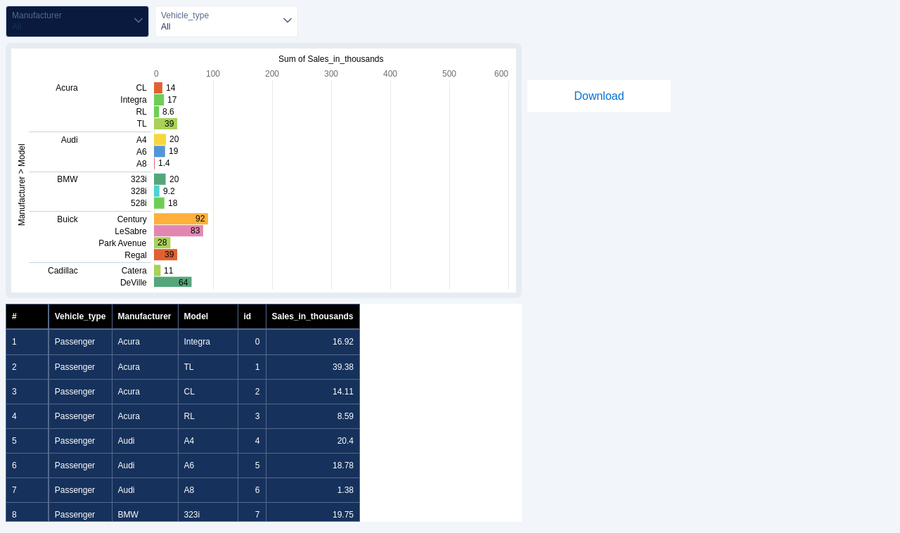

## How I can download CRMA Assets like (Lens, Dashboard, Report) in Modern Browsers like Chrome and Safari ?

### Steps involved

1. Setup Slack for Saleforce
    - Note: You **do not have use Slack** to enable this feature. This Slack setup enables this Download feature
2. Assign **Slack Service User** to user
3. Build Button with URL link to the asset PNG and PDF
- format:
```
/analytics/download/dashboard/ASSET_ID.png
# Example
/analytics/download/dashboard/0FK3h000000d8lTGAQ.png

# For PDF:

/analytics/download/dashboard/ASSET_ID.pdf
# Example
/analytics/download/dashboard/0FK3h000000d8lTGAQ.pdf

```

----
[Sample PDF](img/0FK3h000000d8lTGAQ.pdf)


### References
- [Download a CRM Analytics lens as an image](https://developer.salesforce.com/docs/atlas.en-us.api_analytics.meta/api_analytics/analytics_api_download_example_crma_lens_png.htm)
