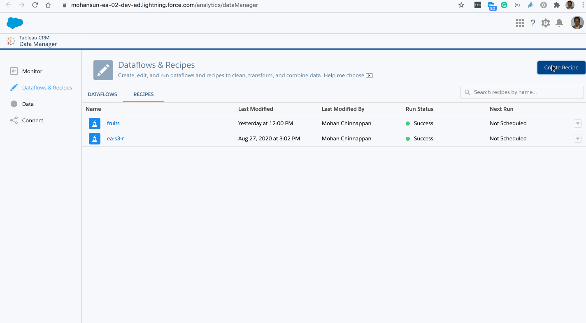

# DataPrep / Recipes

- Requires 0.0.147 version of the plugin
    - sfdx-mohanc-plugins@0.0.147
    - [How to install the plugin](https://mohan-chinnappan-n.github.io/dx/plugins.html#/1)


## Topics
- [Compare](#compare)
- [Converter](#convertor)
- [Recipe List](#recipeList)
- [Recipe Definition](#recipeDef)


## Comparing Dataflow and DataPrep for a simple Dataflow
<a name="compare"></a>
<table width="2400"> 
<tr valign='top' width="2400"><td>

<pre>

{
    "version": "51.0",
    "nodes": {
        "LOAD_DATASET0": {
            "action": "load",
            "parameters": {
                "dataset": {
                    "label": "fruit-yield-acct",
                    "name": "fruit_yield_acct",
                    "type": "analyticsDataset"
                },
                "fields": [
                    "date",
                    "act",
                    "fruit",
                    "qty"
                ]
            },
            "sources": []
        },
        "FILTER0": {
            "action": "filter",
            "parameters": {
                "filterExpressions": [
                    {
                        "field": "fruit",
                        "operands": [
                            "apple"
                        ],
                        "operator": "EQUAL",
                        "type": "TEXT"
                    }
                ]
            },
            "sources": [
                "LOAD_DATASET0"
            ]
        },
        "OUTPUT0": {
            "action": "save",
            "parameters": {
                "dataset": {
                    "label": "apples",
                    "name": "apples",
                    "type": "analyticsDataset"
                },
                "fields": []
            },
            "sources": [
                "FILTER0"
            ]
        }
    },
    "ui": {
        "nodes": {
            "LOAD_DATASET0": {
                "label": "fruit-yield-acct",
                "type": "LOAD_DATASET",
                "top": 112,
                "left": 112,
                "parameters": {
                    "sampleSize": 2000
                }
            },
            "FILTER0": {
                "label": "Filter",
                "type": "FILTER",
                "top": 112,
                "left": 252
            },
            "OUTPUT0": {
                "label": "Output",
                "type": "OUTPUT",
                "top": 112,
                "left": 392
            }
        },
        "connectors": [
            {
                "source": "LOAD_DATASET0",
                "target": "FILTER0"
            },
            {
                "source": "FILTER0",
                "target": "OUTPUT0"
            }
        ],
        "hiddenColumns": []
    }
}
</pre>

</td>
<td>

<pre>
{ 
  "getFruitYield": {
    "action": "edgemart",
    "parameters": {
      "alias": "fruit_yield"
    }
  },
  "filterForApple": {
    "action": "filter",
    "parameters": {
      "source": "getFruitYield",
      "saqlFilter": "fruit==\"apple\""
    }
  },
  "registerAppleFruits": {
    "action": "sfdcRegister",
    "parameters": {
      "source": "filterForApple",
      "name": "regFruits",
      "alias": "regFruits"
    }
  }
}

</pre>
</td>
</tr>
</table>

<a name='convertor'></a>

###  Dataflow to DataPrep - dataflow2dataPrep 

- List dataflows
```
$ sfdx mohanc:ea:dataflow:list -u mohan.chinnappan.n_ea2@gmail.com 
Id,Label
02K3h000000jqv1EAA,filterFruits <-----
02K3h000000Mr7JEAS,The_Motivator
02K3h000000Mu1oEAC,exportOppty2
02K3h000000Mu0vEAC,exportOppty
02K3h000000MtyuEAC,ExportCustomers
02K3h000000MrxWEAS,fruitsdf
02K3h000000Mr7KEAS,Default Salesforce Dataflow

```
- Run converter

```
$ sfdx mohanc:ea:dataflow:dataflow2dataPrep -u mohan.chinnappan.n_ea2@gmail.com  -d 02K3h000000jqv1EAA > ~/tmp/dp-1.json

```

```
$ cat ~/tmp/dp-1.json 

```

```json

{
    "version": "51.0",
    "nodes": {
        "getFruitYield": {
            "parameters": {
                "dataset": {
                    "label": "fruit_yield",
                    "name": "fruit_yield",
                    "type": "analyticsDataset"
                },
                "fields": []
            },
            "action": "load",
            "sources": []
        },
        "filterForApple": {
            "parameters": {
                "filterExpressions": [
                    {
                        "field": "fruit",
                        "operands": [
                            "apple"
                        ],
                        "operator": "EQUAL"
                    }
                ]
            },
            "action": "filter",
            "sources": [
                "getFruitYield"
            ]
        },
        "registerAppleFruits": {
            "parameters": {
                "dataset": {
                    "label": "regFruits",
                    "name": "regFruits",
                    "type": "analyticsDataset"
                },
                "fields": []
            },
            "action": "save",
            "sources": [
                "filterForApple"
            ]
        }
    }
}
```

- Demo


<a name='recipelist'></a>

### Getting Recipe List

```
$ sfdx mohanc:ea:recipe:list -u mohan.chinnappan.n_ea2@gmail.com  -h
Lists Recipes

USAGE
  $ sfdx mohanc:ea:recipe:list

OPTIONS
  -u, --targetusername=targetusername             username or alias for the target org; overrides default target org
  --apiversion=apiversion                         override the api version used for api requests made by this command
  --json                                          format output as json
  --loglevel=(trace|debug|info|warn|error|fatal)  logging level for this command invocation

EXAMPLE

              List Recipes
              sfdx mohanc:ea:recipe:list  -u <username>

```


```
$ sfdx mohanc:ea:recipe:list -u mohan.chinnappan.n_ea2@gmail.com  
Id,Name,Format
"05v3h000000CctIAAS","fruits","R3"
"05v3h000000CcpaAAC","ea_s3_r","undefined"

```
<a name='recipedef'></a>
### Getting Recipe Definition


```
$ sfdx mohanc:ea:recipe:definition  -h
Get Definition of the given Recipe

USAGE
  $ sfdx mohanc:ea:recipe:definition

OPTIONS
  -f, --format=format                             Format R3 or none
  -r, --recipeid=recipeid                         Recipe Id for which we need definition
  -u, --targetusername=targetusername             username or alias for the target org; overrides default target org
  --apiversion=apiversion                         override the api version used for api requests made by this command
  --json                                          format output as json
  --loglevel=(trace|debug|info|warn|error|fatal)  logging level for this command invocation

EXAMPLE

              Get Definition of the given Recipe
              sfdx mohanc:ea:recipe:definition  -u <username> -r <recipeId> -f <format>

```


$ sfdx mohanc:ea:recipe:definition -u mohan.chinnappan.n_ea2@gmail.com -r 05v3h000000CctIAAS -f R3  
```

```json
{
    "nodes": {
        "LOAD_DATASET0": {
            "action": "load",
            "parameters": {
                "dataset": {
                    "label": "fruit-yield-acct",
                    "name": "fruit_yield_acct",
                    "type": "analyticsDataset"
                },
                "fields": [
                    "date",
                    "act",
                    "fruit",
                    "qty"
                ]
            },
            "sources": []
        },
        "FILTER0": {
            "action": "filter",
            "parameters": {
                "filterExpressions": [
                    {
                        "field": "fruit",
                        "operands": [
                            "apple"
                        ],
                        "operator": "EQUAL",
                        "type": "TEXT"
                    }
                ]
            },
            "sources": [
                "LOAD_DATASET0"
            ]
        },
        "OUTPUT0": {
            "action": "save",
            "parameters": {
                "dataset": {
                    "label": "apples",
                    "name": "apples",
                    "type": "analyticsDataset"
                },
                "fields": []
            },
            "sources": [
                "FILTER0"
            ]
        }
    },
    "ui": {
        "nodes": {
            "LOAD_DATASET0": {
                "label": "fruit-yield-acct",
                "type": "LOAD_DATASET",
                "top": 112,
                "left": 112,
                "parameters": {
                    "sampleSize": 2000
                }
            },
            "FILTER0": {
                "label": "Filter",
                "type": "FILTER",
                "top": 112,
                "left": 252
            },
            "OUTPUT0": {
                "label": "Output",
                "type": "OUTPUT",
                "top": 112,
                "left": 392
            }
        },
        "connectors": [
            {
                "source": "LOAD_DATASET0",
                "target": "FILTER0"
            },
            {
                "source": "FILTER0",
                "target": "OUTPUT0"
            }
        ],
        "hiddenColumns": []
    },
    "version": "51.0"
}
```
```
