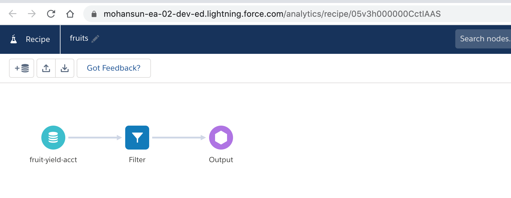
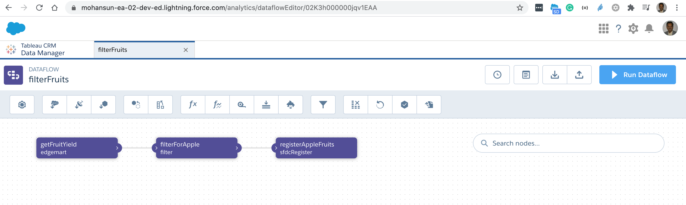

## Notes of DataPrep



```json

{
    "version": "51.0",
    "nodes": {
        "LOAD_DATASET0": {
            "action": "load",
            "parameters": {
                "dataset": {
                    "label": "fruit-yield-acct",
                    "name": "fruit_yield_acct",
                    "type": "analyticsDataset"
                },
                "fields": [
                    "date",
                    "act",
                    "fruit",
                    "qty"
                ]
            },
            "sources": []
        },
        "FILTER0": {
            "action": "filter",
            "parameters": {
                "filterExpressions": [
                    {
                        "field": "fruit",
                        "operands": [
                            "apple"
                        ],
                        "operator": "EQUAL",
                        "type": "TEXT"
                    }
                ]
            },
            "sources": [
                "LOAD_DATASET0"
            ]
        },
        "OUTPUT0": {
            "action": "save",
            "parameters": {
                "dataset": {
                    "label": "apples",
                    "name": "apples",
                    "type": "analyticsDataset"
                },
                "fields": []
            },
            "sources": [
                "FILTER0"
            ]
        }
    },
    "ui": {
        "nodes": {
            "LOAD_DATASET0": {
                "label": "fruit-yield-acct",
                "type": "LOAD_DATASET",
                "top": 112,
                "left": 112,
                "parameters": {
                    "sampleSize": 2000
                }
            },
            "FILTER0": {
                "label": "Filter",
                "type": "FILTER",
                "top": 112,
                "left": 252
            },
            "OUTPUT0": {
                "label": "Output",
                "type": "OUTPUT",
                "top": 112,
                "left": 392
            }
        },
        "connectors": [
            {
                "source": "LOAD_DATASET0",
                "target": "FILTER0"
            },
            {
                "source": "FILTER0",
                "target": "OUTPUT0"
            }
        ],
        "hiddenColumns": []
    }
}

```

### Dataflow
```json
{ 
  "getFruitYield": {
    "action": "edgemart",
    "parameters": {
      "alias": "fruit_yield"
    }
  },
  "filterForApple": {
    "action": "filter",
    "parameters": {
      "source": "getFruitYield",
      "saqlFilter": "fruit==\"apple\""
    }
  },
  "registerAppleFruits": {
    "action": "sfdcRegister",
    "parameters": {
      "source": "filterForApple",
      "name": "regFruits",
      "alias": "regFruits"
    }
  }
}

```
