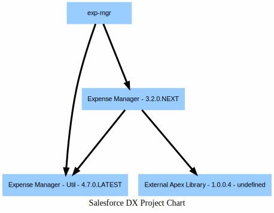

# Drawing Org-Charts


## Input file

```
cat sfdx-project.json 
```

```json


{
   "namespace": "exp-mgr",
   "sfdcLoginUrl": "https://login.salesforce.com",
   "sourceApiVersion": "47.0",
   "packageDirectories": [
      {
         "path": "util",
         "default": true,
         "package": "Expense Manager - Util",
         "versionName": "Winter ‘20",
         "versionDescription": "Welcome to Winter 2020 Release of Expense Manager Util Package",
         "versionNumber": "4.7.0.LATEST",
         "definitionFile": "config/scratch-org-def.json"
      },
      {
         "path": "exp-core",
         "default": false,
         "package": "Expense Manager",
         "versionName": "v 3.2",
         "versionDescription": "Winter 2020 Release",
         "versionNumber": "3.2.0.NEXT", 
         "ancestorVersion": "3.0.0.7",
         "postInstallScript": "PostInstallScript",
         "uninstallScript": "PreUninstallScript",
         "postInstallUrl": "https://expenser.com/post-install-instructions.html",
         "releaseNotesUrl": "https://expenser.com/winter-2020-release-notes.html",
         "definitionFile": "config/scratch-org-def.json",
         "dependencies": [
            {
               "package": "Expense Manager - Util",
               "versionNumber": "4.7.0.LATEST"

            },
            {
               "package" : "External Apex Library - 1.0.0.4"
            }
         ]
      }
   ],
   "packageAliases": {
      "Expense Manager - Util": "0HoB00000004CFpKAM",
      "External Apex Library@1.0.0.4": "04tB0000000IB1EIAW",
      "Expense Manager": "0HoB00000004CFuKAM"}
}

```

## Run the DX Project chart

```
sfdx mohanc:security:dxprj -i sfdx-project.json
```

```
Writing visualization in file __PRJ__.svg ...
Visualization done. "open  __PRJ__.svg" in Chrome Browser to view the Visualization.
```

## DX Project Chart



