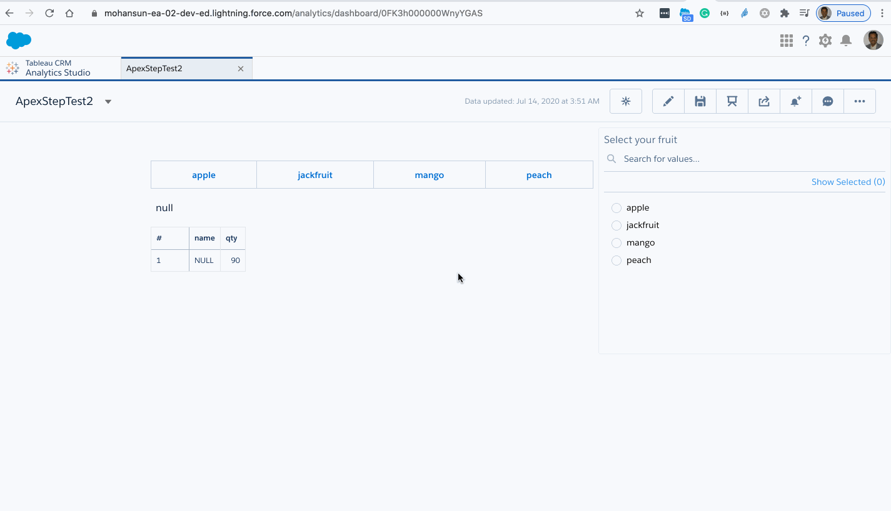

# How to use Apex Step in EA (Tableau CRM)

## Use case
- We have a REST API (/fruits) takes  given a fruit name via HTTP POST, provides its qty (also uppercase the fruit name)
- In the dashboard when the user selects the item in the list box or the pillbox this apex REST service will be called to get the qty (it our case it is a random number between 0 to 100)

## Apex code for  FruitsManager.cls
```java
@RestResource(urlMapping='/fruits')

global with sharing class FuritsManager {

    @HttpPost
    global static String getFruits(String item) {
     
        Integer qty = Integer.valueof(Math.random() * 100);
        
        String result = '[ {"name": "' + item.toUpperCase()  + '", "qty" : ' + qty + '}]';
        JSONParser parser = JSON.createParser(result);
        
        List<Fruit> fruits = new List<Fruit>();

        
        while (parser.nextToken() != null) {
        if (parser.getCurrentToken() == JSONToken.START_ARRAY) {
            while (parser.nextToken() != null) {
               
                if (parser.getCurrentToken() == JSONToken.START_OBJECT) {
                    Fruit fruit = (Fruit)parser.readValueAs(Fruit.class);
                    fruits.add(fruit);
            
                    parser.skipChildren();
                }
            }
        }
    }
  
    return JSON.serialize(new PackagedReturnItem(fruits));
  }
  
     // Metadata Structure returns alongside Data
    public class ReturnMetadata {
        
        public List<String> strings; // Name of all the columns returned that is considered as text
        public List<String> numbers; // Name of all the columns returned that is considered as numeric
        public List<String> groups;  // Name of all the columns returned that is considered as groups
        
        public ReturnMetadata(List<String> strings, List<String> numbers, List<String> groups) {
            this.strings = strings;
            this.numbers = numbers;
            this.groups = groups;
        }
    }
    
    // Combined Structure of Data and Metadata
    public class PackagedReturnItem {
        
        public List<Fruit> data;
        public ReturnMetadata metadata;
        
        public PackagedReturnItem(List<Fruit> data) {
            this.data = data;
            this.metadata = new ReturnMetadata(new List<String>{'name'}, new List<String>{'qty'}, new List<String>());
        }   
    }  
    
    
 }
```
## Let us test the REST service

```
$ cat fruitData.json
{ "item" : "mango"}
```


```
$ sfdx mohanc:ws:rest -f ~/.ea/header.json -r https://mohansun-ea-02-dev-ed.my.salesforce.com/services/apexrest/fruits -m POST -d fruitData.json 
"{\"metadata\":{\"strings\":[\"name\"],\"numbers\":[\"qty\"],\"groups\":[]},\"data\":[{\"qty\":54.0,\"name\":\"MANGO\"}]}"


```

## Let us wire this service into dashboard

### Apex Step code
```json
   "GetFruitData": {
    "query": {
        "body": {
            "item": "{{cell(lens_1.selection, 0, \"fruit\").asString()}}"
        },
        "path": "fruits"
    },
    "type": "apex"
}
```

### Full Dashboard JSON

```
{
    "label": "ApexStepTest2",
    "mobileDisabled": false,
    "state": {
        "dataSourceLinks": [],
        "filters": [],
        "gridLayouts": [
            {
                "name": "Default",
                "numColumns": 12,
                "pages": [
                    {
                        "label": "Fruits via Apex Step",
                        "name": "83a79639-d0e2-42a8-8c04-5431c81589ba",
                        "navigationHidden": false,
                        "widgets": [
                            {
                                "colspan": 6,
                                "column": 2,
                                "name": "pillbox_1",
                                "row": 1,
                                "rowspan": 1,
                                "widgetStyle": {
                                    "borderEdges": []
                                }
                            },
                            {
                                "colspan": 3,
                                "column": 2,
                                "name": "text_2",
                                "row": 2,
                                "rowspan": 1,
                                "widgetStyle": {
                                    "borderEdges": []
                                }
                            },
                            {
                                "colspan": 4,
                                "column": 8,
                                "name": "listselector_1",
                                "row": 0,
                                "rowspan": 7,
                                "widgetStyle": {
                                    "backgroundColor": "#FFFFFF",
                                    "borderColor": "#E6ECF2",
                                    "borderEdges": [
                                        "all"
                                    ],
                                    "borderRadius": 4,
                                    "borderWidth": 1
                                }
                            },
                            {
                                "colspan": 3,
                                "column": 2,
                                "name": "table_3",
                                "row": 3,
                                "rowspan": 4,
                                "widgetStyle": {
                                    "borderEdges": []
                                }
                            }
                        ]
                    }
                ],
                "rowHeight": "normal",
                "selectors": [],
                "style": {
                    "alignmentX": "left",
                    "alignmentY": "top",
                    "backgroundColor": "#F2F6FA",
                    "cellSpacingX": 8,
                    "cellSpacingY": 8,
                    "fit": "original",
                    "gutterColor": "#C5D3E0"
                },
                "version": 1
            }
        ],
        "layouts": [],
        "steps": {
            "GetFruitData": {
                "query": {
                    "body": {
                        "item": "{{cell(lens_1.selection, 0, \"fruit\").asString()}}"
                    },
                    "path": "fruits"
                },
                "type": "apex"
            },
           "lens_1": {
                "broadcastFacet": true,
                "groups": [],
                "numbers": [],
                "query": "q = load \"fruit_yield\";\nq = group q by fruit;\nq = foreach q generate fruit as 'fruit';\nq = limit q 2000;",
                "receiveFacetSource": {
                    "mode": "all",
                    "steps": []
                },
                "selectMode": "single",
                "strings": [],
                "type": "saql",
                "useGlobal": true,
                "visualizationParameters": {
                    "parameters": {
                        "autoFitMode": "keepLabels",
                        "showValues": true,
                        "bins": {
                            "breakpoints": {
                                "high": 100,
                                "low": 0
                            },
                            "bands": {
                                "high": {
                                    "color": "#008000",
                                    "label": ""
                                },
                                "low": {
                                    "color": "#B22222",
                                    "label": ""
                                },
                                "medium": {
                                    "color": "#ffa500",
                                    "label": ""
                                }
                            }
                        },
                        "legend": {
                            "descOrder": false,
                            "showHeader": true,
                            "show": true,
                            "customSize": "auto",
                            "position": "right-top",
                            "inside": false
                        },
                        "axisMode": "multi",
                        "tooltip": {
                            "showBinLabel": true,
                            "measures": "",
                            "showNullValues": true,
                            "showPercentage": true,
                            "showDimensions": true,
                            "showMeasures": true,
                            "customizeTooltip": false,
                            "dimensions": ""
                        },
                        "visualizationType": "hbar",
                        "title": {
                            "fontSize": 14,
                            "subtitleFontSize": 11,
                            "label": "",
                            "align": "center",
                            "subtitleLabel": ""
                        },
                        "binValues": false,
                        "trellis": {
                            "flipLabels": false,
                            "showGridLines": true,
                            "size": [
                                100,
                                100
                            ],
                            "enable": false,
                            "type": "x",
                            "chartsPerLine": 4
                        },
                        "showActionMenu": true,
                        "measureAxis2": {
                            "sqrtScale": false,
                            "showTitle": true,
                            "showAxis": true,
                            "title": "",
                            "customDomain": {
                                "showDomain": false
                            }
                        },
                        "measureAxis1": {
                            "sqrtScale": false,
                            "showTitle": true,
                            "showAxis": true,
                            "title": "",
                            "customDomain": {
                                "showDomain": false
                            }
                        },
                        "theme": "wave",
                        "dimensionAxis": {
                            "showTitle": true,
                            "customSize": "auto",
                            "showAxis": true,
                            "title": "",
                            "icons": {
                                "useIcons": false,
                                "iconProps": {
                                    "fit": "cover",
                                    "column": "",
                                    "type": "round"
                                }
                            }
                        },
                        "applyConditionalFormatting": true
                    },
                    "type": "chart"
                }
            }
        },
        "widgetStyle": {
            "backgroundColor": "#FFFFFF",
            "borderColor": "#E6ECF2",
            "borderEdges": [],
            "borderRadius": 0,
            "borderWidth": 1
        },
        "widgets": {
            "table_3": {
                "parameters": {
                    "borderColor": "#e0e5ee",
                    "borderWidth": 1,
                    "cell": {
                        "backgroundColor": "#ffffff",
                        "fontColor": "#16325c",
                        "fontSize": 12
                    },
                    "columnProperties": {},
                    "columns": [],
                    "customBulkActions": [],
                    "exploreLink": false,
                    "header": {
                        "backgroundColor": "#f4f6f9",
                        "fontColor": "#16325c",
                        "fontSize": 12
                    },
                    "innerMajorBorderColor": "#a8b7c7",
                    "innerMinorBorderColor": "#e0e5ee",
                    "maxColumnWidth": 300,
                    "minColumnWidth": 40,
                    "mode": "variable",
                    "numberOfLines": 1,
                    "showActionMenu": true,
                    "step": "GetFruitData",
                    "verticalPadding": 8
                },
                "type": "table"
            },
            "pillbox_1": {
                "parameters": {
                    "compact": false,
                    "exploreLink": false,
                    "fontSize": 14,
                    "selectedTab": {
                        "backgroundColor": "#0070D2",
                        "borderColor": "#C6D3E1",
                        "borderEdges": [
                            "all"
                        ],
                        "borderWidth": 1,
                        "textColor": "#FFFFFF"
                    },
                    "showActionMenu": true,
                    "step": "lens_1",
                    "textColor": "#0070D2"
                },
                "type": "pillbox"
            },
            "text_2": {
                "parameters": {
                    "content": {
                        "displayTemplate": "{{cell(lens_1.selection, 0, \"fruit\").asString()}}"
                    },
                    "fontSize": 16,
                    "showActionMenu": true,
                    "textAlignment": "left",
                    "textColor": "#091A3E"
                },
                "type": "text"
            },
            "listselector_1": {
                "parameters": {
                    "compact": false,
                    "displayMode": "filter",
                    "exploreLink": false,
                    "filterStyle": {
                        "titleColor": "#54698D",
                        "valueColor": "#16325C"
                    },
                    "instant": true,
                    "showActionMenu": true,
                    "step": "lens_1",
                    "title": "Select your fruit"
                },
                "type": "listselector"
            }
        }
    },
    "datasets": [
        {
            "id": "0Fb3h0000008s9kCAA",
            "label": "fruit-yield",
            "name": "fruit_yield",
            "url": "/services/data/v51.0/wave/datasets/0Fb3h0000008s9kCAA"
        }
    ]
}
```

## Demo of the dashboard

