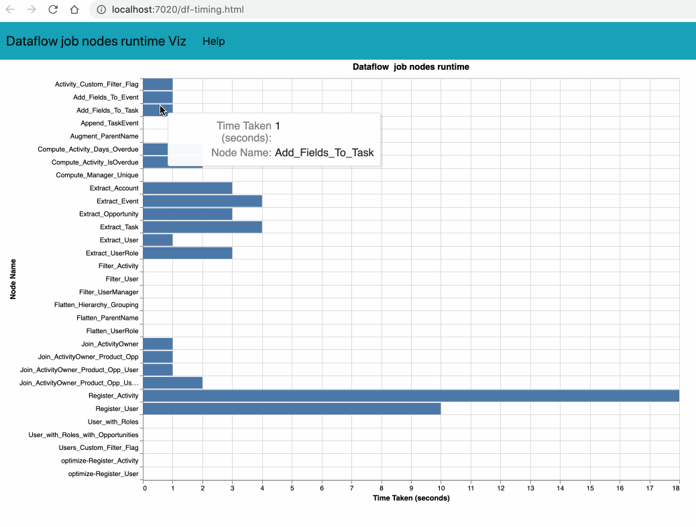

# Provide Dataflow job nodes timing

- Requires 0.0.120 version of the plugin
    - sfdx-mohanc-plugins@0.0.120
    - [How to install the plugin](https://mohan-chinnappan-n.github.io/dx/plugins.html#/1)


## Usage
```
$ sfdx mohanc:ea:dataflow:jobs:timing -h
Lists Dataflow job timing of the given job id  

USAGE
  $ sfdx mohanc:ea:dataflow:jobs:timing

OPTIONS
  -j, --jobid=jobid                               Dataflow job Id

  -u, --targetusername=targetusername             username or alias for the target org; overrides default target 
                                                  org

  --apiversion=apiversion                         override the api version used for api requests made by this 
                                                  command

  --json                                          format output as json

  --loglevel=(trace|debug|info|warn|error|fatal)  logging level for this command invocation

EXAMPLE

              List Dataflow Jobs timing
              sfdx mohanc:ea:dataflow:jobs:timing  -u <username> -j <jobId>


```

## Demo
```
 sfdx mohanc:ea:dataflow:jobs:timing -u mohan.chinnappan.n_ea2@gmail.com -j 03C3h000002qB0gEAE
=== Writing to 03C3h000002qB0gEAE.timing.json ...
=== Writing to 03C3h000002qB0gEAE.timing.csv ...
```



