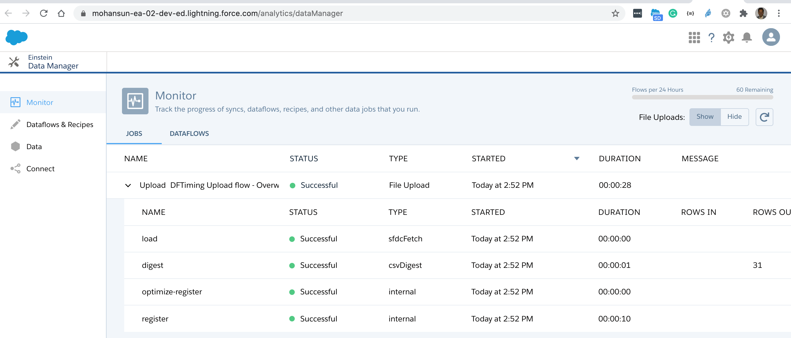
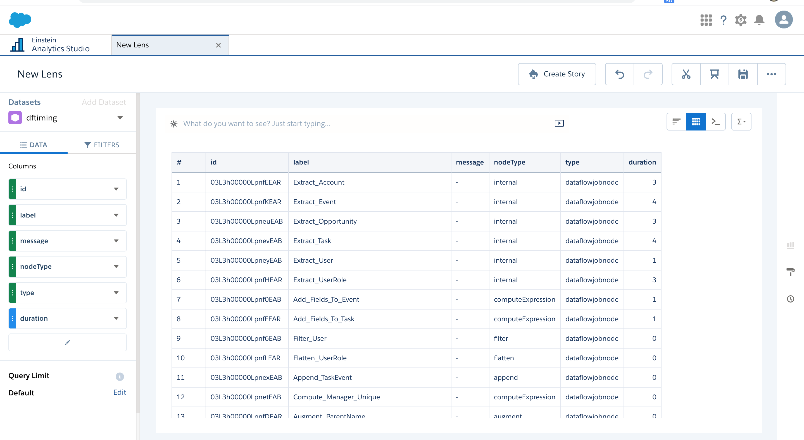
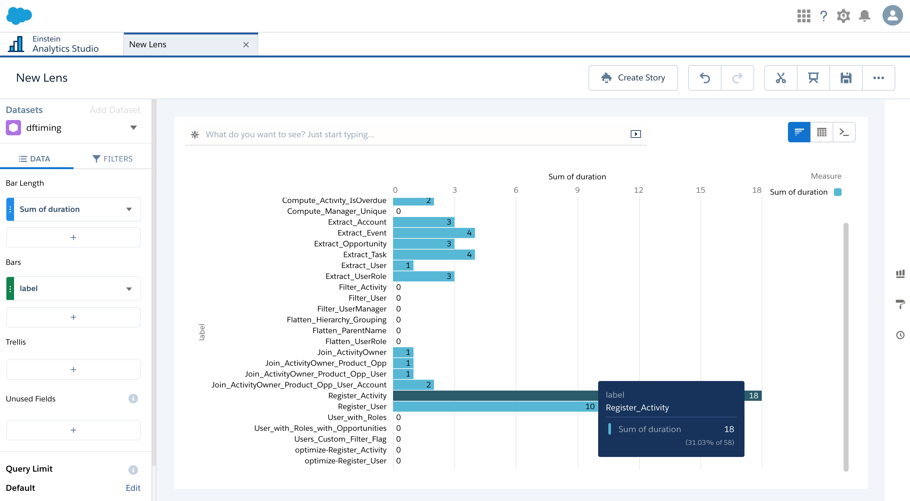
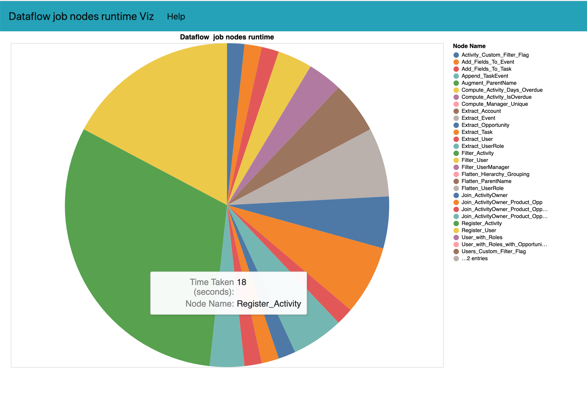
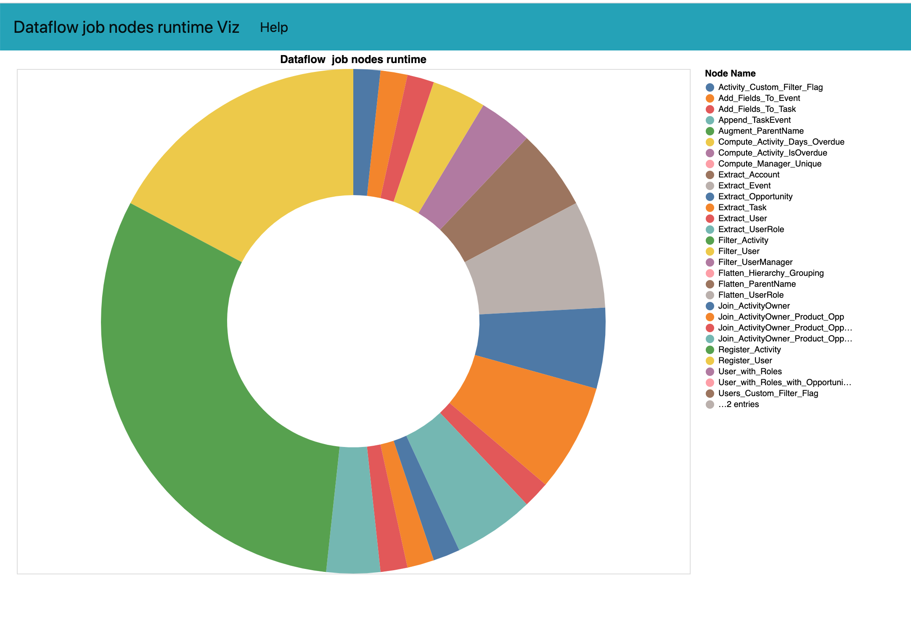
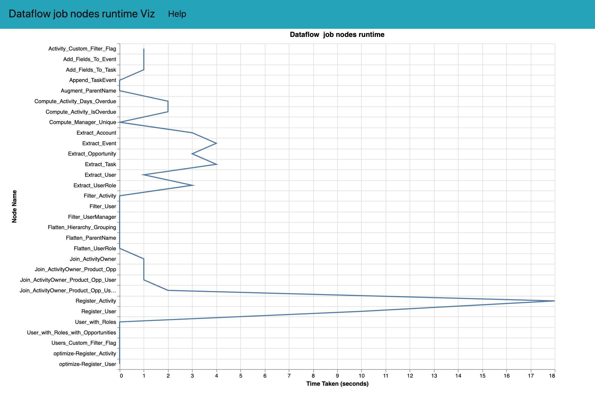

# Provide Dataflow job nodes timing

- Requires 0.0.121 version of the plugin
    - sfdx-mohanc-plugins@0.0.121
    - [How to install the plugin](https://mohan-chinnappan-n.github.io/dx/plugins.html#/1)


## Usage
```
$ sfdx mohanc:ea:dataflow:jobs:timing -h
Lists Dataflow job timing of the given job id  

USAGE
  $ sfdx mohanc:ea:dataflow:jobs:timing

OPTIONS
  -j, --jobid=jobid                               Dataflow job Id

  -u, --targetusername=targetusername             username or alias for the target org; overrides default target 
                                                  org

  --apiversion=apiversion                         override the api version used for api requests made by this 
                                                  command

  --json                                          format output as json

  --loglevel=(trace|debug|info|warn|error|fatal)  logging level for this command invocation

EXAMPLE

              List Dataflow Jobs timing
              sfdx mohanc:ea:dataflow:jobs:timing  -u <username> -j <jobId>


```

## Demo
```
sfdx mohanc:ea:dataflow:jobs:timing -u mohan.chinnappan.n_ea2@gmail.com -j 03C3h000002qB0gEAE
=== Writing to 03C3h000002qB0gEAE.timing.json ...
=== Writing to DFTiming.csv  for loading into EA Dataset ...
=== Writing to 03C3h000002qB0gEAE.timing.csv ...
```
## Load the timing data file into EA

```
$ sfdx mohanc:ea:dataset:load -u mohan.chinnappan.n_ea2@gmail.com -d DFTiming.csv -a DFTiming
=== Sampling data
-- Please make sure that first row of your data does not have missing values --
[
  [
    'duration', 'id',
    'message',  'label',
    'nodeType', 'startDate',
    'status',   'type'
  ],
  [
    '3',
    '03L3h00000LpnfEEAR',
    undefined,
    'Extract_Account',
    'internal',
    '2020-11-18T14:51:27.296Z',
    'success',
    'dataflowjobnode'
  ]
]
=== Finding the data types based on the sample data ...
NOTE: First row of the data has empty columns, those will be casted as Text columns!
[
  {
    fullyQualifiedName: 'DFTiming.duration',
    label: 'duration',
    name: 'duration',
    isSystemField: false,
    isUniqueId: false,
    type: 'Numeric',
    defaultValue: '0',
    precision: 18,
    scale: 0
  },
  {
    fullyQualifiedName: 'DFTiming.id',
    label: 'id',
    name: 'id',
    isSystemField: false,
    isUniqueId: false,
    isMultiValue: false,
    multiValueSeparator: 'null',
    type: 'Text'
  },
  {
    fullyQualifiedName: 'DFTiming.message',
    label: 'message',
    name: 'message',
    isSystemField: false,
    isUniqueId: false,
    isMultiValue: false,
    multiValueSeparator: 'null',
    type: 'Text'
  },
  {
    fullyQualifiedName: 'DFTiming.label',
    label: 'label',
    name: 'label',
    isSystemField: false,
    isUniqueId: false,
    isMultiValue: false,
    multiValueSeparator: 'null',
    type: 'Text'
  },
  {
    fullyQualifiedName: 'DFTiming.nodeType',
    label: 'nodeType',
    name: 'nodeType',
    isSystemField: false,
    isUniqueId: false,
    isMultiValue: false,
    multiValueSeparator: 'null',
    type: 'Text'
  },
  {
    fullyQualifiedName: 'DFTiming.startDate',
    label: 'startDate',
    name: 'startDate',
    isSystemField: false,
    isUniqueId: false,
    isMultiValue: false,
    multiValueSeparator: 'null',
    type: 'Text'
  },
  {
    fullyQualifiedName: 'DFTiming.status',
    label: 'status',
    name: 'status',
    isSystemField: false,
    isUniqueId: false,
    isMultiValue: false,
    multiValueSeparator: 'null',
    type: 'Text'
  },
  {
    fullyQualifiedName: 'DFTiming.type',
    label: 'type',
    name: 'type',
    isSystemField: false,
    isUniqueId: false,
    isMultiValue: false,
    multiValueSeparator: 'null',
    type: 'Text'
  }
]
=== Preparing for the loading ...
{ id: '06V3h0000005wWEEAY', success: true, errors: [] }
-- Maximum Chunck size: 9437184 bytes --
=== Loading part: '1' with chunk size: 4944 bytes ...
{ id: '06W3h000000789cEAA', success: true, errors: [] }
=== Loading Complete.
Going to process...

Done.
Time taken: 20.622 seconds
open https://mohansun-ea-02-dev-ed.my.salesforce.com/analytics/dataManager in a web browser to view this job
```

## Explore In EA

- Job
- 
-   
- 


`


## Sample Charts  







