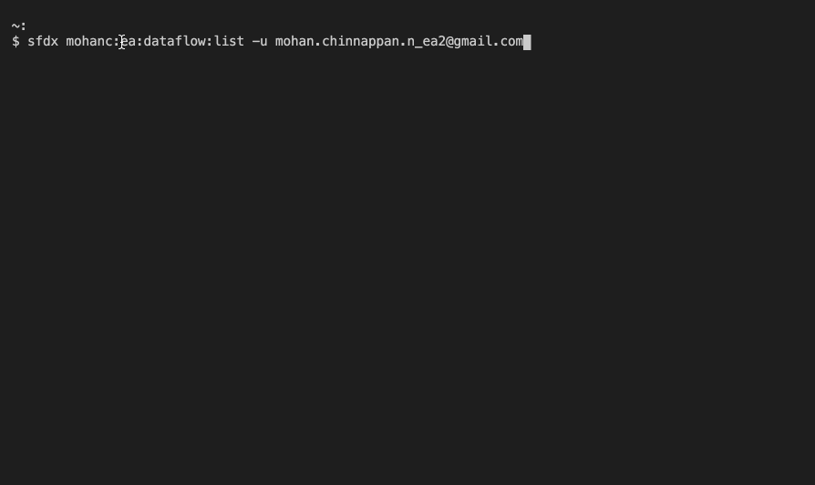
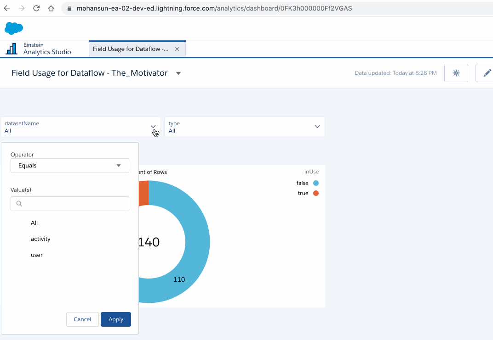

# Get FieldUsage info for a given Dataflow using DX

- Requires 0.0.73 version of the plugin
    - sfdx-mohanc-plugins@0.0.73
    - [How to install the plugin](https://mohan-chinnappan-n.github.io/dx/plugins.html#/1)


## Topics
- [Demo](#demo)
- [Usage](#usage)
- [Steps](#steps)
- [Output CSV](#outputcsv)
- [Output JSON](#outputjson)
- [Load Field Usage CSV into EA](#load)
- [Field Usage Dashboard](#db)
- [Dataflows without field usage info](#nofinfo)
<a name="demo"></a>
## Demo




<a name="usage"></a>
## Usage
```
$ sfdx mohanc:ea:dataflow:fieldUsage -h
Get Field Usage Info for the given dataflow 

USAGE
  $ sfdx mohanc:ea:dataflow:fieldUsage

OPTIONS
  -d, --dataflowid=dataflowid                     Dataflow Id to analyzed
  -u, --targetusername=targetusername             username or alias for the target org; overrides default target org
  --apiversion=apiversion                         override the api version used for api requests made by this command
  --json                                          format output as json
  --loglevel=(trace|debug|info|warn|error|fatal)  logging level for this command invocation

EXAMPLE

              Get Field Usage data for the given dataflow
              sfdx mohanc:ea:dataflow:fieldUsage  -u <username> -d <dataflowId> 

              Creates output in both csv and json file 
           
              --------------------------------------------------
              NOTE:
              Use:
              sfdx mohanc:ea:dataflow:list  -u <username>
              to list the dataflows in the org


```


<a name="steps"></a>

## Steps

### List the dataflows in the org
```
$ sfdx mohanc:ea:dataflow:list -u mohan.chinnappan.n_ea2@gmail.com 
Id,Label
02K3h000000Mu1oEAC,exportOppty2
02K3h000000Mu0vEAC,exportOppty
02K3h000000MtyuEAC,ExportCustomers
02K3h000000MrxWEAS,fruitsdf
02K3h000000Mr7JEAS,The_Motivator
02K3h000000Mr7KEAS,Default Salesforce Dataflow

```
### Get the field usage info this dataflow: 02K3h000000Mr7JEAS,The_Motivator 
```
$ sfdx mohanc:ea:dataflow:fieldUsage -u mohan.chinnappan.n_ea2@gmail.com -d 02K3h000000Mr7JEAS
=== Looking at the dataflow: 02K3h000000Mr7JEAS, The_Motivator ...
=== Looking at the dataflow's sfdcRegister actions ...
_________________________________________________
=== Looking at the dataset: user ...
=== Looking at current version of the dataset: user ...
=== Looking at Security Predicate of the dataset: user ...
=== Looking at WHERE USED details of the dataset: user ...
=== Looking at Dashboards using this dataset: user ...
=== Looking at Lenses using this dataset: user ...
_________________________________________________
=== Looking at the dataset: activity ...
=== Looking at current version of the dataset: activity ...
=== Looking at Security Predicate of the dataset: activity ...
=== Looking at WHERE USED details of the dataset: activity ...
=== Looking at Dashboards using this dataset: activity ...
_________________________________________________
Writing output files in:  The_Motivator_fldusage.json and The_Motivator_fldusage.csv 
Done.

```

<a name='outputcsv'></a>
### Output CSV
- [Field Usage in CSV](ea/02K3h000000Mr7JEAS.csv)

<a name='load'></a>
### Load Field Usage CSV file into EA
```
$ cp ea/02K3h000000Mr7JEAS.csv /tmp/fieldusage.csv

$ sfdx mohanc:ea:dataset:load -u mohan.chinnappan.n_ea2@gmail.com  -d /tmp/fieldusage.csv 
[
  {
    fullyQualifiedName: 'fieldusage_csvDataset.type',
    label: 'type',
    name: 'type',
    isSystemField: false,
    isUniqueId: false,
    isMultiValue: false,
    multiValueSeparator: 'null',
    type: 'Text'
  },
  {
    fullyQualifiedName: 'fieldusage_csvDataset.name',
    label: 'name',
    name: 'name',
    isSystemField: false,
    isUniqueId: false,
    isMultiValue: false,
    multiValueSeparator: 'null',
    type: 'Text'
  },
  {
    fullyQualifiedName: 'fieldusage_csvDataset.dataflowName',
    label: 'dataflowName',
    name: 'dataflowName',
    isSystemField: false,
    isUniqueId: false,
    isMultiValue: false,
    multiValueSeparator: 'null',
    type: 'Text'
  },
  {
    fullyQualifiedName: 'fieldusage_csvDataset.datasetName',
    label: 'datasetName',
    name: 'datasetName',
    isSystemField: false,
    isUniqueId: false,
    isMultiValue: false,
    multiValueSeparator: 'null',
    type: 'Text'
  },
  {
    fullyQualifiedName: 'fieldusage_csvDataset.dashboardName',
    label: 'dashboardName',
    name: 'dashboardName',
    isSystemField: false,
    isUniqueId: false,
    isMultiValue: false,
    multiValueSeparator: 'null',
    type: 'Text'
  },
  {
    fullyQualifiedName: 'fieldusage_csvDataset.lensName',
    label: 'lensName',
    name: 'lensName',
    isSystemField: false,
    isUniqueId: false,
    isMultiValue: false,
    multiValueSeparator: 'null',
    type: 'Text'
  },
  {
    fullyQualifiedName: 'fieldusage_csvDataset.InSecurityPredicate',
    label: 'InSecurityPredicate',
    name: 'InSecurityPredicate',
    isSystemField: false,
    isUniqueId: false,
    isMultiValue: false,
    multiValueSeparator: 'null',
    type: 'Text'
  },
  {
    fullyQualifiedName: 'fieldusage_csvDataset.usageCount',
    label: 'usageCount',
    name: 'usageCount',
    isSystemField: false,
    isUniqueId: false,
    type: 'Numeric',
    defaultValue: '0',
    precision: 18,
    scale: 0
  },
  {
    fullyQualifiedName: 'fieldusage_csvDataset.inUse',
    label: 'inUse',
    name: 'inUse',
    isSystemField: false,
    isUniqueId: false,
    isMultiValue: false,
    multiValueSeparator: 'null',
    type: 'Text'
  }
]
{ id: '06V3h0000005uEOEAY', success: true, errors: [] }
Load part: 1
{ id: '06W3h00000075pdEAA', success: true, errors: [] }
Going to process...

Done.
```


- Dataflow job created details
    - [View Dataflow jobs](./ea-dataflow-jobs.md)


<a name='nofinfo'></a>

## Dataflow without field usage info
```
$ sfdx mohanc:ea:dataflow:list -u mohan.chinnappan.n_ea2@gmail.com 
Id,Label
02K3h000000Mu1oEAC,exportOppty2
02K3h000000Mu0vEAC,exportOppty
02K3h000000MtyuEAC,ExportCustomers
02K3h000000MrxWEAS,fruitsdf
02K3h000000Mr7JEAS,The_Motivator
02K3h000000Mr7KEAS,Default Salesforce Dataflow

# let us look at  02K3h000000MrxWEAS,fruitsdf

$ sfdx mohanc:ea:dataflow:fieldUsage -u mohan.chinnappan.n_ea2@gmail.com -d 02K3h000000MrxWEAS
=== Looking at the dataflow 02K3h000000MrxWEAS ...
=== Looking at the dataflow sfdcRegister Actions ...
_________________________________________________
=== Looking at the dataset regFruitYield ...
Error: getting dataset for the currentVersion!
No field usage can be obtained for this dataflow!

```


<a name='db'></a>
### Dashboard


- [Dashboard json](ea/dashboard.json)

<a name="outputjson"></a>

### Field Usage Output JSON
- [Field Usage Json](ea/02K3h000000Mr7JEAS.json)

