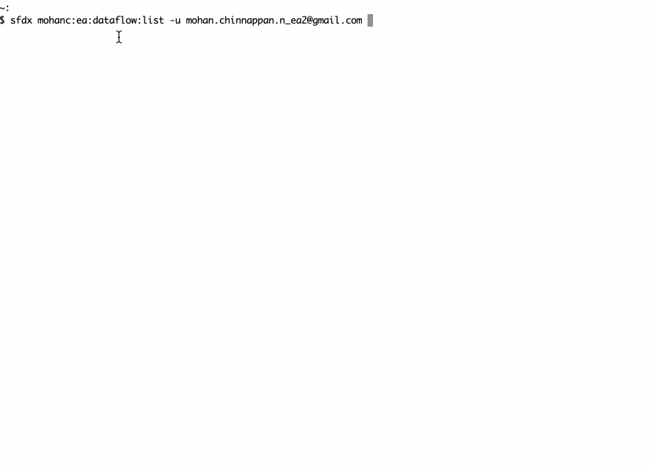
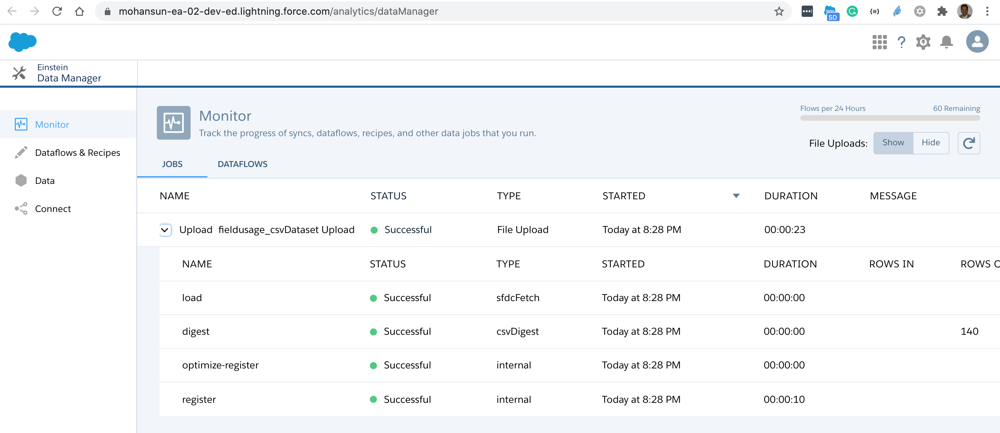
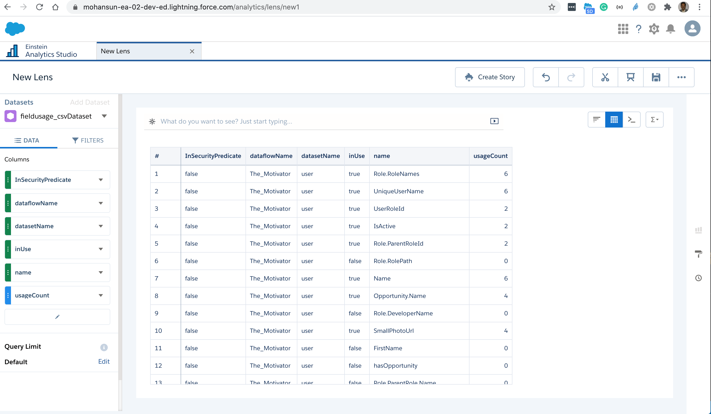

# Get FieldUsage info for a given Dataflow using DX

- Requires 0.0.72 version of the plugin
    - sfdx-mohanc-plugins@0.0.72
    - [How to install the plugin](https://mohan-chinnappan-n.github.io/dx/plugins.html#/1)


## Usage
```
$ sfdx mohanc:ea:dataflow:fieldUsage -h
Get Field Usage Info for the given dataflow 

USAGE
  $ sfdx mohanc:ea:dataflow:fieldUsage

OPTIONS
  -d, --dataflowid=dataflowid                     Dataflow Id to analyzed
  -u, --targetusername=targetusername             username or alias for the target org; overrides default target org
  --apiversion=apiversion                         override the api version used for api requests made by this command
  --json                                          format output as json
  --loglevel=(trace|debug|info|warn|error|fatal)  logging level for this command invocation

EXAMPLE

              Get Field Usage data for the given dataflow
              sfdx mohanc:ea:dataflow:fieldUsage  -u <username> -d <dataflowId> 

              Creates output in both csv and json file :
              dataflowId.json and 
              dataflowId.csv
           
              --------------------------------------------------
              NOTE:
              Use:
              sfdx mohanc:ea:dataflow:list  -u <username>
              to list the dataflows in the org


```

## Demo




## Steps

### List the dataflows in the org
```
$ sfdx mohanc:ea:dataflow:list -u mohan.chinnappan.n_ea2@gmail.com 
Id,Label
02K3h000000Mu1oEAC,exportOppty2
02K3h000000Mu0vEAC,exportOppty
02K3h000000MtyuEAC,ExportCustomers
02K3h000000MrxWEAS,fruitsdf
02K3h000000Mr7JEAS,The_Motivator
02K3h000000Mr7KEAS,Default Salesforce Dataflow

```
### Get the field usage info this dataflow: 02K3h000000Mr7JEAS,The_Motivator 
```
$ sfdx mohanc:ea:dataflow:fieldUsage -u mohan.chinnappan.n_ea2@gmail.com -d 02K3h000000Mr7JEAS
=== Looking at the dataflow 02K3h000000Mr7JEAS ...
=== Looking at the dataflow sfdcRegister Actions ...
_________________________________________________
=== Looking at the dataset user ...
=== Looking at current version of the dataset user ...
=== Looking at Security Predicate of the dataset user ...
=== Looking at WHERE USED details of the dataset user ...
=== Looking at Dashboards using this dataset user ...
=== Looking at Lenses using this dataset user ...
_________________________________________________
=== Looking at the dataset activity ...
=== Looking at current version of the dataset activity ...
=== Looking at Security Predicate of the dataset activity ...
=== Looking at WHERE USED details of the dataset activity ...
=== Looking at Dashboards using this dataset activity ...
Writing output files in 02K3h000000Mr7JEAS.json and 02K3h000000Mr7JEAS.csv 
Done.
```

### Output CSV
- [Field Usage in CSV](ea/02K3h000000Mr7JEAS.csv)
    - Load CSV file into EA
```
$ cp ea/02K3h000000Mr7JEAS.csv /tmp/fieldusage.csv

$ sfdx mohanc:ea:dataset:load -u mohan.chinnappan.n_ea2@gmail.com  -d /tmp/fieldusage.csv 
[
  {
    fullyQualifiedName: 'fieldusage_csvDataset.type',
    label: 'type',
    name: 'type',
    isSystemField: false,
    isUniqueId: false,
    isMultiValue: false,
    multiValueSeparator: 'null',
    type: 'Text'
  },
  {
    fullyQualifiedName: 'fieldusage_csvDataset.name',
    label: 'name',
    name: 'name',
    isSystemField: false,
    isUniqueId: false,
    isMultiValue: false,
    multiValueSeparator: 'null',
    type: 'Text'
  },
  {
    fullyQualifiedName: 'fieldusage_csvDataset.dataflowName',
    label: 'dataflowName',
    name: 'dataflowName',
    isSystemField: false,
    isUniqueId: false,
    isMultiValue: false,
    multiValueSeparator: 'null',
    type: 'Text'
  },
  {
    fullyQualifiedName: 'fieldusage_csvDataset.datasetName',
    label: 'datasetName',
    name: 'datasetName',
    isSystemField: false,
    isUniqueId: false,
    isMultiValue: false,
    multiValueSeparator: 'null',
    type: 'Text'
  },
  {
    fullyQualifiedName: 'fieldusage_csvDataset.dashboardName',
    label: 'dashboardName',
    name: 'dashboardName',
    isSystemField: false,
    isUniqueId: false,
    isMultiValue: false,
    multiValueSeparator: 'null',
    type: 'Text'
  },
  {
    fullyQualifiedName: 'fieldusage_csvDataset.lensName',
    label: 'lensName',
    name: 'lensName',
    isSystemField: false,
    isUniqueId: false,
    isMultiValue: false,
    multiValueSeparator: 'null',
    type: 'Text'
  },
  {
    fullyQualifiedName: 'fieldusage_csvDataset.InSecurityPredicate',
    label: 'InSecurityPredicate',
    name: 'InSecurityPredicate',
    isSystemField: false,
    isUniqueId: false,
    isMultiValue: false,
    multiValueSeparator: 'null',
    type: 'Text'
  },
  {
    fullyQualifiedName: 'fieldusage_csvDataset.usageCount',
    label: 'usageCount',
    name: 'usageCount',
    isSystemField: false,
    isUniqueId: false,
    type: 'Numeric',
    defaultValue: '0',
    precision: 18,
    scale: 0
  },
  {
    fullyQualifiedName: 'fieldusage_csvDataset.inUse',
    label: 'inUse',
    name: 'inUse',
    isSystemField: false,
    isUniqueId: false,
    isMultiValue: false,
    multiValueSeparator: 'null',
    type: 'Text'
  }
]
{ id: '06V3h0000005uEOEAY', success: true, errors: [] }
Load part: 1
{ id: '06W3h00000075pdEAA', success: true, errors: [] }
Going to process...

Done.
```




### Output JSON
```json

[
    {
        "type": "dimension",
        "name": "Role.RoleNames",
        "dataflowName": "The_Motivator",
        "datasetName": "user",
        "dashboardName": "The_Motivator_1",
        "lensName": "New_Lens",
        "InSecurityPredicate": false,
        "usageCount": 6,
        "inUse": true
    },
    {
        "type": "dimension",
        "name": "UniqueUserName",
        "dataflowName": "The_Motivator",
        "datasetName": "user",
        "dashboardName": "The_Motivator_1",
        "lensName": "New_Lens",
        "InSecurityPredicate": false,
        "usageCount": 6,
        "inUse": true
    },
    {
        "type": "dimension",
        "name": "UserRoleId",
        "dataflowName": "The_Motivator",
        "datasetName": "user",
        "dashboardName": "New_dashboard1",
        "lensName": "New_Lens",
        "InSecurityPredicate": false,
        "usageCount": 2,
        "inUse": true
    },
    {
        "type": "dimension",
        "name": "IsActive",
        "dataflowName": "The_Motivator",
        "datasetName": "user",
        "dashboardName": "New_dashboard1",
        "lensName": "New_Lens",
        "InSecurityPredicate": false,
        "usageCount": 2,
        "inUse": true
    },
    {
        "type": "dimension",
        "name": "Role.ParentRoleId",
        "dataflowName": "The_Motivator",
        "datasetName": "user",
        "dashboardName": "New_dashboard1",
        "lensName": "New_Lens",
        "InSecurityPredicate": false,
        "usageCount": 2,
        "inUse": true
    },
    {
        "type": "dimension",
        "name": "Role.RolePath",
        "dataflowName": "The_Motivator",
        "datasetName": "user",
        "dashboardName": null,
        "lensName": null,
        "InSecurityPredicate": false,
        "usageCount": 0,
        "inUse": false
    },
    {
        "type": "dimension",
        "name": "Name",
        "dataflowName": "The_Motivator",
        "datasetName": "user",
        "dashboardName": "The_Motivator_1",
        "lensName": "New_Lens",
        "InSecurityPredicate": false,
        "usageCount": 6,
        "inUse": true
    },
    {
        "type": "dimension",
        "name": "Opportunity.Name",
        "dataflowName": "The_Motivator",
        "datasetName": "user",
        "dashboardName": "The_Motivator_1",
        "lensName": null,
        "InSecurityPredicate": false,
        "usageCount": 4,
        "inUse": true
    },
    {
        "type": "dimension",
        "name": "Role.DeveloperName",
        "dataflowName": "The_Motivator",
        "datasetName": "user",
        "dashboardName": null,
        "lensName": null,
        "InSecurityPredicate": false,
        "usageCount": 0,
        "inUse": false
    },
    {
        "type": "dimension",
        "name": "SmallPhotoUrl",
        "dataflowName": "The_Motivator",
        "datasetName": "user",
        "dashboardName": "The_Motivator_1",
        "lensName": null,
        "InSecurityPredicate": false,
        "usageCount": 4,
        "inUse": true
    },
    {
        "type": "dimension",
        "name": "FirstName",
        "dataflowName": "The_Motivator",
        "datasetName": "user",
        "dashboardName": null,
        "lensName": null,
        "InSecurityPredicate": false,
        "usageCount": 0,
        "inUse": false
    },
    {
        "type": "dimension",
        "name": "hasOpportunity",
        "dataflowName": "The_Motivator",
        "datasetName": "user",
        "dashboardName": null,
        "lensName": null,
        "InSecurityPredicate": false,
        "usageCount": 0,
        "inUse": false
    },
    {
        "type": "dimension",
        "name": "Role.ParentRole.Name",
        "dataflowName": "The_Motivator",
        "datasetName": "user",
        "dashboardName": null,
        "lensName": null,
        "InSecurityPredicate": false,
        "usageCount": 0,
        "inUse": false
    },
    {
        "type": "dimension",
        "name": "Role.RoleNamesPath",
        "dataflowName": "The_Motivator",
        "datasetName": "user",
        "dashboardName": null,
        "lensName": null,
        "InSecurityPredicate": false,
        "usageCount": 0,
        "inUse": false
    },
    {
        "type": "dimension",
        "name": "CustomFilter",
        "dataflowName": "The_Motivator",
        "datasetName": "user",
        "dashboardName": null,
        "lensName": null,
        "InSecurityPredicate": false,
        "usageCount": 0,
        "inUse": false
    },
    {
        "type": "dimension",
        "name": "FullPhotoUrl",
        "dataflowName": "The_Motivator",
        "datasetName": "user",
        "dashboardName": null,
        "lensName": null,
        "InSecurityPredicate": false,
        "usageCount": 0,
        "inUse": false
    },
    {
        "type": "dimension",
        "name": "Username",
        "dataflowName": "The_Motivator",
        "datasetName": "user",
        "dashboardName": null,
        "lensName": null,
        "InSecurityPredicate": false,
        "usageCount": 0,
        "inUse": false
    },
    {
        "type": "dimension",
        "name": "Role.Name",
        "dataflowName": "The_Motivator",
        "datasetName": "user",
        "dashboardName": null,
        "lensName": null,
        "InSecurityPredicate": false,
        "usageCount": 0,
        "inUse": false
    },
    {
        "type": "dimension",
        "name": "Role.Roles",
        "dataflowName": "The_Motivator",
        "datasetName": "user",
        "dashboardName": null,
        "lensName": null,
        "InSecurityPredicate": false,
        "usageCount": 0,
        "inUse": false
    },
    {
        "type": "dimension",
        "name": "Id",
        "dataflowName": "The_Motivator",
        "datasetName": "user",
        "dashboardName": "The_Motivator_1",
        "lensName": "New_Lens",
        "InSecurityPredicate": true,
        "usageCount": 7,
        "inUse": true
    },
    {
        "type": "dimension",
        "name": "LastName",
        "dataflowName": "The_Motivator",
        "datasetName": "user",
        "dashboardName": null,
        "lensName": null,
        "InSecurityPredicate": false,
        "usageCount": 0,
        "inUse": false
    },
    {
        "type": "dimension",
        "name": "Role.Hierarchy_RoleNames",
        "dataflowName": "The_Motivator",
        "datasetName": "user",
        "dashboardName": null,
        "lensName": null,
        "InSecurityPredicate": false,
        "usageCount": 0,
        "inUse": false
    },
    {
        "type": "dimension",
        "name": "Role.ParentRole.DeveloperName",
        "dataflowName": "The_Motivator",
        "datasetName": "user",
        "dashboardName": null,
        "lensName": null,
        "InSecurityPredicate": false,
        "usageCount": 0,
        "inUse": false
    },
    {
        "type": "dimension",
        "name": "UserType",
        "dataflowName": "The_Motivator",
        "datasetName": "user",
        "dashboardName": null,
        "lensName": null,
        "InSecurityPredicate": false,
        "usageCount": 0,
        "inUse": false
    },
    {
        "type": "dimension",
        "name": "ManagerId",
        "dataflowName": "The_Motivator",
        "datasetName": "user",
        "dashboardName": null,
        "lensName": null,
        "InSecurityPredicate": false,
        "usageCount": 0,
        "inUse": false
    },
    {
        "type": "dimension",
        "name": "LastModifiedDate",
        "dataflowName": "The_Motivator",
        "datasetName": "activity",
        "dashboardName": null,
        "lensName": null,
        "InSecurityPredicate": false,
        "usageCount": 0,
        "inUse": false
    },
    {
        "type": "dimension",
        "name": "LastModifiedDate_Year",
        "dataflowName": "The_Motivator",
        "datasetName": "activity",
        "dashboardName": null,
        "lensName": null,
        "InSecurityPredicate": false,
        "usageCount": 0,
        "inUse": false
    },
    {
        "type": "dimension",
        "name": "LastModifiedDate_Quarter",
        "dataflowName": "The_Motivator",
        "datasetName": "activity",
        "dashboardName": null,
        "lensName": null,
        "InSecurityPredicate": false,
        "usageCount": 0,
        "inUse": false
    },
    {
        "type": "dimension",
        "name": "LastModifiedDate_Month",
        "dataflowName": "The_Motivator",
        "datasetName": "activity",
        "dashboardName": null,
        "lensName": null,
        "InSecurityPredicate": false,
        "usageCount": 0,
        "inUse": false
    },
    {
        "type": "dimension",
        "name": "LastModifiedDate_Week",
        "dataflowName": "The_Motivator",
        "datasetName": "activity",
        "dashboardName": null,
        "lensName": null,
        "InSecurityPredicate": false,
        "usageCount": 0,
        "inUse": false
    },
    {
        "type": "dimension",
        "name": "LastModifiedDate_Day",
        "dataflowName": "The_Motivator",
        "datasetName": "activity",
        "dashboardName": null,
        "lensName": null,
        "InSecurityPredicate": false,
        "usageCount": 0,
        "inUse": false
    },
    {
        "type": "dimension",
        "name": "LastModifiedDate_Hour",
        "dataflowName": "The_Motivator",
        "datasetName": "activity",
        "dashboardName": null,
        "lensName": null,
        "InSecurityPredicate": false,
        "usageCount": 0,
        "inUse": false
    },
    {
        "type": "dimension",
        "name": "LastModifiedDate_Minute",
        "dataflowName": "The_Motivator",
        "datasetName": "activity",
        "dashboardName": null,
        "lensName": null,
        "InSecurityPredicate": false,
        "usageCount": 0,
        "inUse": false
    },
    {
        "type": "dimension",
        "name": "LastModifiedDate_Second",
        "dataflowName": "The_Motivator",
        "datasetName": "activity",
        "dashboardName": null,
        "lensName": null,
        "InSecurityPredicate": false,
        "usageCount": 0,
        "inUse": false
    },
    {
        "type": "dimension",
        "name": "LastModifiedDate_Year_Fiscal",
        "dataflowName": "The_Motivator",
        "datasetName": "activity",
        "dashboardName": null,
        "lensName": null,
        "InSecurityPredicate": false,
        "usageCount": 0,
        "inUse": false
    },
    {
        "type": "dimension",
        "name": "LastModifiedDate_Quarter_Fiscal",
        "dataflowName": "The_Motivator",
        "datasetName": "activity",
        "dashboardName": null,
        "lensName": null,
        "InSecurityPredicate": false,
        "usageCount": 0,
        "inUse": false
    },
    {
        "type": "dimension",
        "name": "LastModifiedDate_Month_Fiscal",
        "dataflowName": "The_Motivator",
        "datasetName": "activity",
        "dashboardName": null,
        "lensName": null,
        "InSecurityPredicate": false,
        "usageCount": 0,
        "inUse": false
    },
    {
        "type": "dimension",
        "name": "LastModifiedDate_Week_Fiscal",
        "dataflowName": "The_Motivator",
        "datasetName": "activity",
        "dashboardName": null,
        "lensName": null,
        "InSecurityPredicate": false,
        "usageCount": 0,
        "inUse": false
    },
    {
        "type": "dimension",
        "name": "Account.Type",
        "dataflowName": "The_Motivator",
        "datasetName": "activity",
        "dashboardName": null,
        "lensName": null,
        "InSecurityPredicate": false,
        "usageCount": 0,
        "inUse": false
    },
    {
        "type": "dimension",
        "name": "AccountId",
        "dataflowName": "The_Motivator",
        "datasetName": "activity",
        "dashboardName": null,
        "lensName": null,
        "InSecurityPredicate": false,
        "usageCount": 0,
        "inUse": false
    },
    {
        "type": "dimension",
        "name": "CallDisposition",
        "dataflowName": "The_Motivator",
        "datasetName": "activity",
        "dashboardName": null,
        "lensName": null,
        "InSecurityPredicate": false,
        "usageCount": 0,
        "inUse": false
    },
    {
        "type": "dimension",
        "name": "Opportunity.RecordTypeId",
        "dataflowName": "The_Motivator",
        "datasetName": "activity",
        "dashboardName": null,
        "lensName": null,
        "InSecurityPredicate": false,
        "usageCount": 0,
        "inUse": false
    },
    {
        "type": "dimension",
        "name": "Owner.Role.ParentRole.Name",
        "dataflowName": "The_Motivator",
        "datasetName": "activity",
        "dashboardName": null,
        "lensName": null,
        "InSecurityPredicate": false,
        "usageCount": 0,
        "inUse": false
    },
    {
        "type": "dimension",
        "name": "Owner.Role.Hierarchy_RoleNames",
        "dataflowName": "The_Motivator",
        "datasetName": "activity",
        "dashboardName": null,
        "lensName": null,
        "InSecurityPredicate": false,
        "usageCount": 0,
        "inUse": false
    },
    {
        "type": "dimension",
        "name": "Owner.Role.Name",
        "dataflowName": "The_Motivator",
        "datasetName": "activity",
        "dashboardName": null,
        "lensName": null,
        "InSecurityPredicate": false,
        "usageCount": 0,
        "inUse": false
    },
    {
        "type": "dimension",
        "name": "Opportunity.StageName",
        "dataflowName": "The_Motivator",
        "datasetName": "activity",
        "dashboardName": null,
        "lensName": null,
        "InSecurityPredicate": false,
        "usageCount": 0,
        "inUse": false
    },
    {
        "type": "dimension",
        "name": "Owner.Username",
        "dataflowName": "The_Motivator",
        "datasetName": "activity",
        "dashboardName": null,
        "lensName": null,
        "InSecurityPredicate": false,
        "usageCount": 0,
        "inUse": false
    },
    {
        "type": "dimension",
        "name": "AssignedTo.UniqueUserName",
        "dataflowName": "The_Motivator",
        "datasetName": "activity",
        "dashboardName": "The_Motivator_1",
        "lensName": null,
        "InSecurityPredicate": false,
        "usageCount": 2,
        "inUse": true
    },
    {
        "type": "dimension",
        "name": "Owner.Role.DeveloperName",
        "dataflowName": "The_Motivator",
        "datasetName": "activity",
        "dashboardName": null,
        "lensName": null,
        "InSecurityPredicate": false,
        "usageCount": 0,
        "inUse": false
    },
    {
        "type": "dimension",
        "name": "Status",
        "dataflowName": "The_Motivator",
        "datasetName": "activity",
        "dashboardName": "The_Motivator_1",
        "lensName": null,
        "InSecurityPredicate": false,
        "usageCount": 2,
        "inUse": true
    },
    {
        "type": "dimension",
        "name": "IsOverdue",
        "dataflowName": "The_Motivator",
        "datasetName": "activity",
        "dashboardName": "The_Motivator_1",
        "lensName": null,
        "InSecurityPredicate": false,
        "usageCount": 2,
        "inUse": true
    },
    {
        "type": "dimension",
        "name": "Owner.Role.RoleNamesPath",
        "dataflowName": "The_Motivator",
        "datasetName": "activity",
        "dashboardName": null,
        "lensName": null,
        "InSecurityPredicate": false,
        "usageCount": 0,
        "inUse": false
    },
    {
        "type": "dimension",
        "name": "ActivityDate",
        "dataflowName": "The_Motivator",
        "datasetName": "activity",
        "dashboardName": "The_Motivator_1",
        "lensName": null,
        "InSecurityPredicate": false,
        "usageCount": 2,
        "inUse": true
    },
    {
        "type": "dimension",
        "name": "ActivityDate_Year",
        "dataflowName": "The_Motivator",
        "datasetName": "activity",
        "dashboardName": "The_Motivator_1",
        "lensName": null,
        "InSecurityPredicate": false,
        "usageCount": 2,
        "inUse": true
    },
    {
        "type": "dimension",
        "name": "ActivityDate_Quarter",
        "dataflowName": "The_Motivator",
        "datasetName": "activity",
        "dashboardName": null,
        "lensName": null,
        "InSecurityPredicate": false,
        "usageCount": 0,
        "inUse": false
    },
    {
        "type": "dimension",
        "name": "ActivityDate_Month",
        "dataflowName": "The_Motivator",
        "datasetName": "activity",
        "dashboardName": null,
        "lensName": null,
        "InSecurityPredicate": false,
        "usageCount": 0,
        "inUse": false
    },
    {
        "type": "dimension",
        "name": "ActivityDate_Week",
        "dataflowName": "The_Motivator",
        "datasetName": "activity",
        "dashboardName": "The_Motivator_1",
        "lensName": null,
        "InSecurityPredicate": false,
        "usageCount": 2,
        "inUse": true
    },
    {
        "type": "dimension",
        "name": "ActivityDate_Day",
        "dataflowName": "The_Motivator",
        "datasetName": "activity",
        "dashboardName": null,
        "lensName": null,
        "InSecurityPredicate": false,
        "usageCount": 0,
        "inUse": false
    },
    {
        "type": "dimension",
        "name": "ActivityDate_Hour",
        "dataflowName": "The_Motivator",
        "datasetName": "activity",
        "dashboardName": null,
        "lensName": null,
        "InSecurityPredicate": false,
        "usageCount": 0,
        "inUse": false
    },
    {
        "type": "dimension",
        "name": "ActivityDate_Minute",
        "dataflowName": "The_Motivator",
        "datasetName": "activity",
        "dashboardName": null,
        "lensName": null,
        "InSecurityPredicate": false,
        "usageCount": 0,
        "inUse": false
    },
    {
        "type": "dimension",
        "name": "ActivityDate_Second",
        "dataflowName": "The_Motivator",
        "datasetName": "activity",
        "dashboardName": null,
        "lensName": null,
        "InSecurityPredicate": false,
        "usageCount": 0,
        "inUse": false
    },
    {
        "type": "dimension",
        "name": "ActivityDate_Year_Fiscal",
        "dataflowName": "The_Motivator",
        "datasetName": "activity",
        "dashboardName": null,
        "lensName": null,
        "InSecurityPredicate": false,
        "usageCount": 0,
        "inUse": false
    },
    {
        "type": "dimension",
        "name": "ActivityDate_Quarter_Fiscal",
        "dataflowName": "The_Motivator",
        "datasetName": "activity",
        "dashboardName": null,
        "lensName": null,
        "InSecurityPredicate": false,
        "usageCount": 0,
        "inUse": false
    },
    {
        "type": "dimension",
        "name": "ActivityDate_Month_Fiscal",
        "dataflowName": "The_Motivator",
        "datasetName": "activity",
        "dashboardName": null,
        "lensName": null,
        "InSecurityPredicate": false,
        "usageCount": 0,
        "inUse": false
    },
    {
        "type": "dimension",
        "name": "ActivityDate_Week_Fiscal",
        "dataflowName": "The_Motivator",
        "datasetName": "activity",
        "dashboardName": null,
        "lensName": null,
        "InSecurityPredicate": false,
        "usageCount": 0,
        "inUse": false
    },
    {
        "type": "dimension",
        "name": "Priority",
        "dataflowName": "The_Motivator",
        "datasetName": "activity",
        "dashboardName": "The_Motivator_1",
        "lensName": null,
        "InSecurityPredicate": false,
        "usageCount": 2,
        "inUse": true
    },
    {
        "type": "dimension",
        "name": "Owner.Role.RolePath",
        "dataflowName": "The_Motivator",
        "datasetName": "activity",
        "dashboardName": null,
        "lensName": null,
        "InSecurityPredicate": false,
        "usageCount": 0,
        "inUse": false
    },
    {
        "type": "dimension",
        "name": "Opportunity.Id",
        "dataflowName": "The_Motivator",
        "datasetName": "activity",
        "dashboardName": null,
        "lensName": null,
        "InSecurityPredicate": false,
        "usageCount": 0,
        "inUse": false
    },
    {
        "type": "dimension",
        "name": "Opportunity.IsClosed",
        "dataflowName": "The_Motivator",
        "datasetName": "activity",
        "dashboardName": null,
        "lensName": null,
        "InSecurityPredicate": false,
        "usageCount": 0,
        "inUse": false
    },
    {
        "type": "dimension",
        "name": "TaskSubtype",
        "dataflowName": "The_Motivator",
        "datasetName": "activity",
        "dashboardName": "The_Motivator_1",
        "lensName": null,
        "InSecurityPredicate": false,
        "usageCount": 1,
        "inUse": true
    },
    {
        "type": "dimension",
        "name": "Account.BillingCountry",
        "dataflowName": "The_Motivator",
        "datasetName": "activity",
        "dashboardName": null,
        "lensName": null,
        "InSecurityPredicate": false,
        "usageCount": 0,
        "inUse": false
    },
    {
        "type": "dimension",
        "name": "CreatedDate",
        "dataflowName": "The_Motivator",
        "datasetName": "activity",
        "dashboardName": null,
        "lensName": null,
        "InSecurityPredicate": false,
        "usageCount": 0,
        "inUse": false
    },
    {
        "type": "dimension",
        "name": "CreatedDate_Year",
        "dataflowName": "The_Motivator",
        "datasetName": "activity",
        "dashboardName": null,
        "lensName": null,
        "InSecurityPredicate": false,
        "usageCount": 0,
        "inUse": false
    },
    {
        "type": "dimension",
        "name": "CreatedDate_Quarter",
        "dataflowName": "The_Motivator",
        "datasetName": "activity",
        "dashboardName": null,
        "lensName": null,
        "InSecurityPredicate": false,
        "usageCount": 0,
        "inUse": false
    },
    {
        "type": "dimension",
        "name": "CreatedDate_Month",
        "dataflowName": "The_Motivator",
        "datasetName": "activity",
        "dashboardName": null,
        "lensName": null,
        "InSecurityPredicate": false,
        "usageCount": 0,
        "inUse": false
    },
    {
        "type": "dimension",
        "name": "CreatedDate_Week",
        "dataflowName": "The_Motivator",
        "datasetName": "activity",
        "dashboardName": null,
        "lensName": null,
        "InSecurityPredicate": false,
        "usageCount": 0,
        "inUse": false
    },
    {
        "type": "dimension",
        "name": "CreatedDate_Day",
        "dataflowName": "The_Motivator",
        "datasetName": "activity",
        "dashboardName": null,
        "lensName": null,
        "InSecurityPredicate": false,
        "usageCount": 0,
        "inUse": false
    },
    {
        "type": "dimension",
        "name": "CreatedDate_Hour",
        "dataflowName": "The_Motivator",
        "datasetName": "activity",
        "dashboardName": null,
        "lensName": null,
        "InSecurityPredicate": false,
        "usageCount": 0,
        "inUse": false
    },
    {
        "type": "dimension",
        "name": "CreatedDate_Minute",
        "dataflowName": "The_Motivator",
        "datasetName": "activity",
        "dashboardName": null,
        "lensName": null,
        "InSecurityPredicate": false,
        "usageCount": 0,
        "inUse": false
    },
    {
        "type": "dimension",
        "name": "CreatedDate_Second",
        "dataflowName": "The_Motivator",
        "datasetName": "activity",
        "dashboardName": null,
        "lensName": null,
        "InSecurityPredicate": false,
        "usageCount": 0,
        "inUse": false
    },
    {
        "type": "dimension",
        "name": "CreatedDate_Year_Fiscal",
        "dataflowName": "The_Motivator",
        "datasetName": "activity",
        "dashboardName": null,
        "lensName": null,
        "InSecurityPredicate": false,
        "usageCount": 0,
        "inUse": false
    },
    {
        "type": "dimension",
        "name": "CreatedDate_Quarter_Fiscal",
        "dataflowName": "The_Motivator",
        "datasetName": "activity",
        "dashboardName": null,
        "lensName": null,
        "InSecurityPredicate": false,
        "usageCount": 0,
        "inUse": false
    },
    {
        "type": "dimension",
        "name": "CreatedDate_Month_Fiscal",
        "dataflowName": "The_Motivator",
        "datasetName": "activity",
        "dashboardName": null,
        "lensName": null,
        "InSecurityPredicate": false,
        "usageCount": 0,
        "inUse": false
    },
    {
        "type": "dimension",
        "name": "CreatedDate_Week_Fiscal",
        "dataflowName": "The_Motivator",
        "datasetName": "activity",
        "dashboardName": null,
        "lensName": null,
        "InSecurityPredicate": false,
        "usageCount": 0,
        "inUse": false
    },
    {
        "type": "dimension",
        "name": "Account.OwnerId",
        "dataflowName": "The_Motivator",
        "datasetName": "activity",
        "dashboardName": null,
        "lensName": null,
        "InSecurityPredicate": false,
        "usageCount": 0,
        "inUse": false
    },
    {
        "type": "dimension",
        "name": "Id",
        "dataflowName": "The_Motivator",
        "datasetName": "activity",
        "dashboardName": "The_Motivator_1",
        "lensName": null,
        "InSecurityPredicate": true,
        "usageCount": 3,
        "inUse": true
    },
    {
        "type": "dimension",
        "name": "EventSubtype",
        "dataflowName": "The_Motivator",
        "datasetName": "activity",
        "dashboardName": "The_Motivator_1",
        "lensName": null,
        "InSecurityPredicate": false,
        "usageCount": 2,
        "inUse": true
    },
    {
        "type": "dimension",
        "name": "Opportunity.AccountId",
        "dataflowName": "The_Motivator",
        "datasetName": "activity",
        "dashboardName": null,
        "lensName": null,
        "InSecurityPredicate": false,
        "usageCount": 0,
        "inUse": false
    },
    {
        "type": "dimension",
        "name": "Owner.Role.RoleNames",
        "dataflowName": "The_Motivator",
        "datasetName": "activity",
        "dashboardName": "The_Motivator_1",
        "lensName": null,
        "InSecurityPredicate": false,
        "usageCount": 2,
        "inUse": true
    },
    {
        "type": "dimension",
        "name": "Owner.UniqueUserName",
        "dataflowName": "The_Motivator",
        "datasetName": "activity",
        "dashboardName": "The_Motivator_1",
        "lensName": null,
        "InSecurityPredicate": false,
        "usageCount": 2,
        "inUse": true
    },
    {
        "type": "dimension",
        "name": "WhatId",
        "dataflowName": "The_Motivator",
        "datasetName": "activity",
        "dashboardName": null,
        "lensName": null,
        "InSecurityPredicate": false,
        "usageCount": 0,
        "inUse": false
    },
    {
        "type": "dimension",
        "name": "Owner.FullPhotoUrl",
        "dataflowName": "The_Motivator",
        "datasetName": "activity",
        "dashboardName": null,
        "lensName": null,
        "InSecurityPredicate": false,
        "usageCount": 0,
        "inUse": false
    },
    {
        "type": "dimension",
        "name": "CallType",
        "dataflowName": "The_Motivator",
        "datasetName": "activity",
        "dashboardName": "The_Motivator_1",
        "lensName": null,
        "InSecurityPredicate": false,
        "usageCount": 2,
        "inUse": true
    },
    {
        "type": "dimension",
        "name": "AssignedTo.Name",
        "dataflowName": "The_Motivator",
        "datasetName": "activity",
        "dashboardName": null,
        "lensName": null,
        "InSecurityPredicate": false,
        "usageCount": 0,
        "inUse": false
    },
    {
        "type": "dimension",
        "name": "IsClosed",
        "dataflowName": "The_Motivator",
        "datasetName": "activity",
        "dashboardName": "The_Motivator_1",
        "lensName": null,
        "InSecurityPredicate": false,
        "usageCount": 2,
        "inUse": true
    },
    {
        "type": "dimension",
        "name": "Owner.SmallPhotoUrl",
        "dataflowName": "The_Motivator",
        "datasetName": "activity",
        "dashboardName": "The_Motivator_1",
        "lensName": null,
        "InSecurityPredicate": false,
        "usageCount": 2,
        "inUse": true
    },
    {
        "type": "dimension",
        "name": "Owner.Role.ParentRoleId",
        "dataflowName": "The_Motivator",
        "datasetName": "activity",
        "dashboardName": null,
        "lensName": null,
        "InSecurityPredicate": false,
        "usageCount": 0,
        "inUse": false
    },
    {
        "type": "dimension",
        "name": "Account.Industry",
        "dataflowName": "The_Motivator",
        "datasetName": "activity",
        "dashboardName": null,
        "lensName": null,
        "InSecurityPredicate": false,
        "usageCount": 0,
        "inUse": false
    },
    {
        "type": "dimension",
        "name": "Opportunity.Type",
        "dataflowName": "The_Motivator",
        "datasetName": "activity",
        "dashboardName": "The_Motivator_1",
        "lensName": null,
        "InSecurityPredicate": false,
        "usageCount": 2,
        "inUse": true
    },
    {
        "type": "dimension",
        "name": "OwnerId",
        "dataflowName": "The_Motivator",
        "datasetName": "activity",
        "dashboardName": null,
        "lensName": null,
        "InSecurityPredicate": false,
        "usageCount": 0,
        "inUse": false
    },
    {
        "type": "dimension",
        "name": "Owner.UserRoleId",
        "dataflowName": "The_Motivator",
        "datasetName": "activity",
        "dashboardName": null,
        "lensName": null,
        "InSecurityPredicate": false,
        "usageCount": 0,
        "inUse": false
    },
    {
        "type": "dimension",
        "name": "Opportunity.Name",
        "dataflowName": "The_Motivator",
        "datasetName": "activity",
        "dashboardName": "The_Motivator_1",
        "lensName": null,
        "InSecurityPredicate": false,
        "usageCount": 2,
        "inUse": true
    },
    {
        "type": "dimension",
        "name": "Owner.Name",
        "dataflowName": "The_Motivator",
        "datasetName": "activity",
        "dashboardName": "The_Motivator_1",
        "lensName": null,
        "InSecurityPredicate": false,
        "usageCount": 1,
        "inUse": true
    },
    {
        "type": "dimension",
        "name": "Opportunity.CloseDate",
        "dataflowName": "The_Motivator",
        "datasetName": "activity",
        "dashboardName": null,
        "lensName": null,
        "InSecurityPredicate": false,
        "usageCount": 0,
        "inUse": false
    },
    {
        "type": "dimension",
        "name": "Opportunity.CloseDate_Year",
        "dataflowName": "The_Motivator",
        "datasetName": "activity",
        "dashboardName": null,
        "lensName": null,
        "InSecurityPredicate": false,
        "usageCount": 0,
        "inUse": false
    },
    {
        "type": "dimension",
        "name": "Opportunity.CloseDate_Quarter",
        "dataflowName": "The_Motivator",
        "datasetName": "activity",
        "dashboardName": null,
        "lensName": null,
        "InSecurityPredicate": false,
        "usageCount": 0,
        "inUse": false
    },
    {
        "type": "dimension",
        "name": "Opportunity.CloseDate_Month",
        "dataflowName": "The_Motivator",
        "datasetName": "activity",
        "dashboardName": null,
        "lensName": null,
        "InSecurityPredicate": false,
        "usageCount": 0,
        "inUse": false
    },
    {
        "type": "dimension",
        "name": "Opportunity.CloseDate_Week",
        "dataflowName": "The_Motivator",
        "datasetName": "activity",
        "dashboardName": null,
        "lensName": null,
        "InSecurityPredicate": false,
        "usageCount": 0,
        "inUse": false
    },
    {
        "type": "dimension",
        "name": "Opportunity.CloseDate_Day",
        "dataflowName": "The_Motivator",
        "datasetName": "activity",
        "dashboardName": null,
        "lensName": null,
        "InSecurityPredicate": false,
        "usageCount": 0,
        "inUse": false
    },
    {
        "type": "dimension",
        "name": "Opportunity.CloseDate_Hour",
        "dataflowName": "The_Motivator",
        "datasetName": "activity",
        "dashboardName": null,
        "lensName": null,
        "InSecurityPredicate": false,
        "usageCount": 0,
        "inUse": false
    },
    {
        "type": "dimension",
        "name": "Opportunity.CloseDate_Minute",
        "dataflowName": "The_Motivator",
        "datasetName": "activity",
        "dashboardName": null,
        "lensName": null,
        "InSecurityPredicate": false,
        "usageCount": 0,
        "inUse": false
    },
    {
        "type": "dimension",
        "name": "Opportunity.CloseDate_Second",
        "dataflowName": "The_Motivator",
        "datasetName": "activity",
        "dashboardName": null,
        "lensName": null,
        "InSecurityPredicate": false,
        "usageCount": 0,
        "inUse": false
    },
    {
        "type": "dimension",
        "name": "Opportunity.CreatedDate",
        "dataflowName": "The_Motivator",
        "datasetName": "activity",
        "dashboardName": null,
        "lensName": null,
        "InSecurityPredicate": false,
        "usageCount": 0,
        "inUse": false
    },
    {
        "type": "dimension",
        "name": "Opportunity.CreatedDate_Year",
        "dataflowName": "The_Motivator",
        "datasetName": "activity",
        "dashboardName": null,
        "lensName": null,
        "InSecurityPredicate": false,
        "usageCount": 0,
        "inUse": false
    },
    {
        "type": "dimension",
        "name": "Opportunity.CreatedDate_Quarter",
        "dataflowName": "The_Motivator",
        "datasetName": "activity",
        "dashboardName": null,
        "lensName": null,
        "InSecurityPredicate": false,
        "usageCount": 0,
        "inUse": false
    },
    {
        "type": "dimension",
        "name": "Opportunity.CreatedDate_Month",
        "dataflowName": "The_Motivator",
        "datasetName": "activity",
        "dashboardName": null,
        "lensName": null,
        "InSecurityPredicate": false,
        "usageCount": 0,
        "inUse": false
    },
    {
        "type": "dimension",
        "name": "Opportunity.CreatedDate_Week",
        "dataflowName": "The_Motivator",
        "datasetName": "activity",
        "dashboardName": null,
        "lensName": null,
        "InSecurityPredicate": false,
        "usageCount": 0,
        "inUse": false
    },
    {
        "type": "dimension",
        "name": "Opportunity.CreatedDate_Day",
        "dataflowName": "The_Motivator",
        "datasetName": "activity",
        "dashboardName": null,
        "lensName": null,
        "InSecurityPredicate": false,
        "usageCount": 0,
        "inUse": false
    },
    {
        "type": "dimension",
        "name": "Opportunity.CreatedDate_Hour",
        "dataflowName": "The_Motivator",
        "datasetName": "activity",
        "dashboardName": null,
        "lensName": null,
        "InSecurityPredicate": false,
        "usageCount": 0,
        "inUse": false
    },
    {
        "type": "dimension",
        "name": "Opportunity.CreatedDate_Minute",
        "dataflowName": "The_Motivator",
        "datasetName": "activity",
        "dashboardName": null,
        "lensName": null,
        "InSecurityPredicate": false,
        "usageCount": 0,
        "inUse": false
    },
    {
        "type": "dimension",
        "name": "Opportunity.CreatedDate_Second",
        "dataflowName": "The_Motivator",
        "datasetName": "activity",
        "dashboardName": null,
        "lensName": null,
        "InSecurityPredicate": false,
        "usageCount": 0,
        "inUse": false
    },
    {
        "type": "dimension",
        "name": "Subject",
        "dataflowName": "The_Motivator",
        "datasetName": "activity",
        "dashboardName": "The_Motivator_1",
        "lensName": null,
        "InSecurityPredicate": false,
        "usageCount": 2,
        "inUse": true
    },
    {
        "type": "dimension",
        "name": "Owner.Role.Roles",
        "dataflowName": "The_Motivator",
        "datasetName": "activity",
        "dashboardName": null,
        "lensName": null,
        "InSecurityPredicate": false,
        "usageCount": 0,
        "inUse": false
    },
    {
        "type": "dimension",
        "name": "CustomFilter",
        "dataflowName": "The_Motivator",
        "datasetName": "activity",
        "dashboardName": null,
        "lensName": null,
        "InSecurityPredicate": false,
        "usageCount": 0,
        "inUse": false
    },
    {
        "type": "dimension",
        "name": "Owner.Role.ParentRole.DeveloperName",
        "dataflowName": "The_Motivator",
        "datasetName": "activity",
        "dashboardName": null,
        "lensName": null,
        "InSecurityPredicate": false,
        "usageCount": 0,
        "inUse": false
    },
    {
        "type": "dimension",
        "name": "Opportunity.OwnerId",
        "dataflowName": "The_Motivator",
        "datasetName": "activity",
        "dashboardName": null,
        "lensName": null,
        "InSecurityPredicate": false,
        "usageCount": 0,
        "inUse": false
    },
    {
        "type": "dimension",
        "name": "Account.Name",
        "dataflowName": "The_Motivator",
        "datasetName": "activity",
        "dashboardName": "The_Motivator_1",
        "lensName": null,
        "InSecurityPredicate": false,
        "usageCount": 2,
        "inUse": true
    },
    {
        "type": "measure",
        "name": "LastModifiedDate_day_epoch",
        "dataflowName": "The_Motivator",
        "datasetName": "activity",
        "dashboardName": null,
        "lensName": null,
        "InSecurityPredicate": false,
        "usageCount": 0,
        "inUse": false
    },
    {
        "type": "measure",
        "name": "LastModifiedDate_sec_epoch",
        "dataflowName": "The_Motivator",
        "datasetName": "activity",
        "dashboardName": null,
        "lensName": null,
        "InSecurityPredicate": false,
        "usageCount": 0,
        "inUse": false
    },
    {
        "type": "measure",
        "name": "DaysOverdue",
        "dataflowName": "The_Motivator",
        "datasetName": "activity",
        "dashboardName": "The_Motivator_1",
        "lensName": null,
        "InSecurityPredicate": false,
        "usageCount": 2,
        "inUse": true
    },
    {
        "type": "measure",
        "name": "ActivityDate_day_epoch",
        "dataflowName": "The_Motivator",
        "datasetName": "activity",
        "dashboardName": null,
        "lensName": null,
        "InSecurityPredicate": false,
        "usageCount": 0,
        "inUse": false
    },
    {
        "type": "measure",
        "name": "ActivityDate_sec_epoch",
        "dataflowName": "The_Motivator",
        "datasetName": "activity",
        "dashboardName": null,
        "lensName": null,
        "InSecurityPredicate": false,
        "usageCount": 0,
        "inUse": false
    },
    {
        "type": "measure",
        "name": "CallDurationInSeconds",
        "dataflowName": "The_Motivator",
        "datasetName": "activity",
        "dashboardName": null,
        "lensName": null,
        "InSecurityPredicate": false,
        "usageCount": 0,
        "inUse": false
    },
    {
        "type": "measure",
        "name": "CreatedDate_day_epoch",
        "dataflowName": "The_Motivator",
        "datasetName": "activity",
        "dashboardName": null,
        "lensName": null,
        "InSecurityPredicate": false,
        "usageCount": 0,
        "inUse": false
    },
    {
        "type": "measure",
        "name": "CreatedDate_sec_epoch",
        "dataflowName": "The_Motivator",
        "datasetName": "activity",
        "dashboardName": null,
        "lensName": null,
        "InSecurityPredicate": false,
        "usageCount": 0,
        "inUse": false
    },
    {
        "type": "measure",
        "name": "DurationInMinutes",
        "dataflowName": "The_Motivator",
        "datasetName": "activity",
        "dashboardName": null,
        "lensName": null,
        "InSecurityPredicate": false,
        "usageCount": 0,
        "inUse": false
    },
    {
        "type": "measure",
        "name": "Opportunity.CloseDate_day_epoch",
        "dataflowName": "The_Motivator",
        "datasetName": "activity",
        "dashboardName": null,
        "lensName": null,
        "InSecurityPredicate": false,
        "usageCount": 0,
        "inUse": false
    },
    {
        "type": "measure",
        "name": "Opportunity.CloseDate_sec_epoch",
        "dataflowName": "The_Motivator",
        "datasetName": "activity",
        "dashboardName": null,
        "lensName": null,
        "InSecurityPredicate": false,
        "usageCount": 0,
        "inUse": false
    },
    {
        "type": "measure",
        "name": "Opportunity.CreatedDate_day_epoch",
        "dataflowName": "The_Motivator",
        "datasetName": "activity",
        "dashboardName": null,
        "lensName": null,
        "InSecurityPredicate": false,
        "usageCount": 0,
        "inUse": false
    },
    {
        "type": "measure",
        "name": "Opportunity.CreatedDate_sec_epoch",
        "dataflowName": "The_Motivator",
        "datasetName": "activity",
        "dashboardName": null,
        "lensName": null,
        "InSecurityPredicate": false,
        "usageCount": 0,
        "inUse": false
    }
]
```

