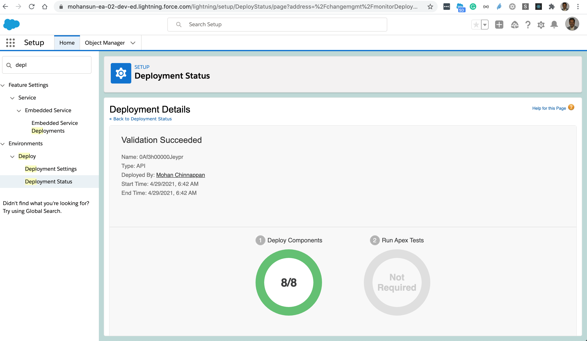

# Tableau CRM deployment using CLI

## Topics

- [List for the given metadata type](#list)
- [Retrieve the metadata zip file for the given metadata type from the source org](#retrieve)
- [Deploy the metadata zip file into the target org](#deploy)


<a name="list"></a>

## List for metadata type WaveDashboard
```
$ sfdx mohanc:mdapi:list -u mohan.chinnappan.n_ea2@gmail.com -t WaveDashboard
```
```
{
  result: [
    {
      createdById: '0053h000002xQ5sAAE',
      createdByName: 'Mohan Chinnappan',
      createdDate: 2020-07-13T19:30:57.000Z,
      fileName: 'wave/The_Motivator_1.wdash',
      fullName: 'The_Motivator_1',
      id: '0FK3h0000001yCcGAI',
      lastModifiedById: '0053h000003de6bAAA',
      lastModifiedByName: 'Integration User',
      lastModifiedDate: 2020-07-13T19:30:57.000Z,
      manageableState: 'unmanaged',
      type: 'WaveDashboard'
    },
    {
      createdById: '0053h000002xQ5sAAE',
      createdByName: 'Mohan Chinnappan',
      createdDate: 2020-10-24T03:50:25.000Z,
      fileName: 'wave/FieldUsage.wdash',
      fullName: 'FieldUsage',
      id: '0FK3h000000Ff2QGAS',
      lastModifiedById: '0053h000002xQ5sAAE',
      lastModifiedByName: 'Mohan Chinnappan',
      lastModifiedDate: 2020-10-24T03:50:25.000Z,
      manageableState: 'unmanaged',
      type: 'WaveDashboard'
    },
    {
      createdById: '0053h000002xQ5sAAE',
      createdByName: 'Mohan Chinnappan',
      createdDate: 2020-07-13T19:30:57.000Z,
      fileName: 'wave/The_Motivator_2.wdash',
      fullName: 'The_Motivator_2',
      id: '0FK3h0000001yCdGAI',
      lastModifiedById: '0053h000003de6bAAA',
      lastModifiedByName: 'Integration User',
      lastModifiedDate: 2020-07-13T19:30:57.000Z,
      manageableState: 'unmanaged',
      type: 'WaveDashboard'
    },
    {
      createdById: '0053h000002xQ5sAAE',
      createdByName: 'Mohan Chinnappan',
      createdDate: 2020-07-13T19:30:57.000Z,
      fileName: 'wave/DTC_Sales_SAMPLE.wdash',
      fullName: 'DTC_Sales_SAMPLE',
      id: '0FK3h0000001yCfGAI',
      lastModifiedById: '0053h000002xQ5sAAE',
      lastModifiedByName: 'Mohan Chinnappan',
      lastModifiedDate: 2020-07-13T19:30:57.000Z,
      manageableState: 'unmanaged',
      type: 'WaveDashboard'
    },
    {
      createdById: '0053h000002xQ5sAAE',
      createdByName: 'Mohan Chinnappan',
      createdDate: 2020-07-13T19:30:57.000Z,
      fileName: 'wave/Regional_Sales_SAMPLE.wdash',
      fullName: 'Regional_Sales_SAMPLE',
      id: '0FK3h0000001yChGAI',
      lastModifiedById: '0053h000002xQ5sAAE',
      lastModifiedByName: 'Mohan Chinnappan',
      lastModifiedDate: 2020-07-13T19:30:57.000Z,
      manageableState: 'unmanaged',
      type: 'WaveDashboard'
    },
    {
      createdById: '0053h000002xQ5sAAE',
      createdByName: 'Mohan Chinnappan',
      createdDate: 2020-07-13T19:30:57.000Z,
      fileName: 'wave/Sales_Performance_with_Selectable_Measures_Trailhead.wdash',
      fullName: 'Sales_Performance_with_Selectable_Measures_Trailhead',
      id: '0FK3h0000001yCiGAI',
      lastModifiedById: '0053h000002xQ5sAAE',
      lastModifiedByName: 'Mohan Chinnappan',
      lastModifiedDate: 2020-07-13T19:30:57.000Z,
      manageableState: 'unmanaged',
      type: 'WaveDashboard'
    },
    {
      createdById: '0053h000002xQ5sAAE',
      createdByName: 'Mohan Chinnappan',
      createdDate: 2020-07-13T19:30:57.000Z,
      fileName: 'wave/Opportunity_Details.wdash',
      fullName: 'Opportunity_Details',
      id: '0FK3h0000001yCgGAI',
      lastModifiedById: '0053h000002xQ5sAAE',
      lastModifiedByName: 'Mohan Chinnappan',
      lastModifiedDate: 2020-07-13T19:30:57.000Z,
      manageableState: 'unmanaged',
      type: 'WaveDashboard'
    },
    {
      createdById: '0053h000002xQ5sAAE',
      createdByName: 'Mohan Chinnappan',
      createdDate: 2020-07-13T19:30:57.000Z,
      fileName: 'wave/Worldwide_Fundraising_Starter.wdash',
      fullName: 'Worldwide_Fundraising_Starter',
      id: '0FK3h0000001yCeGAI',
      lastModifiedById: '0053h000002xQ5sAAE',
      lastModifiedByName: 'Mohan Chinnappan',
      lastModifiedDate: 2020-07-13T19:30:57.000Z,
      manageableState: 'unmanaged',
      type: 'WaveDashboard'
    }
  ]
}
```

<a name='retrieve'></a>

## Retrieve the metadata for WaveDashboard from the source org

```
$ sfdx mohanc:mdapi:retrieve -u mohan.chinnappan.n_ea2@gmail.com -t "WaveDashboard"
```

```
{
    "RetrieveRequest": {
        "apiVersion": "51.0",
        "unpackaged": [
            {
                "types": {
                    "members": "*",
                    "name": "WaveDashboard"
                }
            }
        ]
    }
}
{ result: { done: false, id: '09S3h000005hXVrEAM', state: 'Queued' } }
```

```
$ sfdx mohanc:mdapi:checkRetrieveStatus -u mohan.chinnappan.n_ea2@gmail.com -i 09S3h000005hXVrEAM
```

```
[
  {
    createdById: '0053h000002xQ5sAAE',
    createdByName: 'Mohan Chinnappan',
    createdDate: 2020-07-13T19:30:57.000Z,
    fileName: 'unpackaged/wave/Sales_Performance_with_Selectable_Measures_Trailhead.wdash',
    fullName: 'Sales_Performance_with_Selectable_Measures_Trailhead',
    id: '0FK3h0000001yCiGAI',
    lastModifiedById: '0053h000002xQ5sAAE',
    lastModifiedByName: 'Mohan Chinnappan',
    lastModifiedDate: 2020-07-13T19:30:57.000Z,
    manageableState: 'unmanaged',
    type: 'WaveDashboard'
  },
  {
    createdById: '0053h000002xQ5sAAE',
    createdByName: 'Mohan Chinnappan',
    createdDate: 2020-07-13T19:30:57.000Z,
    fileName: 'unpackaged/wave/The_Motivator_2.wdash',
    fullName: 'The_Motivator_2',
    id: '0FK3h0000001yCdGAI',
    lastModifiedById: '0053h000003de6bAAA',
    lastModifiedByName: 'Integration User',
    lastModifiedDate: 2020-07-13T19:30:57.000Z,
    manageableState: 'unmanaged',
    type: 'WaveDashboard'
  },
  {
    createdById: '0053h000002xQ5sAAE',
    createdByName: 'Mohan Chinnappan',
    createdDate: 2020-07-13T19:30:57.000Z,
    fileName: 'unpackaged/wave/The_Motivator_1.wdash',
    fullName: 'The_Motivator_1',
    id: '0FK3h0000001yCcGAI',
    lastModifiedById: '0053h000003de6bAAA',
    lastModifiedByName: 'Integration User',
    lastModifiedDate: 2020-07-13T19:30:57.000Z,
    manageableState: 'unmanaged',
    type: 'WaveDashboard'
  },
  {
    createdById: '0053h000002xQ5sAAE',
    createdByName: 'Mohan Chinnappan',
    createdDate: 2020-07-13T19:30:57.000Z,
    fileName: 'unpackaged/wave/Regional_Sales_SAMPLE.wdash',
    fullName: 'Regional_Sales_SAMPLE',
    id: '0FK3h0000001yChGAI',
    lastModifiedById: '0053h000002xQ5sAAE',
    lastModifiedByName: 'Mohan Chinnappan',
    lastModifiedDate: 2020-07-13T19:30:57.000Z,
    manageableState: 'unmanaged',
    type: 'WaveDashboard'
  },
  {
    createdById: '0053h000002xQ5sAAE',
    createdByName: 'Mohan Chinnappan',
    createdDate: 2020-10-24T03:50:25.000Z,
    fileName: 'unpackaged/wave/FieldUsage.wdash',
    fullName: 'FieldUsage',
    id: '0FK3h000000Ff2QGAS',
    lastModifiedById: '0053h000002xQ5sAAE',
    lastModifiedByName: 'Mohan Chinnappan',
    lastModifiedDate: 2020-10-24T03:50:25.000Z,
    manageableState: 'unmanaged',
    type: 'WaveDashboard'
  },
  {
    createdById: '0053h000002xQ5sAAE',
    createdByName: 'Mohan Chinnappan',
    createdDate: 2020-07-13T19:30:57.000Z,
    fileName: 'unpackaged/wave/Opportunity_Details.wdash',
    fullName: 'Opportunity_Details',
    id: '0FK3h0000001yCgGAI',
    lastModifiedById: '0053h000002xQ5sAAE',
    lastModifiedByName: 'Mohan Chinnappan',
    lastModifiedDate: 2020-07-13T19:30:57.000Z,
    manageableState: 'unmanaged',
    type: 'WaveDashboard'
  },
  {
    createdById: '0053h000002xQ5sAAE',
    createdByName: 'Mohan Chinnappan',
    createdDate: 2020-07-13T19:30:57.000Z,
    fileName: 'unpackaged/wave/DTC_Sales_SAMPLE.wdash',
    fullName: 'DTC_Sales_SAMPLE',
    id: '0FK3h0000001yCfGAI',
    lastModifiedById: '0053h000002xQ5sAAE',
    lastModifiedByName: 'Mohan Chinnappan',
    lastModifiedDate: 2020-07-13T19:30:57.000Z,
    manageableState: 'unmanaged',
    type: 'WaveDashboard'
  },
  {
    createdById: '0053h000002xQ5sAAE',
    createdByName: 'Mohan Chinnappan',
    createdDate: 2020-07-13T19:30:57.000Z,
    fileName: 'unpackaged/wave/Worldwide_Fundraising_Starter.wdash',
    fullName: 'Worldwide_Fundraising_Starter',
    id: '0FK3h0000001yCeGAI',
    lastModifiedById: '0053h000002xQ5sAAE',
    lastModifiedByName: 'Mohan Chinnappan',
    lastModifiedDate: 2020-07-13T19:30:57.000Z,
    manageableState: 'unmanaged',
    type: 'WaveDashboard'
  },
  {
    createdById: '0053h000002xQ5sAAE',
    createdByName: 'Mohan Chinnappan',
    createdDate: 2021-04-29T13:31:39.051Z,
    fileName: 'unpackaged/package.xml',
    fullName: 'unpackaged/package.xml',
    id: '',
    lastModifiedById: '0053h000002xQ5sAAE',
    lastModifiedByName: 'Mohan Chinnappan',
    lastModifiedDate: 2021-04-29T13:31:39.051Z,
    manageableState: 'unmanaged',
    type: 'Package'
  }
]
=== Writing zipFile base64 content to 09S3h000005hXVrEAM.zip.txt ...
=== Writing zipFile binary content to 09S3h000005hXVrEAM.zip ... 
$ jar xvf 09S3h000005hXVrEAM.zip
 inflated: unpackaged/wave/Sales_Performance_with_Selectable_Measures_Trailhead.wdash
 inflated: unpackaged/wave/Sales_Performance_with_Selectable_Measures_Trailhead.wdash-meta.xml
 inflated: unpackaged/wave/The_Motivator_2.wdash
 inflated: unpackaged/wave/The_Motivator_2.wdash-meta.xml
 inflated: unpackaged/wave/The_Motivator_1.wdash
 inflated: unpackaged/wave/The_Motivator_1.wdash-meta.xml
 inflated: unpackaged/wave/Regional_Sales_SAMPLE.wdash
 inflated: unpackaged/wave/Regional_Sales_SAMPLE.wdash-meta.xml
 inflated: unpackaged/wave/FieldUsage.wdash
 inflated: unpackaged/wave/FieldUsage.wdash-meta.xml
 inflated: unpackaged/wave/Opportunity_Details.wdash
 inflated: unpackaged/wave/Opportunity_Details.wdash-meta.xml
 inflated: unpackaged/wave/DTC_Sales_SAMPLE.wdash
 inflated: unpackaged/wave/DTC_Sales_SAMPLE.wdash-meta.xml
 inflated: unpackaged/wave/Worldwide_Fundraising_Starter.wdash
 inflated: unpackaged/wave/Worldwide_Fundraising_Starter.wdash-meta.xml
 inflated: unpackaged/package.xml
```
<a name="deploy"></a>
```

$ cat ~/.ea/options.json 
```json
{
  "checkOnly": true

}
```

```
$ sfdx mohanc:mdapi:deploy -u mohan.chinnappan.n_ea2@gmail.com -z 09S3h000005hXVrEAM.zip.txt   -o  ~/.ea/options.json
```

{ checkOnly: true }
{
    "zipFile": "Zip file content",
    "DeployOptions": {
        "checkOnly": true
    }
}
{ result: { done: false, id: '0Af3h00000JeyprCAB', state: 'Queued' } }
```

$ sfdx mohanc:mdapi:checkDeployStatus -u mohan.chinnappan.n_ea2@gmail.com -i 0Af3h00000JeyprCAB
```
{
  result: {
    checkOnly: true,
    completedDate: 2021-04-29T13:42:33.000Z,
    createdBy: '0053h000002xQ5s',
    createdByName: 'Mohan Chinnappan',
    createdDate: 2021-04-29T13:42:29.000Z,
    details: null,
    done: true,
    id: '0Af3h00000JeyprCAB',
    ignoreWarnings: false,
    lastModifiedDate: 2021-04-29T13:42:33.000Z,
    numberComponentErrors: 0,
    numberComponentsDeployed: 8,
    numberComponentsTotal: 8,
    numberTestErrors: 0,
    numberTestsCompleted: 0,
    numberTestsTotal: 0,
    rollbackOnError: false,
    runTestsEnabled: false,
    startDate: 2021-04-29T13:42:29.000Z,
    status: 'Succeeded',
    success: true
  }
}
```

## List metadata type WaveXmd 

```
$ sfdx mohanc:mdapi:list -u mohan.chinnappan.n_ea2@gmail.com -t WaveXmd
```
```
{
  result: [
    {
      createdById: '0053h000002xQ5sAAE',
      createdByName: 'Mohan Chinnappan',
      createdDate: 2020-10-20T20:37:46.000Z,
      fileName: 'wave/user.xmd',
      fullName: 'user',
      id: '0KT3h00000567WpGAI',
      lastModifiedById: '0053h000002xQ5sAAE',
      lastModifiedByName: 'Mohan Chinnappan',
      lastModifiedDate: 2020-10-20T20:37:46.000Z,
      manageableState: 'unmanaged',
      type: 'WaveXmd'
    }
  ]
}
```


