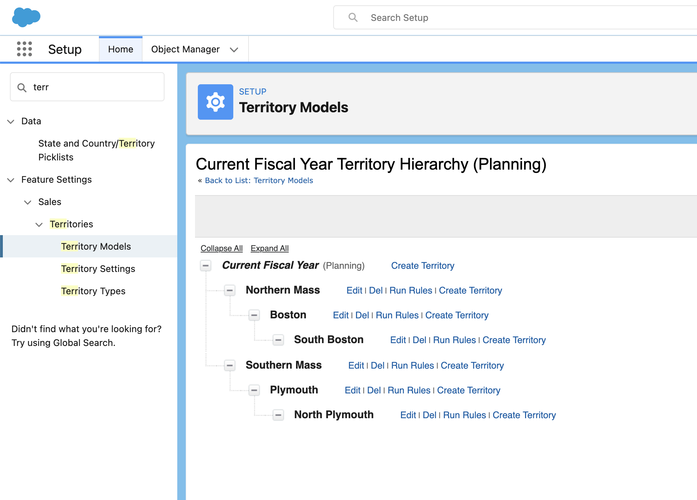
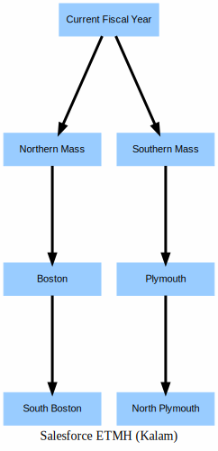

# How to visualize the Enterprise Territory Management (ETM) hierarchy using DX


```
sfdx mohanc:security:etmh -u mohan.chinnappan.n_ea2@gmail.com 

Writing visualization in file __ETMH__.svg ...
Visualization done. "open  __ETMH__.svg" in Chrome Browser to view the Visualization.
```


