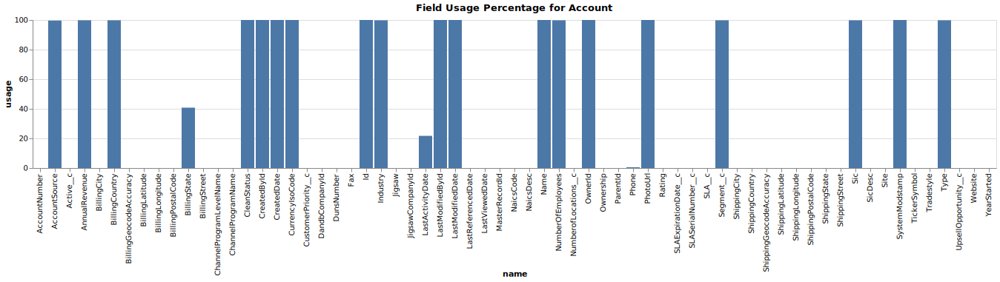

# How to get the field usage for a given SObject using DX

- Requires plugin version 0.0.199
- [Install / update plugin](https://mohan-chinnappan-n.github.io/dx/plugins.html#/1)

## Login into the Org
```
sfdx force:auth:web:login
Successfully authorized mohan.chinnappan.n_ea2@gmail.com with org ID 00D3h000007R1LuEAK

```
## Run the command
```
sfdx mohanc:data:field:usage -u mohan.chinnappan.n_ea2@gmail.com -s Account
=== Writing $ in file Account_fieldUsage.csv ... ===
=== Opening  Account_fieldUsage.csv... ===
==== Opening the Chart Site in the web browser... ===

```

### Chart


### CSV
[Accout Field Usage CSV](Account_fieldUsage.csv)


## Demo


