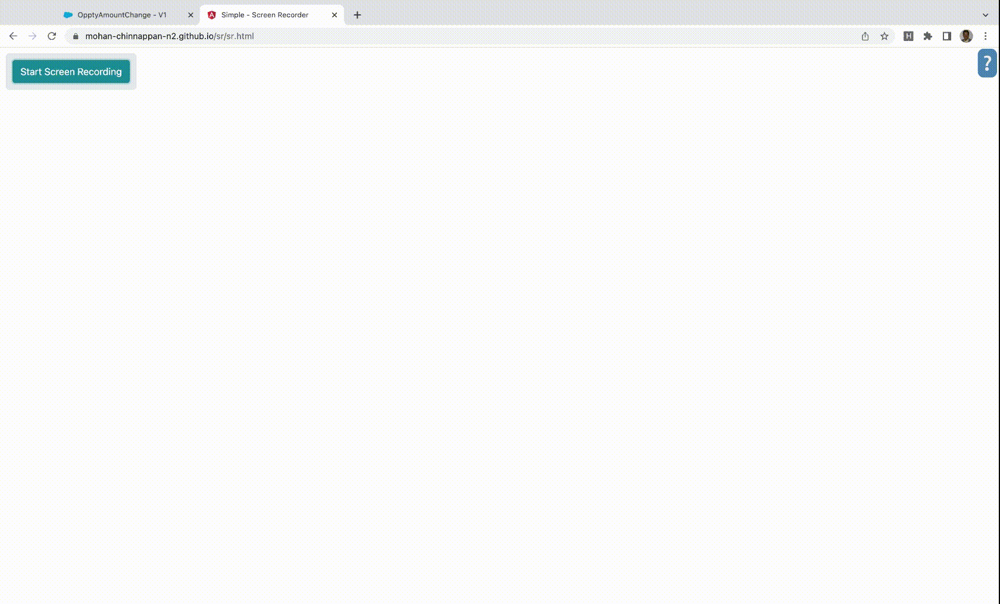

# How to deactivate a flow using CLI

## Get Flow Ids

```
 sfdx mohanc:tooling:query -u mohan.chinnappan.n.sel@gmail.com  -q ~/.soql/flowdetails.soql -f json

```

```
cat ~/.soql/flowdetails.soql
```
```sql
SELECT
Id,
ActiveVersion.VersionNumber,
LatestVersion.VersionNumber,
ActiveVersionId,
LatestVersionId,
ManageableState,
MasterLabel,
Metadata,
NamespacePrefix
FROM

FlowDefinition
ORDER BY
DeveloperName
```
```json
[
    {
        "attributes": {
            "type": "FlowDefinition",
            "url": "/services/data/v56.0/tooling/sobjects/FlowDefinition/3004x000000hFYrAAM"
        },
        "Id": "3004x000000hFYrAAM",
        "ActiveVersion": {
            "attributes": {
                "type": "Flow",
                "url": "/services/data/v56.0/tooling/sobjects/Flow/3014x000000VJwaAAG"
            },
            "VersionNumber": 1
        },
        "LatestVersion": {
            "attributes": {
                "type": "Flow",
                "url": "/services/data/v56.0/tooling/sobjects/Flow/3014x000000VJwaAAG"
            },
            "VersionNumber": 1
        },
        "ActiveVersionId": "3014x000000VJwaAAG",
        "LatestVersionId": "3014x000000VJwaAAG",
        "ManageableState": "unmanaged",
        "MasterLabel": null,
        "Metadata": {
            "activeVersionNumber": 1,
            "description": null,
            "masterLabel": null,
            "urls": null
        },
        "NamespacePrefix": null
    }
]
```

## Deactivate the flow

- 3004x000000hFYrAAM in below url is flowId to be deactivated

```
sfdx mohanc:ws:rest -r https://d4x000007rxogeaq-dev-ed.my.salesforce.com/services/data/v56.0/tooling/sobjects/FlowDefinition/3004x000000hFYrAAM/  -m PATCH -f header.json -d flow_data.json

```

```
cat flow_data.json
```
```json
{
  "Metadata": {
       "activeVersionNumber": null
   }
}
```

- This will deactive the flow with id: 3004x000000hFYrAAM


## Recording method

```
sfdx mohanc:recording:toggleFlow -h
Toggle given FlowIds

USAGE
  $ sfdx mohanc recording toggleFlow [-r <string>] [-f <string>] [--json] [--loglevel
    trace|debug|info|warn|error|fatal|TRACE|DEBUG|INFO|WARN|ERROR|FATAL]

FLAGS
  -f, --flowids=<value>
      Comma separated list of FlowIds

  -r, --url=<value>
      Org Url (https://xxxx.force.com

  --json
      format output as json

  --loglevel=(trace|debug|info|warn|error|fatal|TRACE|DEBUG|INFO|WARN|ERROR|FATAL)
      [default: warn] logging level for this command invocation
```
### Preparing recording for Chrome recorder
```
 sfdx mohanc:recording:toggleFlow -i https://d4x000007rxogeaq-dev-ed.lightning.force.com -u 3014x000000VJwaAAG,3014x000000VJwaAAG,3014x000000VJwaAAG > ~/Desktop/f1.json
```

### Demo


