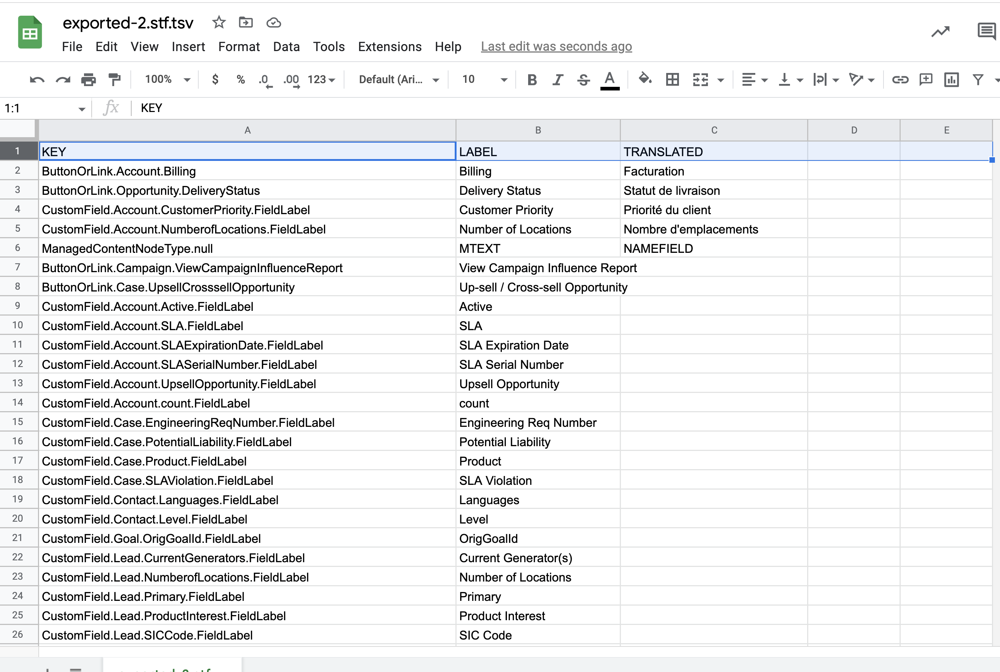
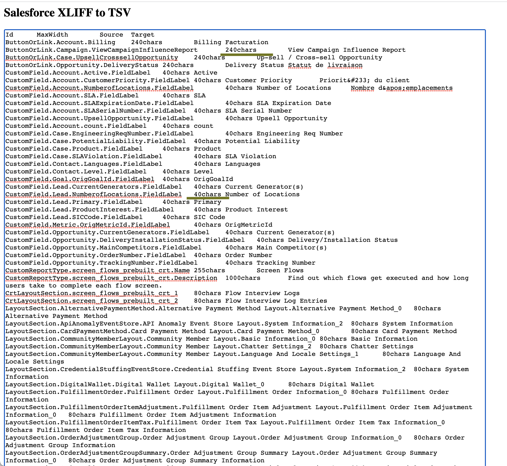
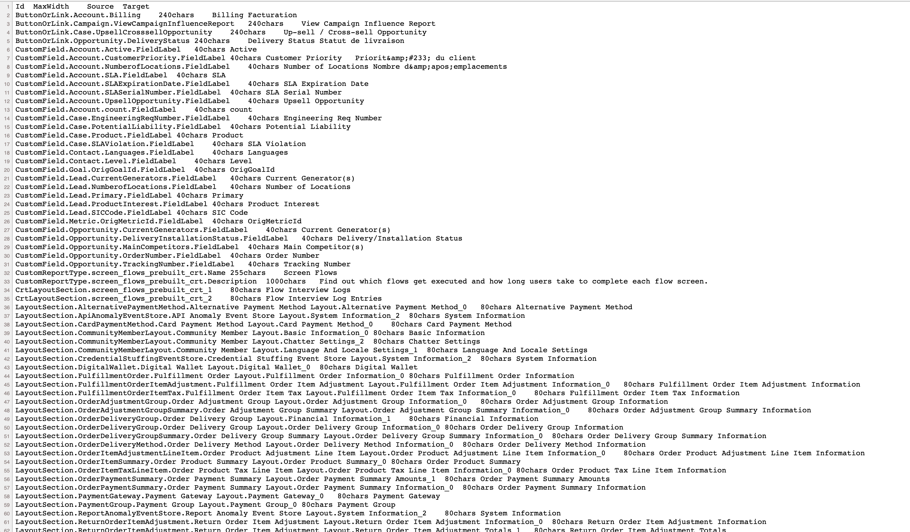
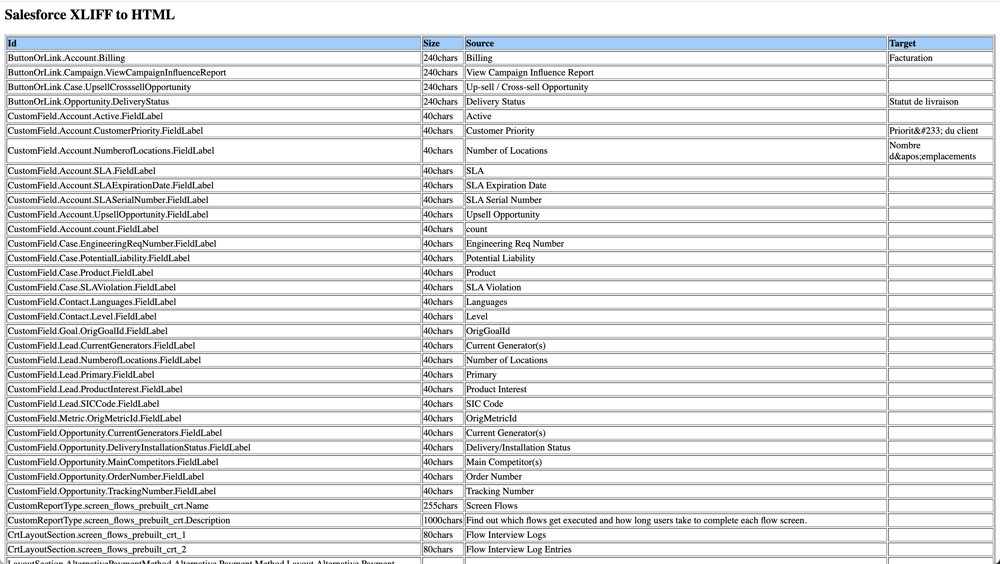

# How to prepare translation TSV 
- [Demo showing how to do the export - PDF](img/exportSTF.pdf)
- [exported-2.stf](img/exported-2.stf) is the input file you got from Translation workbench export
```
sfdx mohanc:i18n:stf:prep -i exported-2.stf > exported-2.stf.tsv
```

### [exported-2.stf.tsv](img/exported-2.stf.tsv)
 


## Using XLF export
- If you exported the [XLF file](img/exported-2.xlf) is translation workbench you will know the max width/size of the translation allowed
- Using our CLI you can convert that XLF file into TSV
- [stf2tsvHtml.xsl](xsl/stf2tsvHtml.xsl) used here
```
sfdx mohanc:xml:transform -i img/exported-2.xlf -t xsl/stf2tsvHtml.xsl
```
- Above command will open a HTML page with TSV file loaded in a textarea. You can cut and paste the content of the textarea to create a TSV file




- If you want to view the XLIFF file as a TSV page:

```
sfdx mohanc:xml:transform -i img/exported-2.xlf -t xsl/stf2tsv.xsl
=== Writing the output into file : img/exported-2.xlf.out.xml.html ===

```



- If you want to view the XLIFF file as a HTML page:

```
sfdx mohanc:xml:transform -i img/exported-2.xlf -t xsl/stf2html.xsl
=== Writing the output into file : img/exported-2.xlf.out.xml.html ===

```



