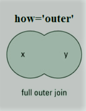
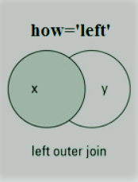
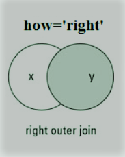

# How to join 2 csv files  on a key 

- Joints supported
    - inner (natural join)
        - 
    - outer
        - 

    - left   (left outer join)
        - 
    - right  (right outer join)
        - 

## First file
```
cat f1.csv 
```

```
key|label|translation
Account.Description|Help in planting trees|Aide à la plantation d'arbres
Contact.Description|passinate about environment|passionné par l'environnement
```

## Second file
```
cat f2.csv
```

```
key|width
Contact.Description|45
Account.Description|4
```

## inner join on field key

```
python3 joincsv.py -f f1.csv -s f2.csv  -j inner -d '|' -o 'key' -r result.psv

```

## result 


```
cat result.psv

```

```
key|label|translation|width
Account.Description|Help in planting trees|Aide à la plantation d'arbres|40
Contact.Description|passinate about environment|passionné par l'environnement|45


```


