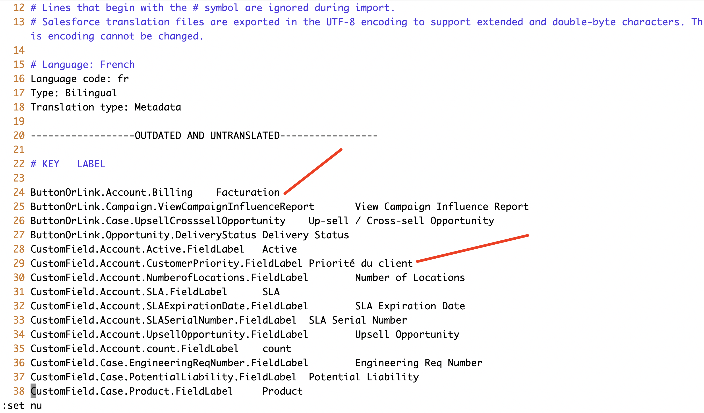
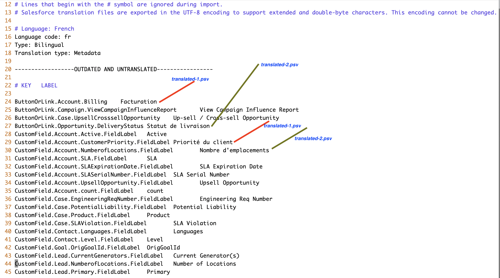
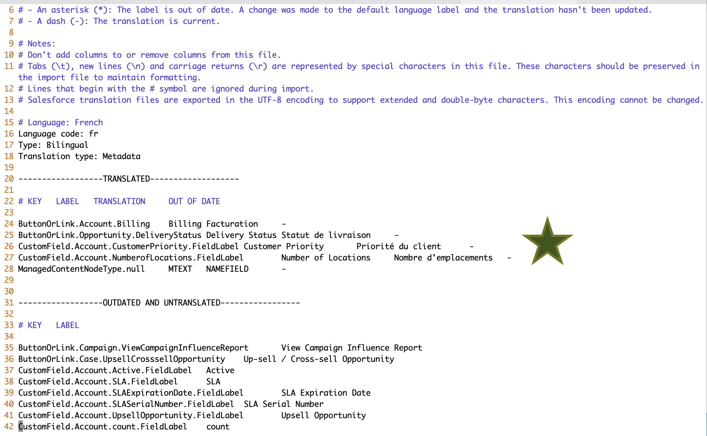

# Using CLI to fill-in Salesforce translation file (STF)

## Update the plugin
- [Refer: Plugin install and update](https://mohan-chinnappan-n.github.io/dx/plugins.html#/1)
```
 sfdx plugins:update
```
### NOTE: You can use [Kural CLI]((https://github.com/mohan-chinnappan-n/kural-docs)) to get free translations
-------

### CLI allows progressive filling of stf with translated files
- STEPS

- [Demo showing how to do the export - PDF](img/exportSTF.pdf)

1. Export STF file for a bilingual (using Translation workbench) - say our case it is French (FR) 
    - Our file say: [exported.stf](img/exported.stf)
2. You have translated the keys in this STF file and have the [translated-1.psv](img/translated-1.psv) (Pipe Separated Value file)
3. Create the filled value stf file [batch-1.stf](img/batch-1.stf) using this command:
```
sfdx mohanc:i18n:stf:fill -i exported.stf -t  translated-1.psv > batch-1.stf
```
```
1|ButtonOrLink.Account.Billing|Billing|Facturation
2|CustomField.Account.CustomerPriority.FieldLabel|Customer Priority|Priorité du client
```


4. Now another translation team has provided you [translated-2.psv](img/translated-2.psv)
5. You can apply this translation on top of  [batch-1.stf](img/batch-1.stf), using this command

```
sfdx mohanc:i18n:stf:fill -i batch-1.stf -t  translated-2.psv > batch-2.stf

1|ButtonOrLink.Opportunity.DeliveryStatus|Delivery Status|Statut de livraison
2|CustomField.Account.NumberofLocations.FieldLabel|Number of Locations|Nombre d'emplacements
```



6. and so on...
7. You can load (import) the final stf file to the org in translation workbench
- [Demo showing Importing STF file](img/import-1.pdf)

8. If you export again you will see the results of your translations:



-----------

## Using Kural to translate
- [Kural Docs](https://github.com/mohan-chinnappan-n/kural-docs)

```
kural i18n:translate -i 'Billing' -f en -t fr
Facturation
```

```
kural i18n:translate -i 'Customer Priority' -f en -t fr
Priorité du client

```


### translated-1.psv 
```
cat translated-1.psv 
ButtonOrLink.Account.Billing|Billing|Facturation
CustomField.Account.CustomerPriority.FieldLabel|Customer Priority|Priorité du client
```


```
kural i18n:translate -i 'Delivery Status' -f en -t fr
Statut de livraison

kural i18n:translate -i 'Number of Locations' -f en -t fr
Nombre d'emplacements
```

### translated-2.psv 

```
cat translated-2.psv 
ButtonOrLink.Opportunity.DeliveryStatus|Delivery Status|Statut de livraison
CustomField.Account.NumberofLocations.FieldLabel|Number of Locations|Nombre d'emplacements

```