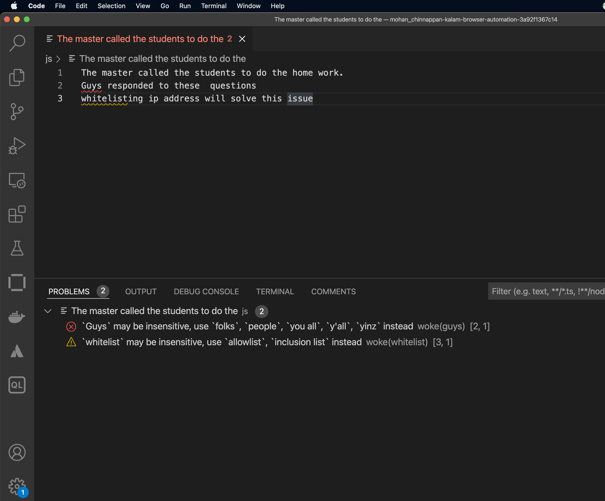

# Inclusive language scanning

## [Woke](https://docs.getwoke.tech/installation/)

```
# on macOs

brew install get-woke/tap/woke


```

### Testing

```
cat text1.txt
```

```
The master called the students to do the home work.
Guys responded to these 	questions
whitelisting ip address will solve this issue
```
- Scan

```
woke text1.txt
```

```
text1.txt:2:0-4: `Guys` may be insensitive, use `folks`, `people`, `you all`, `y'all`, `yinz` instead (error)
Guys responded to these 	questions
^
text1.txt:3:0-9: `whitelist` may be insensitive, use `allowlist`, `inclusion list` instead (warning)
whitelisting ip address will solve this issue
^
```

## Similar Tools
- [es-lint plugin](https://www.npmjs.com/package/eslint-plugin-inclusive-language)
- [Woke VS Code extension]()


