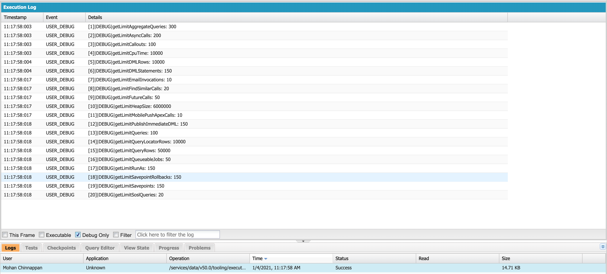

# My org limits

## Login
```
$ sfdx force:auth:web:login 
Successfully authorized mohan.chinnappan.n_ea2@gmail.com with org ID 00D3h000007R1LuEAK
You may now close the browser

```

## Get auth headers
```
$ sfdx mohanc:hello:myorg -u mohan.chinnappan.n_ea2@gmail.com
{
    "Content-Type": "application/json",
    "Authorization": "Bearer 00D3h000007R1Lu!FakeTPDpFnoMAzeS35jXcuxDQFRDs8oipxmWMHnY6H02FaPr3Tp.dXxf4jJMnhULEOv9zdWl_cWvp_MdWl_UnTDhMoi",
    "apiVersion": "50.0",
    "instanceUrl": "https://mohansun-ea-02-dev-ed.my.salesforce.com",
    "restAPIUri": "https://mohansun-ea-02-dev-ed.my.salesforce.com/services/data/v50.0/"
}
$ sfdx mohanc:hello:myorg -u mohan.chinnappan.n_ea2@gmail.com > ~/.ea/header.json 
```

## Get current limits for the org

```
$ sfdx mohanc:ws:rest -f ~/.ea/header.json -r https://mohansun-ea-02-dev-ed.my.salesforce.com/services/data/v50.0/limits
{
    "AnalyticsExternalDataSizeMB": {
        "Max": 40960,
        "Remaining": 40960
    },
    "BOZosCalloutHourlyLimit": {
        "Max": 20000,
        "Remaining": 20000
    },
    "ConcurrentAsyncGetReportInstances": {
        "Max": 200,
        "Remaining": 200
    },
    "ConcurrentEinsteinDataInsightsStoryCreation": {
        "Max": 5,
        "Remaining": 5
    },
    "ConcurrentEinsteinDiscoveryStoryCreation": {
        "Max": 2,
        "Remaining": 2
    },
    "ConcurrentSyncReportRuns": {
        "Max": 20,
        "Remaining": 20
    },
    "DailyAnalyticsDataflowJobExecutions": {
        "Max": 60,
        "Remaining": 60
    },
    "DailyAnalyticsUploadedFilesSizeMB": {
        "Max": 51200,
        "Remaining": 51200
    },
    "DailyApiRequests": {
        "Max": 15000,
        "Remaining": 14988,
        "Ant Migration Tool": {
            "Max": 0,
            "Remaining": 0
        },
        "CMOffice": {
            "Max": 0,
            "Remaining": 0
        },
        "Dataloader Bulk": {
            "Max": 0,
            "Remaining": 0
        },
        "Dataloader Partner": {
            "Max": 0,
            "Remaining": 0
        },
        "Force.com IDE": {
            "Max": 0,
            "Remaining": 0
        },
        "JWTTest": {
            "Max": 0,
            "Remaining": 0
        },
        "Salesforce Mobile Dashboards": {
            "Max": 0,
            "Remaining": 0
        },
        "Salesforce Touch": {
            "Max": 0,
            "Remaining": 0
        },
        "Salesforce for Outlook": {
            "Max": 0,
            "Remaining": 0
        },
        "Salesforce_to_SalesforceIQ_Secure_Connected_App": {
            "Max": 0,
            "Remaining": 0
        },
        "Workbench": {
            "Max": 0,
            "Remaining": 0
        },
        "mohansun4ConnApp": {
            "Max": 0,
            "Remaining": 0
        },
        "mohansunCApp": {
            "Max": 0,
            "Remaining": 0
        }
    },
    "DailyAsyncApexExecutions": {
        "Max": 250000,
        "Remaining": 250000
    },
    "DailyBulkApiBatches": {
        "Max": 15000,
        "Remaining": 15000,
        "Ant Migration Tool": {
            "Max": 0,
            "Remaining": 0
        },
        "CMOffice": {
            "Max": 0,
            "Remaining": 0
        },
        "Dataloader Bulk": {
            "Max": 0,
            "Remaining": 0
        },
        "Dataloader Partner": {
            "Max": 0,
            "Remaining": 0
        },
        "Force.com IDE": {
            "Max": 0,
            "Remaining": 0
        },
        "JWTTest": {
            "Max": 0,
            "Remaining": 0
        },
        "Salesforce Mobile Dashboards": {
            "Max": 0,
            "Remaining": 0
        },
        "Salesforce Touch": {
            "Max": 0,
            "Remaining": 0
        },
        "Salesforce for Outlook": {
            "Max": 0,
            "Remaining": 0
        },
        "Salesforce_to_SalesforceIQ_Secure_Connected_App": {
            "Max": 0,
            "Remaining": 0
        },
        "Workbench": {
            "Max": 0,
            "Remaining": 0
        },
        "mohansun4ConnApp": {
            "Max": 0,
            "Remaining": 0
        },
        "mohansunCApp": {
            "Max": 0,
            "Remaining": 0
        }
    },
    "DailyBulkV2QueryFileStorageMB": {
        "Max": 976562,
        "Remaining": 976562
    },
    "DailyBulkV2QueryJobs": {
        "Max": 10000,
        "Remaining": 10000
    },
    "DailyDurableGenericStreamingApiEvents": {
        "Max": 10000,
        "Remaining": 10000
    },
    "DailyDurableStreamingApiEvents": {
        "Max": 10000,
        "Remaining": 10000
    },
    "DailyEinsteinDataInsightsStoryCreation": {
        "Max": 1000,
        "Remaining": 1000
    },
    "DailyEinsteinDiscoveryPredictAPICalls": {
        "Max": 50000,
        "Remaining": 50000
    },
    "DailyEinsteinDiscoveryPredictionsByCDC": {
        "Max": 500000,
        "Remaining": 500000
    },
    "DailyEinsteinDiscoveryStoryCreation": {
        "Max": 100,
        "Remaining": 100
    },
    "DailyGenericStreamingApiEvents": {
        "Max": 10000,
        "Remaining": 10000,
        "Ant Migration Tool": {
            "Max": 0,
            "Remaining": 0
        },
        "CMOffice": {
            "Max": 0,
            "Remaining": 0
        },
        "Dataloader Bulk": {
            "Max": 0,
            "Remaining": 0
        },
        "Dataloader Partner": {
            "Max": 0,
            "Remaining": 0
        },
        "Force.com IDE": {
            "Max": 0,
            "Remaining": 0
        },
        "JWTTest": {
            "Max": 0,
            "Remaining": 0
        },
        "Salesforce Mobile Dashboards": {
            "Max": 0,
            "Remaining": 0
        },
        "Salesforce Touch": {
            "Max": 0,
            "Remaining": 0
        },
        "Salesforce for Outlook": {
            "Max": 0,
            "Remaining": 0
        },
        "Salesforce_to_SalesforceIQ_Secure_Connected_App": {
            "Max": 0,
            "Remaining": 0
        },
        "Workbench": {
            "Max": 0,
            "Remaining": 0
        },
        "mohansun4ConnApp": {
            "Max": 0,
            "Remaining": 0
        },
        "mohansunCApp": {
            "Max": 0,
            "Remaining": 0
        }
    },
    "DailyManagedContentPublicRequests": {
        "Max": 50000,
        "Remaining": 50000
    },
    "DailyStandardVolumePlatformEvents": {
        "Max": 10000,
        "Remaining": 10000
    },
    "DailyStreamingApiEvents": {
        "Max": 10000,
        "Remaining": 10000,
        "Ant Migration Tool": {
            "Max": 0,
            "Remaining": 0
        },
        "CMOffice": {
            "Max": 0,
            "Remaining": 0
        },
        "Dataloader Bulk": {
            "Max": 0,
            "Remaining": 0
        },
        "Dataloader Partner": {
            "Max": 0,
            "Remaining": 0
        },
        "Force.com IDE": {
            "Max": 0,
            "Remaining": 0
        },
        "JWTTest": {
            "Max": 0,
            "Remaining": 0
        },
        "Salesforce Mobile Dashboards": {
            "Max": 0,
            "Remaining": 0
        },
        "Salesforce Touch": {
            "Max": 0,
            "Remaining": 0
        },
        "Salesforce for Outlook": {
            "Max": 0,
            "Remaining": 0
        },
        "Salesforce_to_SalesforceIQ_Secure_Connected_App": {
            "Max": 0,
            "Remaining": 0
        },
        "Workbench": {
            "Max": 0,
            "Remaining": 0
        },
        "mohansun4ConnApp": {
            "Max": 0,
            "Remaining": 0
        },
        "mohansunCApp": {
            "Max": 0,
            "Remaining": 0
        }
    },
    "DailyWorkflowEmails": {
        "Max": 405,
        "Remaining": 405
    },
    "DataStorageMB": {
        "Max": 45,
        "Remaining": 14
    },
    "DurableStreamingApiConcurrentClients": {
        "Max": 20,
        "Remaining": 18
    },
    "FileStorageMB": {
        "Max": 20,
        "Remaining": 20
    },
    "HourlyAsyncReportRuns": {
        "Max": 1200,
        "Remaining": 1200
    },
    "HourlyDashboardRefreshes": {
        "Max": 200,
        "Remaining": 200
    },
    "HourlyDashboardResults": {
        "Max": 5000,
        "Remaining": 5000
    },
    "HourlyDashboardStatuses": {
        "Max": 999999999,
        "Remaining": 999999999
    },
    "HourlyLongTermIdMapping": {
        "Max": 100000,
        "Remaining": 100000
    },
    "HourlyODataCallout": {
        "Max": 1000,
        "Remaining": 1000
    },
    "HourlyPublishedPlatformEvents": {
        "Max": 50000,
        "Remaining": 50000
    },
    "HourlyPublishedStandardVolumePlatformEvents": {
        "Max": 1000,
        "Remaining": 1000
    },
    "HourlyShortTermIdMapping": {
        "Max": 100000,
        "Remaining": 100000
    },
    "HourlySyncReportRuns": {
        "Max": 500,
        "Remaining": 500
    },
    "HourlyTimeBasedWorkflow": {
        "Max": 50,
        "Remaining": 50
    },
    "MassEmail": {
        "Max": 10,
        "Remaining": 10
    },
    "MonthlyEinsteinDiscoveryStoryCreation": {
        "Max": 500,
        "Remaining": 500
    },
    "MonthlyPlatformEventsUsageEntitlement": {
        "Max": 0,
        "Remaining": 0
    },
    "Package2VersionCreates": {
        "Max": 6,
        "Remaining": 6
    },
    "Package2VersionCreatesWithoutValidation": {
        "Max": 500,
        "Remaining": 500
    },
    "PermissionSets": {
        "Max": 1500,
        "Remaining": 1496,
        "CreateCustom": {
            "Max": 1000,
            "Remaining": 996
        }
    },
    "PrivateConnectOutboundCalloutHourlyLimitMB": {
        "Max": 0,
        "Remaining": 0
    },
    "SingleEmail": {
        "Max": 15,
        "Remaining": 15
    },
    "StreamingApiConcurrentClients": {
        "Max": 20,
        "Remaining": 20
    }
}
```

## Using  tooling API

```
$ sfdx mohanc:tooling:execute -u mohan.chinnappan.n_ea2@gmail.com -a ~/.ea/mylimits.cls 
apexCode: 
Integer mygetLimitAggregateQueries = Limits.getLimitAggregateQueries(); System.debug('getLimitAggregateQueries: ' + mygetLimitAggregateQueries ); 
Integer mygetLimitAsyncCalls = Limits.getLimitAsyncCalls(); System.debug('getLimitAsyncCalls: ' + mygetLimitAsyncCalls ); 
Integer mygetLimitCallouts = Limits.getLimitCallouts(); System.debug('getLimitCallouts: ' + mygetLimitCallouts ); 
Integer mygetLimitCpuTime = Limits.getLimitCpuTime(); System.debug('getLimitCpuTime: ' + mygetLimitCpuTime ); 
Integer mygetLimitDMLRows = Limits.getLimitDMLRows(); System.debug('getLimitDMLRows: ' + mygetLimitDMLRows ); 
Integer mygetLimitDMLStatements = Limits.getLimitDMLStatements(); System.debug('getLimitDMLStatements: ' + mygetLimitDMLStatements ); 
Integer mygetLimitEmailInvocations = Limits.getLimitEmailInvocations(); System.debug('getLimitEmailInvocations: ' + mygetLimitEmailInvocations ); 
Integer mygetLimitFindSimilarCalls = Limits.getLimitFindSimilarCalls(); System.debug('getLimitFindSimilarCalls: ' + mygetLimitFindSimilarCalls ); 
Integer mygetLimitFutureCalls = Limits.getLimitFutureCalls(); System.debug('getLimitFutureCalls: ' + mygetLimitFutureCalls ); 
Integer mygetLimitHeapSize = Limits.getLimitHeapSize(); System.debug('getLimitHeapSize: ' + mygetLimitHeapSize ); 
Integer mygetLimitMobilePushApexCalls = Limits.getLimitMobilePushApexCalls(); System.debug('getLimitMobilePushApexCalls: ' + mygetLimitMobilePushApexCalls ); 
Integer mygetLimitPublishImmediateDML = Limits.getLimitPublishImmediateDML(); System.debug('getLimitPublishImmediateDML: ' + mygetLimitPublishImmediateDML ); 
Integer mygetLimitQueries = Limits.getLimitQueries(); System.debug('getLimitQueries: ' + mygetLimitQueries ); 
Integer mygetLimitQueryLocatorRows = Limits.getLimitQueryLocatorRows(); System.debug('getLimitQueryLocatorRows: ' + mygetLimitQueryLocatorRows ); 
Integer mygetLimitQueryRows = Limits.getLimitQueryRows(); System.debug('getLimitQueryRows: ' + mygetLimitQueryRows ); 
Integer mygetLimitQueueableJobs = Limits.getLimitQueueableJobs(); System.debug('getLimitQueueableJobs: ' + mygetLimitQueueableJobs ); 
Integer mygetLimitRunAs = Limits.getLimitRunAs(); System.debug('getLimitRunAs: ' + mygetLimitRunAs ); 
Integer mygetLimitSavepointRollbacks = Limits.getLimitSavepointRollbacks(); System.debug('getLimitSavepointRollbacks: ' + mygetLimitSavepointRollbacks ); 
Integer mygetLimitSavepoints = Limits.getLimitSavepoints(); System.debug('getLimitSavepoints: ' + mygetLimitSavepoints ); 
Integer mygetLimitSoslQueries = Limits.getLimitSoslQueries(); System.debug('getLimitSoslQueries: ' + mygetLimitSoslQueries ); 

compiled?: true
executed?: true
{
  line: -1,
  column: -1,
  compiled: true,
  success: true,
  compileProblem: null,
  exceptionStackTrace: null,
  exceptionMessage: null
}
```

