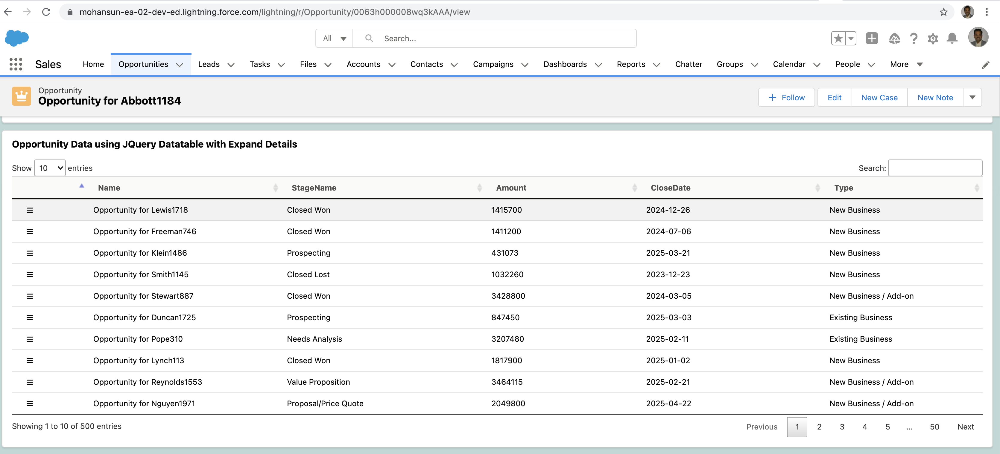
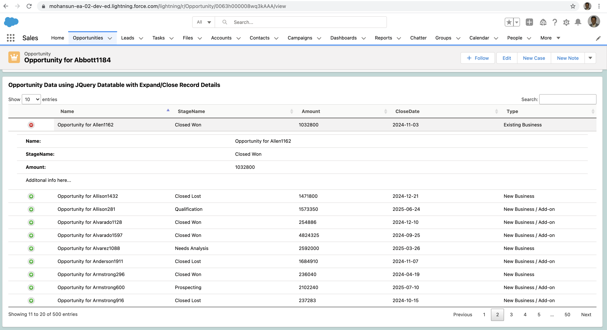
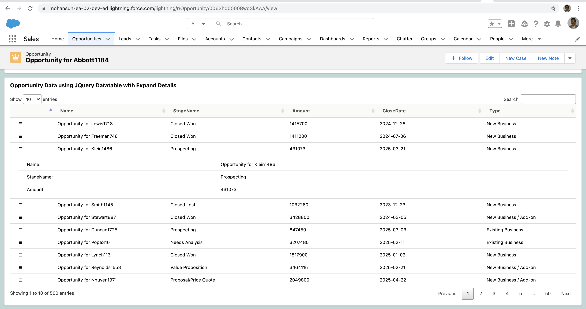
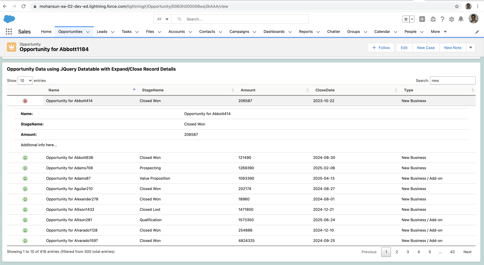

# JQuery Datatable in LWC  with Close/Expand Details

## Demo

## Demo - Screenshots
### Closed state

### Expanded state

### Expanded state

### Search and then expand

## References
- [Jquery datatable example](https://datatables.net/examples/api/row_details.html)
