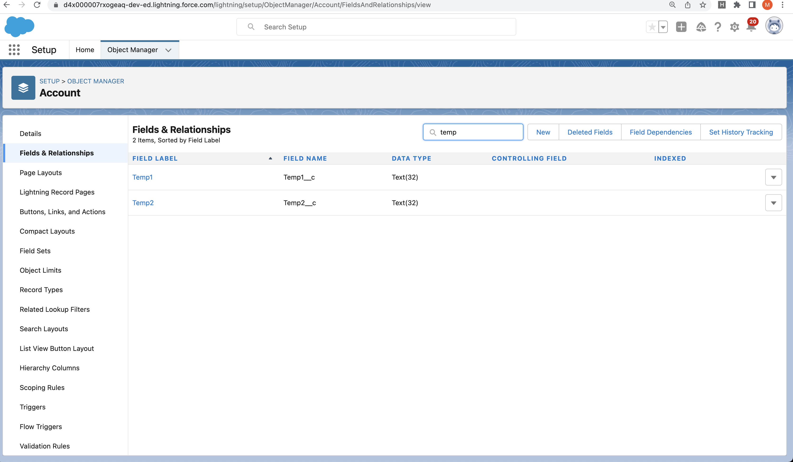

#  How to delete Object or Field using DX

## Plugin version 0.0.204
-  sfdx-mohanc-plugins@0.0.204
- Update it with:
```
sfdx plugins:update
```

## Sample Input JSON file
- Can have multiple delete 
- Example here has 
	-  Deleting Account.Temp1__c and Account.Temp2__c

```
cat  delete.account.fields.json 
```
```json

[
  "Account.Temp1__c",  "Account.Temp2__c"
]

```
## Usage
```
sfdx mohanc:mdapi:del -h
```
```
fdx mohanc:mdapi:del -h
Delete metadata

USAGE
  $ sfdx mohanc:mdapi:del [-i <string>] [-t <string>] [-u <string>] [--apiversion <string>]
    [--json] [--loglevel trace|debug|info|warn|error|fatal|TRACE|DEBUG|INFO|WARN|ERROR|FATAL]

FLAGS
  -i, --input=<value>
      Input JSON file for the metadata type

  -t, --type=<value>
      Metadata type (e.g CustomField or CustomObject)

  -u, --targetusername=<value>
      username or alias for the target org; overrides default target org

  --apiversion=<value>
      override the api version used for api requests made by this command

  --json
      format output as json

  --loglevel=(trace|debug|info|warn|error|fatal|TRACE|DEBUG|INFO|WARN|ERROR|FATAL)
      [default: warn] logging level for this command invocation

DESCRIPTION
  Delete metadata

EXAMPLES
             remove metadata for the given metadata type and delete info 
             sfdx mohanc:mdapi:del  -u <username> -i <inputJSON>  -t <metadataType>
             Example:
             sfdx mohanc:mdapi:del -u mohan.chinnappan.n.sel@gmail.com -i delete.account.fields.json -t CustomField

```

## Demo
```
sfdx mohanc:mdapi:del -u mohan.chinnappan.n.sel@gmail.com -i delete.account.fields.json -t CustomField
```

```
[
  { fullName: 'Account.Temp1__c', success: true },
  { fullName: 'Account.Temp2__c', success: true },
]

```
## Before


## After


<a name='listViewDel'></a>
## Deleting ListViews

```
cat delete.oppty.listview.json 
```

```json

[
  "Opportunity.ClosingNextMonth"

]

```

```
sfdx mohanc:mdapi:del -u mohan.chinnappan.n.sel@gmail.com -i delete.oppty.listview.json -t ListView 
```

```
{ fullName: 'Opportunity.ClosingNextMonth', success: true }

```
## List to confirm the deletion
- [More about listing](../ls/list.md)

```

sfdx mohanc:mdapi:ls -u mohan.chinnappan.n.sel@gmail.com -i  ../ls/list.json -t ListView
[ 'Account.AllAccounts', 'Opportunity.ClosingNextMonth' ]
[
    {
        "fullName": "Account.AllAccounts",
        "filterScope": "Everything",
        "label": "All Accounts"
    },
    {}
]

```
<a name='apexDelete'></a>
## How to delete an Apex Class
```
sfdx force:source:delete -m ApexClass:Greeter -u mohan.chinnappan.n.sel@gmail.com
This operation will delete the following metadata in your org: 
ApexClass:Greeter

Are you sure you want to proceed (y/n)?: y
*** Deleting with SOAP API ***
Deploy ID: 0Af4x00000VobpDCAR

=== Deleted Source

 FULL NAME TYPE      PROJECT PATH 
 ───────── ───────── ──────────── 
 Greeter   ApexClass              
Deploy Succeeded.

```
- For slient delete use
```
sfdx force:source:delete -m ApexClass:Greeter -u mohan.chinnappan.n.sel@gmail.com

``


