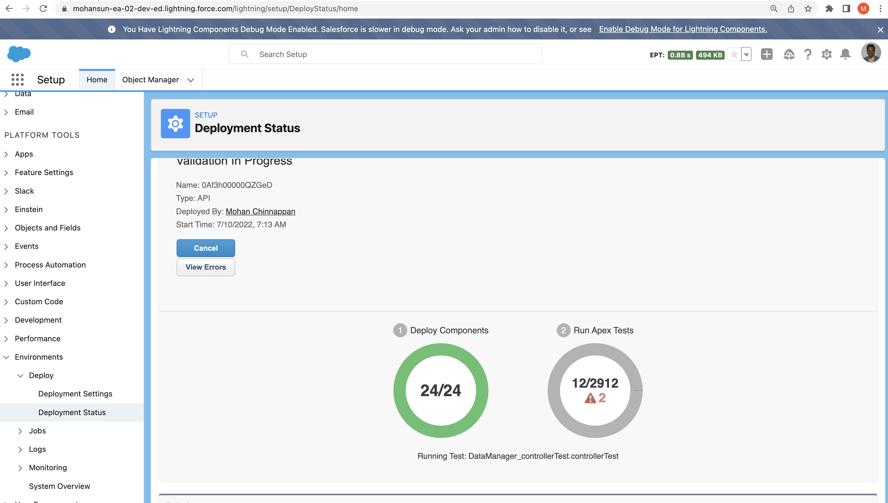

# How to use DX to validate a deployment before final deployment

## Login into the org
```
~/deployment-validate  >sfdx force:auth:web:login
Successfully authorized mohan.chinnappan.n_ea2@gmail.com with org ID 00D3h000007R1LuEAK
```

## Retrieve - usage
```
~/deployment-validate  >sfdx mohanc:mdapi:retrieve -h
Retrieve metadata

USAGE
  $ sfdx mohanc:mdapi:retrieve [-t <string>] [-u <string>] [--apiversion <string>] [--json] [--loglevel 
  trace|debug|info|warn|error|fatal|TRACE|DEBUG|INFO|WARN|ERROR|FATAL]

OPTIONS
  -t, --types=types                                                                 Types to retrieve, comma separated values
  -u, --targetusername=targetusername                                               username or alias for the target org; overrides default target org
  --apiversion=apiversion                                                           override the api version used for api requests made by this command
  --json                                                                            format output as json
  --loglevel=(trace|debug|info|warn|error|fatal|TRACE|DEBUG|INFO|WARN|ERROR|FATAL)  [default: warn] logging level for this command invocation

EXAMPLE

             Retrieve metadata for the given metadata types
             sfdx mohanc:mdapi:retrieve  -u <username> -t <types>
             Example:
             sfdx mohanc:mdapi:retrieve -u mohan.chinnappan.n_ea2@gmail.com -t "CustomSite,ExperienceBundle,Network"

```  

## retrieve FlexiPage
``` 
~/deployment-validate  >sfdx mohanc:mdapi:retrieve -u mohan.chinnappan.n_ea2@gmail.com -t "FlexiPage"
{
    "RetrieveRequest": {
        "apiVersion": "55.0",
        "unpackaged": [
            {
                "types": {
                    "members": "*",
                    "name": "FlexiPage"
                }
            }
        ]
    }
}
{ result: { done: false, id: '09S3h000006Ce1dEAC', state: 'Queued' } }
```

## checkRetrieveStatus  - Usage

```
~/deployment-validate  >sfdx mohanc:mdapi:checkRetrieveStatus -u mohan.chinnappan.n_ea2@gmail.com -i 09S3h000006Ce1dEAC -h 
checkRetrieveStatus  for the given Id

USAGE
  $ sfdx mohanc:mdapi:checkRetrieveStatus [-i <string>] [-u <string>] [--apiversion <string>] [--json] [--loglevel 
  trace|debug|info|warn|error|fatal|TRACE|DEBUG|INFO|WARN|ERROR|FATAL]

OPTIONS
  -i, --id=id                                                                       Id to be checked for RetrieveStatus
  -u, --targetusername=targetusername                                               username or alias for the target org; overrides default target org
  --apiversion=apiversion                                                           override the api version used for api requests made by this command
  --json                                                                            format output as json
  --loglevel=(trace|debug|info|warn|error|fatal|TRACE|DEBUG|INFO|WARN|ERROR|FATAL)  [default: warn] logging level for this command invocation

EXAMPLE

             checkRetrieveStatus for the given id
             sfdx mohanc:mdapi:checkRetrieveStatus  -u <username> -i <id>  


```
      
## checkRetrieveStatus for Id: 09S3h000006Ce1dEAC
``` 
~/deployment-validate  >sfdx mohanc:mdapi:checkRetrieveStatus -u mohan.chinnappan.n_ea2@gmail.com -i 09S3h000006Ce1dEAC    
```

```
[
  {
    createdById: '0053h000002xQ5sAAE',
    createdByName: 'Mohan Chinnappan',
    createdDate: 2021-07-15T10:46:00.000Z,
    fileName: 'unpackaged/flexipages/Lead_Record_Page.flexipage',
    fullName: 'Lead_Record_Page',
    id: '0M03h000003R32VCAS',
    lastModifiedById: '0053h000002xQ5sAAE',
    lastModifiedByName: 'Mohan Chinnappan',
    lastModifiedDate: 2021-07-15T10:46:00.000Z,
    manageableState: 'unmanaged',
    type: 'FlexiPage'
  },
  ...More

]

=== Writing zipFile base64 content to 09S3h000006Ce1dEAC.zip.txt ...
=== Writing zipFile binary content to 09S3h000006Ce1dEAC.zip ... 

```

## Check the zip files created

```
~/deployment-validate  >ls -l
total 104
-rw-r--r--  1 mchinnappan  staff  21090 Jun 16 09:26 09S3h000006Ce1dEAC.zip
-rw-r--r--  1 mchinnappan  staff  28120 Jun 16 09:26 09S3h000006Ce1dEAC.zip.txt
```

## Create a options.json
```
~/deployment-validate  >cat options.json
```

```json
{ "checkOnly": true }
```

### If you like to run Apex Test Coverage check

```
cat options.json 
```
```json
{ "checkOnly": true,
  "runAllTests": true
}
```

## Deploy this Zip file with ```checkOnly```
```
~/deployment-validate  > sfdx mohanc:mdapi:deploy -u mohan.chinnappan.n_ea2@gmail.com -z 09S3h000006Ce1dEAC.zip.txt -o options.json 
{ checkOnly: true }
{
    "zipFile": " CONTENT HERE",
    "DeployOptions": {
        "checkOnly": true
    }
}
```
```
{ result: { done: false, id: '0Af3h00000QXpgFCAT', state: 'Queued' } }
```

## Let us check the deployment status for this id: ```0Af3h00000QXpgFCAT```

```
~/deployment-validate  >sfdx mohanc:mdapi:checkDeployStatus -u mohan.chinnappan.n_ea2@gmail.com -i 0Af3h00000QXpgFCAT 
{
  result: {
    checkOnly: true,
    completedDate: 2022-06-16T13:27:55.000Z,
    createdBy: '0053h000002xQ5s',
    createdByName: 'Mohan Chinnappan',
    createdDate: 2022-06-16T13:27:23.000Z,
    details: null,
    done: true,
    id: '0Af3h00000QXpgFCAT',
    ignoreWarnings: false,
    lastModifiedDate: 2022-06-16T13:27:55.000Z,
    numberComponentErrors: 0,
    numberComponentsDeployed: 24,
    numberComponentsTotal: 24,
    numberTestErrors: 0,
    numberTestsCompleted: 0,
    numberTestsTotal: 0,
    rollbackOnError: false,
    runTestsEnabled: false,
    startDate: 2022-06-16T13:27:26.000Z,
    status: 'Succeeded',
    success: true
  }
}

```

## View Deployment status in the ORG


### With Apex Test Coverage 


## How about a single script to all these steps
- Note this validate against the same org it retrived from
- To validate against a differnent you need to change the user name in the  deploy command

- Here is the bash command (run-all.sh)
- run it like for 4 min wait time:	``` bash run-all.sh 4 ```
```
echo =====running retrieve====
sfdx mohanc:mdapi:retrieve -u mohan.chinnappan.n_ea2@gmail.com -t "FlexiPage" > run2.sh
echo ----going to sleep for $1 min.----
sleep $1m
echo =====running checkRetrieveStatus====
bash run2.sh
echo =====running validation for the SAME org====
bash run-validation.sh

```
