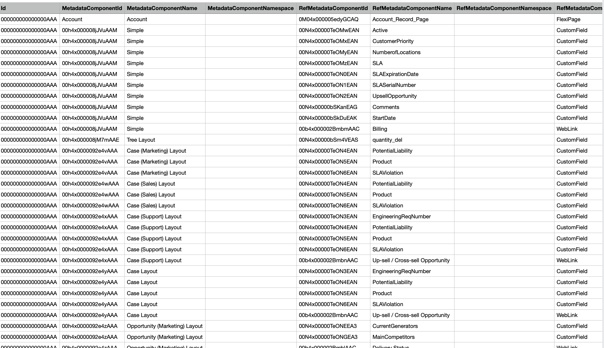

# Finding the metadata dendency

- [How to install the plugin](https://mohan-chinnappan-n.github.io/dx/plugins.html#/1)

## Login to your org
```
sfdx force:auth:web:login -r https://login.salesforce.com
Successfully authorized mohan.chinnappan.n.sel@gmail.com with org ID 00D4x000007rxoGEAQ
```

## Qurey SOQL

```
cat ~/.soql/meta-dep.soql 
```

```sql
SELECT Id, 
MetadataComponentId, MetadataComponentName,MetadataComponentNamespace,
RefMetadataComponentId,RefMetadataComponentName,RefMetadataComponentNamespace,
RefMetadataComponentType
FROM MetadataComponentDependency 
```

## Run tool to get the CSC output file
```
sfdx mohanc:tooling:query -u  mohan.chinnappan.n.sel@gmail.com -q ~/.soql/meta-dep.soql >md.csv
```

## Open it in a spreasheet app (Excel, Google Sheets, OpenOffice, Numbers...)
```
open md.csv
``` 
- 

