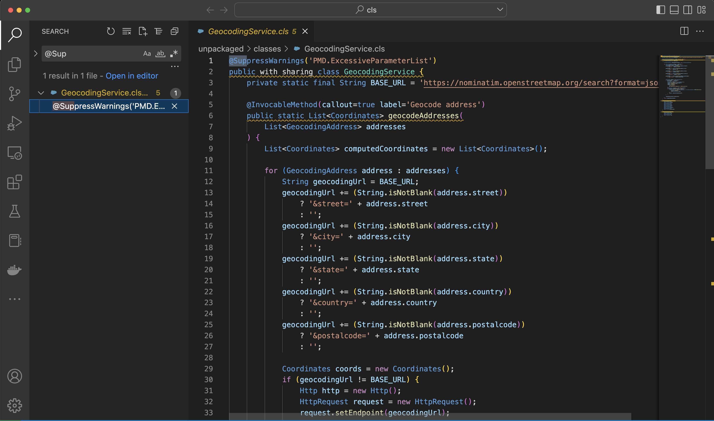
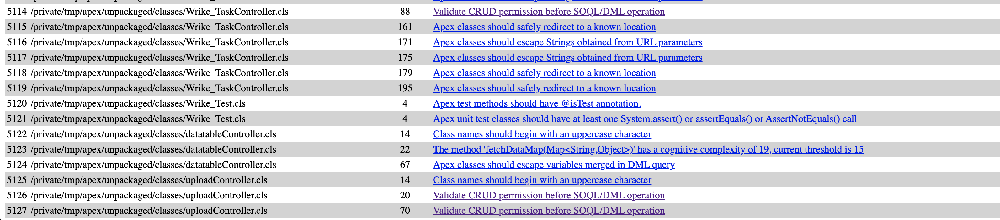
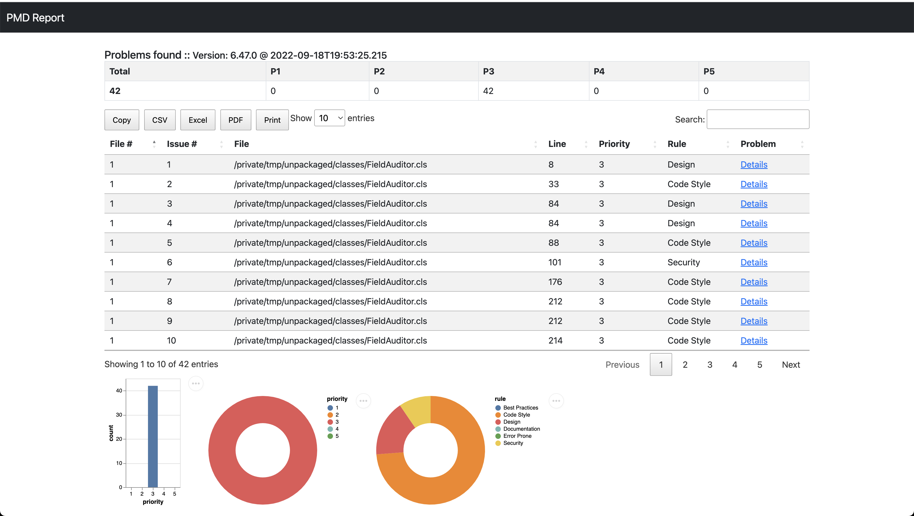

# PMD Apex code scan using DX 


## Topics
- [How to use in CI/CD pipeline](#cicd)
- [Github Actions](#gha)

## Make sure you have java installed
```
java --version
openjdk 11.0.14.1 2022-02-08
OpenJDK Runtime Environment Homebrew (build 11.0.14.1+0)
OpenJDK 64-Bit Server VM Homebrew (build 11.0.14.1+0, mixed mode)

```

## Download and install pmd distribution - pmd-bin-6.47.0 

- from [pmd-bin-6.47.0](dist/pmd-bin-6.47.0.zip)

- unzip the file pmd-bin-6.47.0.zip

```
jar xvf pmd-bin-6.47.0.zip
```


- go to bin folder of the extracted pmd-bin-6.47.0.zip
- do this copy
```
cd pmd-bin-6.47.0/bin
cp run.sh pmd-run.sh 
```

- put this folder: ```pmd-bin-6.47.0/bin``` in your PATH (```~/.zshrc or ~/.bashrc```)
- example in ~/.zshrc
```

# PMD env var holds the location of your PMD install
export PMD="/Users/mchinnappan/node-pmd/pmd-bin-6.47.0"
# let us put the bin folder of the PMD in path
export PATH="$PATH:$PMD/bin"

```
- make it executable ```chmod +x pmd-run.sh```

## Extract Apex Classes from your Org

### Login into the Org
```
sfdx force:auth:web:login
Successfully authorized mohan.chinnappan.n_ea2@gmail.com with org ID 00D3h000007R1LuEAK

```
### Get the Apex Classes using DX
```
sfdx mohanc:mdapi:retrieve -u mohan.chinnappan.n_ea2@gmail.com -t "ApexClass"

cd /tmp/
/tmp  >mkdir apex
/tmp  >cd apex

/tmp/apex  >sfdx mohanc:mdapi:checkRetrieveStatus -u mohan.chinnappan.n_ea2@gmail.com -i "09S3h000006DK3lEAG"
jar xvf  09S3h000006DK3lEAG.zip


```

## Download the apex_ruleset.xml to your ~/.pmd folder 
- create folder ```mkdir ~/.pmd```
- copy the apex_ruleset.xml from:
	- [apex_ruleset.xml](pmd-rules/apex_ruleset.xml)
	- to the folder ~/.pmd

-----------------

<a name='suppress'></a>
## Check for @SuppressWarning annotations in the code 

```bash
grep -irn '@SuppressWarnings' unpackaged/classes 
```
```
unpackaged/classes/GeocodingService.cls:1:@SuppressWarnings('PMD.ExcessiveParameterList')

```

### Using VS Code

------------------
## Run pmd csv output
- your apex class files are at: /tmp/apex/unpackaged/classes/
- csv output
```
pmd-run.sh pmd -R ~/.pmd/apex_ruleset.xml -d /tmp/apex/unpackaged/classes/ -f csv > /tmp/apex/pmd-results.csv


```

<a name="cicd"></a>

## Script for CI/CD Pipeline [cicd-pmd.sh](cicd-pmd.sh)

```bash
# Script for pipeline
# Bails out if count of P1 and P2 are not zero
# -----------------------------------------

# Run the pmd
pmd-run.sh pmd -R ~/.pmd/apex_ruleset.xml -d /tmp/deployment/unpackaged/classes/  -f csv > results.csv

# query the results using SQL
echo 'SELECT COUNT(*) AS CNT   FROM CSV("results.csv", {headers:true}) WHERE Priority < 3' > q.sql
sfdx mohanc:data:query:sql -q q.sql  > out.json

# check for the errors
nerrors=`sfdx mohanc:data:jq -f  '.[].CNT'  -i out.json`
echo "nerrors: $nerrors"

if [ "$nerrors" != 0 ]
then
  echo "Number of P1 and P2 issues are:  $nerrors. Stopping the deployment!"
  exit 2
fi
echo "Continue the deployment..."

```

### Query used [q.sql](q.sql)

### sample run
```
bash cicd-pmd.sh 
Jan 10, 2023 9:42:14 PM net.sourceforge.pmd.PMD encourageToUseIncrementalAnalysis
WARNING: This analysis could be faster, please consider using Incremental Analysis: https://pmd.github.io/pmd-6.47.0/pmd_userdocs_incremental_analysis.html
nerrors: 0
Continue the deployment...
```

<a name='gha'></a>

## PMD workflow bailing out when violations count is not zero

```yaml
 - uses: pmd/pmd-github-action@v1
        id: pmd
        with:
          version: '6.40.0'
          sourcePath: 'mc2Project/force-app/main/default/classes'
          rulesets: 'pmd/rulesets/apex_ruleset.xml'
      
      - name: Fail build if there are violations
        if: steps.pmd.outputs.violations != 0
        run: exit 1
```

### Open the results csv file

```
open /tmp/apex/pmd-results.csv

```
- [Sample CSV Ouput](img/pmd-results_s.csv)

-----------------
## Run pmd html output
- your apex class files are at: /tmp/apex/unpackaged/classes/
- html output
```
pmd-run.sh pmd -R ~/.pmd/apex_ruleset.xml -d /tmp/apex/unpackaged/classes/ -f html > /tmp/apex/pmd-results.html
```

### Open the results html file

```
open /tmp/apex/pmd-results.html

```



-------
## Run pmd enhanced html output

```
pmd-run.sh pmd -R ~/.pmd/apex_ruleset.xml -d ./unpackaged/classes -f xslt -property xsltFilename=html-report-v2.xslt > pmd-report.html

```
- [html-report-v2.xslt](https://raw.githubusercontent.com/mohan-chinnappan-n/pmd/master/pmd-core/etc/xslt/html-report-v2.xslt)


### Screenshot
- 


### Demo


