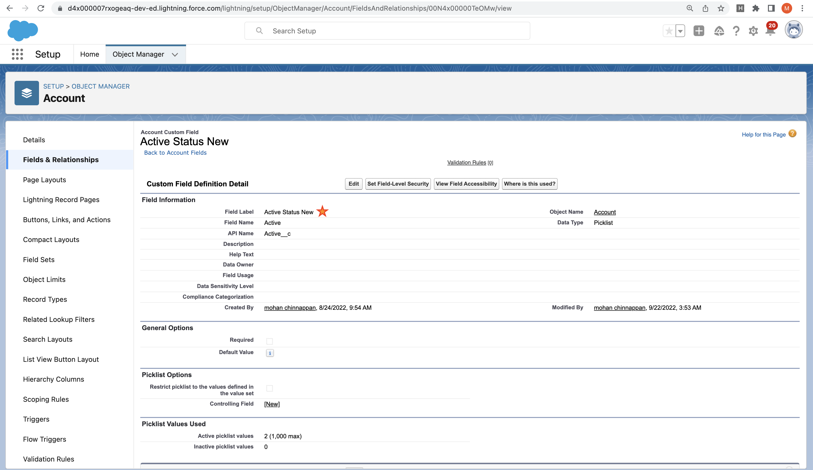

# How to use DX to update a metadata type

```
cat account.fieldLabels.rename.json
```
```json
[
  {
    "fullName": "Account.Status__c",
    "label": "Current Account Status New",
    "type": "Text",
    "length": 32
  },
  {
    "fullName": "Account.Active__c",
    "label": "Active Status New ",
    "type": "Picklist",
    "valueSet": {
      "valueSetDefinition": {
        "value": [
          {
            "fullName": "No",
            "default": "false",
            "label": "No"
          },
          {
            "fullName": "Yes",
            "default": "false",
            "label": "Yes"
          }
        ]
      }
    }
  }
]


```
## Usage
```
sfdx mohanc:mdapi:update -h
```
```
Update exiting metadata objects

USAGE
  $ sfdx mohanc:mdapi:update [-i <string>] [-t <string>] [-u <string>] [--apiversion <string>] [--json] [--loglevel
    trace|debug|info|warn|error|fatal|TRACE|DEBUG|INFO|WARN|ERROR|FATAL]

FLAGS
  -i, --input=<value>                                                               Input JSON file for the metadata type
  -t, --type=<value>                                                                Metadata type (e.g CustomField)
  -u, --targetusername=<value>                                                      username or alias for the target org; overrides
                                                                                    default target org
  --apiversion=<value>                                                              override the api version used for api requests made by
                                                                                    this command
  --json                                                                            format output as json
  --loglevel=(trace|debug|info|warn|error|fatal|TRACE|DEBUG|INFO|WARN|ERROR|FATAL)  [default: warn] logging level for this command
                                                                                    invocation

DESCRIPTION
  Update exiting metadata objects

EXAMPLES
             Update metadata for the given metadata type and change info 
             sfdx mohanc:mdapi:update  -u <username> -i <inputJSON>  -t <metadataType>
             Example:
             sfdx mohanc:mdapi:update -u mohan.chinnappan.n.sel@gmail.com -i account.status.rename.json -t CustomField


```

## Demo
```

sfdx mohanc:mdapi:update -u mohan.chinnappan.n.sel@gmail.com -i account.fieldLabels.rename.json -t CustomField
```

```
[
  { fullName: 'Account.Status__c', success: true },
  { fullName: 'Account.Active__c', success: true }
]

```
## Before


## After



