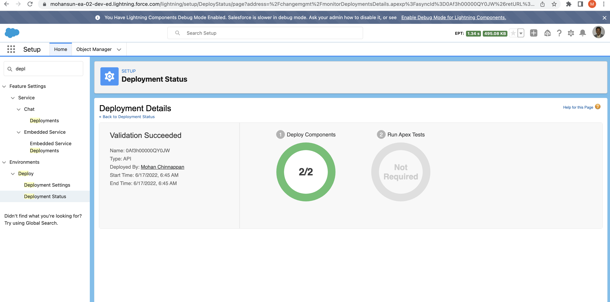

# Using DX to retrieve  Wave resources  and validate deployment  

## Use case
- Retrieve Wave assets from one org
- Deploy validation on another org or on same org

## Wave Assets
- WaveApplication
- WaveDataflow
- WaveDashboard
- WaveDataset
- WaveLens
- WaveRecipe
- WaveTemplateBundle
- WaveXmd

## Login into the org
```
sfdx force:auth:web:login
Successfully authorized mohan.chinnappan.n_ea2@gmail.com with org ID 00D3h000007R1LuEAK
```


## retrieve resource WaveApplication
```
sfdx mohanc:mdapi:retrieve -u mohan.chinnappan.n_ea2@gmail.com -t "WaveApplication"                                          
{
    "RetrieveRequest": {
        "apiVersion": "55.0",
        "unpackaged": [
            {
                "types": {
                    "members": "*",
                    "name": "WaveApplication"
                }
            }
        ]
    }
}
{ result: { done: false, id: '09S3h000006CffeEAC', state: 'Queued' } }
```

## checkRetrieveStatus

```
sfdx mohanc:mdapi:checkRetrieveStatus -u mohan.chinnappan.n_ea2@gmail.com -i 09S3h000006CffeEAC
[
  {
    createdById: '0053h000002xQ5sAAE',
    createdByName: 'Mohan Chinnappan',
    createdDate: 2022-03-11T22:59:28.000Z,
    fileName: 'unpackaged/wave/Cars.wapp',
    fullName: 'Cars',
    id: '02I3h000000HxlyEAC',
    lastModifiedById: '0053h000002xQ5sAAE',
    lastModifiedByName: 'Mohan Chinnappan',
    lastModifiedDate: 2022-03-11T22:59:28.000Z,
    manageableState: 'unmanaged',
    type: 'WaveApplication'
  },
  {
    createdById: '0053h000002xQ5sAAE',
    createdByName: 'Mohan Chinnappan',
    createdDate: 2020-07-13T19:30:57.000Z,
    fileName: 'unpackaged/wave/My_DTC_Sales.wapp',
    fullName: 'My_DTC_Sales',
    id: '02I3h000000QwPvEAK',
    lastModifiedById: '0053h000002xQ5sAAE',
    lastModifiedByName: 'Mohan Chinnappan',
    lastModifiedDate: 2020-07-13T19:30:57.000Z,
    manageableState: 'unmanaged',
    type: 'WaveApplication'
  },
  {
    createdById: '0053h000003de6bAAA',
    createdByName: 'Integration User',
    createdDate: 2020-07-13T19:30:57.000Z,
    fileName: 'unpackaged/wave/SharedApp.wapp',
    fullName: 'SharedApp',
    id: '02I3h000000QwPtEAK',
    lastModifiedById: '0053h000003de6bAAA',
    lastModifiedByName: 'Integration User',
    lastModifiedDate: 2020-07-13T19:30:57.000Z,
    manageableState: 'unmanaged',
    type: 'WaveApplication'
  },
  {
    createdById: '0053h000002xQ5sAAE',
    createdByName: 'Mohan Chinnappan',
    createdDate: 2020-07-13T19:30:57.000Z,
    fileName: 'unpackaged/wave/The_Motivator.wapp',
    fullName: 'The_Motivator',
    id: '02I3h000000QwPsEAK',
    lastModifiedById: '0053h000002xQ5sAAE',
    lastModifiedByName: 'Mohan Chinnappan',
    lastModifiedDate: 2020-07-13T19:30:57.000Z,
    manageableState: 'unmanaged',
    type: 'WaveApplication'
  },
  {
    createdById: '0053h000002xQ5sAAE',
    createdByName: 'Mohan Chinnappan',
    createdDate: 2020-07-13T19:30:57.000Z,
    fileName: 'unpackaged/wave/ABC_Seed.wapp',
    fullName: 'ABC_Seed',
    id: '02I3h000000QwPrEAK',
    lastModifiedById: '0053h000002xQ5sAAE',
    lastModifiedByName: 'Mohan Chinnappan',
    lastModifiedDate: 2020-07-13T19:30:57.000Z,
    manageableState: 'unmanaged',
    type: 'WaveApplication'
  },
  {
    createdById: '0053h000002xQ5sAAE',
    createdByName: 'Mohan Chinnappan',
    createdDate: 2022-06-17T12:43:35.370Z,
    fileName: 'unpackaged/package.xml',
    fullName: 'unpackaged/package.xml',
    id: '',
    lastModifiedById: '0053h000002xQ5sAAE',
    lastModifiedByName: 'Mohan Chinnappan',
    lastModifiedDate: 2022-06-17T12:43:35.370Z,
    manageableState: 'unmanaged',
    type: 'Package'
  }
]
=== Writing zipFile base64 content to 09S3h000006CffeEAC.zip.txt ...
=== Writing zipFile binary content to 09S3h000006CffeEAC.zip ... 
```

### View the zip file
```
jar tvf  09S3h000006CffeEAC.zip
   359 Fri Jun 17 12:43:34 EDT 2022 unpackaged/wave/Cars.wapp
   451 Fri Jun 17 12:43:34 EDT 2022 unpackaged/wave/My_DTC_Sales.wapp
   535 Fri Jun 17 12:43:34 EDT 2022 unpackaged/wave/SharedApp.wapp
   377 Fri Jun 17 12:43:34 EDT 2022 unpackaged/wave/The_Motivator.wapp
   367 Fri Jun 17 12:43:34 EDT 2022 unpackaged/wave/ABC_Seed.wapp
   227 Fri Jun 17 12:43:34 EDT 2022 unpackaged/package.xml
```

## retrieve WaveLens 
```
sfdx mohanc:mdapi:retrieve -u mohan.chinnappan.n_ea2@gmail.com -t "WaveLens"                   
{
    "RetrieveRequest": {
        "apiVersion": "55.0",
        "unpackaged": [
            {
                "types": {
                    "members": "*",
                    "name": "WaveLens"
                }
            }
        ]
    }
}

{ result: { done: false, id: '09S3h000006CffjEAC', state: 'Queued' } }
```

```
sfdx mohanc:mdapi:checkRetrieveStatus -u mohan.chinnappan.n_ea2@gmail.com -i 09S3h000006CffjEAC
[
  {
    createdById: '0053h000002xQ5sAAE',
    createdByName: 'Mohan Chinnappan',
    createdDate: 2022-04-08T03:28:30.000Z,
    fileName: 'unpackaged/wave/Benchmark.wlens',
    fullName: 'Benchmark',
    id: '0FK3h000000d8o3GAA',
    lastModifiedById: '0053h000002xQ5sAAE',
    lastModifiedByName: 'Mohan Chinnappan',
    lastModifiedDate: 2022-04-08T04:15:39.000Z,
    manageableState: 'unmanaged',
    type: 'WaveLens'
  },
  {
    createdById: '0053h000002xQ5sAAE',
    createdByName: 'Mohan Chinnappan',
    createdDate: 2022-05-28T23:25:02.000Z,
    fileName: 'unpackaged/wave/myFriutsYield.wlens',
    fullName: 'myFriutsYield',
    id: '0FK3h000000d8t8GAA',
    lastModifiedById: '0053h000002xQ5sAAE',
    lastModifiedByName: 'Mohan Chinnappan',
    lastModifiedDate: 2022-05-28T23:25:02.000Z,
    manageableState: 'unmanaged',
    type: 'WaveLens'
  },
  {
    createdById: '0053h000002xQ5sAAE',
    createdByName: 'Mohan Chinnappan',
    createdDate: 2022-06-17T12:50:51.257Z,
    fileName: 'unpackaged/package.xml',
    fullName: 'unpackaged/package.xml',
    id: '',
    lastModifiedById: '0053h000002xQ5sAAE',
    lastModifiedByName: 'Mohan Chinnappan',
    lastModifiedDate: 2022-06-17T12:50:51.257Z,
    manageableState: 'unmanaged',
    type: 'Package'
  }
]
=== Writing zipFile base64 content to 09S3h000006CffjEAC.zip.txt ...
=== Writing zipFile binary content to 09S3h000006CffjEAC.zip ... 
```

## Check the content of the zip file
```
jar tvf 09S3h000006CffjEAC.zip
  2604 Fri Jun 17 12:50:50 EDT 2022 unpackaged/wave/Benchmark.wlens
   408 Fri Jun 17 12:50:50 EDT 2022 unpackaged/wave/Benchmark.wlens-meta.xml
  1001 Fri Jun 17 12:50:50 EDT 2022 unpackaged/wave/myFriutsYield.wlens
   372 Fri Jun 17 12:50:50 EDT 2022 unpackaged/wave/myFriutsYield.wlens-meta.xml
   220 Fri Jun 17 12:50:50 EDT 2022 unpackaged/package.xml

```

## Create options.json file
```
cat options.json
{ "checkOnly": true }

```

- Note: You can login into another ORG and do the deploy validation in that org
  - Here, we use same org for this purpose


## Validate the deployment for this ```09S3h000006CffjEAC.zip.txt```
```
sfdx mohanc:mdapi:deploy -u mohan.chinnappan.n_ea2@gmail.com -z 09S3h000006CffjEAC.zip.txt -o options.json 
 ›   Warning: sfdx-cli update available from 7.153.1 to 7.155.1.
{ checkOnly: true }
{
    "zipFile": "CONTENT HERE",
    "DeployOptions": {
        "checkOnly": true
    }
}
{ result: { done: false, id: '0Af3h00000QY0JWCA1', state: 'Queued' } }
```

## Check in the org


