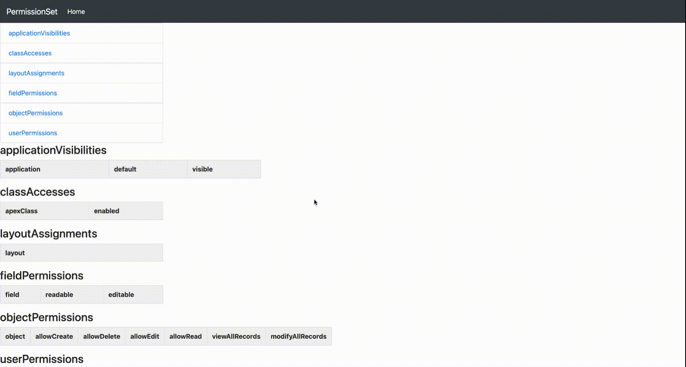
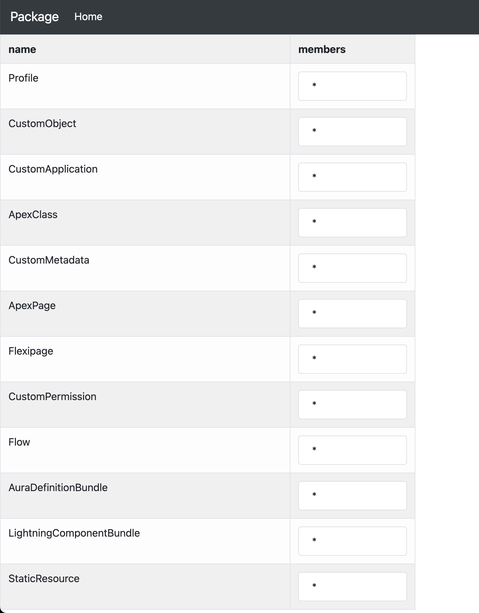
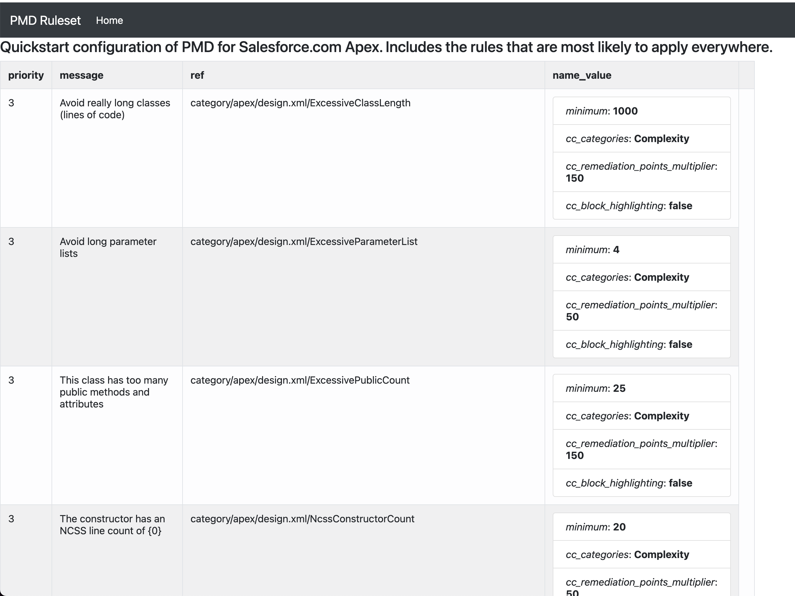

# How to prepare HTML version of package, profile and permset using DX

- Make sure you have the latest version of the plugin - [Refer](https://mohan-chinnappan-n.github.io/dx/plugins.html#/1)

## Topics
- [Profile](#profile)
- [Permset](#permset)
- [Package](#package)
- [PMD Ruleset](#pmd)


<a name='profile'></a>

## Profile
```
sfdx mohanc:xml:transform -i ~/treeprj/force-app/main/default/profiles/Admin.profile-meta.xml  -m profile 
=== Writing the output into file : /Users/mchinnappan/treeprj/force-app/main/default/profiles/Admin.profile-meta.xml.html ===
```
 - 

<a name='permset'></a>
## Permset
```
sfdx mohanc:xml:transform -i ~/treeprj/force-app/main/default/permissionsets/sf_devops_InitializeEnvironments.permissionset-meta.xml  -m permset    
=== Writing the output into file : /Users/mchinnappan/treeprj/force-app/main/default/permissionsets/sf_devops_InitializeEnvironments.permissionset-meta.xml.html ===
```
- 

<a name='package'></a>
## package.xml
```
~/xslts [main] >sfdx mohanc:xml:transform -i package.xml  -m package 
=== Writing the output into file : package.xml.html ===

```
- 

## Using weburl for input xml file

```
sfdx mohanc:xml:transform  -i https://raw.githubusercontent.com/mohan-chinnappan-n/org-compare/main/se2/unpackaged/unpackaged/permissionsets/Experience_Profile_Manager.permissionset -m permset
=== Writing the output into file : output.html ===
```


<a name='pmd'></a>
## PMD Ruleset 
```
sfdx mohanc:xml:transform -i https://raw.githubusercontent.com/mohan-chinnappan-n/cli-dx/master/mdapi/pmd-rules/apex_ruleset.xml -m pmd-ruleset
=== Writing the output into file : output.html ===
```

```
sfdx mohanc:xml:transform -i https://raw.githubusercontent.com/mohan-chinnappan-n/cli-dx/master/mdapi/pmd-rules/apex_ruleset-old.xml -m pmd-ruleset
=== Writing the output into file : output.html ===

```
- 
