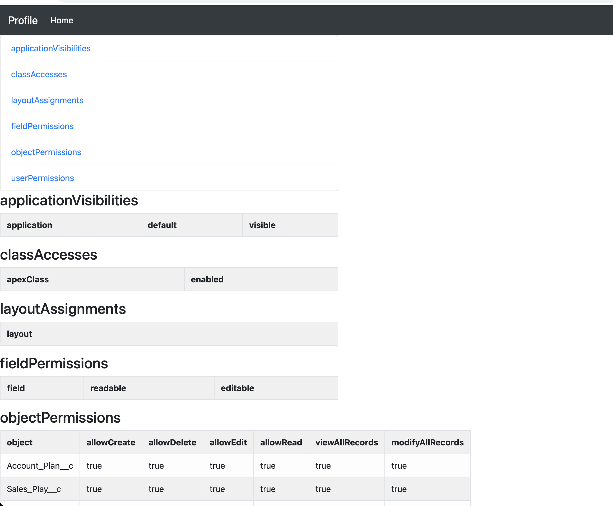

# How to prepare HTML version of package, profile and permset using DX

- Make sure you have the latest version of the plugin - [Refer](https://mohan-chinnappan-n.github.io/dx/plugins.html#/1)

## Profile
```
sfdx mohanc:xml:transform -i ~/treeprj/force-app/main/default/profiles/Admin.profile-meta.xml  -m profile 
=== Writing the output into file : /Users/mchinnappan/treeprj/force-app/main/default/profiles/Admin.profile-meta.xml.html ===
```
 - 

## Permset
```
sfdx mohanc:xml:transform -i ~/treeprj/force-app/main/default/permissionsets/sf_devops_InitializeEnvironments.permissionset-meta.xml  -m permset    
=== Writing the output into file : /Users/mchinnappan/treeprj/force-app/main/default/permissionsets/sf_devops_InitializeEnvironments.permissionset-meta.xml.html ===
```

## package.xml
```
~/xslts [main] >sfdx mohanc:xml:transform -i package.xml  -m package 
=== Writing the output into file : package.xml.html ===

```