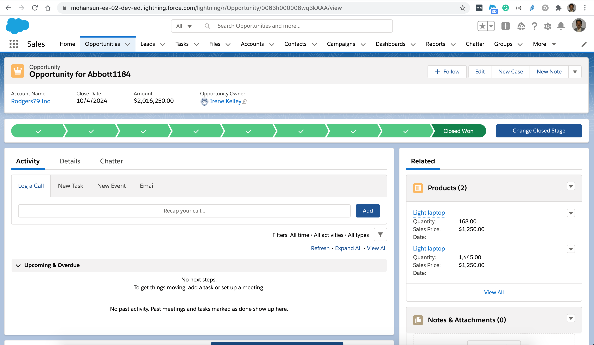

# Getting FlexiPage info using CLI

## Topics
- [List FlexiPages](#listFlexiPages)
- [Retrieve  FlexiPages](#retrieveFlexiPages)
- [View a  FlexiPage](#viewFP)


<a name='listFlexiPages'></a>

##  List FlexiPages

```
$ sfdx mohanc:mdapi:list -u mohan.chinnappan.n_ea2@gmail.com -t FlexiPage
```

```
{
  result: [
    {
      createdById: '0053h000002xQ5sAAE',
      createdByName: 'Mohan Chinnappan',
      createdDate: 2020-07-13T19:30:57.000Z,
      fileName: 'flexipages/LightningService_UtilityBar.flexipage',
      fullName: 'LightningService_UtilityBar',
      id: '0M03h000003eh6iCAA',
      lastModifiedById: '0053h000002xQ5sAAE',
      lastModifiedByName: 'Mohan Chinnappan',
      lastModifiedDate: 2020-07-13T19:30:57.000Z,
      manageableState: 'unmanaged',
      type: 'FlexiPage'
    },
    {
      createdById: '0053h000002xQ5sAAE',
      createdByName: 'Mohan Chinnappan',
      createdDate: 2020-07-13T19:43:44.000Z,
      fileName: 'flexipages/Opportunity_Record_Page.flexipage',
      fullName: 'Opportunity_Record_Page',
      id: '0M03h000003ehKCCAY',
      lastModifiedById: '0053h000002xQ5sAAE',
      lastModifiedByName: 'Mohan Chinnappan',
      lastModifiedDate: 2020-07-13T19:43:44.000Z,
      manageableState: 'unmanaged',
      type: 'FlexiPage'
    },
    {
      createdById: '0053h000002xQ5sAAE',
      createdByName: 'Mohan Chinnappan',
      createdDate: 2020-07-13T22:01:20.000Z,
      fileName: 'flexipages/Account_Record_Page.flexipage',
      fullName: 'Account_Record_Page',
      id: '0M03h000003ek3eCAA',
      lastModifiedById: '0053h000002xQ5sAAE',
      lastModifiedByName: 'Mohan Chinnappan',
      lastModifiedDate: 2021-02-10T21:42:43.000Z,
      manageableState: 'unmanaged',
      type: 'FlexiPage'
    },
    {
      createdById: '0053h000002xQ5sAAE',
      createdByName: 'Mohan Chinnappan',
      createdDate: 2020-07-13T19:30:57.000Z,
      fileName: 'flexipages/LightningSalesConsole_UtilityBar.flexipage',
      fullName: 'LightningSalesConsole_UtilityBar',
      id: '0M03h000003eh6jCAA',
      lastModifiedById: '0053h000002xQ5sAAE',
      lastModifiedByName: 'Mohan Chinnappan',
      lastModifiedDate: 2020-07-13T19:30:57.000Z,
      manageableState: 'unmanaged',
      type: 'FlexiPage'
    },
    {
      createdById: '0053h000002xQ5sAAE',
      createdByName: 'Mohan Chinnappan',
      createdDate: 2020-07-13T19:44:32.000Z,
      fileName: 'flexipages/Opportunity_Record_Page1.flexipage',
      fullName: 'Opportunity_Record_Page1',
      id: '0M03h000003ehOMCAY',
      lastModifiedById: '0053h000002xQ5sAAE',
      lastModifiedByName: 'Mohan Chinnappan',
      lastModifiedDate: 2020-09-24T11:29:01.000Z,
      manageableState: 'unmanaged',
      type: 'FlexiPage'
    },
    {
      createdById: '0053h000002xQ5sAAE',
      createdByName: 'Mohan Chinnappan',
      createdDate: 2020-12-06T13:25:05.000Z,
      fileName: 'flexipages/Ideas2_UtilityBar.flexipage',
      fullName: 'Ideas2_UtilityBar',
      id: '0M03h000003JEE5CAO',
      lastModifiedById: '0053h000002xQ5sAAE',
      lastModifiedByName: 'Mohan Chinnappan',
      lastModifiedDate: 2020-12-06T13:25:05.000Z,
      manageableState: 'unmanaged',
      type: 'FlexiPage'
    }
  ]
}
```

<a name='retrieveFlexiPages'></a>

## Retrieve all FlexiPages

```
$ sfdx mohanc:mdapi:retrieve -u mohan.chinnappan.n_ea2@gmail.com -t "FlexiPage"
```

```
{
    "RetrieveRequest": {
        "apiVersion": "51.0",
        "unpackaged": [
            {
                "types": {
                    "members": "*",
                    "name": "FlexiPage"
                }
            }
        ]
    }
}
{ result: { done: false, id: '09S3h000005gexeEAA', state: 'Queued' } }

```

```
$ sfdx mohanc:mdapi:checkRetrieveStatus  -u mohan.chinnappan.n_ea2@gmail.com -i 09S3h000005gexeEAA

```
```
[
  {
    createdById: '0053h000002xQ5sAAE',
    createdByName: 'Mohan Chinnappan',
    createdDate: 2020-07-13T19:44:32.000Z,
    fileName: 'unpackaged/flexipages/Opportunity_Record_Page1.flexipage',
    fullName: 'Opportunity_Record_Page1',
    id: '0M03h000003ehOMCAY',
    lastModifiedById: '0053h000002xQ5sAAE',
    lastModifiedByName: 'Mohan Chinnappan',
    lastModifiedDate: 2020-09-24T11:29:01.000Z,
    manageableState: 'unmanaged',
    type: 'FlexiPage'
  },
  {
    createdById: '0053h000002xQ5sAAE',
    createdByName: 'Mohan Chinnappan',
    createdDate: 2020-07-13T22:01:20.000Z,
    fileName: 'unpackaged/flexipages/Account_Record_Page.flexipage',
    fullName: 'Account_Record_Page',
    id: '0M03h000003ek3eCAA',
    lastModifiedById: '0053h000002xQ5sAAE',
    lastModifiedByName: 'Mohan Chinnappan',
    lastModifiedDate: 2021-02-10T21:42:43.000Z,
    manageableState: 'unmanaged',
    type: 'FlexiPage'
  },
  {
    createdById: '0053h000002xQ5sAAE',
    createdByName: 'Mohan Chinnappan',
    createdDate: 2020-12-06T13:25:05.000Z,
    fileName: 'unpackaged/flexipages/Ideas2_UtilityBar.flexipage',
    fullName: 'Ideas2_UtilityBar',
    id: '0M03h000003JEE5CAO',
    lastModifiedById: '0053h000002xQ5sAAE',
    lastModifiedByName: 'Mohan Chinnappan',
    lastModifiedDate: 2020-12-06T13:25:05.000Z,
    manageableState: 'unmanaged',
    type: 'FlexiPage'
  },
  {
    createdById: '0053h000002xQ5sAAE',
    createdByName: 'Mohan Chinnappan',
    createdDate: 2020-07-13T19:30:57.000Z,
    fileName: 'unpackaged/flexipages/LightningSalesConsole_UtilityBar.flexipage',
    fullName: 'LightningSalesConsole_UtilityBar',
    id: '0M03h000003eh6jCAA',
    lastModifiedById: '0053h000002xQ5sAAE',
    lastModifiedByName: 'Mohan Chinnappan',
    lastModifiedDate: 2020-07-13T19:30:57.000Z,
    manageableState: 'unmanaged',
    type: 'FlexiPage'
  },
  {
    createdById: '0053h000002xQ5sAAE',
    createdByName: 'Mohan Chinnappan',
    createdDate: 2020-07-13T19:30:57.000Z,
    fileName: 'unpackaged/flexipages/LightningService_UtilityBar.flexipage',
    fullName: 'LightningService_UtilityBar',
    id: '0M03h000003eh6iCAA',
    lastModifiedById: '0053h000002xQ5sAAE',
    lastModifiedByName: 'Mohan Chinnappan',
    lastModifiedDate: 2020-07-13T19:30:57.000Z,
    manageableState: 'unmanaged',
    type: 'FlexiPage'
  },
  {
    createdById: '0053h000002xQ5sAAE',
    createdByName: 'Mohan Chinnappan',
    createdDate: 2020-07-13T19:43:44.000Z,
    fileName: 'unpackaged/flexipages/Opportunity_Record_Page.flexipage',
    fullName: 'Opportunity_Record_Page',
    id: '0M03h000003ehKCCAY',
    lastModifiedById: '0053h000002xQ5sAAE',
    lastModifiedByName: 'Mohan Chinnappan',
    lastModifiedDate: 2020-07-13T19:43:44.000Z,
    manageableState: 'unmanaged',
    type: 'FlexiPage'
  },
  {
    createdById: '0053h000002xQ5sAAE',
    createdByName: 'Mohan Chinnappan',
    createdDate: 2021-03-11T14:26:57.645Z,
    fileName: 'unpackaged/package.xml',
    fullName: 'unpackaged/package.xml',
    id: '',
    lastModifiedById: '0053h000002xQ5sAAE',
    lastModifiedByName: 'Mohan Chinnappan',
    lastModifiedDate: 2021-03-11T14:26:57.645Z,
    manageableState: 'unmanaged',
    type: 'Package'
  }
]
```
```
=== Writing zipFile base64 content to 09S3h000005gexeEAA.zip.txt ...
=== Writing zipFile binary content to 09S3h000005gexeEAA.zip ... 

```

### Unzip the 09S3h000005gexeEAA.zip
```
$ unzip 09S3h000005gexeEAA.zip
Archive:  09S3h000005gexeEAA.zip
  inflating: unpackaged/flexipages/Opportunity_Record_Page1.flexipage  
  inflating: unpackaged/flexipages/Account_Record_Page.flexipage  
  inflating: unpackaged/flexipages/Ideas2_UtilityBar.flexipage  
  inflating: unpackaged/flexipages/LightningSalesConsole_UtilityBar.flexipage  
  inflating: unpackaged/flexipages/LightningService_UtilityBar.flexipage  
  inflating: unpackaged/flexipages/Opportunity_Record_Page.flexipage  
  inflating: unpackaged/package.xml 

```


<a name="viewFP"></a>
## Viewing FlexiPage content
- flexipages/Opportunity_Record_Page.flexipage

```
$ cat unpackaged/flexipages/Opportunity_Record_Page.flexipage
```

```xml 
<?xml version="1.0" encoding="UTF-8"?>
<FlexiPage xmlns="http://soap.sforce.com/2006/04/metadata">
    <flexiPageRegions>
        <itemInstances>
            <componentInstance>
                <componentInstanceProperties>
                    <name>collapsed</name>
                    <value>false</value>
                </componentInstanceProperties>
                <componentInstanceProperties>
                    <name>hideChatterActions</name>
                    <value>false</value>
                </componentInstanceProperties>
                <componentInstanceProperties>
                    <name>numVisibleActions</name>
                    <value>3</value>
                </componentInstanceProperties>
                <componentName>force:highlightsPanel</componentName>
            </componentInstance>
        </itemInstances>
        <mode>Replace</mode>
        <name>header</name>
        <type>Region</type>
    </flexiPageRegions>
    <flexiPageRegions>
        <itemInstances>
            <componentInstance>
                <componentInstanceProperties>
                    <name>hideUpdateButton</name>
                    <value>false</value>
                </componentInstanceProperties>
                <componentInstanceProperties>
                    <name>variant</name>
                    <value>linear</value>
                </componentInstanceProperties>
                <componentName>runtime_sales_pathassistant:pathAssistant</componentName>
            </componentInstance>
        </itemInstances>
        <mode>Replace</mode>
        <name>subheader</name>
        <type>Region</type>
    </flexiPageRegions>
    <flexiPageRegions>
        <itemInstances>
            <componentInstance>
                <componentName>runtime_sales_activities:activityPanel</componentName>
            </componentInstance>
        </itemInstances>
        <mode>Replace</mode>
        <name>activityTabContent</name>
        <type>Facet</type>
    </flexiPageRegions>
    <flexiPageRegions>
        <itemInstances>
            <componentInstance>
                <componentName>force:detailPanel</componentName>
            </componentInstance>
        </itemInstances>
        <mode>Replace</mode>
        <name>detailTabContent</name>
        <type>Facet</type>
    </flexiPageRegions>
    <flexiPageRegions>
        <itemInstances>
            <componentInstance>
                <componentName>forceChatter:recordFeedContainer</componentName>
            </componentInstance>
        </itemInstances>
        <mode>Replace</mode>
        <name>feedTabContent</name>
        <type>Facet</type>
    </flexiPageRegions>
    <flexiPageRegions>
        <itemInstances>
            <componentInstance>
                <componentInstanceProperties>
                    <name>active</name>
                    <value>true</value>
                </componentInstanceProperties>
                <componentInstanceProperties>
                    <name>body</name>
                    <value>activityTabContent</value>
                </componentInstanceProperties>
                <componentInstanceProperties>
                    <name>title</name>
                    <value>Standard.Tab.activity</value>
                </componentInstanceProperties>
                <componentName>flexipage:tab</componentName>
            </componentInstance>
        </itemInstances>
        <itemInstances>
            <componentInstance>
                <componentInstanceProperties>
                    <name>body</name>
                    <value>detailTabContent</value>
                </componentInstanceProperties>
                <componentInstanceProperties>
                    <name>title</name>
                    <value>Standard.Tab.detail</value>
                </componentInstanceProperties>
                <componentName>flexipage:tab</componentName>
            </componentInstance>
        </itemInstances>
        <itemInstances>
            <componentInstance>
                <componentInstanceProperties>
                    <name>body</name>
                    <value>feedTabContent</value>
                </componentInstanceProperties>
                <componentInstanceProperties>
                    <name>title</name>
                    <value>Standard.Tab.collaborate</value>
                </componentInstanceProperties>
                <componentName>flexipage:tab</componentName>
            </componentInstance>
        </itemInstances>
        <mode>Replace</mode>
        <name>tabs</name>
        <type>Facet</type>
    </flexiPageRegions>
    <flexiPageRegions>
        <itemInstances>
            <componentInstance>
                <componentInstanceProperties>
                    <name>tabs</name>
                    <value>tabs</value>
                </componentInstanceProperties>
                <componentName>flexipage:tabset</componentName>
            </componentInstance>
        </itemInstances>
        <itemInstances>
            <componentInstance>
                <componentName>FilterTest</componentName>
            </componentInstance>
        </itemInstances>
        <mode>Replace</mode>
        <name>main</name>
        <type>Region</type>
    </flexiPageRegions>
    <flexiPageRegions>
        <itemInstances>
            <componentInstance>
                <componentName>cooper:companyInsightTeaserCard</componentName>
            </componentInstance>
        </itemInstances>
        <itemInstances>
            <componentInstance>
                <componentInstanceProperties>
                    <name>relatedListComponentOverride</name>
                    <value>NONE</value>
                </componentInstanceProperties>
                <componentInstanceProperties>
                    <name>rowsToDisplay</name>
                    <value>10</value>
                </componentInstanceProperties>
                <componentInstanceProperties>
                    <name>showActionBar</name>
                    <value>true</value>
                </componentInstanceProperties>
                <componentName>force:relatedListContainer</componentName>
            </componentInstance>
        </itemInstances>
        <mode>Replace</mode>
        <name>relatedListTabContent</name>
        <type>Facet</type>
    </flexiPageRegions>
    <flexiPageRegions>
        <itemInstances>
            <componentInstance>
                <componentInstanceProperties>
                    <name>active</name>
                    <value>true</value>
                </componentInstanceProperties>
                <componentInstanceProperties>
                    <name>body</name>
                    <value>relatedListTabContent</value>
                </componentInstanceProperties>
                <componentInstanceProperties>
                    <name>title</name>
                    <value>Standard.Tab.relatedLists</value>
                </componentInstanceProperties>
                <componentName>flexipage:tab</componentName>
            </componentInstance>
        </itemInstances>
        <mode>Replace</mode>
        <name>sidebartabs</name>
        <type>Facet</type>
    </flexiPageRegions>
    <flexiPageRegions>
        <itemInstances>
            <componentInstance>
                <componentInstanceProperties>
                    <name>tabs</name>
                    <value>sidebartabs</value>
                </componentInstanceProperties>
                <componentName>flexipage:tabset</componentName>
            </componentInstance>
        </itemInstances>
        <mode>Replace</mode>
        <name>sidebar</name>
        <type>Region</type>
    </flexiPageRegions>
    <masterLabel>Opportunity Record Page</masterLabel>
    <parentFlexiPage>sfa__Opportunity_rec_L</parentFlexiPage>
    <sobjectType>Opportunity</sobjectType>
    <template>
        <name>flexipage:recordHomeWithSubheaderTemplateDesktop</name>
    </template>
    <type>RecordPage</type>
</FlexiPage>
```
