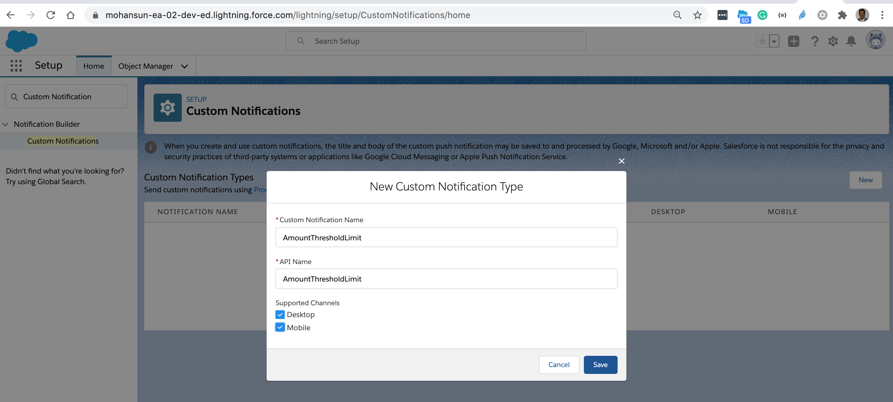
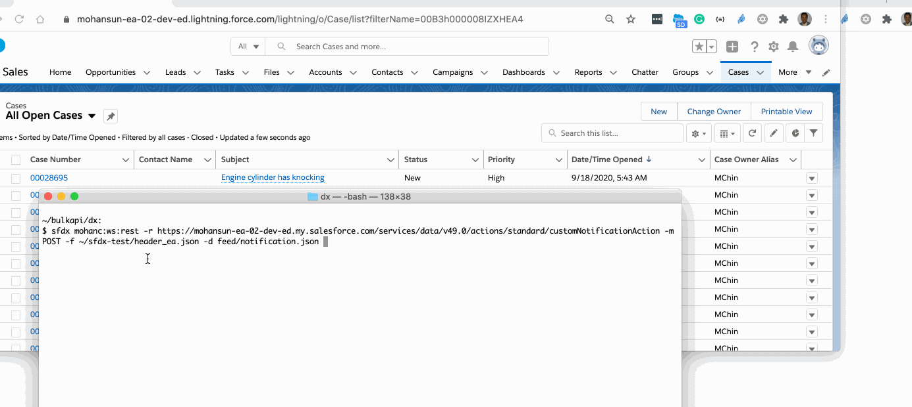

# Notification notes
- Question: How I can send a notification to a Salesforce User - using bell icon?

## Create a custom notification type


- Get the id of that custom notification type
```
$ sfdx mohanc:data:query -q soql/cnt.soql -u mohan.chinnappan.n_ea2@gmail.com -f json
[
    {
        "attributes": {
            "type": "CustomNotificationType",
            "url": "/services/data/v49.0/sobjects/CustomNotificationType/0ML3h0000004DhgGAE"
        },
        "Id": "0ML3h0000004DhgGAE",
        "CustomNotifTypeName": "AmountThresholdLimit"
    }
]
```

```
$ cat soql/cnt.soql 
```
```sql
SELECT id,customNotifTypeName 
FROM CustomNotificationType

```

## Form the request payload

```
$ cat feed/notification.json 
```
- Note: 
    - **recipientIds**: Array of Users Record-Ids, to send the message to
    - **targetId**: Case Record-id
```json
{ "inputs" :
  [
  {
    "customNotifTypeId" : "0ML3h0000004DhgGAE",
    "recipientIds" : ["0053h000002xQ5sAAE"],
    "title" : "Amount Threshold reached!",
    "body" : "Amount Threshold reached, Take Action",
    "targetId" : "5003h000006FbJAAA0"
  }
  ]
}

```

## Create notification
```
$ sfdx mohanc:ws:rest -r https://mohansun-ea-02-dev-ed.my.salesforce.com/services/data/v49.0/actions/standard/customNotificationAction -m POST -f ~/sfdx-test/header_ea.json -d feed/notification.json 
```

```json
[
    {
        "actionName": "customNotificationAction",
        "errors": null,
        "isSuccess": true,
        "outputValues": {
            "SuccessMessage": "Your custom notification is processed successfully."
        }
    }
]
```
## Demo

 

## Links
- [Get #Buildspiration with Custom Notifications in Summer ’19](https://developer.salesforce.com/blogs/2019/06/get-buildspiration-with-custom-notifications-in-summer-19.html)
