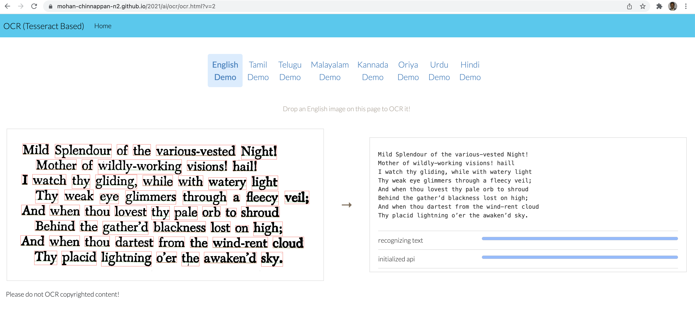
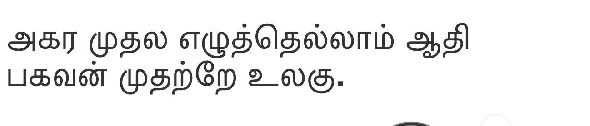

# How to OCR a given image using SFDX CLI?

## Topics

- [Plugin install](#install)
- [Web App](#webapp)
- [Usage](#usage)
- [Examples](#examples) 
  - [English](#eng)
  - [Tamil](#tam)
  - [Danish](#dan)

<a name='install'></a>
- Requires 0.0.163 version of the plugin
    - sfdx-mohanc-plugins@0.0.163
    - [How to install the plugin](https://mohan-chinnappan-n.github.io/dx/plugins.html#/1)

<a name='webapp'></a>

## Want to use Web App version?  (click to launch)
[](https://mohan-chinnappan-n2.github.io/2021/ai/ocr/ocr.html)


<a name='usage'></a>

## Usage
```bash
sfdx mohanc:ida:ocr -h
```

```

OCR a given document in the given language  

USAGE
  $ sfdx mohanc:ida:ocr

OPTIONS
  -i, --inputfilename=inputfilename                Input file or url to scan

  -l, --lang=lang                                  Language for the doc, default is 'eng'; Language info available: 
                                                   https://tesseract-ocr.github.io/tessdoc/Data-Files-in-different-versions.html

  -v, --targetdevhubusername=targetdevhubusername  username or alias for the dev hub org; overrides default dev hub org

  --apiversion=apiversion                          override the api version used for api requests made by this command

  --json                                           format output as json

  --loglevel=(trace|debug|info|warn|error|fatal)   logging level for this command invocation

EXAMPLE

     ** OCR a given document in the given language   **

      sfdx mohanc:ida:ocr -i input.png  -l 'language'

      Example:

           # English from an image file
           sfdx mohanc:ida:ocr -i img/eng_bw.png

           # English from an image url
           sfdx mohanc:ida:ocr -i https://tesseract.projectnaptha.com/img/eng_bw.png


           # Tamil
           sfdx mohanc:ida:ocr -i img/tam.png -l tam
```

<a name='examples'></a>
## Examples

### Input images

### English


### Tamil



<a name='eng'></a>
### English

- From an image URL
```
 sfdx mohanc:ida:ocr -i https://tesseract.projectnaptha.com/img/eng_bw.png


...

===== writing text into ./out.txt... ======
===== writing text into ./out.txt completed. ======

```

```
cat out.txt
Mild Splendour of the various-vested Night!
Mother of wildly-working visions! haill
I watch thy gliding, while with watery light
Thy weak eye glimmers through a fleecy veil;
And when thou lovest thy pale orb to shroud
Behind the gather’d blackness lost on high;
And when thou dartest from the wind-rent cloud
Thy placid lightning o’er the awaken’d sky.

```

- From an image file
```
 sfdx mohanc:ida:ocr -i img/eng_bw.png


...

===== writing text into ./img/eng_bw.png.txt... ======
===== writing text into ./img/eng_bw.png completed. ======

```

```
cat ./img/eng_bw.png.txt
Mild Splendour of the various-vested Night!
Mother of wildly-working visions! haill
I watch thy gliding, while with watery light
Thy weak eye glimmers through a fleecy veil;
And when thou lovest thy pale orb to shroud
Behind the gather’d blackness lost on high;
And when thou dartest from the wind-rent cloud
Thy placid lightning o’er the awaken’d sky.

```

<a name='tam'></a>
### Tamil -  From an image file - language  
```
 sfdx mohanc:ida:ocr -i img/tam.png -l tam


...

===== writing text into img/tam.png.txt... ======
===== writing text into img/tam.png.txt completed. ======

```

```
cat img/tam.png.txt
அகர முதல எழுத்தெல்லாம்‌ ஆதி
பகவன்‌ முதற்றே உலகு.


```
<a name='dan'></a>

### Danish Example from URL


- Thanks to [Rikke](https://www.linkedin.com/in/rikkehovgaard/)  for this example!

```
sfdx mohanc:ida:ocr -i https://docplayer.dk/docs-images/41/7040540/images/page_1.jpg -l dan
```

```
cat ./out.txt 
```
```
ALLE ER VI SØMÆND
Dansk Tekst: Frithiof Rolsted
Musik: Alvor Kraft
1. Jeg synge vil en Vise,
kun et par simple, jævne ord,
I den vil jeg af Hjertet prise,
de Gutter, som på Havet fo'r.
Den ene hedder Persson,
den anden von og av,
men alle er vi Sømænd
på Livets store Hav.
2. Man si'r, at vi i alle Havne
en Kærest' har. Ja, det tror jeg.
Der findes mange åbne Favne,
hvorhen vi kommer på vor Vej.
Men holde alle Løfter,
som Pigerne man gav,
det kan nu ingen Sømand
på Livets store Hav.
3. En Dag — det for os alle gælder —
det ud på sidste Krydstogt går,
og inden Morgengry sig melder,
man pluds”lig for Sct. Peter står,
Så frem med Sømandsbogen,
det gælder høj og lav,
thi alle er vi Sømænd
på Livets store Hav.
g
7 " ø
HPM s Sångtekster M
```
