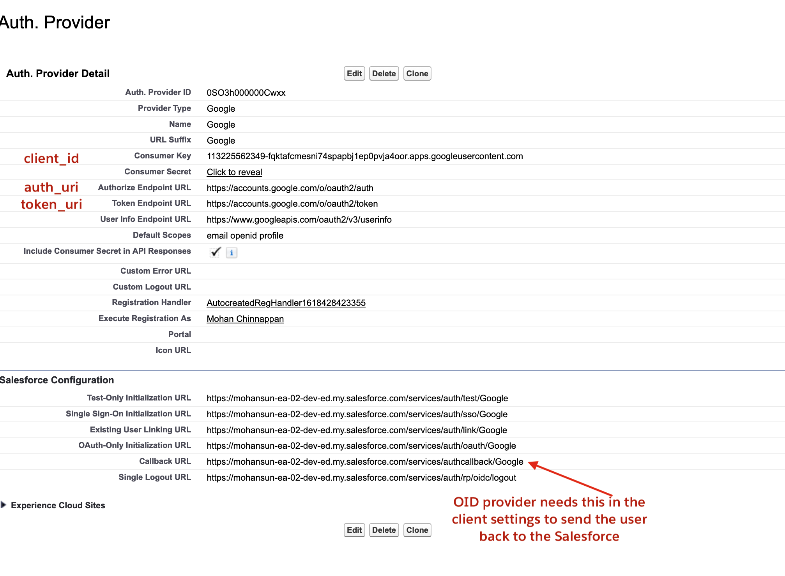
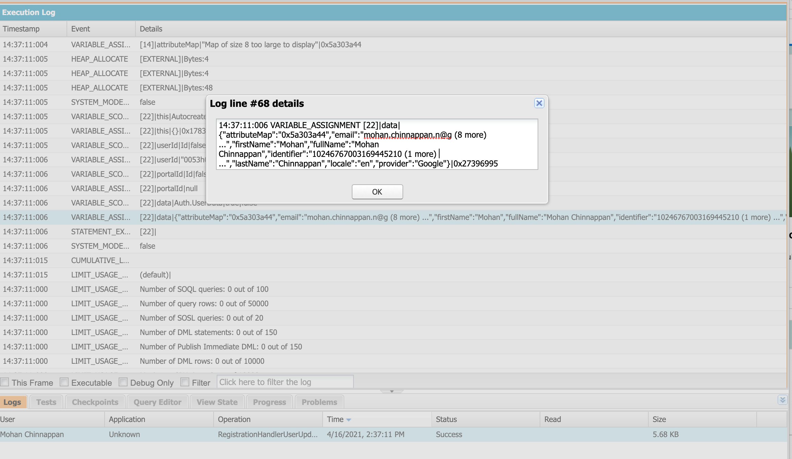
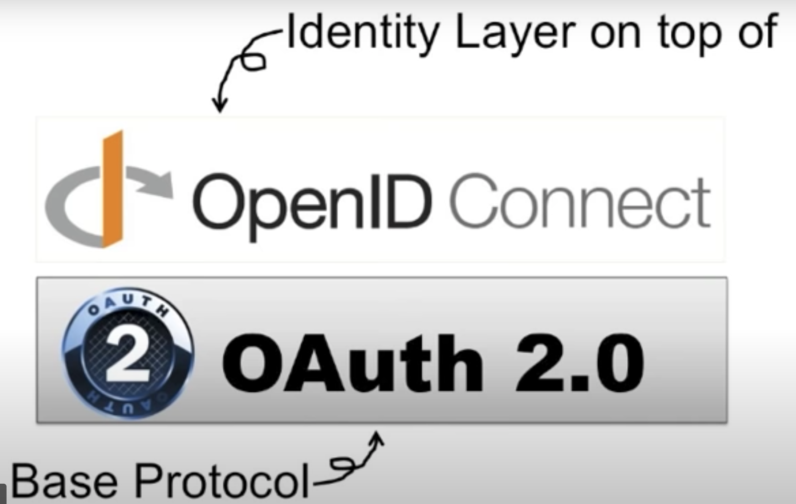

# How to use Google as OpenID Connect provider for Salesforce?

## Topics

- [Demo](#demo)
- [Auth. Provider Settings](#ap)
- [Open ID Provider client secret](#cs)
- [Auth.RegistrationHandler](#rh)
- [Auth.RegistrationHandler Log](#lrh)
- [Using Metadata API](#mdapi)
- [References](#ref)

<a name='demo'></a>

## Demo


<a name='ap'></a>

## Auth. Provider settings

<a name='cs'></a>

## OID provider client secret details
- Note: Content is mangled here to protect the idenity
```json

{
  "web": {
    "project_id": "oidtest-310720",
    
    "client_id": "113225562349-fqktafcJUNK.apps.googleusercontent.com",
    "client_secret": "6VIgVAz8NlJUNKIk4INu4",

    "auth_uri": "https://accounts.google.com/o/oauth2/auth",
    "token_uri": "https://oauth2.googleapis.com/token",
   
     "auth_provider_x509_cert_url": "https://www.googleapis.com/oauth2/v1/certs",


    "redirect_uris": [
      "https://mohansun-ea-02-dev-ed.my.salesforce.com/services/authcallback/Google"
    ]
  }
}

```
<a name='rh'></a>
## Sample Autocreated RegHandler class

```java 
// TODO:This autogenerated class includes the basics for a Registration

// Handler class. You will need to customize it to ensure it meets your needs and
// the data provided by the third party.

global class AutocreatedRegHandler1618428423355 implements Auth.RegistrationHandler {
   
 global boolean canCreateUser(Auth.UserData data) {
        //TODO: Check whether we want to allow creation of a user with this data
        //Set<String> s = new Set<String>{'usernamea', 'usernameb', 'usernamec'};
        //if(s.contains(data.username)) {
            //return true;
        //}
        return false;
    }

    global User createUser(Id portalId, Auth.UserData data){
        System.debug(data);       
    
        User u = [Select Id From User WHERE federationidentifier = :data.email LIMIT 1];
        return u;
    }

    global void updateUser(Id userId, Id portalId, Auth.UserData data){
         
    }


}
```

<a name='lrh'></a>
## Log from the RegHandler


<a name='mdapi'></a>
## Metadata details of this AuthProvider

```
$ sfdx mohanc:mdapi:list -u mohan.chinnappan.n_ea2@gmail.com -t AuthProvider

```

```
{
  result: [
    {
      createdById: '0053h000002xQ5sAAE',
      createdByName: 'Mohan Chinnappan',
      createdDate: 2020-12-11T17:06:31.000Z,
      fileName: 'authproviders/Google.authprovider',
      fullName: 'Google',
      id: '0SO3h000000CwxxGAC',
      lastModifiedById: '0053h000002xQ5sAAE',
      lastModifiedByName: 'Mohan Chinnappan',
      lastModifiedDate: 1970-01-01T00:00:00.000Z,
      type: 'AuthProvider'
    }
  ]
}

```

```
$ sfdx mohanc:mdapi:retrieve -u mohan.chinnappan.n_ea2@gmail.com -t AuthProvider
```

```
{
    "RetrieveRequest": {
        "apiVersion": "51.0",
        "unpackaged": [
            {
                "types": {
                    "members": "*",
                    "name": "AuthProvider"
                }
            }
        ]
    }
}
{ result: { done: false, id: '09S3h000005hIRGEA2', state: 'Queued' } }
```

```
$ sfdx mohanc:mdapi:checkRetrieveStatus  -u mohan.chinnappan.n_ea2@gmail.com -i 09S3h000005hIRGEA2

```
```
[
  {
    createdById: '',
    createdByName: '',
    createdDate: 2020-12-11T17:06:31.000Z,
    fileName: 'unpackaged/authproviders/Google.authprovider',
    fullName: 'Google',
    id: '0SO3h000000CwxxGAC',
    lastModifiedById: '',
    lastModifiedByName: '',
    lastModifiedDate: 1970-01-01T00:00:00.000Z,
    type: 'AuthProvider'
  },
  {
    createdById: '0053h000002xQ5sAAE',
    createdByName: 'Mohan Chinnappan',
    createdDate: 2021-04-16T01:12:48.036Z,
    fileName: 'unpackaged/package.xml',
    fullName: 'unpackaged/package.xml',
    id: '',
    lastModifiedById: '0053h000002xQ5sAAE',
    lastModifiedByName: 'Mohan Chinnappan',
    lastModifiedDate: 2021-04-16T01:12:48.036Z,
    manageableState: 'unmanaged',
    type: 'Package'
  }
]
=== Writing zipFile base64 content to 09S3h000005hIRGEA2.zip.txt ...
=== Writing zipFile binary content to 09S3h000005hIRGEA2.zip ... 

```
```
$ jar tvf 09S3h000005hIRGEA2.zip
  1054 Fri Apr 16 01:12:48 EDT 2021 unpackaged/authproviders/Google.authprovider
   224 Fri Apr 16 01:12:48 EDT 2021 unpackaged/package.xml
```

```
$ unzip 09S3h000005hIRGEA2.zip
Archive:  09S3h000005hIRGEA2.zip
  inflating: unpackaged/authproviders/Google.authprovider  
  inflating: unpackaged/package.xml  

```
```
$ cat authproviders/Google.authprovider 
```

```xml
<?xml version="1.0" encoding="UTF-8"?>
<AuthProvider xmlns="http://soap.sforce.com/2006/04/metadata">
    <authorizeUrl>https://accounts.google.com/o/oauth2/auth</authorizeUrl>
    <consumerKey>113225562349-fqktafcmesni74spapbj1ep0pvja4oor.apps.googleusercontent.com</consumerKey>
    <consumerSecret>+Za8U3gPxgIJUNK49yR1Z7va0cEEY92ILatc=</consumerSecret>
    <defaultScopes>email openid  profile</defaultScopes>
    <executionUser>mohan.chinnappan@email.com</executionUser>
    <friendlyName>Google</friendlyName>
    <includeOrgIdInIdentifier>false</includeOrgIdInIdentifier>
    <providerType>Google</providerType>
    <registrationHandler>AutocreatedRegHandler1618428423355</registrationHandler>
    <sendAccessTokenInHeader>false</sendAccessTokenInHeader>
    <sendClientCredentialsInHeader>false</sendClientCredentialsInHeader>
    <sendSecretInApis>true</sendSecretInApis>
    <tokenUrl>https://accounts.google.com/o/oauth2/token</tokenUrl>
    <userInfoUrl>https://www.googleapis.com/oauth2/v3/userinfo</userInfoUrl>
</AuthProvider>


```

<a name='ref'></a>
## Resources

- [RegistrationHandler Interface](https://developer.salesforce.com/docs/atlas.en-us.apexcode.meta/apexcode/apex_auth_plugin.htm)
- [Configure an OpenID Connect Authentication Provider](https://developer.salesforce.com/docs/atlas.en-us.mobile_sdk.meta/mobile_sdk/sso_provider_openid_connect.htm)

- [OpenID Connect](https://openid.net/connect/)
- [Spec](https://openid.net/specs/openid-connect-basic-1_0.html)

- Okta specific
    - [OpenID Connect & OAuth 2.0 API - Endpoints ](https://developer.okta.com/docs/reference/api/oidc/)
    - [Configure Okta for use as an OpenID Connect (OIDC) identity provide](https://auth0.com/docs/protocols/configure-okta-as-oauth2-identity-provider)
- Videos
    - [OAuth 2.0 and OpenID Connect (in plain English)](https://www.youtube.com/watch?v=996OiexHze0)
    - [OpenId Connect in Salesforce | SSO Between Google and Salesforce](https://www.youtube.com/watch?v=0qNQ_YEIM8s)

- Playgrounds
    - [Salesforce as OpenID Connect - Playground](https://openidconnect.herokuapp.com/)
    - [Auth0 - OpenID Connect Playground](https://openidconnect.net/)
    - [Google OAuth2 Playground](https://developers.google.com/oauthplayground/)


## About OpenID connect
- Simple Identity layer on top of the OAuth 2.0 protocol
- Allows Clients (like service providers) to verify the identity of the End-User based on the authentication performed by an Authorization Server
-   
