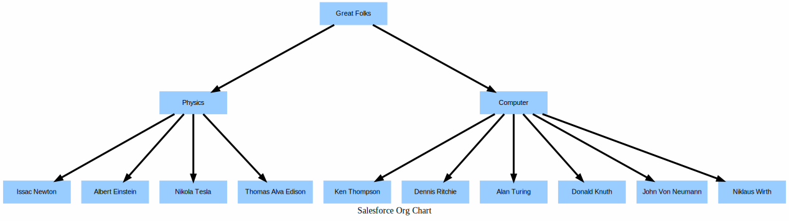

# Drawing Org-Charts


## Input file

```
cat input.json
```

```json

[
        {
          "Id": 1,
          "Name": "Great Folks",
          "ParentRoleId": 0
        },
        {
          "Id": 2,
          "Name": "Physics",
          "ParentRoleId": 1
        },
        {
          "Id": 3,
          "Name": "Issac Newton",
          "ParentRoleId":2 
        },
         {
          "Id": 5,
          "Name": "Albert Einstein",
          "ParentRoleId":2 
        },

        {
          "Id": 4,
          "Name": "Nikola Tesla ",
          "ParentRoleId":2 
        },
         {
            "Id": 6,
            "Name": "Thomas Alva Edison ",
            "ParentRoleId":2 
        },

        {
          "Id": 20,
          "Name": "Computer",
          "ParentRoleId": 1
        },

        {
          "Id": 21,
          "Name": "Ken Thompson",
          "ParentRoleId": 20
        },

        {
          "Id": 22,
          "Name": "Dennis Ritchie",
          "ParentRoleId": 20
        },
        {
          "Id": 23,
          "Name": "Alan Turing",
          "ParentRoleId": 20
        },
        {
          "Id": 24,
          "Name": "Donald Knuth",
          "ParentRoleId": 20
        },
        {
          "Id": 25,
          "Name": "John Von Neumann",
          "ParentRoleId": 20
        },
        {
          "Id": 25,
          "Name": "Niklaus Wirth",
          "ParentRoleId": 20
        }


        
      ]


```

## Run the org chart

```
sfdx mohanc:security:oc -i input.json
```

```
Writing visualization in file __OC__.svg ...
Visualization done. "open  __OC__.svg" in Chrome Browser to view the Visualization.
```

## Chart



