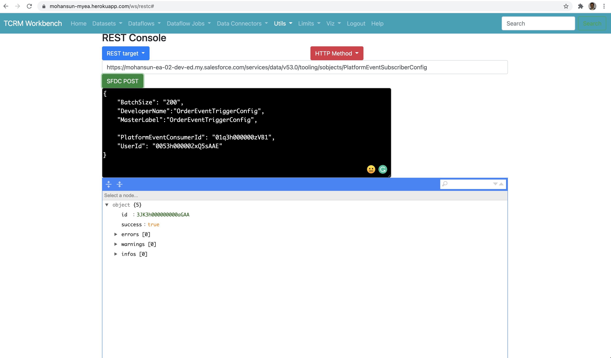
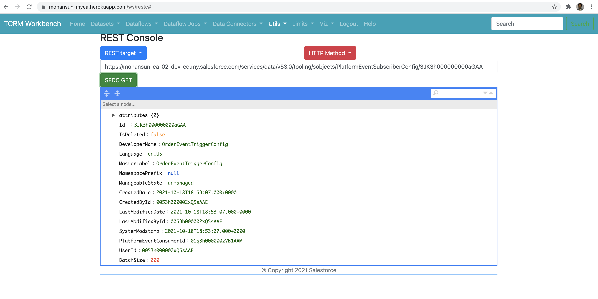

# PlatformEventSubscriberConfig

## Create PlatformEventSubscriberConfig




## View configs

```
cat ./soql/pe.sql
```

```sql
SELECT Id,DeveloperName,BatchSize,PlatformEventConsumerId,UserId FROM PlatformEventSubscriberConfig
```

```
sfdx mohanc:tooling:query -q ~/.soql/pe.soql -u mohan.chinnappan.n_ea2@gmail.com -f json
```



```json
[
    {
        "attributes": {
            "type": "PlatformEventSubscriberConfig",
            "url": "/services/data/v53.0/tooling/sobjects/PlatformEventSubscriberConfig/3JK3h000000000aGAA"
        },
        "Id": "3JK3h000000000aGAA",
        "DeveloperName": "OrderEventTriggerConfig",
        "BatchSize": 200,
        "PlatformEventConsumerId": "01q3h000000zVB1AAM",
        "UserId": "0053h000002xQ5sAAE"
    }
]
```


