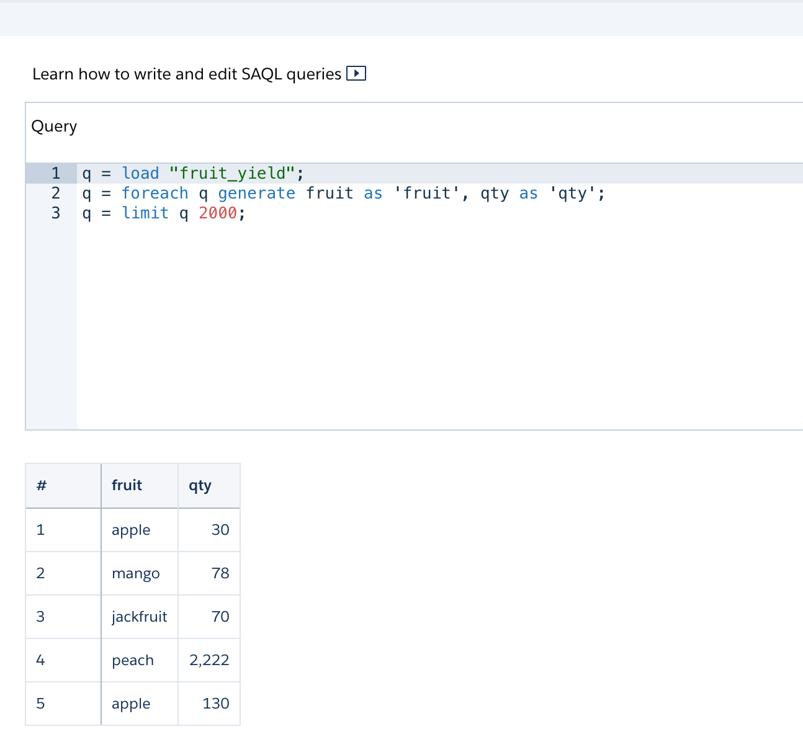

# Querying a Dataset

- Requires 0.0.151 version of the plugin
    - sfdx-mohanc-plugins@0.0.151
    - [How to install the plugin](https://mohan-chinnappan-n.github.io/dx/plugins.html#/1)


## Topics
- [Using Query API](#queryApi)
- [Using Apex](#queryInApex)


<a name='queryApi'></a>
## Query request

### Get the Dataset Id and versionId
```
$ sfdx mohanc:ea:dataset:list  -u mohan.chinnappan.n_ea2@gmail.com  
Id,Version,Name,Label
0Fb3h0000008s9kCAA,0Fc3h0000026QBWCA2,fruit_yield,fruit-yield <-------
0Fb3h0000008sAECAY,0Fc3h0000026QMACA2,fruit_yield_acct,fruit-yield-acct
0Fb3h0000005Yz0CAE,0Fc3h000002umTfCAI,ea_s3_r,ea-s3-r
0Fb3h000000Yea2CAC,0Fc3h0000052auxCAA,regFruits,regFruits
0Fb3h0000005eTmCAI,0Fc3h0000059UJfCAM,apples,apples
0Fb3h0000008ryVCAQ,0Fc3h0000026KlGCAU,DTC_Opportunity_SAMPLE,DTC Opportunity
0Fb3h0000005bIQCAY,0Fc3h00000592zOCAQ,datafromOra,datafromOra
0Fb3h0000005eG4CAI,0Fc3h00000592DeCAI,SampleFruitData,SampleFruitData
0Fb3h0000005bILCAY,0Fc3h000003ojoFCAQ,oraload49,oraload49
0Fb3h0000008zhFCAQ,0Fc3h000004951eCAA,a536087,a536087
0Fb3h0000008zIdCAI,0Fc3h000003F7tgCAC,a536087_csvDataset,a536087_csvDataset
0Fb3h0000008zLXCAY,0Fc3h000003FK6NCAW,a536087_DS,a536087_DS
0Fb3h0000008ryTCAQ,0Fc3h000004lVIBCA2,activity,Activities
0Fb3h0000008zSECAY,0Fc3h0000048AYjCAM,CityEA,CityEA
0Fb3h0000008zS9CAI,0Fc3h0000048AY0CAM,CityEA_c,CityEA_c
0Fb3h0000008zMBCAY,0Fc3h000003FK2aCAG,CityEA_cDS,CityEA_cDS
0Fb3h0000005aTZCAY,0Fc3h000003dhKkCAI,CityEA_csvDataset,CityEA_csvDataset
0Fb3h0000008zimCAA,0Fc3h00000493pgCAA,CustomerData,CustomerData
0Fb3h0000005b3LCAQ,0Fc3h000003o71oCAA,DFTiming,dftiming
0Fb3h0000005bAqCAI,0Fc3h000003oX5cCAE,dsname,dsname
0Fb3h0000005bCSCAY,0Fc3h000003obeqCAA,dsname10,dsname10
0Fb3h0000005bCXCAY,undefined,dsname11,dsname11
0Fb3h0000005bCwCAI,undefined,dsname12,dsname12
0Fb3h0000005bD1CAI,0Fc3h000003obqJCAQ,dsname13,dsname13
0Fb3h0000005bD6CAI,0Fc3h000003ocTjCAI,dsname14,dsname14
```        


```json
{
    "query":"q = load \"0Fb3h0000008s9kCAA/0Fc3h0000026QBWCA2\"; q = foreach q generate fruit as 'fruit', qty as 'qty'; q = limit q 2000;"
}
```

## Run the query
```
$ sfdx mohanc:ea:dataset:query  -u mohan.chinnappan.n_ea2@gmail.com  -q queryRequest.json 
=== Writing the JSON into file : queryRequest.json.json ===
=== Writing the csv into file : queryRequest.json.csv ===

```

### Query Results
```
$ cat queryRequest.json.csv

"fruit","qty"
"apple",30
"mango",78
"jackfruit",70
"peach",2222
"apple",130
"mango",278
"jackfruit",270
"peach",266
```

```
$ cat queryRequest.json.json
```
```json
{
    "action": "query",
    "responseId": "4afvO34cyG6UW40fHnmgZ-",
    "results": {
        "metadata": [
            {
                "lineage": {
                    "type": "foreach",
                    "projections": [
                        {
                            "field": {
                                "id": "q.fruit",
                                "type": "string"
                            },
                            "inputs": [
                                {
                                    "id": "q.fruit"
                                }
                            ]
                        },
                        {
                            "field": {
                                "id": "q.qty",
                                "type": "numeric"
                            },
                            "inputs": [
                                {
                                    "id": "q.qty"
                                }
                            ]
                        }
                    ]
                },
                "queryLanguage": "SAQL"
            }
        ],
        "records": [
            {
                "fruit": "apple",
                "qty": 30
            },
            {
                "fruit": "mango",
                "qty": 78
            },
            {
                "fruit": "jackfruit",
                "qty": 70
            },
            {
                "fruit": "peach",
                "qty": 2222
            },
            {
                "fruit": "apple",
                "qty": 130
            },
            {
                "fruit": "mango",
                "qty": 278
            },
            {
                "fruit": "jackfruit",
                "qty": 270
            },
            {
                "fruit": "peach",
                "qty": 266
            }
        ]
    },
    "query": "q = load \"0Fb3h0000008s9kCAA/0Fc3h0000026QBWCA2\"; q = foreach q generate fruit as 'fruit', qty as 'qty'; q = limit q 2000;",
    "responseTime": 3
}
```
<a name='queryInApex'></a>

## Querying a dataset in Apex

```
$ cat waveQuery.cls

String query = 'q = load "0Fb3h0000008s9kCAA/0Fc3h0000026QBWCA2"; q = foreach q generate fruit as \'fruit\', qty as \'qty\'; q = limit q 2000;';     
ConnectApi.LiteralJson result =  ConnectApi.Wave.executeQuery(query);
String response = result.json;
System.debug(response);

```

### Run Apex
```
$ sfdx mohanc:tooling:execute -u mohan.chinnappan.n_ea2@gmail.com -a waveQuery.cls 
apexCode: String query = 'q = load "0Fb3h0000008s9kCAA/0Fc3h0000026QBWCA2"; q = foreach q generate fruit as \'fruit\', qty as \'qty\'; q = limit q 2000;';     
ConnectApi.LiteralJson result =  ConnectApi.Wave.executeQuery(query);
String response = result.json;
System.debug(response);

compiled?: true
executed?: true
{
  line: -1,
  column: -1,
  compiled: true,
  success: true,
  compileProblem: null,
  exceptionStackTrace: null,
  exceptionMessage: null
}
```
### Apex Run Results
```

51.0 APEX_CODE,FINEST;APEX_PROFILING,INFO;CALLOUT,INFO;DB,INFO;NBA,INFO;SYSTEM,DEBUG;VALIDATION,INFO;VISUALFORCE,INFO;WAVE,INFO;WORKFLOW,INFO
Execute Anonymous: String query = 'q = load "0Fb3h0000008s9kCAA/0Fc3h0000026QBWCA2"; q = foreach q generate fruit as \'fruit\', qty as \'qty\'; q = limit q 2000;';     
Execute Anonymous: ConnectApi.LiteralJson result =  ConnectApi.Wave.executeQuery(query);
Execute Anonymous: String response = result.json;
Execute Anonymous: System.debug(response);
03:46:50.1 (1206037)|USER_INFO|[EXTERNAL]|0053h000002xQ5s|mohan.chinnappan.n_ea2@gmail.com|(GMT-08:00) Pacific Standard Time (America/Los_Angeles)|GMT-08:00
03:46:50.1 (1247317)|EXECUTION_STARTED
03:46:50.1 (1254608)|CODE_UNIT_STARTED|[EXTERNAL]|execute_anonymous_apex
03:46:50.1 (1418842)|VARIABLE_SCOPE_BEGIN|[1]|query|String|false|false
03:46:50.1 (1434289)|VARIABLE_SCOPE_BEGIN|[3]|response|String|false|false
03:46:50.1 (1525486)|VARIABLE_SCOPE_BEGIN|[2]|result|ConnectApi.LiteralJson|true|false
03:46:50.1 (1705522)|HEAP_ALLOCATE|[79]|Bytes:3
03:46:50.1 (1745897)|HEAP_ALLOCATE|[84]|Bytes:152
03:46:50.1 (1765831)|HEAP_ALLOCATE|[399]|Bytes:408
03:46:50.1 (1787378)|HEAP_ALLOCATE|[412]|Bytes:408
03:46:50.1 (1805742)|HEAP_ALLOCATE|[520]|Bytes:48
03:46:50.1 (1845372)|HEAP_ALLOCATE|[139]|Bytes:6
03:46:50.1 (1883521)|HEAP_ALLOCATE|[EXTERNAL]|Bytes:7
03:46:50.1 (2008871)|STATEMENT_EXECUTE|[1]
03:46:50.1 (2013824)|STATEMENT_EXECUTE|[1]
03:46:50.1 (2018696)|HEAP_ALLOCATE|[1]|Bytes:122
03:46:50.1 (2171806)|VARIABLE_ASSIGNMENT|[1]|query|"q = load \"0Fb3h00000 (102 more) ..."
03:46:50.1 (2182578)|STATEMENT_EXECUTE|[2]
03:46:50.1 (2252956)|HEAP_ALLOCATE|[52]|Bytes:5
03:46:50.1 (2281350)|HEAP_ALLOCATE|[58]|Bytes:5
03:46:50.1 (2291900)|HEAP_ALLOCATE|[66]|Bytes:7
03:46:50.1 (2317627)|SYSTEM_MODE_ENTER|false
03:46:50.1 (2357083)|HEAP_ALLOCATE|[2]|Bytes:5
03:46:50.1 (2417388)|HEAP_ALLOCATE|[2]|Bytes:17
03:46:50.1 (2441102)|SYSTEM_METHOD_ENTRY|[5]|Wave.Wave()
03:46:50.1 (2448203)|STATEMENT_EXECUTE|[5]
03:46:50.1 (2456885)|SYSTEM_METHOD_EXIT|[5]|Wave
03:46:50.1 (2486930)|METHOD_ENTRY|[2]||ConnectApi.Wave.executeQuery(String)
03:46:50.1 (96432126)|SYSTEM_METHOD_ENTRY|[5]|LiteralJson.LiteralJson()
03:46:50.1 (96452786)|STATEMENT_EXECUTE|[5]
03:46:50.1 (96464991)|SYSTEM_METHOD_EXIT|[5]|LiteralJson
03:46:50.1 (96495107)|HEAP_ALLOCATE|[32]|Bytes:20
03:46:50.1 (96506874)|HEAP_ALLOCATE|[32]|Bytes:12
03:46:50.1 (96515736)|HEAP_ALLOCATE|[32]|Bytes:8
03:46:50.1 (96526431)|VARIABLE_SCOPE_BEGIN|[24]|this|ConnectApi.LiteralJson|true|false
03:46:50.1 (96790548)|VARIABLE_ASSIGNMENT|[24]|this|{}|0x7eb762fe
03:46:50.1 (96806761)|VARIABLE_SCOPE_BEGIN|[24]|versionIn|Double|false|false
03:46:50.1 (96825723)|VARIABLE_ASSIGNMENT|[24]|versionIn|51.0
03:46:50.1 (96835250)|VARIABLE_SCOPE_BEGIN|[24]|javaObj|java:sfdc.insights.connect.api.output.LiteralJsonRepresentation|true|false
03:46:50.1 (97199764)|VARIABLE_ASSIGNMENT|[24]|javaObj|"sfdc.insights.connect.api.output.LiteralJsonRepresentation@5b87f7b7"|0x5b87f7b7
03:46:50.1 (98020911)|METHOD_EXIT|[2]||ConnectApi.Wave.executeQuery(String)
03:46:50.1 (98045193)|SYSTEM_MODE_EXIT|false
03:46:50.1 (98210153)|VARIABLE_ASSIGNMENT|[2]|result|{}|0x7eb762fe
03:46:50.1 (98224324)|STATEMENT_EXECUTE|[3]
03:46:50.1 (98293293)|SYSTEM_MODE_ENTER|false
03:46:50.1 (98318395)|HEAP_ALLOCATE|[3]|Bytes:5
03:46:50.1 (98536197)|SYSTEM_MODE_EXIT|false
03:46:50.1 (98569491)|VARIABLE_ASSIGNMENT|[3]|response|"{\"action\":\"query\",\"r (664 more) ..."
03:46:50.1 (98577705)|STATEMENT_EXECUTE|[4]
03:46:50.1 (98634705)|USER_DEBUG|[4]|DEBUG|{"action":"query","responseId":"4afsddQwLwwDQVF8RxkEg-","results":{"metadata":[{"lineage":{"type":"foreach","projections":[{"field":{"id":"q.fruit","type":"string"},"inputs":[{"id":"q.fruit"}]},{"field":{"id":"q.qty","type":"numeric"},"inputs":[{"id":"q.qty"}]}]},"queryLanguage":"SAQL"}],"records":[{"fruit":"apple","qty":30},{"fruit":"mango","qty":78},{"fruit":"jackfruit","qty":70},{"fruit":"peach","qty":2222},{"fruit":"apple","qty":130},{"fruit":"mango","qty":278},{"fruit":"jackfruit","qty":270},{"fruit":"peach","qty":266}]},"query":"q = load \"0Fb3h0000008s9kCAA/0Fc3h0000026QBWCA2\"; q = foreach q generate fruit as 'fruit', qty as 'qty'; q = limit q 2000;","responseTime":3}
03:46:50.102 (102499319)|CUMULATIVE_LIMIT_USAGE
03:46:50.102 (102499319)|LIMIT_USAGE_FOR_NS|(default)|
  Number of SOQL queries: 0 out of 100
  Number of query rows: 0 out of 50000
  Number of SOSL queries: 0 out of 20
  Number of DML statements: 1 out of 150
  Number of Publish Immediate DML: 0 out of 150
  Number of DML rows: 1 out of 10000
  Maximum CPU time: 0 out of 10000
  Maximum heap size: 0 out of 6000000
  Number of callouts: 1 out of 100
  Number of Email Invocations: 0 out of 10
  Number of future calls: 0 out of 50
  Number of queueable jobs added to the queue: 0 out of 50
  Number of Mobile Apex push calls: 0 out of 10

03:46:50.102 (102499319)|CUMULATIVE_LIMIT_USAGE_END

03:46:50.1 (102575922)|CODE_UNIT_FINISHED|execute_anonymous_apex
03:46:50.1 (102594675)|EXECUTION_FINISHED

```

