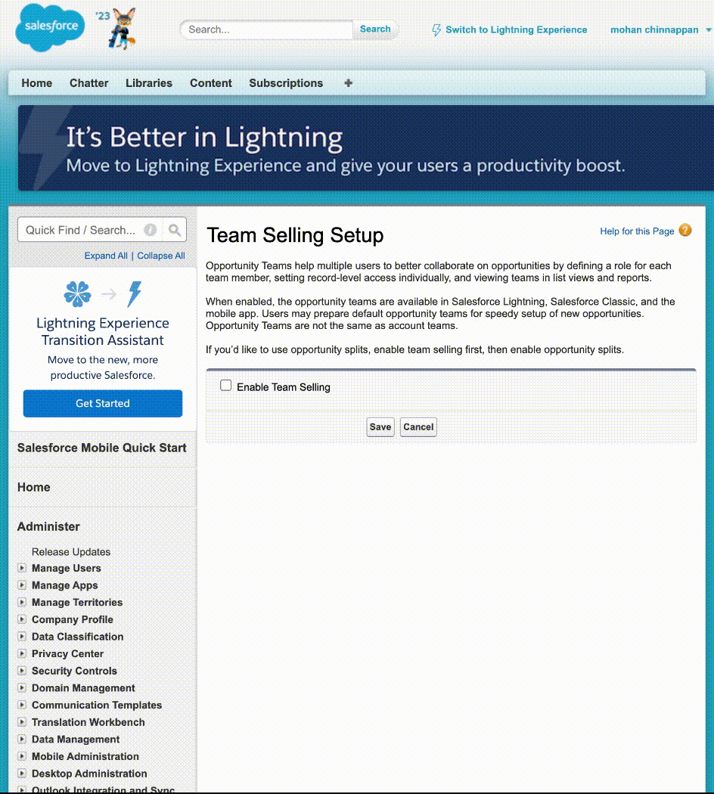
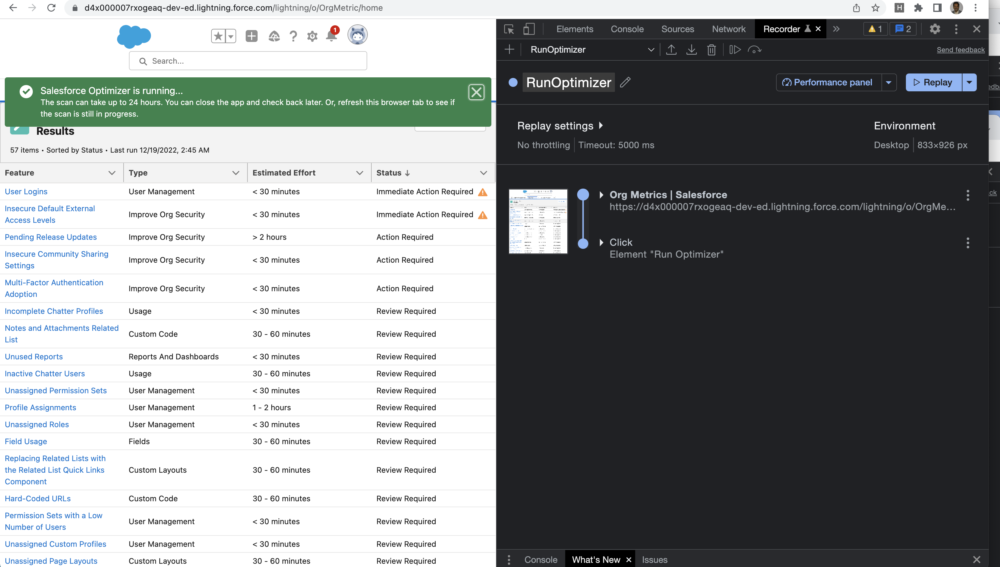

# Using CLI to create Chrome recording

## Enable Oppty Team Selling
```
sfdx mohanc:recording:createScript -r https://d4x000007rxogeaq-dev-ed.my.salesforce.com -s OpptyTeamEnableTeamSelling.json > ~/Desktop/otets.json
```

- Load the  ~/Desktop/otets.json into Chrome Recorder to play it

### Demo



------

## Run Optimizer

```
sfdx mohanc:recording:createScript -r https://d4x000007rxogeaq-dev-ed.lightning.force.com -s RunOptimizer.json > ~/Desktop/ro.json
```
- Load the  ~/Desktop/ro.json into Chrome Recorder to play it

### Demo Screenshot
-
