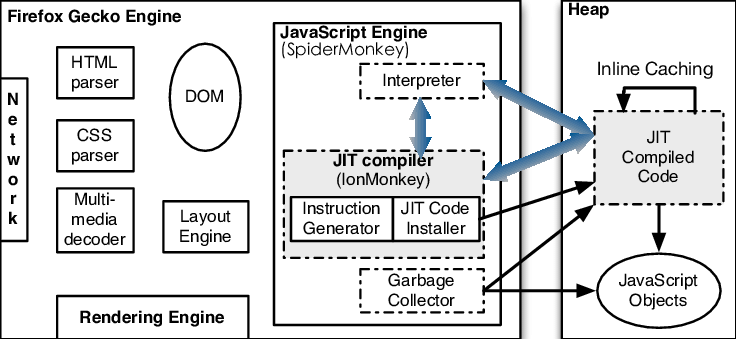

# Notes about Browser rendering engines

[Chrome](https://www.google.com/chrome/browser-tools/) (77.03%)|[Safari](https://www.apple.com/safari/) (8.87)%|[Firefox](https://www.mozilla.org/en-US/firefox/new/) (7.69 %)
|---|---|---|
|[Blink](https://www.chromium.org/blink/)|[WebKit](https://webkit.org/)|[Gecko](https://developer.mozilla.org/en-US/docs/Glossary/Gecko)

## Blink

Blink is a rendering engine of the web platform. Roughly speaking, Blink implements everything that renders content inside a browser tab:

- Implement the specs of the web platform (e.g., HTML standard), including DOM, CSS and Web IDL
Embed V8 and run JavaScript

- Request resources from the underlying network stack
- Build DOM trees
- Calculate style and layout
- Embed Chrome Compositor and draw graphics

Blink is embedded by many customers such as Chromium, Android WebView and Opera via content public APIs.

- 
- 

- [How Blink works ](https://docs.google.com/document/d/1aitSOucL0VHZa9Z2vbRJSyAIsAz24kX8LFByQ5xQnUg/edit)
- [Chrome Architecture](https://mohan-chinnappan-n2.github.io/2019/lex/perf.html#chromeArch)
- Inside look at modern web browser
    - [part 1](https://developer.chrome.com/blog/inside-browser-part1/)
    - [part 2](https://developer.chrome.com/blog/inside-browser-part2/)
    - [part 3](https://developer.chrome.com/blog/inside-browser-part3/)
    - [part 4](https://developer.chrome.com/blog/inside-browser-part4/)
- [RenderingNG deep-dive: LayoutNG](https://developer.chrome.com/blog/layoutng/)

## WebKit

## Gecko
- 

- [Firefox Browser Architecture](https://mozilla.github.io/firefox-browser-architecture/)

