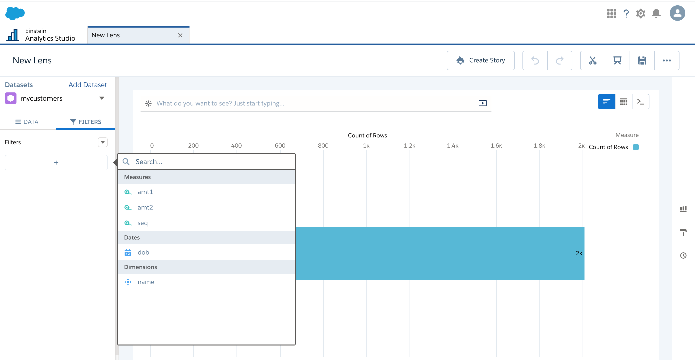
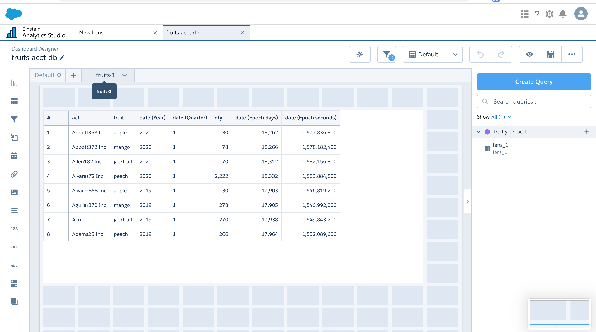
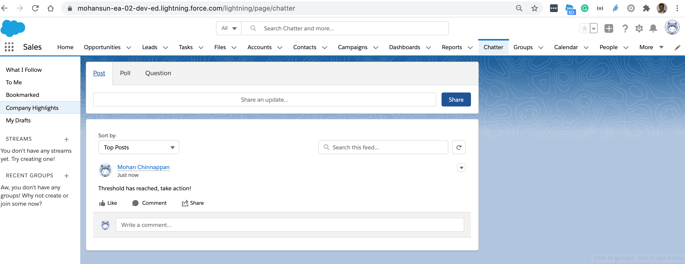
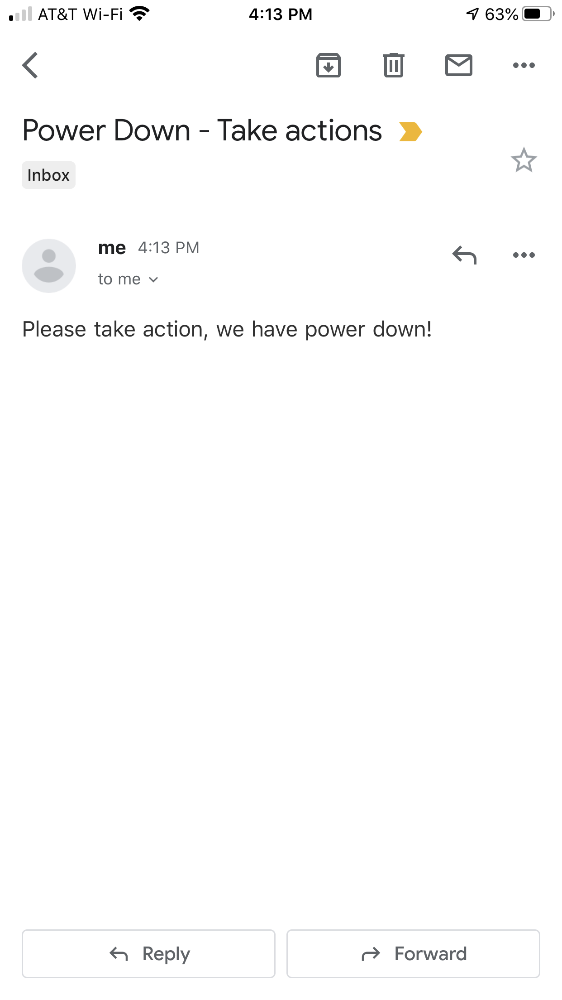

# REST API support using DX

- Requires 0.0.51 version of the plugin
    - sfdx-mohanc-plugins@0.0.51
    - [How to install the plugin](https://mohan-chinnappan-n.github.io/dx/plugins.html#/1)

- Supported Methods
    - GET
    - PUT
    - POST
    - PATCH
    - DELETE 


### Topics
- [Usage](#usage)
- [Creating header.json for the connected Salesforce org](#myorg)
- [REST GET](#get)
- [REST POST](#post)
- [REST PATCH](#patch)
- [REST DELETE](#delete)
- [REST PUT](#put)
- [BulkAPI 2.0 data load](#bulkapi2) 

<a name="usage"></a>
## Usage
```
$ sfdx mohanc:ws:rest -h
REST API 

USAGE
  $ sfdx mohanc:ws:rest

OPTIONS
  -d, --datafilename=datafilename                 data filename (content in json)
  -f, --headerfilename=headerfilename             header filename (content in json)
  -m, --method=method                             REST method (GET|POST|PATCH)
  -r, --resourceuri=resourceuri                   REST Resource URI
  --json                                          format output as json
  --loglevel=(trace|debug|info|warn|error|fatal)  logging level for this command invocation

EXAMPLE

              Perform REST API calls
              sfdx mohanc:ws:rest  -r <resourceURI> -m <method: GET|POST|PATCH|PUT|DELETE> -f <header-file> -d <data>


```

## Demos
<a name="get"></a>
###  GET
- get time
```
$ sfdx mohanc:ws:rest -r https://mohansun-rum.herokuapp.com/time  -m GET 
{
    "time": "2020-08-21T20:24:56.033Z"
}
```
- get random dog images

```
$ sfdx mohanc:ws:rest -r https://dog.ceo/api/breeds/image/random  -m GET 
{
    "message": "https://images.dog.ceo/breeds/papillon/n02086910_9317.jpg",
    "status": "success"
}
```


- Get all bulkAPI 2.0 jobs
```
$ sfdx mohanc:ws:rest -r https://mohansun-ea-02-dev-ed.my.salesforce.com/services/data/v49.0/jobs/ingest  -m GET -f header.json 
{
    "done": true,
    "records": [
        {
            "id": "7503h000004R4JuAAK",
            "operation": "insert",
            "object": "Case",
            "createdById": "0053h000002xQ5sAAE",
            "createdDate": "2020-08-21T20:30:24.000+0000",
            "systemModstamp": "2020-08-21T20:30:30.000+0000",
            "state": "InProgress",
            "concurrencyMode": "Parallel",
            "contentType": "CSV",
            "apiVersion": 49,
            "jobType": "V2Ingest",
            "lineEnding": "LF",
            "columnDelimiter": "COMMA"
        }
    ],
    "nextRecordsUrl": null
}

$ cat header.json 
{
 "Content-Type": "application/json",
  "Authorization": "Bearer 00D3h000007R1Lu!JUNK_9bUOI21JUNKJjAKIuy.2wbCg_OLXxoFrrKvL2aG9"

}

```
- Get securityCoverageUrl for the given dataset in EA
```
$ sfdx mohanc:ws:rest -r https://mohansun-ea-02-dev-ed.my.salesforce.com/services/data/v49.0/wave/datasets/0Fb3h0000008spECAQ/versions/0Fc3h0000026e3aCAA -m GET   -f header.json 
{
    "createdBy": {
        "id": "0053h000003de6bAAA",
        "name": "Integration User",
        "profilePhotoUrl": "https://mohansun-ea-02-dev-ed--c.documentforce.com/profilephoto/005/T"
    },
    "createdDate": "2020-07-15T18:10:11.000Z",
    "dataset": {
        "id": "0Fb3h0000008spECAQ",
        "url": "/services/data/v49.0/wave/datasets/0Fb3h0000008spECAQ"
    },
    "files": [],
    "id": "0Fc3h0000026e3aCAA",
    "lastModifiedBy": {
        "id": "0053h000003de6bAAA",
        "name": "Integration User",
        "profilePhotoUrl": "https://mohansun-ea-02-dev-ed--c.documentforce.com/profilephoto/005/T"
    },
    "lastModifiedDate": "2020-08-21T20:42:25.000Z",
    "permissions": {
        "create": true,
        "modify": true,
        "view": true
    },
    "securityCoverageUrl": "/services/data/v49.0/wave/security/coverage/datasets/0Fb3h0000008spECAQ/versions/0Fc3h0000026e3aCAA",
    "totalRows": 2009,
    "type": "datasetversion",
    "url": "/services/data/v49.0/wave/datasets/0Fb3h0000008spECAQ/versions/0Fc3h0000026e3aCAA",
    "xmdMain": {
        "createdBy": {
            "id": "0053h000003de6bAAA",
            "name": "Integration User",
            "profilePhotoUrl": "https://mohansun-ea-02-dev-ed--c.documentforce.com/profilephoto/005/T"
        },
        "createdDate": "2020-07-15T18:10:12.000Z",
        "dataset": {
            "connector": "SalesforceAnalyticsCloudDatasetLoader",
            "description": "customers",
            "fullyQualifiedName": "customers"
        },
        "dates": [
            {
                "alias": "dob",
                "compact": false,
                "description": "dob",
                "fields": {
                    "day": "dob_Day",
                    "epochDay": "dob_day_epoch",
                    "epochSecond": "dob_sec_epoch",
                    "fullField": "dob",
                    "hour": "dob_Hour",
                    "minute": "dob_Minute",
                    "month": "dob_Month",
                    "quarter": "dob_Quarter",
                    "second": "dob_Second",
                    "week": "dob_Week",
                    "year": "dob_Year"
                },
                "firstDayOfWeek": -1,
                "fiscalMonthOffset": 0,
                "fullyQualifiedName": "dob",
                "isYearEndFiscalYear": true,
                "label": "dob",
                "showInExplorer": true,
                "type": "Date"
            }
        ],
        "derivedDimensions": [],
        "derivedMeasures": [],
        "dimensions": [
            {
                "conditionalFormatting": {},
                "customActions": [],
                "customActionsEnabled": true,
                "field": "dob",
                "isMultiValue": false,
                "label": "dob",
                "linkTemplateEnabled": true,
                "members": [],
                "recordDisplayFields": [],
                "salesforceActions": [],
                "salesforceActionsEnabled": true,
                "showInExplorer": true
            },
            {
                "conditionalFormatting": {},
                "customActions": [],
                "customActionsEnabled": true,
                "field": "dob_Year",
                "isMultiValue": false,
                "label": "dob_Year",
                "linkTemplateEnabled": true,
                "members": [],
                "recordDisplayFields": [],
                "salesforceActions": [],
                "salesforceActionsEnabled": true,
                "showInExplorer": true
            },
            {
                "conditionalFormatting": {},
                "customActions": [],
                "customActionsEnabled": true,
                "field": "dob_Quarter",
                "isMultiValue": false,
                "label": "dob_Quarter",
                "linkTemplateEnabled": true,
                "members": [],
                "recordDisplayFields": [],
                "salesforceActions": [],
                "salesforceActionsEnabled": true,
                "showInExplorer": true
            },
            {
                "conditionalFormatting": {},
                "customActions": [],
                "customActionsEnabled": true,
                "field": "dob_Month",
                "isMultiValue": false,
                "label": "dob_Month",
                "linkTemplateEnabled": true,
                "members": [],
                "recordDisplayFields": [],
                "salesforceActions": [],
                "salesforceActionsEnabled": true,
                "showInExplorer": true
            },
            {
                "conditionalFormatting": {},
                "customActions": [],
                "customActionsEnabled": true,
                "field": "dob_Week",
                "isMultiValue": false,
                "label": "dob_Week",
                "linkTemplateEnabled": true,
                "members": [],
                "recordDisplayFields": [],
                "salesforceActions": [],
                "salesforceActionsEnabled": true,
                "showInExplorer": true
            },
            {
                "conditionalFormatting": {},
                "customActions": [],
                "customActionsEnabled": true,
                "field": "dob_Day",
                "isMultiValue": false,
                "label": "dob_Day",
                "linkTemplateEnabled": true,
                "members": [],
                "recordDisplayFields": [],
                "salesforceActions": [],
                "salesforceActionsEnabled": true,
                "showInExplorer": true
            },
            {
                "conditionalFormatting": {},
                "customActions": [],
                "customActionsEnabled": true,
                "field": "dob_Hour",
                "isMultiValue": false,
                "label": "dob_Hour",
                "linkTemplateEnabled": true,
                "members": [],
                "recordDisplayFields": [],
                "salesforceActions": [],
                "salesforceActionsEnabled": true,
                "showInExplorer": true
            },
            {
                "conditionalFormatting": {},
                "customActions": [],
                "customActionsEnabled": true,
                "field": "dob_Minute",
                "isMultiValue": false,
                "label": "dob_Minute",
                "linkTemplateEnabled": true,
                "members": [],
                "recordDisplayFields": [],
                "salesforceActions": [],
                "salesforceActionsEnabled": true,
                "showInExplorer": true
            },
            {
                "conditionalFormatting": {},
                "customActions": [],
                "customActionsEnabled": true,
                "field": "dob_Second",
                "isMultiValue": false,
                "label": "dob_Second",
                "linkTemplateEnabled": true,
                "members": [],
                "recordDisplayFields": [],
                "salesforceActions": [],
                "salesforceActionsEnabled": true,
                "showInExplorer": true
            },
            {
                "conditionalFormatting": {},
                "customActions": [],
                "customActionsEnabled": true,
                "description": "name",
                "field": "name",
                "fullyQualifiedName": "name",
                "isMultiValue": false,
                "label": "name",
                "linkTemplateEnabled": true,
                "members": [],
                "origin": "name",
                "recordDisplayFields": [],
                "salesforceActions": [],
                "salesforceActionsEnabled": true,
                "showInExplorer": true
            }
        ],
        "language": "en_US",
        "lastModifiedBy": {
            "id": "0053h000003de6bAAA",
            "name": "Integration User",
            "profilePhotoUrl": "https://mohansun-ea-02-dev-ed--c.documentforce.com/profilephoto/005/T"
        },
        "lastModifiedDate": "2020-07-15T18:10:12.000Z",
        "measures": [
            {
                "conditionalFormatting": {},
                "description": "amt1",
                "field": "amt1",
                "format": {
                    "decimalDigits": 0,
                    "delimiters": {}
                },
                "fullyQualifiedName": "amt1",
                "label": "amt1",
                "origin": "amt1",
                "showInExplorer": true
            },
            {
                "conditionalFormatting": {},
                "field": "dob_day_epoch",
                "format": {
                    "delimiters": {}
                },
                "label": "dob_day_epoch",
                "showInExplorer": true
            },
            {
                "conditionalFormatting": {},
                "field": "dob_sec_epoch",
                "format": {
                    "delimiters": {}
                },
                "label": "dob_sec_epoch",
                "showInExplorer": true
            },
            {
                "conditionalFormatting": {},
                "description": "amt2",
                "field": "amt2",
                "format": {
                    "decimalDigits": 0,
                    "delimiters": {}
                },
                "fullyQualifiedName": "amt2",
                "label": "amt2",
                "origin": "amt2",
                "showInExplorer": true
            },
            {
                "conditionalFormatting": {},
                "description": "seq",
                "field": "seq",
                "format": {
                    "decimalDigits": 0,
                    "delimiters": {}
                },
                "fullyQualifiedName": "seq",
                "label": "seq",
                "origin": "seq",
                "showInExplorer": true
            }
        ],
        "organizations": [],
        "showDetailsDefaultFields": [],
        "type": "main",
        "url": "/services/data/v49.0/wave/datasets/0Fb3h0000008spECAQ/versions/0Fc3h0000026e3aCAA/xmds/main"
    },
    "xmdsUrl": "/services/data/v49.0/wave/datasets/0Fb3h0000008spECAQ/versions/0Fc3h0000026e3aCAA/xmds"
}


```



- Get Dashboard info
```
$ sfdx mohanc:ws:rest -r https://mohansun-ea-02-dev-ed.my.salesforce.com/services/data/v49.0/wave/dashboards/0FK3h0000001zObGAI -m GET   -f header.json 

{
    "allowPreview": true,
    "assetSharingUrl": "https://mohansun-ea-02-dev-ed.my.salesforce.com/analytics/wave/dashboard?assetId=0FK3h0000001zObGAI&orgId=00D3h000007R1Lu&loginHost=na111.salesforce.com&urlType=sharing",
    "createdBy": {
        "id": "0053h000002xQ5sAAE",
        "name": "Mohan Chinnappan",
        "profilePhotoUrl": "https://mohansun-ea-02-dev-ed--c.documentforce.com/profilephoto/005/T"
    },
    "createdDate": "2020-07-14T11:33:54.000Z",
    "datasets": [
        {
            "id": "0Fb3h0000008sAECAY",
            "label": "fruit-yield-acct",
            "name": "fruit_yield_acct",
            "url": "/services/data/v49.0/wave/datasets/0Fb3h0000008sAECAY"
        }
    ],
    "dateVersion": 1,
    "files": [
        {
            "contentType": "image/png",
            "fileLength": 14499,
            "fileName": "assetPreviewThumb",
            "id": "0FJ3h0000004OMJGA2",
            "lastModifiedDate": "2020-07-14T11:33:56.000Z",
            "url": "/services/data/v49.0/wave/lenses/0FK3h0000001zObGAI/files/0FJ3h0000004OMJGA2"
        }
    ],
    "folder": {
        "id": "0053h000002xQ5sAAE",
        "label": "Mohan Chinnappan"
    },
    "historiesUrl": "/services/data/v49.0/wave/dashboards/0FK3h0000001zObGAI/histories",
    "id": "0FK3h0000001zObGAI",
    "label": "fruits-acct-db",
    "lastAccessedDate": "2020-08-22T01:38:49.000Z",
    "lastModifiedBy": {
        "id": "0053h000002xQ5sAAE",
        "name": "Mohan Chinnappan",
        "profilePhotoUrl": "https://mohansun-ea-02-dev-ed--c.documentforce.com/profilephoto/005/T"
    },
    "lastModifiedDate": "2020-07-14T11:33:54.000Z",
    "mobileDisabled": false,
    "name": "fruits_acct_db",
    "permissions": {
        "create": true,
        "manage": true,
        "modify": true,
        "view": true
    },
    "refreshDate": "2020-07-14T11:30:43.000Z",
    "state": {
        "dataSourceLinks": [],
        "filters": [],
        "gridLayouts": [
            {
                "name": "Default",
                "numColumns": 12,
                "pages": [
                    {
                        "label": "fruits-1",
                        "name": "789504fc-0a7a-4729-9e0d-742b556edd6b",
                        "navigationHidden": false,
                        "widgets": [
                            {
                                "colspan": 11,
                                "column": 0,
                                "name": "table_1",
                                "row": 1,
                                "rowspan": 8,
                                "widgetStyle": {
                                    "borderEdges": []
                                }
                            }
                        ]
                    }
                ],
                "rowHeight": "normal",
                "selectors": [],
                "style": {
                    "alignmentX": "left",
                    "alignmentY": "top",
                    "backgroundColor": "#F2F6FA",
                    "cellSpacingX": 8,
                    "cellSpacingY": 8,
                    "fit": "original",
                    "gutterColor": "#C5D3E0"
                },
                "version": 1
            }
        ],
        "layouts": [],
        "steps": {
            "lens_1": {
                "broadcastFacet": true,
                "datasets": [
                    {
                        "id": "0Fb3h0000008sAECAY",
                        "label": "fruit-yield-acct",
                        "name": "fruit_yield_acct",
                        "url": "/services/data/v49.0/wave/datasets/0Fb3h0000008sAECAY"
                    }
                ],
                "isGlobal": false,
                "label": "lens_1",
                "query": {
                    "query": "{&quot;values&quot;:[&quot;act&quot;,&quot;fruit&quot;,&quot;date_Year&quot;,&quot;date_Quarter&quot;,&quot;qty&quot;,&quot;date_day_epoch&quot;,&quot;date_sec_epoch&quot;]}",
                    "version": -1
                },
                "receiveFacetSource": {
                    "mode": "all",
                    "steps": []
                },
                "selectMode": "single",
                "type": "aggregateflex",
                "useGlobal": true,
                "visualizationParameters": {
                    "options": {},
                    "parameters": {
                        "borderColor": "#e0e5ee",
                        "borderWidth": 1,
                        "cell": {
                            "backgroundColor": "#ffffff",
                            "fontColor": "#16325c",
                            "fontSize": 12
                        },
                        "columnProperties": {},
                        "columns": [],
                        "customBulkActions": [],
                        "header": {
                            "backgroundColor": "#f4f6f9",
                            "fontColor": "#16325c",
                            "fontSize": 12
                        },
                        "innerMajorBorderColor": "#a8b7c7",
                        "innerMinorBorderColor": "#e0e5ee",
                        "maxColumnWidth": 300,
                        "minColumnWidth": 40,
                        "mode": "variable",
                        "numberOfLines": 1,
                        "showActionMenu": true,
                        "showRowIndexColumn": true,
                        "totals": true,
                        "verticalPadding": 8
                    },
                    "type": "table"
                }
            }
        },
        "widgetStyle": {
            "backgroundColor": "#FFFFFF",
            "borderColor": "#E6ECF2",
            "borderEdges": [],
            "borderRadius": 0,
            "borderWidth": 1
        },
        "widgets": {
            "table_1": {
                "parameters": {
                    "borderColor": "#e0e5ee",
                    "borderWidth": 1,
                    "cell": {
                        "backgroundColor": "#ffffff",
                        "fontColor": "#16325c",
                        "fontSize": 12
                    },
                    "columnProperties": {},
                    "columns": [],
                    "customBulkActions": [],
                    "exploreLink": true,
                    "header": {
                        "backgroundColor": "#f4f6f9",
                        "fontColor": "#16325c",
                        "fontSize": 12
                    },
                    "innerMajorBorderColor": "#a8b7c7",
                    "innerMinorBorderColor": "#e0e5ee",
                    "maxColumnWidth": 300,
                    "minColumnWidth": 40,
                    "mode": "variable",
                    "numberOfLines": 1,
                    "showActionMenu": true,
                    "showRowIndexColumn": true,
                    "step": "lens_1",
                    "totals": true,
                    "verticalPadding": 8
                },
                "type": "table"
            }
        }
    },
    "type": "dashboard",
    "url": "/services/data/v49.0/wave/dashboards/0FK3h0000001zObGAI"
}
```



<a name="patch"></a>
### PATCH

- Abort a BulkAPI 2.0 job

```
$ sfdx mohanc:ws:rest -r https://mohansun-ea-02-dev-ed.my.salesforce.com/services/data/v49.0/jobs/ingest/7503h000004R4JuAAK  -m PATCH -f header.json -d bulakpi-abort.json 
[
    {
        "errorCode": "INVALIDJOBSTATE",
        "message": "Aborting already Completed Job not allowed"
    }
]

$ cat bulakpi-abort.json 
{
 "state": "Aborted"

}

```

<a name="delete"></a>

### DELETE
- Delete an Account Record with ID:0013h00000Fz0GzAAJ
```
$ sfdx mohanc:ws:rest -r https://mohansun-ea-02-dev-ed.my.salesforce.com/services/data/v49.0/sobjects/Account/0013h00000Fz0GzAAJ  -m DELETE -f header.json

# delete again to verify
$ sfdx mohanc:ws:rest -r https://mohansun-ea-02-dev-ed.my.salesforce.com/services/data/v49.0/sobjects/Account/0013h00000Fz0GzAAJ  -m DELETE -f header.json
[{"message":"entity is deleted","errorCode":"ENTITY_IS_DELETED","fields":[]}]

```
<a name="post"></a>


### POST

- POST a Chatter Feed for the given user and message
```
$ sfdx mohanc:ws:rest -r https://mohansun-ea-02-dev-ed.my.salesforce.com/services/data/v49.0/sobjects/FeedItem -m POST -f header_ea.json -d feed/fi.json 
{
    "id": "0D53h00000n2cWXCAY",
    "success": true,
    "errors": []
}
```
```
 $ cat feed/fi.json
```
``` json
$ cat feed/fi.json 
{
"ParentId":  "0053h000002xQ5sAAE",
"Body" : "Threshold has reached, take action!",
"type" : "TextPost",
"Title" : "Temperature Threshold Reached!"
}
```


- Apex equivalent [Refer AWS Lamba and Platform Events Example](https://mohan-chinnappan-n2.github.io/2020/sf-aws/sf-aws-pe.html#1)
```java
FeedItem post = new FeedItem();
post.ParentId ='0053h000002xQ5sAAE';
post.Body ='Threshold has reached, take action!' ;

insert post;
```
- Publish a Platform Event *Notification__e*

- [Refer Platform Events Slides for the setup](https://mohan-chinnappan-n.github.io/sfdc/pevents.html#/6)
- [Setting up Process Builder to Subscribe the Event message](https://mohan-chinnappan-n.github.io/sfdc/pevents.html#/18) 
```
$ sfdx mohanc:ws:rest -r https://mohansun-ea-02-dev-ed.my.salesforce.com/services/data/v49.0/sobjects/Notification__e  -m POST -f header.json -d pe_msg.json 
{
    "id": "e00xx0000000001AAA",
    "success": true,
    "errors": [
        {
            "statusCode": "OPERATION_ENQUEUED",
            "message": "6da65473-8293-4d5a-a3a6-9522b4037e5f",
            "fields": []
        }
    ]
}

$ cat pe_msg.json 
{ "message__c": "Power Off"}

```



- Start a Dataflow in EA
```
$ sfdx mohanc:ws:rest -r https://mohansun-ea-02-dev-ed.my.salesforce.com/services/data/v49.0/wave/dataflowjobs  -m POST -f header.json -d df-start.json
{
    "progress": 0,
    "status": "Queued",
    "type": "dataflowjob"
}

$ cat df-start.json 
{
   "command": "start",
   "dataflowId": "02K3h000000Mu1oEAC"
}

```
- Run EA Query
```
$ sfdx mohanc:ws:rest -r https://mohansun-ea-02-dev-ed.my.salesforce.com/services/data/v49.0/wave/query  -m POST -d fruit-act.saql  -f header.json 
{
    "action": "query",
    "responseId": "4XpnbbxmMVwrdvX2-prgV-",
    "results": {
        "metadata": [
            {
                "lineage": {
                    "type": "foreach",
                    "projections": [
                        {
                            "field": {
                                "id": "q.account",
                                "type": "string"
                            },
                            "inputs": [
                                {
                                    "id": "q.act"
                                }
                            ]
                        },
                        {
                            "field": {
                                "id": "q.qty",
                                "type": "numeric"
                            },
                            "inputs": [
                                {
                                    "id": "q.qty"
                                }
                            ]
                        }
                    ]
                }
            }
        ],
        "records": [
            {
                "account": "Abbott358 Inc",
                "qty": 30
            },
            {
                "account": "Abbott372 Inc",
                "qty": 78
            },
            {
                "account": "Allen182 Inc",
                "qty": 70
            },
            {
                "account": "Alvarez72 Inc",
                "qty": 2222
            },
            {
                "account": "Alvarez888 Inc",
                "qty": 130
            }
        ]
    },
    "query": "q = load \"0Fb3h0000008sAECAY/0Fc3h0000026QMACA2\";  q = foreach q generate act as  account, qty as qty ;   q = limit q 5;",
    "responseTime": 2
}

$ cat fruit-act.saql 
{
    "query":"q = load \"0Fb3h0000008sAECAY/0Fc3h0000026QMACA2\";  q = foreach q generate act as  account, qty as qty ;   q = limit q 5;"
}

```            
### PUT
- Schedule a EA dataflow  run 
```
 $ sfdx mohanc:ws:rest -r https://mohansun-ea-02-dev-ed.my.salesforce.com/services/data/v49.0/wave/asset/02K3h000000Mu1oEAC/schedule -m PUT -d df-sched.json   -f header.json 
{}

$ cat df-sched.json | jq
{
  "daysOfWeek": [
    "Sunday",
    "Monday",
    "Tuesday",
    "Wednesday",
    "Thursday",
    "Friday",
    "Saturday"
  ],
  "lastHour": 20,
  "hourlyInterval": 3,
  "time": {
    "hour": 2,
    "minute": 30
  },
  "frequency": "hourly"
}

``` 


 
## Questions

<a name='myorg'></a>
### How to create header.json for the Salesforce org I logged in via sfdx force:auth:web:login ?

- If you like to have an automated login use:
    -  **JWT flow** (force:auth:jwt:grant)  as explained here [DX Login via JWT flow](jwt.md)
```
$ sfdx mohanc:hello:myorg -u mohan.chinnappan.n_ea2@gmail.com > header.json 

cat header.json 
{
    "Content-Type": "application/json",
    "Authorization": "Bearer 00D3h000007R1Lu!qJUNKSngDojbDmxCVuYF1HFFT6snO5fhQYJy8s.jFlO2oqi9CP3qXKJ1fAzgO",
    "apiVersion": "49.0",
    "instanceUrl": "https://mohansun-ea-02-dev-ed.my.salesforce.com",
    "restAPIUri": "https://mohansun-ea-02-dev-ed.my.salesforce.com/services/data/v49.0/"
}


```
<a name='bulkapi2'></a>

### How I can load data using BulkAPI 2.0 using DX
- [How use the DX plugin for BulkAPI 2 data load ?](https://github.com/mohan-chinnappan-n/bulkapi2-dx)

