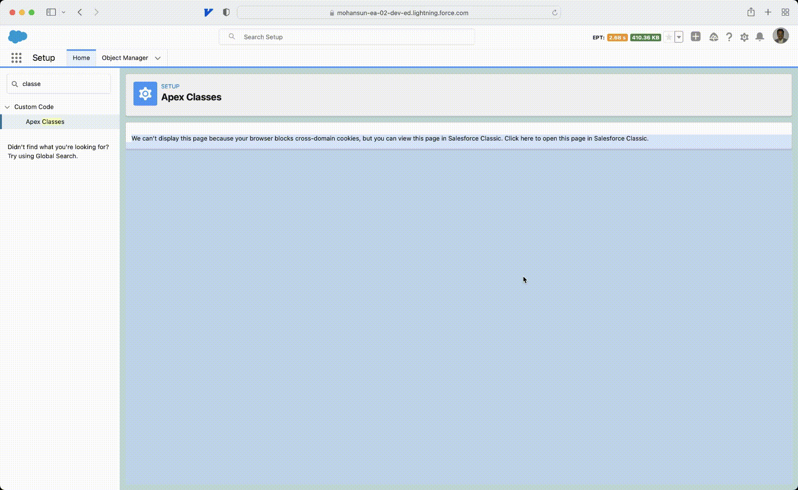
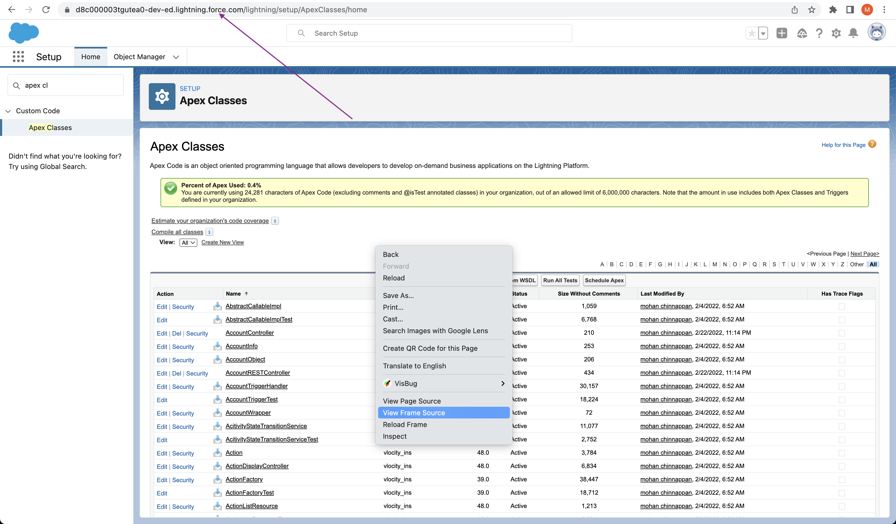
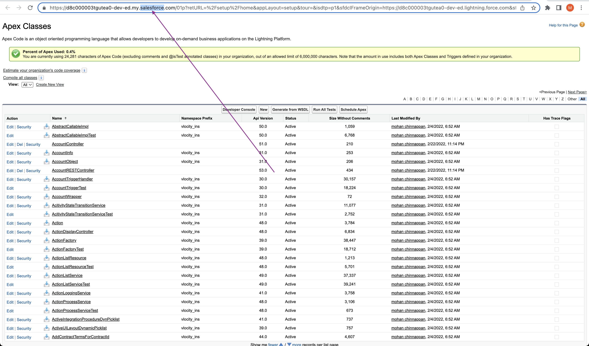
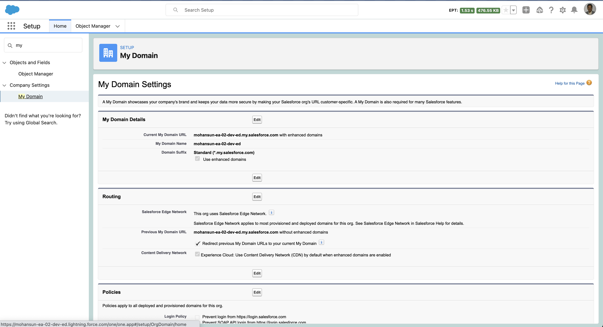
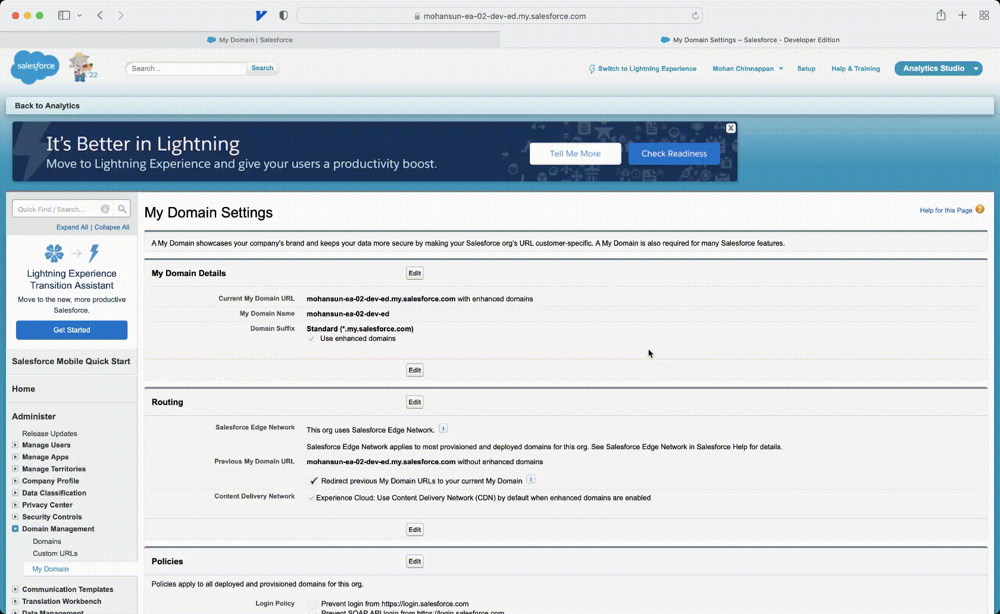

# Safari Compatibility issues

## Cross Domain Cookies issue

- Salesforce uses to 2 domains (salesforce.com and force.com) to render some of the pages under **Setup**

- 
- Safari 13.1 blocks cookies in cross-domain iframes

- 
- 

## Use of Enhanced Domain option

- Setup Enhanced Domain
- 

- Enhanced Domain does not solve this cross domain cookie issue
    - Enhanced Domain helps to make: **Domain names that meet the latest browser requirements and remain stabilized when your org is moved to another Salesforce instance.**

- 

## Help Docs
- [Considerations for Apple Safari
](https://help.salesforce.com/s/articleView?id=sf.getstart_browser_considerations_safari.htm&type=5)