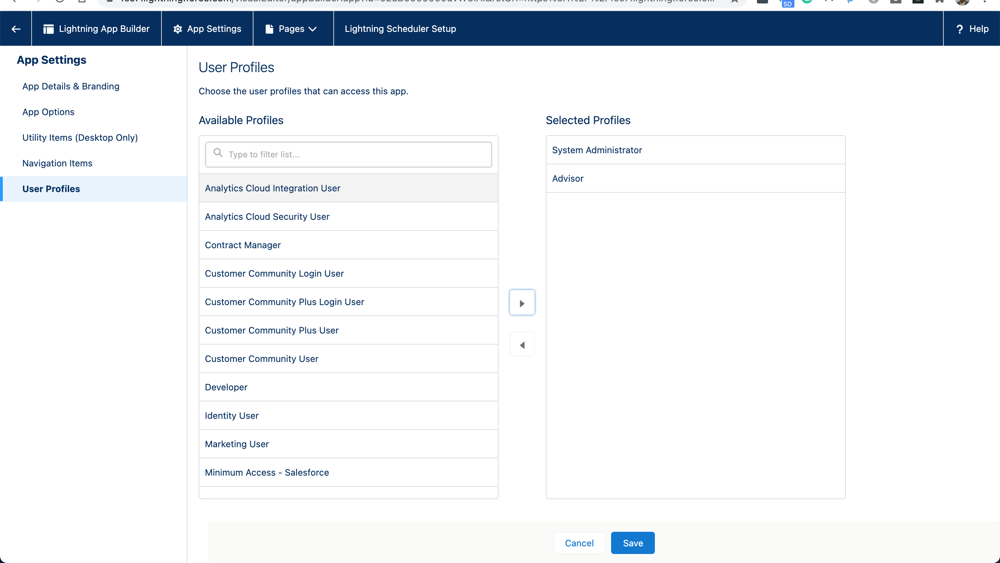
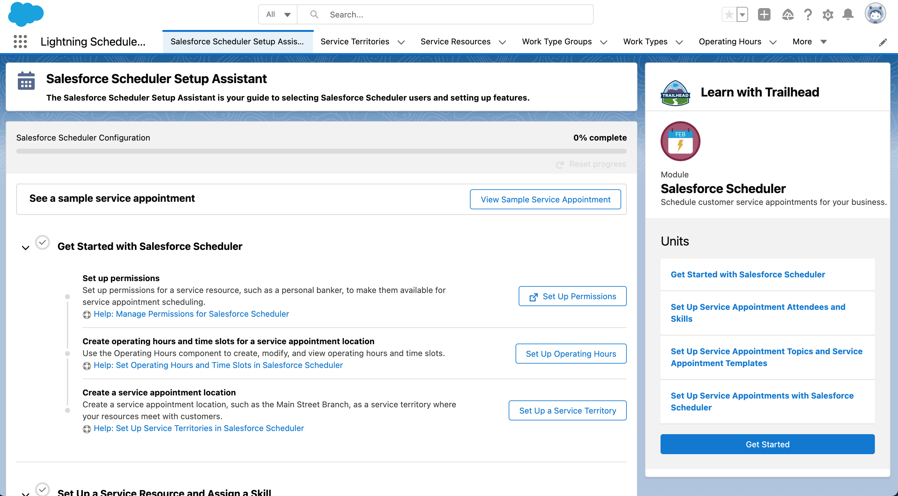

#  Salesforce Scheduler  

## Setup

## Resources
- [Set Up Salesforce Scheduler](https://help.salesforce.com/articleView?id=sf.ls_set_up.htm&type=5)
- [Get Started with Salesforce Scheduler](https://trailhead.salesforce.com/en/content/learn/modules/lightning-scheduler/get-started-with-lightning-scheduler)
- [Set Up Scheduling for Authenticated External Users](https://help.salesforce.com/articleView?id=ls_inbound_overview.htm&type=0)
- [Add Inbound Flows to an Experience Cloud Site](https://help.salesforce.com/articleView?id=sf.ls_publish_inbound_flow.htm&type=5)
- [Add Inbound Flows to a Website](https://help.salesforce.com/articleView?id=sf.ls_set_up_inbound.htm&type=5)

### FSC
- [Start your free trial of our financial services solution](https://www.salesforce.com/form/signup/financial-services-cloud-trial/)
### REST API
- [Salesforce Scheduler Resources](https://developer.salesforce.com/docs/atlas.en-us.232.0.api_rest.meta/api_rest/resources_ls_intro.htm)
- [Salesforce Scheduler Developer Resources](https://help.salesforce.com/articleView?id=sf.ls_developer_resources.htm&type=5)
- [Integrating Salesforce Scheduler with external calendars](https://developer.salesforce.com/docs/atlas.en-us.232.0.apexref.meta/apexref/apex_namespace_lxscheduler.htm)

 

