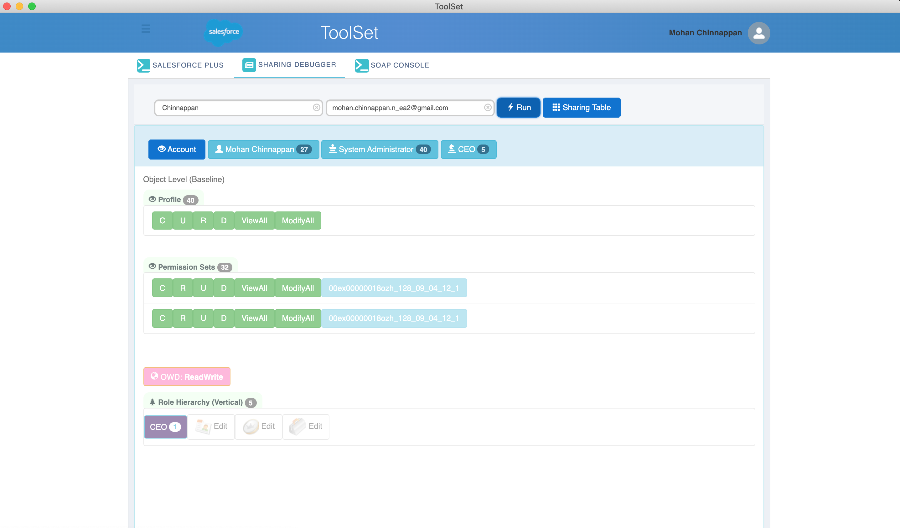

## How to run sharing debugger for the  given user ?

- Chrome Extension version 


- Planning to port Chrome Extension version to DX ( Work-in-progress)
- Requires 0.0.54 version of the plugin
    - sfdx-mohanc-plugins@0.0.54
    - [How to install the plugin](https://mohan-chinnappan-n.github.io/dx/plugins.html#/1)


- Login using  sfdx force:auth:web:login 
### Usge
```
$ sfdx mohanc:sharing:debug -h
Run Sharing Debugger on the given org for the given user

USAGE
  $ sfdx mohanc:sharing:debug

OPTIONS
  -e, --email=email                                User Email Id
  -u, --targetusername=targetusername              username or alias for the target org; overrides default target org
  -v, --targetdevhubusername=targetdevhubusername  username or alias for the dev hub org; overrides default dev hub org
  --apiversion=apiversion                          override the api version used for api requests made by this command
  --json                                           format output as json
  --loglevel=(trace|debug|info|warn|error|fatal)   logging level for this command invocation

EXAMPLE

       ** Run Sharing Debugger on the given org for the given user **

       USAGE
       sfdx mohanc:sharing:debug -u <username> -e <UserEmailId> 

```
### Demo
```
$ sfdx mohanc:sharing:debug -u mohan.chinnappan.n_ea2@gmail.com -e mohan.chinnappan.n@gmail.com
____________Profile____________
profileId : 00e3h000001kqJMAAY
____________Permissions____________
"Id","Name","PermissionsViewAllData","PermissionsModifyAllData","PermissionsManageDataIntegrations"
"00e3h000001kqJMAAY","System Administrator",true,true,true
____________PermSets____________
"Id","Label","PermissionsViewAllData","PermissionsModifyAllData","PermissionsManageDataIntegrations"
"0PS3h000002PwNZGA0","00ex00000018ozh_128_09_04_12_1",true,true,true
```

### Listing share sObjects
```
$ sfdx mohanc:ws:rest -f header_ea.json -r https://mohansun-ea-02-dev-ed.my.salesforce.com/services/data/v49.0/sobjects -m GET  >  sobjects.json 

# sObjects with name ending with Share
$ sfdx mohanc:data:jq -i sobjects.json -f '.sobjects[].name | select ( contains("Share")  )'
"AccountBrandShare"
"AccountShare"
"AcquiredAccount__Share"
"AssetShare"
"AuthorizationFormConsentShare"
"AuthorizationFormDataUseShare"
"AuthorizationFormShare"
"CalendarViewShare"
"CampaignShare"
"CaseShare"
"ChannelProgramLevelShare"
"ChannelProgramMemberShare"
"ChannelProgramShare"
"CommSubscriptionChannelTypeShare"
"CommSubscriptionConsentShare"
"CommSubscriptionShare"
"ConsumptionScheduleShare"
"ContactPointAddressShare"
"ContactPointConsentShare"
"ContactPointEmailShare"
"ContactPointPhoneShare"
"ContactPointTypeConsentShare"
"ContactRequestShare"
"ContactShare"
"DataUseLegalBasisShare"
"DataUsePurposeShare"
"EngagementChannelTypeShare"
"ExternalEventMappingShare"
"FlowInterviewLogShare"
"FlowInterviewShare"
"ImageShare"
"IndividualShare"
"LeadShare"
"ListEmailShare"
"MacroShare"
"MacroUsageShare"
"MyFilter__Share"
"OpportunityHistory__Share"
"OpportunityShare"
"OrderShare"
"OrgDeleteRequestShare"
"PartnerFundAllocationShare"
"PartnerFundClaimShare"
"PartnerFundRequestShare"
"PartnerMarketingBudgetShare"
"PartyConsentShare"
"PromptActionShare"
"QuickTextShare"
"QuickTextUsageShare"
"StreamingChannelShare"
"TodayGoalShare"
"UserAppMenuCustomizationShare"
"UserEmailPreferredPersonShare"
"UserProvisioningRequestShare"
"UserShare"


# __Share sObjects
$  sfdx mohanc:data:jq -i sobjects.json -f '.sobjects[].name | select ( contains("__Share")  )'
"AcquiredAccount__Share"
"MyFilter__Share"
"OpportunityHistory__Share"


# list name,isCustomObject
$  sfdx mohanc:data:jq -i sobjects.json -f '.sobjects[] | .name + "," + (.custom | tostring)' | sed -e 's/"//g'
AIInsightAction,false
AIInsightFeedback,false
AIInsightReason,false
AIInsightValue,false
AIMetric,false
AIPredictionEvent,false
AIRecordInsight,false
AcceptedEventRelation,false
...


```
### Querying the AccountShare
```
$ sfdx mohanc:data:query -q accountShare.soql -u mohan.chinnappan.n_ea2@gmail.com   | sed -e 's/""/"/g' | sed -e 's/"//g'
attributes,Id,AccountId,UserOrGroupId,AccountAccessLevel,ContactAccessLevel,OpportunityAccessLevel,CaseAccessLevel
{type:AccountShare,url:/services/data/v49.0/sobjects/AccountShare/00r3h00000gJvnMAAS},00r3h00000gJvnMAAS,0013h00000FffwFAAR,00G3h000001rhfAEAQ,Read,Read,None,None
{type:AccountShare,url:/services/data/v49.0/sobjects/AccountShare/00r3h00000gJvnDAAS},00r3h00000gJvnDAAS,0013h00000FffwMAAR,00G3h000001rhfAEAQ,Read,Read,None,None
{type:AccountShare,url:/services/data/v49.0/sobjects/AccountShare/00r3h00000gJvryAAC},00r3h00000gJvryAAC,0013h00000FffwVAAR,00G3h000001rhfAEAQ,Read,Read,None,None
...

$ cat accountShare.soql
SELECT Id, AccountId, UserOrGroupId, 
AccountAccessLevel,
ContactAccessLevel,
OpportunityAccessLevel,
CaseAccessLevel

FROM AccountShare


```

### Getting name,label,type,length for a given sObject (say Group)

```
# get Account metadtata
$ sfdx mohanc:ws:rest -f header_ea.json -r https://mohansun-ea-02-dev-ed.my.salesforce.com/services/data/v49.0/sobjects/Group/describe -m GET   > Group.json

$  sfdx mohanc:data:jq -i Group.json -f '.fields[] | .name + "," + .label + "," + .type + "," + (.length | tostring)' | sed -e 's/"//g'
Id,Group ID,id,18
Name,Name,string,40
DeveloperName,Developer Name,string,80
RelatedId,Related ID,reference,18
Type,Type,picklist,40
Email,Email,email,255
OwnerId,Owner ID,reference,18
DoesSendEmailToMembers,Send Email to Members,boolean,0
DoesIncludeBosses,Include Bosses,boolean,0
CreatedDate,Created Date,datetime,0
CreatedById,Created By ID,reference,18
LastModifiedDate,Last Modified Date,datetime,0
LastModifiedById,Last Modified By ID,reference,18
SystemModstamp,System Modstamp,datetime,0

```

### Read Group sObject
```
$ sfdx mohanc:data:query -u mohan.chinnappan.n_ea2@gmail.com -q ./soql/group.soql | sed -e 's/""/"/g' | sed -e 's/"//g'
attributes,Id,Name,DeveloperName,RelatedId,Type,Email,OwnerId,DoesSendEmailToMembers,DoesIncludeBosses
{type:Group,url:/services/data/v49.0/sobjects/Group/00G3h000001rhf6EAA},00G3h000001rhf6EAA,,Sales_WW,00E3h000001JaqREAS,Role,,00D3h000007R1LuEAK,false,true
{type:Group,url:/services/data/v49.0/sobjects/Group/00G3h000001rhf8EAA},00G3h000001rhf8EAA,,CEOA,00E3h000001JaqUEAS,Role,,00D3h000007R1LuEAK,false,true
{type:Group,url:/services/data/v49.0/sobjects/Group/00G3h000001rhf9EAA},00G3h000001rhf9EAA,,CIO,00E3h000001JaqQEAS,Role,,00D3h000007R1LuEAK,false,true
{type:Group,url:/services/data/v49.0/sobjects/Group/00G3h000001rhfAEAQ},00G3h000001rhfAEAQ,,Sales_AMER,00E3h000001JaqSEAS,Role,,00D3h000007R1LuEAK,false,true
{type:Group,url:/services/data/v49.0/sobjects/Group/00G3h000001rhfBEAQ},00G3h000001rhfBEAQ,,Sales_EMEA,00E3h000001JaqTEAS,Role,,00D3h000007R1LuEAK,false,true
{type:Group,url:/services/data/v49.0/sobjects/Group/00G3h000001rhfCEAQ},00G3h000001rhfCEAQ,,CIO,00E3h000001JaqQEAS,RoleAndSubordinates,,00D3h000007R1LuEAK,false,true
{type:Group,url:/services/data/v49.0/sobjects/Group/00G3h000001rhfDEAQ},00G3h000001rhfDEAQ,,Sales_WW,00E3h000001JaqREAS,RoleAndSubordinates,,00D3h000007R1LuEAK,false,true
{type:Group,url:/services/data/v49.0/sobjects/Group/00G3h000001rhfEEAQ},00G3h000001rhfEEAQ,,Sales_AMER,00E3h000001JaqSEAS,RoleAndSubordinates,,00D3h000007R1LuEAK,false,true
{type:Group,url:/services/data/v49.0/sobjects/Group/00G3h000001rhfFEAQ},00G3h000001rhfFEAQ,,Sales_EMEA,00E3h000001JaqTEAS,RoleAndSubordinates,,00D3h000007R1LuEAK,false,true
{type:Group,url:/services/data/v49.0/sobjects/Group/00G3h000001rhfGEAQ},00G3h000001rhfGEAQ,,CEOD,00E3h000001JaqUEAS,RoleAndSubordinates,,00D3h000007R1LuEAK,false,true
{type:Group,url:/services/data/v49.0/sobjects/Group/00G3h000001HciTEAS},00G3h000001HciTEAS,,CEO,00E3h000001JaqUEAS,RoleAndSubordinatesInternal,,00D3h000007R1LuEAK,false,true
{type:Group,url:/services/data/v49.0/sobjects/Group/00G3h000001HciUEAS},00G3h000001HciUEAS,,CIO,00E3h000001JaqQEAS,RoleAndSubordinatesInternal,,00D3h000007R1LuEAK,false,true
{type:Group,url:/services/data/v49.0/sobjects/Group/00G3h000001HciVEAS},00G3h000001HciVEAS,,Sales_AMER,00E3h000001JaqSEAS,RoleAndSubordinatesInternal,,00D3h000007R1LuEAK,false,true
{type:Group,url:/services/data/v49.0/sobjects/Group/00G3h000001HciWEAS},00G3h000001HciWEAS,,Sales_EMEA,00E3h000001JaqTEAS,RoleAndSubordinatesInternal,,00D3h000007R1LuEAK,false,true
{type:Group,url:/services/data/v49.0/sobjects/Group/00G3h000001HciXEAS},00G3h000001HciXEAS,,Sales_WW,00E3h000001JaqREAS,RoleAndSubordinatesInternal,,00D3h000007R1LuEAK,false,true
{type:Group,url:/services/data/v49.0/sobjects/Group/00G3h000001HciSEAS},00G3h000001HciSEAS,,AllPartnerUsers,,PRMOrganization,,00D3h000007R1LuEAK,false,true
{type:Group,url:/services/data/v49.0/sobjects/Group/00G3h000001rhf7EAA},00G3h000001rhf7EAA,,AllInternalUsers,,Organization,,00D3h000007R1LuEAK,false,true
{type:Group,url:/services/data/v49.0/sobjects/Group/00G3h000001HciYEAS},00G3h000001HciYEAS,,AllCustomerPortalUsers,,AllCustomerPortal,,00D3h000007R1LuEAK,false,true
{type:Group,url:/services/data/v49.0/sobjects/Group/00G3h000001HcicEAC},00G3h000001HcicEAC,selfservice,selfservice,0053h000002xqUhAAI,GuestUserGroup,,00D3h000007R1LuEAK,false,true

$ cat soql/group.soql 
SELECT
    Id,
    Name,
    DeveloperName,
    RelatedId,
    Type,
    Email,
    OwnerId,
    DoesSendEmailToMembers,
    DoesIncludeBosses
FROM Group

```
