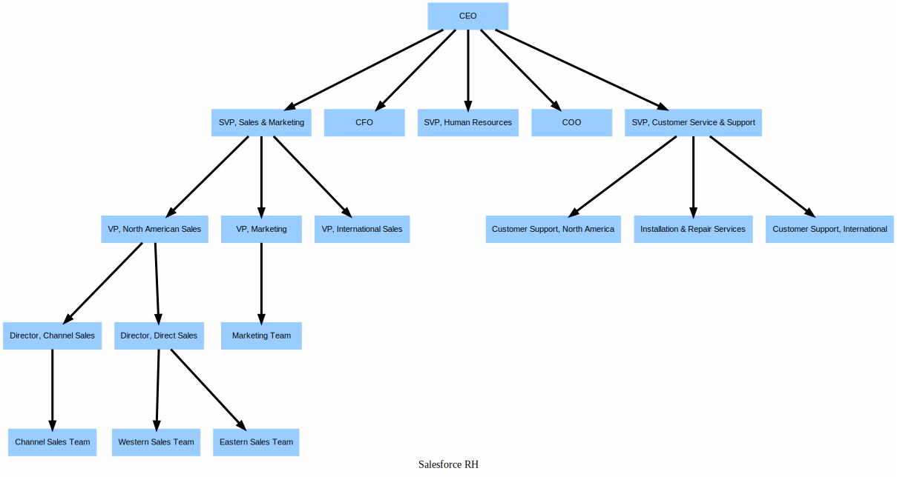

# How to visualize Role Hierarchy in Salesforce org

## Plugin
- Requires 0.0.171 version of the plugin
    - sfdx-mohanc-plugins@0.0.171
    - [How to install the plugin](https://mohan-chinnappan-n.github.io/dx/plugins.html#/1)

## Usage
```
sfdx mohanc:security:rh -h
```

```
Render Role Hierarchy

USAGE
  $ sfdx mohanc:security:rh

OPTIONS
  -u, --targetusername=targetusername             username or alias for the target org; overrides default target org
  --apiversion=apiversion                         override the api version used for api requests made by this command
  --json                                          format output as json
  --loglevel=(trace|debug|info|warn|error|fatal)  logging level for this command invocation

EXAMPLE

       ** Render Role Hierarchy **

       Draw Role Hierarchy
       sfdx mohanc:security:rh -u <username> 
```

## Demo
```
sfdx mohanc:security:rh  -u  mohan.chinnappan.n_ea2@gmail.com
```

```
Writing visualization in file __RH__.svg ...
Visualization done. "open  __RH__.svg" in Chrome Browser to view the Visualization.

```


