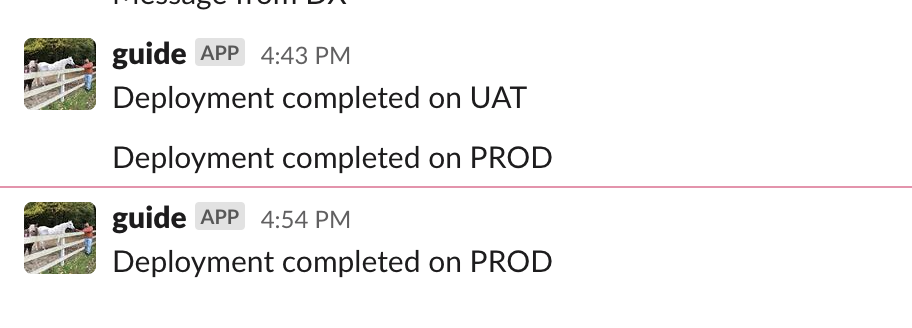

# How to send slack messages using DX

## Usage
```
Slack Integration

USAGE
  $ sfdx mohanc:slack:guide [-w <string>] [-m <string>] [--json] [--loglevel 
  trace|debug|info|warn|error|fatal|TRACE|DEBUG|INFO|WARN|ERROR|FATAL]

OPTIONS
  -m, --message=message                                                             Message to send
  -w, --webhookuri=webhookuri                                                       webHookURI
  --json                                                                            format output as json

  --loglevel=(trace|debug|info|warn|error|fatal|TRACE|DEBUG|INFO|WARN|ERROR|FATAL)  [default: warn] logging level
                                                                                    for this command invocation

EXAMPLE

             slack
             sfdx mohanc:slack:guide -w <webHookURI> -m <message>

             Example:
             sfdx mohanc:slack:guide -w https://hooks.slack.com/services/x/y/z -m "Deployment completed on PROD"


      

```

## Demo
- Note: URI in below example is mangled for protection
```

sfdx mohanc:slack:guide -w https://hooks.slack.com/services/T03P/B06MP/ZEC6 -m "Deployment completed on PROD"  
```

```
ok

```
## Slack UI

- 
